# aiwatcher, in screenshots

Every screenshot below is the panel against a running server — no mockups. Most
data comes from the seed scripts in `scripts/` and is reproducible in about a
minute; the Hub screens capture a live Hugging Face search, whose results may
change. The commands are at the [bottom](#reproducing-these).

The panel follows one lifecycle: observe agent work, curate reproducible data,
label it where needed, train against an immutable revision, promote only after
a held-out measurement, and resolve that promoted checkpoint in a serving
process. The screenshots show the current implementation, including the
boundaries that still need production work.

- [Observability](#observability) — [Runs](#runs) · [A run's trace](#a-runs-trace) · [The same run, still running](#the-same-run-still-running) · [Explore](#explore) · [Metrics](#metrics) · [Query](#query)
- [Workflows](#workflows)
- [Evaluation](#evaluation)
- [Prompts](#prompts)
- [Datasets and data curation](#datasets-and-data-curation)
- [Annotations](#annotations)
- [Training](#training)
- [Serving the promoted demo](#serving-the-promoted-demo)
- [Remaining product boundary](#remaining-product-boundary)

## Observability

### Runs

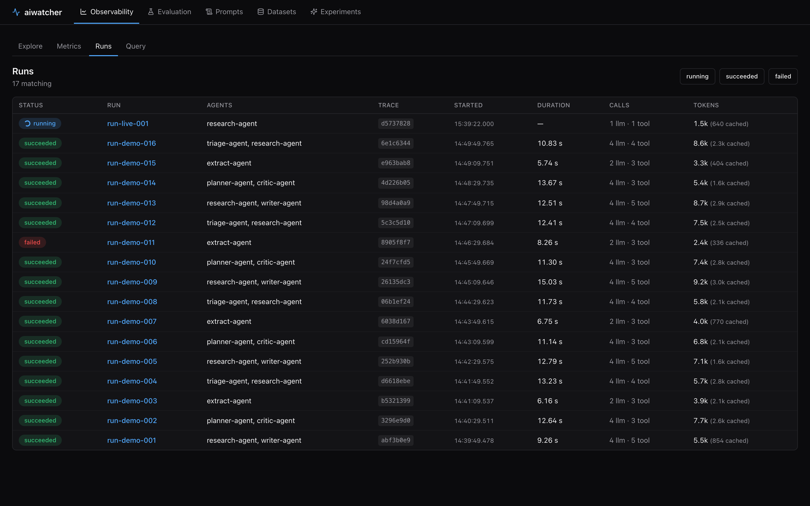

The flat list, filterable by status. One row per run: which agents took part,
the trace the run assembled into, how long it took, how many LLM and tool calls
it made, and how many of its input tokens the provider served from cache.

Nothing here loads a whole run. The list is a cursor page from the read model
and a virtual window in the browser, which is what keeps one very long run from
being a request neither side can hold
([ADR_0007](docs/ADR/ADR_0007_EXPLORER_DIMENSIONS.md)).

### A run's trace

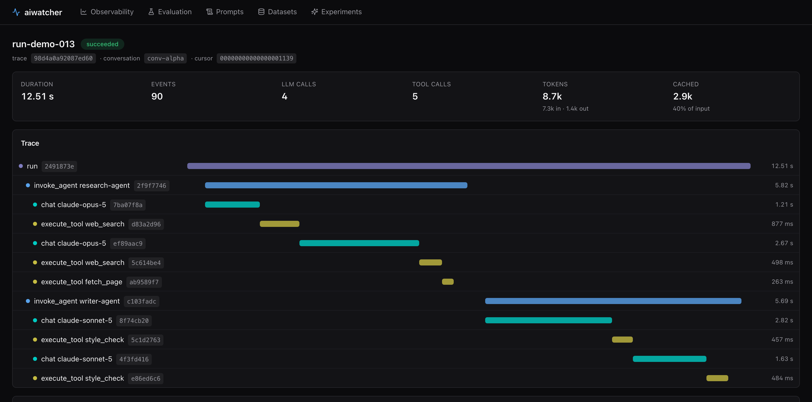

The same run, opened: ninety events folded into twelve spans. The
`invoke_agent` spans are the agents, the `chat` spans are the LLM calls, and
the `execute_tool` spans are the tools — each one written only when its end
event arrives.

The twenty-odd `llm.chunk` events behind the streamed call are counted and
thrown away rather than stored one trace record each
([ADR_0003](docs/ADR/ADR_0003_SPAN_ASSEMBLY.md)). The span ids in the chips are
derived from the run id and a stable span key, not generated, so a redelivered
event lands on the span it already wrote
([ADR_0001](docs/ADR/ADR_0001_EVENT_ENVELOPE.md)).

### The same run, still running

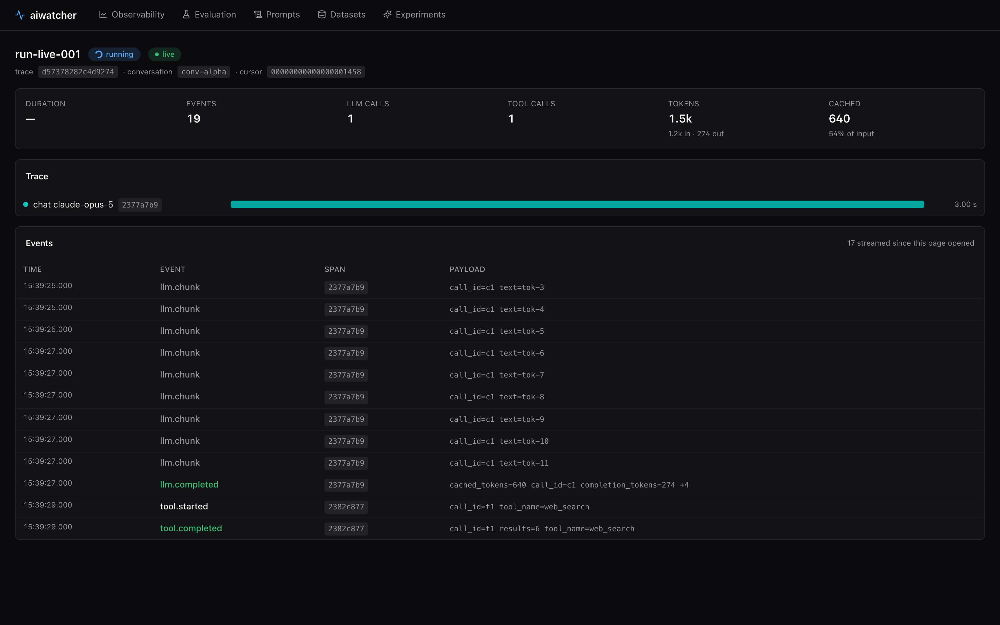

A run whose events are arriving while the page is open: the header says `live`,
the duration is still blank, and the trace holds only the spans that have
already ended.

The events pane below is the live tail over SSE. Every frame carries its
checkpoint as the `id:`, so a browser that loses the connection resumes through
`Last-Event-ID` with no application code on either side
([ADR_0004](docs/ADR/ADR_0004_LIVE_STREAM_RESUME.md)).

### Explore

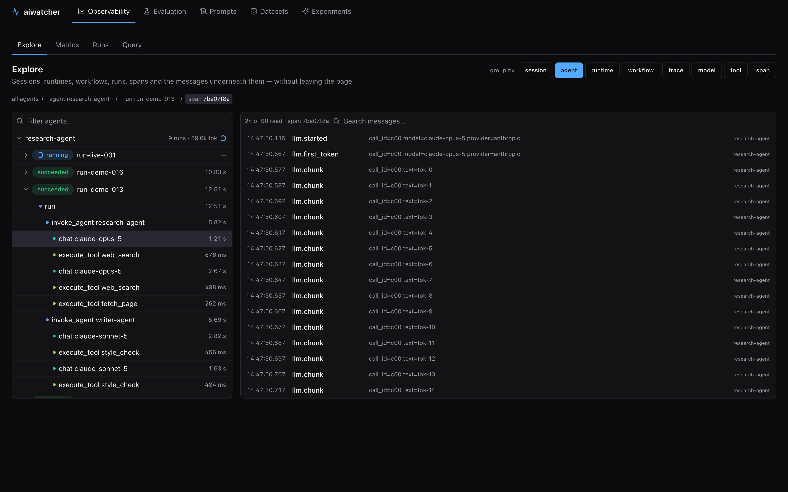

One page for every level. The tree pivots on **session, agent, runtime,
workflow, trace, model, tool or span** — here it is rooted on the agent — and
below the root it is always run → span → messages, so switching what the top
level *is* costs no relearning.

Selecting the `chat claude-opus-5` span narrows the messages on the right to
that span without collapsing the levels above it, and the whole selection lives
in the URL, so this exact view is a link. One fold answers every pivot; the
rows differ only in which key a run contributes to
([ADR_0007](docs/ADR/ADR_0007_EXPLORER_DIMENSIONS.md)).

### Metrics

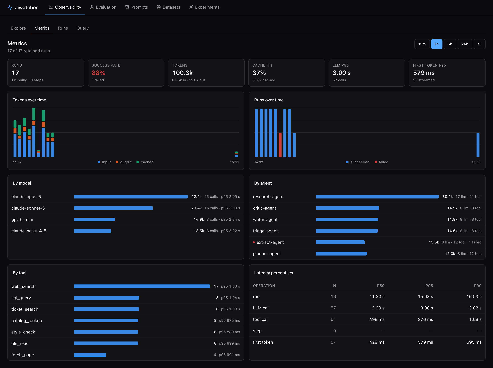

Tokens, success rate, cache hit rate and the latency percentiles that matter
for an agent — time to first token separately from time to the whole
completion — over a window, with ranked breakdowns by model, agent and tool.
The `extract-agent` row carries the failed run, which is why it is marked.

### Query

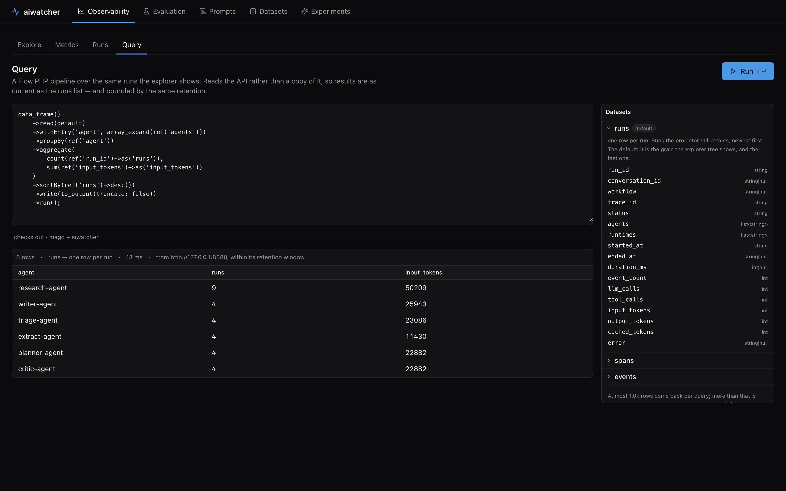

An optional tab. The pipeline is a Flow PHP `data_frame()` expression over the
same runs the explorer shows, answered by `services/flow` — a service that is
outside the Cargo workspace and that the Rust binary does not know exists.

The query is **parsed, never executed**: `token_get_all()` lexes it, a
whitelist checks it, and an explicit `match` turns it into Flow objects. There
is no `eval` in the service and no name from a query ever becomes a callable
([ADR_0008](docs/ADR/ADR_0008_FLOW_QUERY_SURFACE.md)). The starter query is
deliberately the *corrected* form of the obvious first question — `runs`
carries `agents` as a list, so grouping by agent needs the expansion.

Grain is what decides this, not transport: this question is 210 ms in Flow
against 5 ms for the Rust dimension route, which is why the live path stays in
Rust and there is no export.

## Workflows

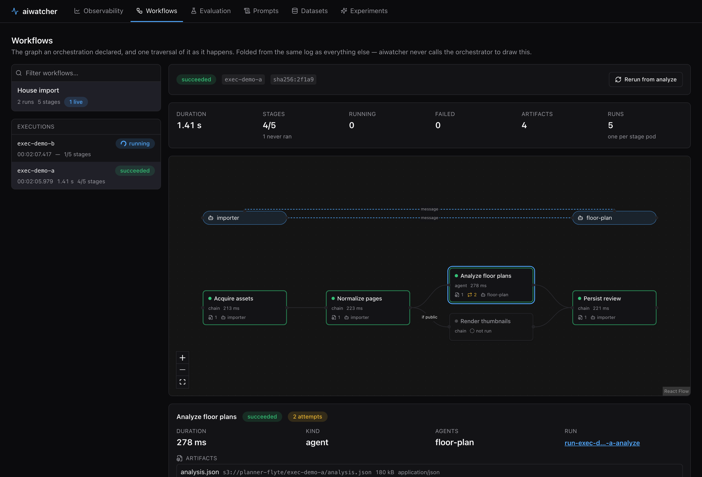

The level above a run. Pick an orchestration on the left, pick one of its
executions, and the graph is that execution: stage statuses, durations, the
agents that did the work, and the artifacts each one handed on.

**`Render thumbnails` says "not run", and that is the point.** A projection
over observed events can say what has happened and can never say what has not,
because a stage that never started emits nothing. So the topology rides the log
as `workflow.declared` and the graph is drawn against it
([ADR_0012](docs/ADR/ADR_0012_WORKFLOW_GRAPH.md)). The `if public` branch was
not taken here; the same rendering is what shows you a pipeline halfway
through.

**`Analyze floor plans` carries a `2`.** It failed once and was retried.
Attempts are counted by span key rather than by event, so a redelivery does not
invent a retry that never happened.

**Five runs, one execution.** Flyte gives every stage its own pod and therefore
its own `run_id`; `workflow_run_id` is what joins them, and it is why this is a
view of its own rather than a filter on the runs list. The live stream is
scoped the same way, so the pod that has not started yet still arrives.

The dashed edges across the top are the other half: `agent.message` records one
agent addressing another, which is the one thing nesting cannot show — two
agents exchanging work through a queue nest inside nothing at all. They are
drawn as a different kind of edge from the declared ones and never merged with
them, because sequence is not communication.

**Rerun** asks a configured orchestrator to run the workflow again, optionally
from the selected stage. aiwatcher runs nothing itself: it posts to one
endpoint from its own configuration — never a URL from an event — and answers
`202`, because nothing has happened yet. The evidence that the rerun ran is the
events it publishes. With no runner configured the button is replaced by a card
naming the variable to set.

## Evaluation

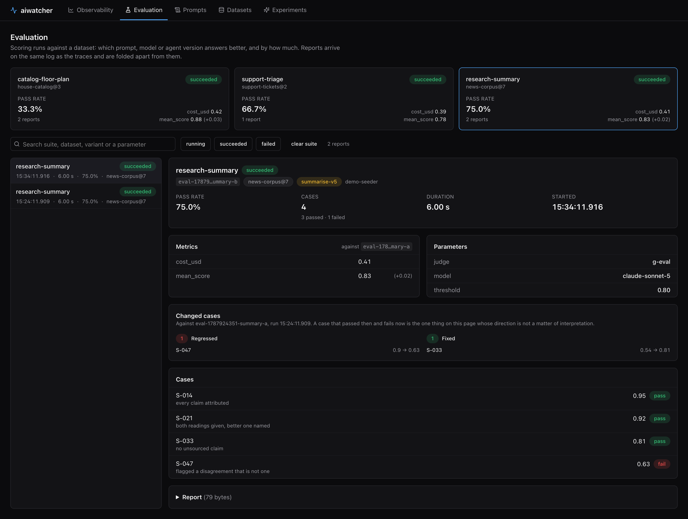

Scoring runs against a dataset. The suite cards are the top level; picking a
report shows its parameters, its metrics against the previous report on the
same dataset, its per-case scores, and the document the producer attached.

**Changed cases** is the reason this view exists. The mean improved by 0.02 and
a case that passed before now fails; a mean alone hides that in either
direction. Two reports are only compared when they agree about suite *and*
dataset — a delta between scores measured on different cases claims they are
one fact when they are two.

An evaluation is deliberately not a trace. `eval.*` events ride the same log,
form no span, and fold into their own bounded projection
([ADR_0010](docs/ADR/ADR_0010_EVALUATION_REPORTS.md)). That is what lets a
producer drop an MLflow `start_run` / `log_params` / `log_metrics` block for
four fields on the client it already imported for tracing.

## Prompts

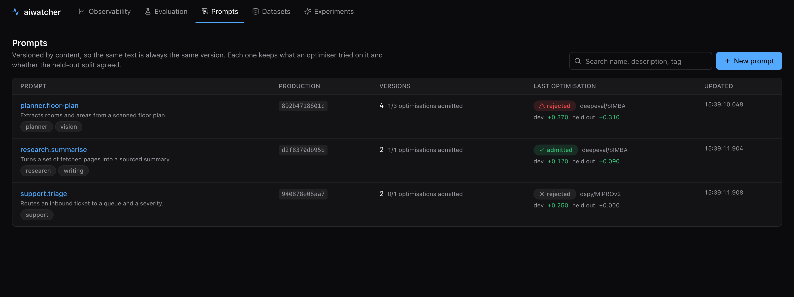

The one area that reads something other than the log, and the one that writes.
A prompt is authored rather than observed, and the version a run used has to be
readable after that run has been evicted — so the registry is an object store
(RustFS in a deployment, a directory under `just run`), outside retention
entirely ([ADR_0011](docs/ADR/ADR_0011_PROMPT_REGISTRY.md)).

Each row carries what an optimiser last tried on that prompt, with its dev gain
beside its held-out gain. The two are shown together on purpose: the ratio is
the story, not either number.

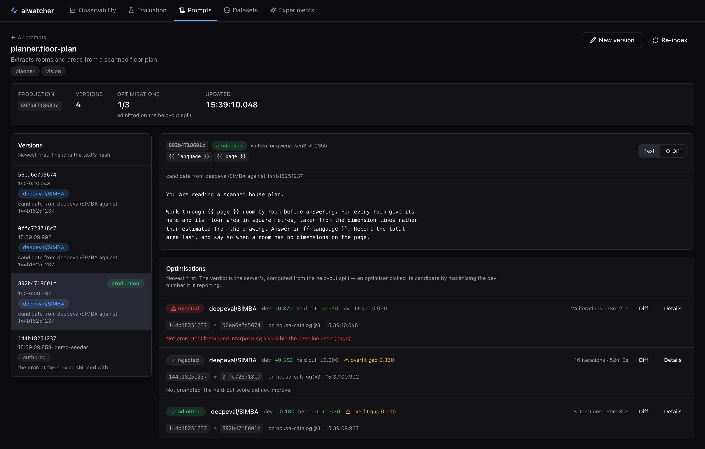

Opened: the version history, the text, a diff against whatever a version was
derived from, and every optimisation with the server's verdict.

The verdict is the server's, computed from the held-out split — never the
client's, because an optimiser selected its candidate by maximising the very
number it is reporting. One of the three here was admitted; the other two were
refused, and for the two different reasons a candidate gets refused:

- **the held-out score did not improve** — +0.350 on the split the search ran
  against and ±0.000 on the split it never saw. `overfit_gap` is the number
  worth watching across a series.
- **it stopped interpolating a variable the baseline used** — checked *before*
  the scores, so the reason says the candidate stopped reading its input rather
  than inviting somebody to raise the iteration count. It scored well because
  the harness fed it the same fixed text every time.

Publishing a new version and moving the `production` label are two separate
acts, because storing a prompt and deploying it are two decisions.

## Datasets and data curation

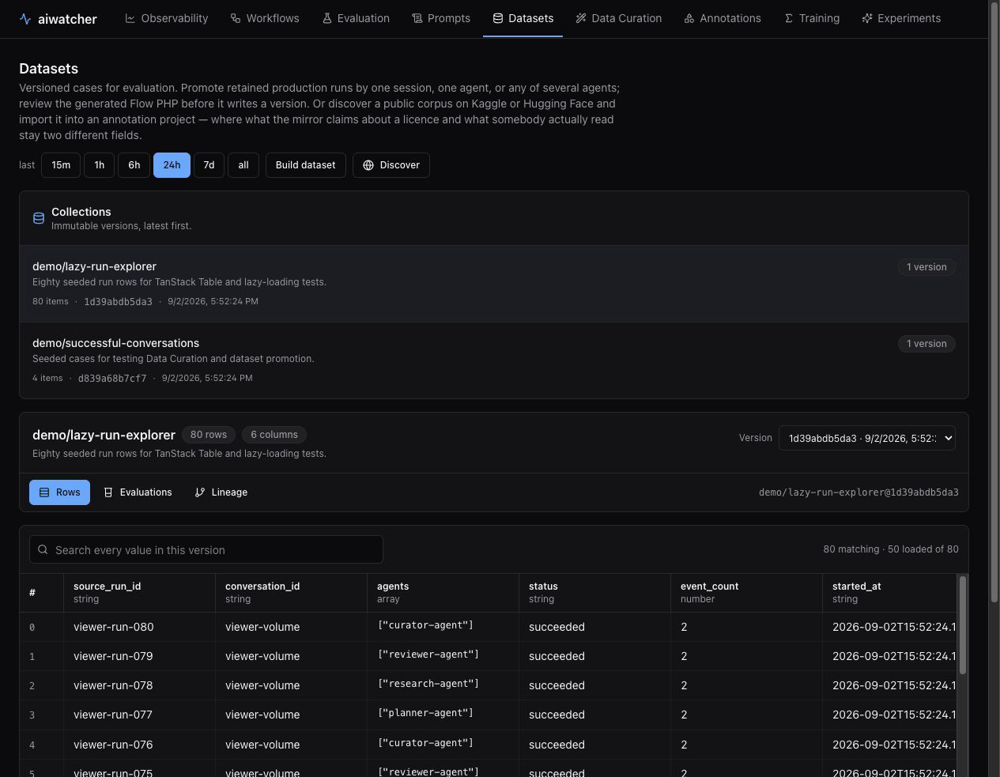

Every saved result is a content-addressed version. The row viewer reads lazy
slices, searches across the whole version, and keeps the exact Flow pipeline
beside the rows. An evaluation should record `name@version`, never only the
mutable dataset name.

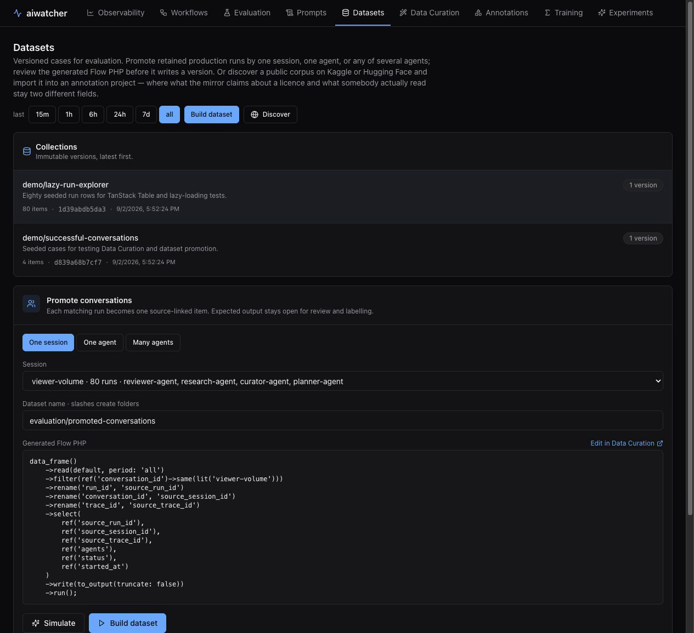

The Build tab turns selected sessions or agents into a generated Flow recipe.
That path keeps run, session and trace identifiers for selection and audit, and
run summaries deliberately contain no conversation bodies — the words are a
different artifact with a different lifetime, and they live in the Conversations
area rather than here. See [ADR_0021](docs/ADR/ADR_0021_CONVERSATION_ARCHIVE.md).

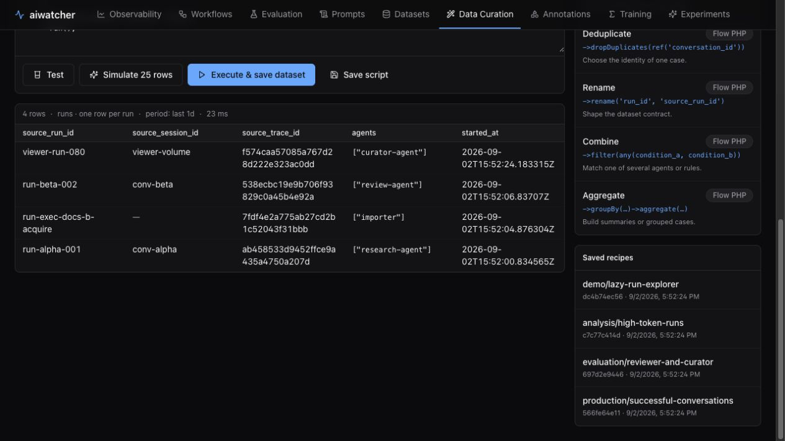

The Data Curation page makes the four stages separate: validate a pipeline
without reading data, simulate a small bounded result, execute it, then publish
that exact output. Saved recipes preserve the transformation rather than only
its result.

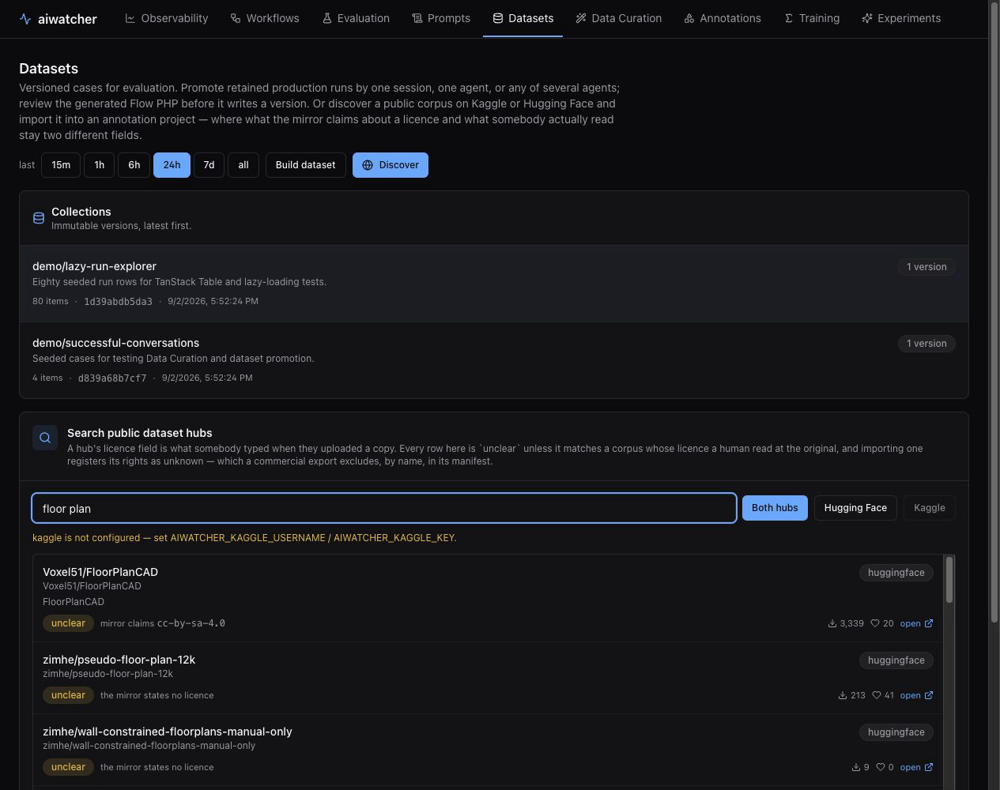

Discover searches Hugging Face, and Kaggle when credentials are configured.
The mirror's `claimed_license` is shown as a claim, never converted into a
permission. Actual usage stays `unclear` until a maintained source record says
otherwise.

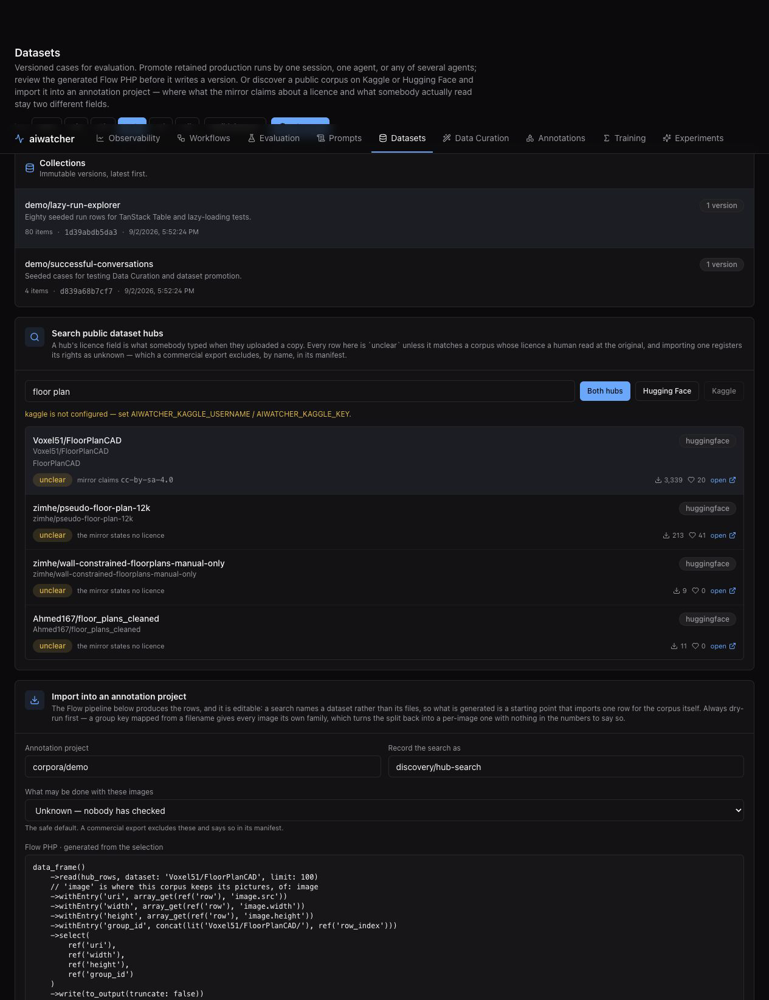

Opening a result reads its schema and a sample of rows, then generates an
editable `hub_rows(...)` Flow mapping into aiwatcher's own image structure:
`uri`, `width`, `height`, `group_id`, optional view/level, and metadata. The UI
always dry-runs the import before writing it, and the submitted rights value is
an explicit human assertion for the batch.

## Annotations

The one area that draws. Everything else here is a fold over the log and is
bounded by retention; an annotation is authored, and the label a model was
trained on has to outlive every run that used it — so it lives in the same
object store as prompts, under its own prefix
([ADR_0017](docs/ADR/ADR_0017_IMAGE_ANNOTATION.md)).

**Label** is a canvas over one image, with the three columns in the order
attention moves: which image, the picture, what the selected shape says.

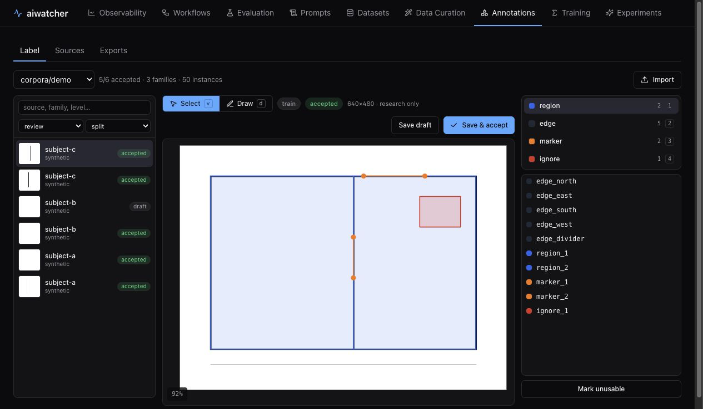

**It ships no vocabulary** ([ADR_0020](docs/ADR/ADR_0020_GENERIC_VISION_ANNOTATION.md)).
The project's label schema is the domain — its classes, their geometry, which
are `ignore`, and which `layer` each paints into — and every mechanism reads
it. A shipped preset is not a neutral default: it decides what the first hour
of labelling produces and what every example shows, and a tool that ships one
is a tool for that domain with an escape hatch. The first-project card offers a
*shape* to edit instead: one filled class, one stroked class, one `ignore`.

What the schema can say is the reason this is not a mask tool. A region is a
polygon; a boundary is a *centreline plus a thickness*, which is the thing an
editor drags and an extrusion needs, with the filled band recoverable from it;
and anything with named positions — the two ends of an opening, a pivot, a
direction — is a keypoint set. A segmentation mask can carry none of that, and
those are exactly the fields a product's output JSON has to carry. Draw pixels
and they are lost at the moment of drawing.

Attributes and links carry the rest, and a link earns its keep twice: it
records what an overlay belongs to, and it is where the rasteriser gets the
overlay's width from — a mark is exactly as wide as the edge it sits in.

`layer` is the one field worth understanding before drawing. Classes on one
layer share a grid and paint in declaration order, last wins; classes on
different layers never contend. That is the generic form of a problem that
looks specific: an opening in a wall, a defect on a component, a marking on a
road — the thing underneath is still there, and one grid could only draw the
overlay by deleting it. A schema that never sets it gets one grid and never
thinks about it.

A model's proposal is drawn dashed and marked `model`, so a page of predictions
nobody has checked looks like one.

A drawing the registry refuses comes back as a 422 carrying *every* problem at
once — the shapes that caused them turn red, and the sentences are listed under
the canvas. Fixing one error per round trip is how somebody stops using a tool.

**Sources** is a dated table of the corpora somebody read the licence of: what
each labels, how large it is, and whether its licence permits a commercial
model. That last filter is one click, because it is the question with an
expensive wrong answer. The table is *loaded* rather than shipped
(`AIWATCHER_DATASET_SOURCES`) and this build ships no rows — which corpora
exist is a question about one field. Empty is a working state: nothing then
outranks a mirror's claim, so every hub result stays `unclear`. Every row links
its original and says when somebody last read the licence there.

**Discover**, in the Datasets area, is the search that table refused to be —
and it is a different question with a different cost of being wrong
([ADR_0019](docs/ADR/ADR_0019_DATASET_HUB_DISCOVERY.md)). "What exists" has no
expensive wrong answer and a hub answers it far better than a hand-written
table; "what may we train on" has one, and no hub is allowed to answer it. So a
result carries both as **two fields that are never merged**: `claimed_license`,
the mirror's own words, named for what they are; and `usage`, which reads
`unclear` for every row unless it matched the loaded table, in which case the
row it matched is named.

The first live search made the point better than any example could.
`Voxel51/FloorPlanCAD` declares `cc-by-sa-4.0`; that corpus's authors state the
drawings are not theirs to license and the annotations are CC BY-NC. The mirror
is not lying — it is a field somebody filled in.

Importing one is a Flow PHP pipeline into `POST /api/v1/annotation-imports`,
generated for the common case and shown so the uncommon case is an edit. It is
a query rather than Rust because every hub lays its files out differently, and
the two columns a registration most needs — the image's size and the *subject*
it belongs to — are not in a search result at all.

Rights are asserted once for the batch, by a person, and default to `unknown`,
which a commercial export then excludes by name. The one licence decision
aiwatcher makes against the caller is refusing a commercial claim on a batch
that matched a curated research-only corpus. Everything else it does is warn: a
batch whose every row is its own family comes back saying so, on a response
that succeeded, because a per-file `group_id` silently turns the family split
back into a per-image one.

Both hubs are off by default — `AIWATCHER_HUGGINGFACE_ENABLED` is a switch
because the search is public, Kaggle needs both halves of a credential — and
unconfigured is a 501 naming the variable rather than an empty list. An empty
search result is a claim about the world, and a deployment that never searched
must not make it.

**Imports** is the same operation at corpus size, and a different shape for it.
The route above takes every row in one body, capped at five thousand; a corpus
is staged instead — pages of rows written to the object store, each hashed, the
batch sealed into a content address — and then read by a job that survives the
process that started it.

```bash
just seed-import   # stage twelve pictures in three pages, then import them
```

Four things about that screen are worth more than the count of what registered:

- **the refusals come first.** An import that registered four hundred thousand
  of six hundred thousand pictures looks, from a success response, exactly like
  one that worked. The counts are grouped by reason — `address_refused`,
  `unreachable`, `not_an_image`, `invalid`, `store_failed` — and the rows behind
  one reason are a click away, each with the sentence that says what to fix.
- **there is a progress bar**, unlike Training, and the difference is honest:
  the pages were counted when the batch was sealed, so the denominator is a
  fact rather than a guess.
- **the revision is pinned.** A batch naming a dataset id and no commit comes
  back with a warning, because `main` is whatever the uploader pushed last and a
  model naming that import would be naming nothing anybody can go back to.
- **every byte went through one bounded fetcher**: `https` with the host parsed
  rather than matched, an allowlist of a hub's own asset hosts, a check that
  every resolved address is public, no redirects, a byte ceiling applied while
  the body streams, a pixel ceiling read out of the image's own header, and a
  verified content address. A row naming `169.254.169.254` is a rejected row
  with a sentence, not a request. See
  [ADR_0022](docs/ADR/ADR_0022_STAGED_IMPORT_JOBS.md).

**Exports** freezes a project into an immutable, content-addressed manifest.
Its id is the string a training run records — `project@export-sha256`, the same
shape as `dataset@version` — and two exports of an unchanged project are one
export, so building it before every run costs nothing.

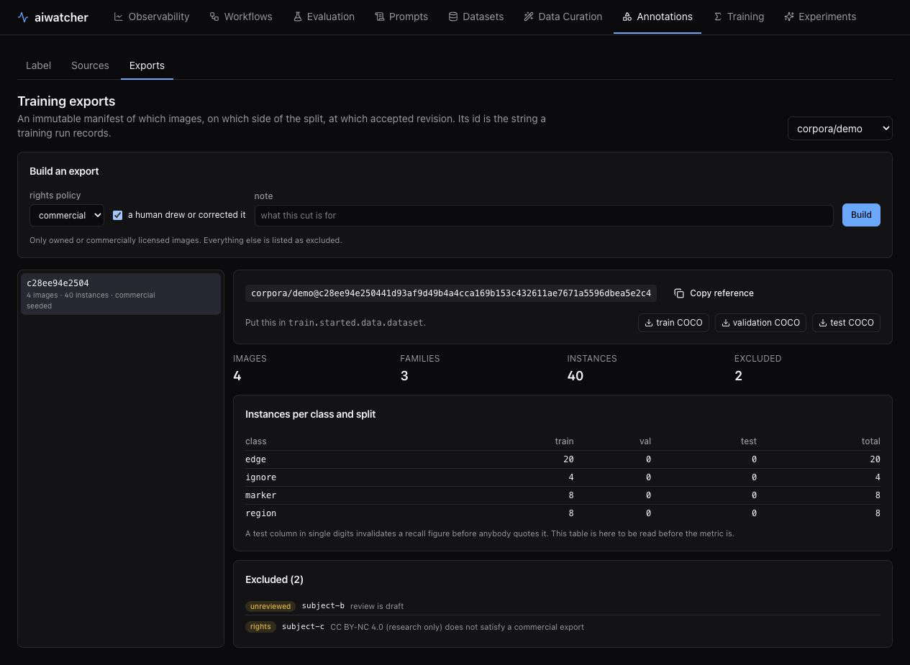

Two things on that page are worth more than the headline counts:

- **the split is by family.** Every image declares a `group_id`: one building,
  however many renderings. A catalogue house published as the plain plan, its
  mirror and a garage variant is four images and one observation, and splitting
  them across train and test makes the score a measurement of memorisation with
  nothing in the numbers to say so. The panel shows a labeller which side the
  plan in front of them is on, because that changes how carefully it gets drawn.
- **every exclusion is listed with its reason.** An export that quietly loses a
  third of a corpus reads exactly like one that did not. The seeded project has
  two: one image nobody accepted, and one CC BY-NC image that a *commercial*
  export refuses — which is the failure mode that otherwise surfaces in a legal
  review rather than in a metric.

COCO is served per split, generated from the manifest rather than stored: a
second copy of the annotations is a copy that can disagree with the first.
Masks and heatmaps are produced in Python, where the array libraries already
are.

## Training

The one area here that reads nothing folded from the event log.

`train.*` events existed for about an hour. Following them through produced a
sequence of exceptions — an epoch is not a span, a step does not belong on the
log at all, a profiler session is not a trace, a checkpoint is not an artifact
— and what was left was one span with no children plus a special case in the
read model to make its status work. A design whose last step is an exception in
somebody else's fold is in the wrong place, so training is its own module with
its own store and its own three write routes
([ADR_0018](docs/ADR/ADR_0018_TRAINING_RUNS.md)).

```python
from aiwatcher_sdk.annotations import AnnotationRegistry
from aiwatcher_sdk.training import TrainingClient

export = AnnotationRegistry(URL).build_export("corpora/plans")
training = TrainingClient(URL)

with training.run(
    "segmenter-2026-09-01",
    model="efficientnetv2-s",
    dataset=export.reference,          # project@sha256, never a bare name
    params={"batch_size": 4, "lr": 3e-4},
) as run:
    for index in range(epochs):
        with run.epoch(index) as epoch:
            for batch in loader:
                epoch.step(loss=loss.item())   # arithmetic, not a request
            epoch.metrics(val_miou=score)      # measured once, not averaged
    run.checkpoint(path, metric="val_miou", value=score, best=True)

training.register_model(
    "corpus.segmenter",
    run_id=run.run_id, checkpoint_uri=path,
    validation={"miou": 0.81}, test={"miou": 0.74},
)
```

What that publishes is deliberately small. An **epoch** is one point carrying
its own duration and metrics; a **step** never leaves the process; a
**checkpoint** is a pointer, because a record that held weights would be a
record nobody can read back; a **profiler session** is its top operators and a
link, because `torch.profiler` on one step emits more records than this
projector holds in a week.

Two failure policies, on purpose. Opening a run **raises** — if the server is
going to refuse it, six GPU-hours from now is the wrong moment to find out.
Progress **never** raises: unsent batches are kept and go out with the next
flush, and the warning is printed once per run rather than once per attempt.
Killing a training run because an observability server restarted is exactly the
failure telemetry must not cause.

### From an export to tensors

An export names shapes; a loss function needs grids. That derivation used to be
written badly in every project that needed it, so it is in the SDK — and it
only goes one way. ADR_0017 says the vector shape is the source and every
raster is derived; `integrations.vision` is that derivation, done per batch and
thrown away. Nothing here writes a mask back, and nothing here reads one.

```python
from aiwatcher_sdk.integrations.vision import ExportDataset

train = ExportDataset(registry, export, split="train",
                      image_size=512, cache_dir=".cache/images")
loader = torch.utils.data.DataLoader(train, batch_size=4, shuffle=True)
```

It is deliberately **not** a `torch.utils.data.Dataset` subclass. A map-style
dataset in PyTorch is `__len__` and `__getitem__`, `default_collate` stacks the
numpy arrays it yields, and this file stays importable in a process that has
never heard of torch — the same rule the Lightning callback follows. numpy and
Pillow are imported lazily; `pip install 'aiwatcher-sdk[vision]'`.

**The schema decides everything.** The rasteriser matches on no class name:
geometry decides fill or stroke, the class's own `ignore` flag decides
exclusion, declaration order decides who wins a contested pixel, and `layer`
decides which grid. A vocabulary of walls and doors and one of components and
defects go through the same code, because the code was never told which it was
looking at.

Each item is the image, one integer grid per declared layer, and the mask the
loss must skip:

| | |
|---|---|
| `image`   | `float32 (channels, size, size)` in `[0, 1]` |
| `targets` | `int64 (layers, size, size)` — index 0 in every layer is background |
| `ignore`  | every `ignore` class, plus the letterbox bars |

`dataset.layers` says what the grids mean, so a model gets its head count and
its class counts from the export rather than from a constant somebody has to
keep in step.

Layers are the generic form of a problem that does not look generic: some
classes *overlay* others and must not erase them. On one grid an opening could
only be drawn by deleting the wall it sits in, and the structural head would
learn that walls have holes exactly where the openings are — which is the first
thing post-processing then has to undo. A schema that never sets `layer` gets
one grid and never thinks about it.

Two more decisions worth knowing. **Paint order is schema order**, not drawing
order — two labellers who drew the same shapes in a different sequence must
produce the same target, or the revision's content address stops meaning what
it says; which class wins is the schema's decision to make, and both directions
are legitimate. And **`ignore` is excluded from the loss rather than labelled
background** — whatever a corpus is full of that the annotation declined to
claim is usually a large, *systematic* fraction of the page, and a model taught
to call it background is rewarded for exactly that.

One guard is worth calling out because the failure it catches is silent: the
dataset reads the project's schema and **checks it against the export's pinned
`schema_version`**. A vocabulary that moved after the export was built would
hand back permuted class indices — every label wrong, every metric finite, and
nothing anywhere saying so.

The real model lives in the repository that owns the domain. planner has one:

```bash
just ml-train --project floor-plans/dom-projekt --run-id parterre-2026-09-02
```

A small multi-task U-Net, two heads on one encoder, plain PyTorch. It refuses a
run whose train, validation *or* test side is empty — the middle one being the
trap, since with no validation images every epoch scores zero, epoch 0 wins by
default and the run still reports a validation number the registry accepts as
the held-out measurement a promotion needs.

For Lightning there is a callback that needs no change to the loop, and it
never imports Lightning — it duck-types the hooks, the same way the DeepEval
bridge reads a report structurally:

```python
from aiwatcher_sdk.integrations.torch import TrainingCallback

trainer = Trainer(callbacks=[TrainingCallback(
    TrainingClient(URL), run_id="…", model="efficientnetv2-s",
    dataset=export.reference,
)])
```

### The model registry, and why this is not in Weights & Biases

A version names the run that produced it and the export that run was trained
on. An agent span names a model. That is the join — from an extraction coming
back with bad geometry, to the checkpoint that produced it, to the labelled
images behind it — and it exists only because both ends are in one system.
W&B stays available as a mirror: pass a `wandb` run as `mirror=` and the same
points go to both.

Two rules gate a promotion, and they are ADR_0011's verdict rule applied to
weights:

- **no held-out measurement, no label.** The validation score is the number
  early stopping maximised; promoting on it promotes the selection.
- **a mutable dataset name, no label.** Nothing can reconstruct what the model
  learned from.

A version that fails either is still *recorded*, and the reason comes back on
the registration rather than three days later when somebody tries to ship it.
The versions table shows validation and held-out side by side with the gap
between them, which is the number to follow across a series: a version that
gained on validation and not on held-out gained on the split its own selection
ran against.

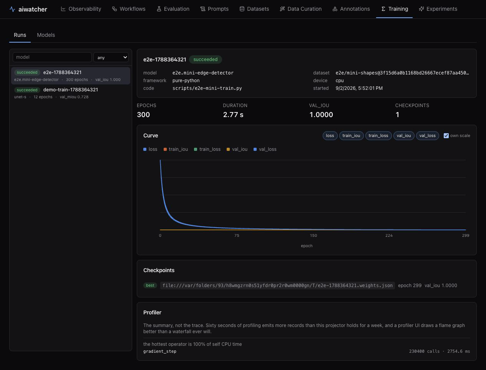

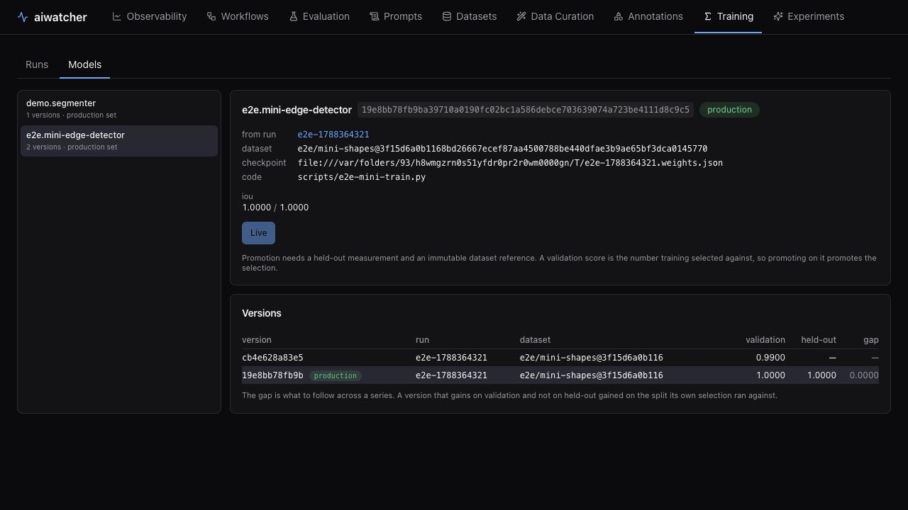

### Seeing it work

```bash
just e2e-train
```

Twelve 64×48 plans are generated, labelled, exported, fetched back through the
API, rasterised into a coarse wall/not-wall grid and used to fit a real
classifier by gradient descent — eight weights, a few thousand samples, two
seconds, pure Python. It fails if the loss does not fall or the held-out IoU
does not clear a floor, so a green run means the chain moved data rather than
that every call returned 200. It also pins two buildings to each side of the
split and checks both renderings of each stayed together, and it registers a
version with no held-out score to confirm the promotion is refused.

## Serving the promoted demo

The registry is the control plane: it decides which immutable version the
`production` label names. The serving process resolves that label, loads
whichever runtime the version's package declares — the JSON weight vector
`just e2e-train` produces, or the ONNX graph below — and starts an inference
endpoint:

```bash
just serve-model                         # http://127.0.0.1:8091
curl -s http://127.0.0.1:8091/v1/model
curl -s -X POST http://127.0.0.1:8091/v1/predict \
  -H 'content-type: application/json' \
  -d '{"instances":[[1,0.9,0.1,0,0,0,0,0.81]]}'
```

What it does before it answers a single request is the part worth reading. It
refuses a registry that resolved a version the label does not name; it hashes
every artifact the version's **package** declares and refuses a mismatch — an
address is not an identity, and `s3://models/latest.pt` is different bytes
tomorrow; it runs one synthetic request through the loaded model; and only then
does `/readyz` stop answering 503.

It then watches the label. Moving `production` downloads, verifies and warms the
candidate **while the old version keeps serving**, and swaps only if all three
succeed — so a version whose weights do not hash to what its package says never
becomes ready, and the reason lands on `/v1/model` rather than on a pager. The
previous version stays loaded, so going back is a request rather than a rebuild:

```bash
curl -s -X POST http://127.0.0.1:8091/v1/rollback
```

Every executed model call emits `run.started → llm.started → llm.completed`
carrying the model, version, label, traffic (`primary|shadow`), rows, latency
and outcome — so it lands in the same traces and the same `model` dimension as
an agent's model call. What those events never carry is the instances or the
predictions: **inference inputs and outputs do not go on the event log**, and a
runtime that wants to keep them writes turns to the conversation archive with
consent and a retention clock, exactly as an agent does.

### The same model, as a graph

Two runtimes load. `just onnx-version` takes the version `production` already
names and writes the *same function* as an ONNX graph, checks the two against
each other row by row, and moves the label:

```bash
just onnx-version          # needs `pip install 'aiwatcher-sdk[onnx]'`
```

```text
4. check they agree before claiming the same score
   261 rows, worst disagreement 3.68e-07 — the same function
6. move the label
   production → fe16caa60271
```

That check is the licence for what follows: the graph is registered with the
weight vector's held-out score, and the reason that is honest is that it
computes the same function to six decimal places. A running `just serve-model`
then rolls forward **across a runtime change** — same three phases, different
loader on the far side — and answers with the same probabilities to six places:

```json
{"runtime": "onnx", "previous": {"runtime": "weights"}, "rollouts": 1}
```

What the ONNX loader adds is a check nothing else here can make. A graph
carries its own input and output names, element types and shapes, so the
package's declaration is **cross-checked** against what the artifact says about
itself rather than trusted:

```text
the package declares the input features dimension 1 as 8 and the graph
declares 16. These do not describe the same model
```

That is not pedantry about a typo. A package whose shape is wrong describes a
*different model*, which means the version's held-out score, its dataset
lineage and its label order belong to something else — and it is the only check
in this chain where the model itself gets a vote. The same reasoning refuses a
head that is not as wide as its declared vocabulary, a graph with two inputs or
an image-shaped one (this request surface sends rows of numbers), a pinned
batch axis, and an onnxruntime older than the one that wrote the graph.

The demo defaults to `file://`. A deployment can add signed, byte-bounded
`s3://` reads for one configured bucket with
`AIWATCHER_MODEL_S3_ENDPOINT`, `AIWATCHER_MODEL_S3_BUCKET` and credentials from
`AIWATCHER_MODEL_S3_*` or the standard AWS environment. Verified downloads are
cached atomically by immutable version and digest with an LRU byte budget;
`/v1/model` reports the non-secret reader and cache configuration. What remains
is an approved-Hub reader plus TorchScript and isolated `python` loaders. See
[plan.md](plan.md) and [ADR_0023](docs/ADR/ADR_0023_MODEL_PACKAGE.md).

### Mirror a candidate without serving its answer

After pointing a second registry label at a candidate, start the same process
with `AIWATCHER_SERVE_SHADOW_LABEL=candidate`. Every validated primary request
is eligible for a fire-and-forget call into that independently verified and
warmed version; the result is discarded. A separate non-blocking semaphore
(`AIWATCHER_SERVE_SHADOW_CONCURRENCY`, default 1) drops rather than queues
excess mirror work.

`/v1/model` reports the shadow's exact version and its per-version request,
failure-rate, drop and mean-latency window. Its telemetry is marked
`traffic=shadow` and carries no inputs or outputs. This is intentionally not a
canary yet: runtime failures and latency can show that a model broke, but not
that its predictions became worse.

## Starting the work, not only watching it

Data Curation and Experiments both carry a picker over the orchestrator's own
inventory: the launch plans Flyte already holds, with the inputs each one
declares rendered as a form. The page fills in what it knows — the dataset name
and the time window become the "what" and the "over what period" — and
launching needs the `admin` role, exactly as a rerun does. An instance with no
orchestrator configured says which variable is unset rather than showing an
empty catalog. See [ADR_0016](docs/ADR/ADR_0016_PIPELINE_ENGINE.md).

Nothing has run when the acknowledgement appears, and the panel says so: it
shows the engine's phase as a second opinion and links to aiwatcher's own live
view of the execution, which fills in once the workflow's producer publishes.

## Conversations

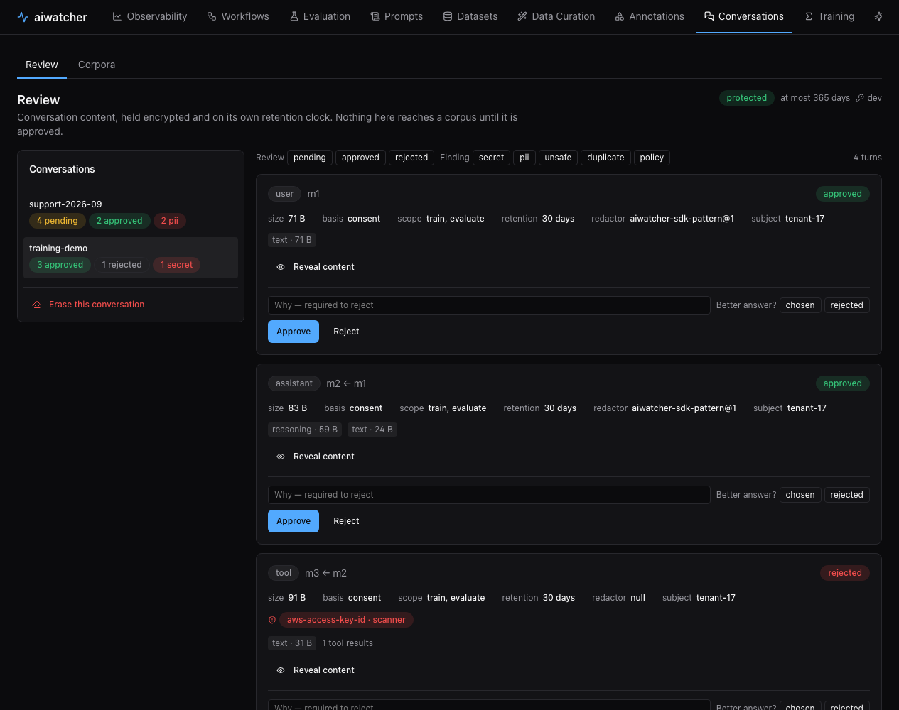

What people said to your agents, kept on purpose and only when a deployment has
said so. The list on this page decrypts nothing: every badge, count and finding
comes from a turn's plaintext head, which is why a review queue over a corpus
nobody may read is still a usable screen. Reading the words is one explicit
click and needs the `admin` role; a viewer sees that a turn exists, what shape
it is, whose consent covers it and what the scanner found, and never what it
says.

The findings are the useful part. A producer's own redaction hook runs before
anything leaves its process, and the server scans again — because a hook that
was misconfigured reports exactly the same record as one that worked. The
demo's third turn is recorded through a producer whose hook was never wired to
tool output, which is the realistic misconfiguration, and the credential in it
is caught here rather than in a corpus.

Rejecting needs a reason, and the reason is the record. The preference field
beside it is a *separate* axis: approving says the content may be used at all,
and choosing between two sibling answers says which was better. Keeping them
apart is what stops a turn rejected for holding somebody's address becoming the
rejected half of a preference pair.

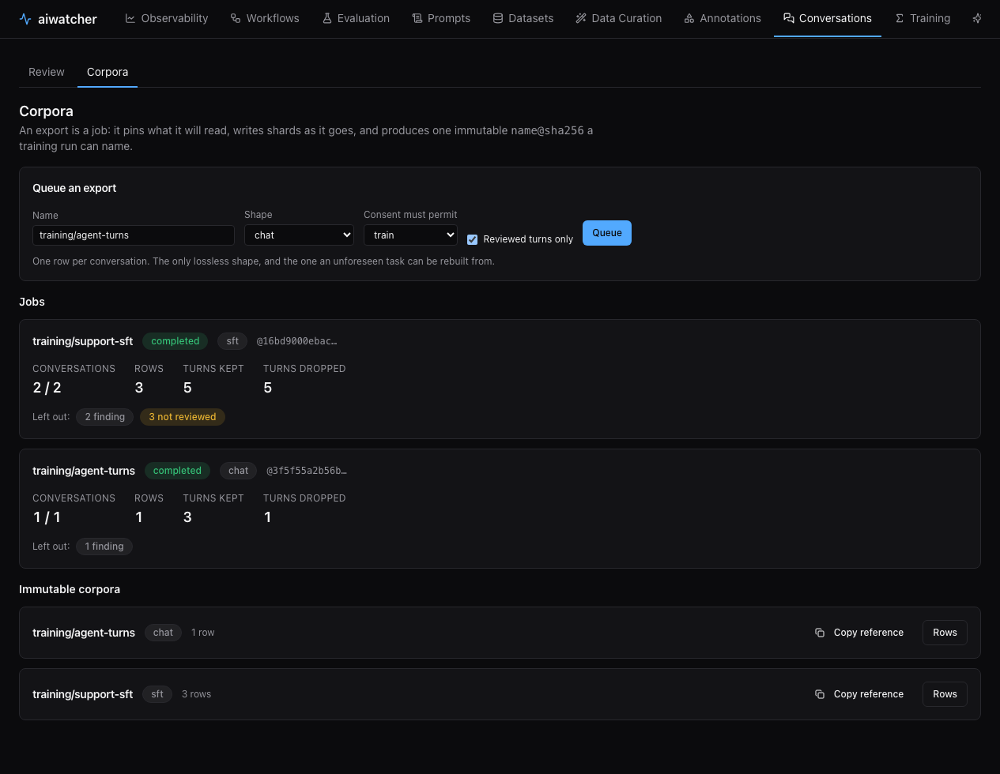

An export is a job rather than a request somebody holds open. It pins the
conversations it will read, writes sealed shards, and advances its cursor only
after each one is stored — so a process killed mid-export resumes at the last
shard it committed and reaches the same version an uninterrupted run would.
Four shapes come out of the same turns: a lossless chat transcript, a
prompt/response pair, an SFT row with its context, and a preference pair built
only from what a reviewer explicitly labelled.

The exclusion table is the part worth reading. An export that quietly produced
forty rows from four thousand turns looks exactly like one that worked; the
counts are what turn that into "three thousand nine hundred are still waiting
for review". Every reason is named — not reviewed, review rejected, consent
missing, scope not permitted, a finding, erased — and the manifest says whether
its sample list is the whole story.

What comes out is `training/agent-turns@sha256`, which is the reference a
training run records and the one a model promotion is refused without. An
erasure request later takes the words out of the archive **and** out of every
corpus that already had them: the manifest survives with its counts and
digests, so the reference still resolves and says what happened to it, and the
rows answer 410.

## Remaining product boundary

Experiments can start a training, evaluation or inference workflow, and cannot
yet *compare* two of them: the join from a variant to the traces it produced —
where latency and token cost live — needs `variant` to become a dimension
first. That half of the area renders a placeholder naming what is missing,
rather than mocked rows: a plausible fake reads as working software, and this
one does not.

Large resumable Hub imports and a general deployment runtime still require
explicit design work. The exact gaps, security constraints and acceptance
criteria are in [plan.md](plan.md); the small local bridges described above are
working now. Governed conversation capture is no longer among them — see the
Conversations section above.

## Reproducing these

```bash
just install    # panel and TypeScript SDK dependencies
just dev        # server on :8080 with an in-memory bus, panel on :5173
```

Then, against the running server:

```bash
just seed             # one run: ~35 events in, 5 spans out
just seed-evaluation  # two comparable reports of one suite on one dataset
just seed-prompts     # a prompt, three optimisations, one of them admitted
just seed-workflow    # two executions of one declared graph: one done, one live
just seed-curation    # 80 runs, saved Flow recipes and two immutable datasets
just seed-annotations # six synthetic plans, three families, an export, a training run
just e2e-train        # the same chain, end to end, with a real (tiny) model
```

The conversation archive is off by default and needs its own server, because
turning it on is a decision rather than a flag:

```bash
just run-conversations   # in place of `just run`; writes a dev key into ./.data
just seed-conversations  # record, review, export, and read one row back
```

See [instructions.md](instructions.md) for both complete paths: tracked agent
conversation → dataset, and Hugging Face discovery → mapped annotation project
→ export → training → serving.

`seed-annotations` draws its own plans in pure Python — no Pillow, no numpy —
so the labels are correct for the pixels rather than approximately correct,
which is the one thing a seeded dataset can get wrong in a way nobody notices.
It leaves one image as a draft and marks one CC BY-NC, so the export has
something to exclude for each of the two reasons.

The Query tab needs the optional PHP service; without it that tab says so and
nothing else is affected:

```bash
just flow-install
just flow-serve       # :8081, reading the aiwatcher API on :8080
```

The runs behind the fuller screenshots — several workflows, four agents, four
models, one failure — are more than `just seed` publishes on its own; run it a
few times with different ids and environment overrides:

```bash
AIWATCHER_WORKFLOW=floor-plan AIWATCHER_SERVICE=planner-service \
  AIWATCHER_CONVERSATION=conv-beta just seed run-002
```
