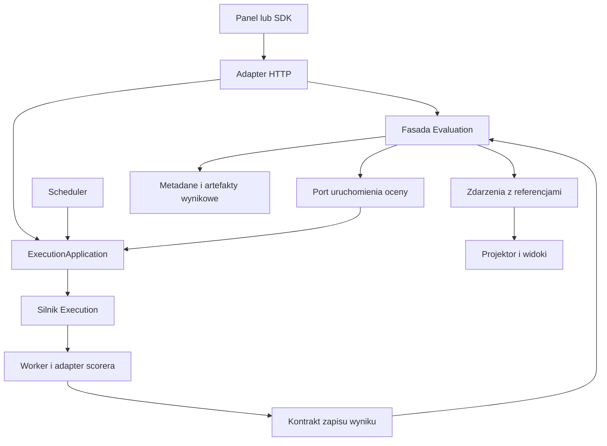

# FTI — vertical slices, bounded contexts i koszt rozszerzeń

Data: 2026-09-11. Przegląd aktualnego katalogu roboczego, obejmującego niezacommitowane zmiany. Status: ocena i plan, bez refaktoryzacji implementacji.

## 1. Werdykt

**Częściowo tak. Mamy dobry fundament modularnego monolitu, egzekwowane vertical slices w panelu i kilka dobrze wydzielonych kontekstów domenowych w Rust. Nie wszystkie nowe funkcje da się jednak dziś dodać bez rozszerzania centralnych modułów.** Najważniejsze wyjątki to ewaluacje oraz logika uruchamiania workflow umieszczona w API.

Porównania treningów, zapis widoków i linki pochodzenia z etapu A można wdrażać na obecnej architekturze. Przed rozbudową trwałych ocen trzeba nadać im własny moduł domenowy; przed dokładaniem kolejnych sposobów uruchamiania trzeba oddzielić wspólny przypadek użycia od HTTP. Nie ma uzasadnienia do przepisywania platformy ani rozbijania jej na mikroserwisy.

Vertical slice oznacza tutaj skupienie zachowania, komponentów i testów wokół funkcji. Bounded context dodatkowo ma własne pojęcia, reguły, dane i publiczny kontrakt. Sam katalog `features/`, osobny crate lub nazwa zakładki nie gwarantują tej drugiej właściwości. F/T/I opisuje przepływ produktu; nie powinno stać się trzema wielkimi kontekstami.

## 2. Co już pomaga w rozwoju

| Obszar | Dowód w kodzie | Ocena i znaczenie dla zmian |
| --- | --- | --- |
| Panel | [Układ features i zasady](../apps/panel/README.md), [kontrola importów](../apps/panel/scripts/check-architecture.mjs) | Rzeczywiste slices: ekrany, URL, komponenty, logika i testy są przy funkcji. Feature nie importuje innego feature; shared nie importuje feature ani composition. Nowy ekran ma przewidywalne miejsce. |
| Egzekwowanie panelu | [build/typecheck](../apps/panel/package.json), [CI](../.github/workflows/ci.yml) | Kontrola analizuje składnię TS, także eksporty i literalne dynamiczne importy. Jest częścią build/typecheck i przez build trafia do CI. To działa silniej niż sama konwencja. |
| Domena backendu | [Annotations Registry](../crates/aiwatcher-annotations/src/registry.rs), [Conversations](../crates/aiwatcher-conversations/src/lib.rs), [Training](../crates/aiwatcher-training/src/lib.rs) | Registry i prywatny storage zamykają operacje oraz reguły. Conversations ma własną politykę treści, review, retencję i usuwanie; Training własny trwały rejestr. To są sensowne granice kontekstów. |
| Zależności Rust | Manifesty 16 crate'ów w `crates/` | Graf bezpośrednich zależności produkcyjnych jest acykliczny. Datasets, Training i Prompts zależą z lokalnych crate'ów tylko od Core; Annotations i Conversations od Core i Jobs. Nie ma wzajemnego łańcucha zależności tych domen. |
| API i kontrakt panelu | [router](../crates/aiwatcher-api/src/routes.rs), [OpenAPI i test składania fasad](../crates/aiwatcher-api/src/openapi.rs) | Moduły dostarczają router/OpenAPI, panel używa wygenerowanego klienta. Test chroni składanie zadeklarowanych fasad. Globalna autentykacja jest na routerze, uprawnienia operacji w handlerach. |
| Silnik wykonania | [ActivityExecutor i ExecutorRegistry](../crates/aiwatcher-execution/src/activity.rs), [handler](../crates/aiwatcher-execution/src/handler.rs) | Wykonawcy mają port i rejestrację; stan wykonania i retry nie muszą być implementowane na nowo dla każdej funkcji. Nowy scorer powinien korzystać z tego mechanizmu. |
| SDK | [wspólny transport API](../sdk/python/aiwatcher_sdk/api.py), [training](../sdk/python/aiwatcher_sdk/training.py), [prompts](../sdk/python/aiwatcher_sdk/prompts.py), [test lekkiego importu](../sdk/python/tests/test_worker.py) | Klienci domen są już wydzielani. Telemetria ma lekkie wejście i inną semantykę awarii niż trwałe zapisy registry. Nie należy scalać tych dwóch kontraktów tylko dla ujednolicenia kodu. |

Duża liczba zależności `aiwatcher-server` i `aiwatcher-api` jest częściowo naturalna: składają produkt z modułów. Problemem jest przenikanie ich globalnego stanu i błędów transportu do przypadków użycia, a nie sam fakt, że composition root zna wiele domen.

Backend ma połączenie modułów domenowych i warstw technicznych. Funkcja przechodząca przez Rust, HTTP, SDK i React nadal wymaga zmian w kilku katalogach. To nie przekreśla vertical slices: ważniejsze, żeby nie zmieniać reguł i magazynów niepowiązanych kontekstów.

## 3. Miejsca utrudniające kolejne funkcje

### R1. Evaluation jest przede wszystkim projekcją, bez właściciela trwałych operacji

[API evaluations](../crates/aiwatcher-api/src/evaluations.rs) odczytuje `ReadModel`. [Projektor evaluations](../crates/aiwatcher-projector/src/evaluations.rs) skupia reprezentację wyniku, stan, agregaty i dobór baseline. [ReadModel](../crates/aiwatcher-projector/src/readmodel.rs) przechowuje ewaluacje razem z projekcjami runów i workflow, pod wspólnym `RwLock` i z limitami retencji.

To wystarcza do przeglądania zdarzeń `eval.*`. Dopisanie w tym miejscu suite registry, ocen recenzentów, wersji rubryk, trwałych dowodów i decyzji CI połączyłoby domenę jakości z przebudowywalnym widokiem telemetryki. Sam wspólny lock nie jest dowodem problemu wydajnościowego; nie wykonywano pomiarów obciążenia.

**Zalecenie przed B2/B4:** wydzielić `aiwatcher-evaluation` z publiczną fasadą i własnym zapisem metadanych. Moduły wewnętrzne: `suites`, `results`, `assessments`, `comparison`; manifesty wariantów początkowo również tutaj. Pełne wyniki korzystają z istniejących artefaktów, a projektor przechowuje podsumowania i referencje. Wykonanie judge'a pozostaje zadaniem workera. Nie dodawać ewaluacyjnego CRUD do `WorkflowStore`.

Migracja musi określić jedno źródło prawdy dla nowych wyników. Stare zdarzenia nadal dają historyczny raport, z jawnym stanem brakującego kontekstu lub szczegółu; nie mogą niejawnie nadpisywać trwałego wyniku. Zachować istniejące identyfikatory i odczyt starszych payloadów.

### R2. Wspólny przypadek użycia uruchomienia zależy od HTTP

[API executions](../crates/aiwatcher-api/src/executions.rs) udostępnia `compile_head`, `start` i `resolve_payloads`, przyjmujące `AppState` oraz zwracające `ApiResult`. [Scheduler serwera](../crates/aiwatcher-server/src/execution/scheduler.rs) wywołuje te funkcje i klasyfikuje trwałość błędu na podstawie HTTP statusu `ApiError`.

Dobrze, że start ma jedną implementację i wspólną idempotencję. Jej właścicielem powinien być jednak moduł aplikacyjny, dostępny dla HTTP i harmonogramu. Inaczej CI, launcher ocen i alerty będą dalej zależeć od stanu i semantyki warstwy HTTP.

**Zalecenie przed C0:** wydzielić wąski `ExecutionApplication` z operacjami kompilacji/startu, potrzebnymi portami i błędami aplikacyjnymi, np. odmowa planu kontra czasowa niedostępność. Jeśli zmieści się w `aiwatcher-execution` bez wciągania kolejnych domen i konfiguracji serwera, umieścić go tam; w przeciwnym razie zastosować mały `aiwatcher-execution-app`. API mapuje błędy na HTTP, scheduler na zasady ponowień. Server składa zależności. Zachować autoryzację wejść, tożsamość inicjatora, politykę payloadów, powiadamianie workera i klucz idempotencji.

### R3. Shared kernel zawiera szczegóły domeny promptów

[Core prompts](../crates/aiwatcher-core/src/prompts.rs) zawiera typy promptów, optymalizacji i `verdict`, ale też ogólny port `ObjectStore`. Z tego portu przez namespace `core::prompts` korzystają m.in. [Training](../crates/aiwatcher-training/src/lib.rs), [Conversations](../crates/aiwatcher-conversations/src/lib.rs) i [Annotations](../crates/aiwatcher-annotations/src/lib.rs).

To nie jest zależność tych rejestrów od crate'a Prompts, ale granica pojęciowa jest rozmyta. Umieszczenie kolejnych reguł ocen w Core zwiększyłoby wspólną powierzchnię zmian.

**Zalecenie przy B1:** pozostawić w Core neutralne identyfikatory, referencje, zdarzenia i porty. Przenieść `ObjectStore` do neutralnego modułu, np. `core::storage`, z kompatybilnym reexportem. Nowe polityki oceny trzymać w Evaluation; przeniesienie istniejących reguł optymalizacji do Prompts zaplanować przy ich zmianie, po sprawdzeniu zależności i serializacji. Nie przenosić wszystkich typów naraz ani nie tworzyć cyklu Core → domena → Core.

### R4. Brakuje analogicznej bramki granic kontekstów backendu

W przejrzanych konfiguracjach CI i skryptach nie znalazłem ogólnej reguły dozwolonych zależności kontekstów Rust/SDK. Kompilator Rust pilnuje poprawności zależności i prywatności, istnieją testy fasad API i lekkości importu Python. Nie wykrywają jednak każdego nowego, niepożądanego powiązania domen.

**Zalecenie od początku:** krótka mapa właścicieli i test dozwolonych krawędzi z `cargo metadata`, uwzględniający rodzaje zależności, aliasy i targety. Osobno zależności produkcyjne i testowe; obecne uzasadnione wyjątki jawnie opisane. Konteksty nie importują API/Server ani prywatnych backendów innych kontekstów. Dla nowych modułów Python rozszerzać obecny test lekkiego importu oraz sprawdzać kierunek SDK → kontrakt/transport, bez importowania workerów i integracji z klienta bazowego.

### R5. Lokalna złożoność utrudnia pracę mimo poprawnych granic

[AppState](../crates/aiwatcher-api/src/state.rs) łączy wiele rejestrów, workerów i ustawień. [Ekran pipeline](../apps/panel/src/features/data-curation/screens/pipeline/page.tsx) ma ponad tysiąc linii i odpowiada m.in. za edycję, wersję, wykonanie i wyniki komórek. [Główny moduł SDK](../sdk/python/aiwatcher_sdk/__init__.py) łączy transport telemetryczny, konteksty i rejestrowanie ewaluacji.

Rozmiar pliku sam nie dowodzi złej architektury. Tutaj wskazuje miejsca, w których kolejna funkcja może wymagać rozumienia zbyt wielu zachowań naraz.

**Zalecenie podczas dotykania tych miejsc:** handlerom nowych funkcji przekazywać wąski stan/fasadę, np. przez `FromRef<AppState>`. W panelu wydzielać hooki przypadków użycia wewnątrz własnego feature. Nowe klienty ocen i feedbacku umieszczać w modułach SDK; dotychczasowe wejście może delegować dla kompatybilności. Wspólne komponenty, np. harmonogramu, są uzasadnione rzeczywistym użyciem, ale reguły domenowe nadal mają jednego właściciela.

### R6. Silnik zna model curation — świadoma, lecz kosztowna granica

[Kompilator execution](../crates/aiwatcher-execution/src/compile.rs) używa `CurationPipeline`, `BlockSpec` i `QueryEngine` z Datasets; [plan](../crates/aiwatcher-execution/src/plan.rs) również zna `QueryEngine`. Silnik i adapter jednej postaci definicji są więc w jednym crate.

**Zalecenie warunkowe:** przy dodaniu istotnie innego źródła definicji wydzielić kompilację curation do adaptera. Nie jest to warunek porównań ani pierwszego scorera. Dla nowych scorerów używać istniejących zadań workera; nowy scorer nie powinien oznaczać nowego `RuntimeKind`, stanów retry ani zmian we wszystkich magazynach wykonania. Dodanie naprawdę nowego runtime'u może zasadnie wymagać takich zmian.

## 4. Proponowani właściciele funkcji z roadmapy

| Kontekst / moduł | Własne dane i reguły | Integracja z pozostałymi |
| --- | --- | --- |
| Datasets / Curation | Wersje datasetów curation, receptury i ich schematy | Odbiera zatwierdzone przypadki przez publiczną operację; zachowuje referencję źródła. Eksporty Annotations i Conversations zachowują własnych właścicieli i odrębne typy referencji. |
| Annotations | Projekty adnotacji, etykiety, rewizje, eksport | Udostępnia wersjonowany eksport przez fasadę; Evaluation nie odczytuje prywatnego storage. |
| Conversations | Treść, zgoda na użycie, retencja, usuwanie, review dopuszczenia do korpusu | Ocena jakości może wskazywać turę/snapshot; nie nadaje prawa do treści ani eksportu. Usunięcie źródła musi być uwzględnione przez zależne artefakty zgodnie z polityką. |
| Training / Models | Treningi, checkpointy, modele, reguły promocji modelu | Pobiera dowody oceny przez kontrakt. Evaluation nie zapisuje samodzielnie etykiety produkcyjnej modelu. |
| Prompts | Wersje promptów, optymalizacje i reguły promocji promptu | Wykorzystuje przypięte dowody; zachowuje odrębność od zasad promocji modelu. |
| Evaluation — nowy właściciel | Definicje suite i rubryk, wyniki, assessments, porównywalność, polityka wyniku CI | Referencje danych/promptu/modelu zamiast kopii ich rejestrów. Manifest wariantu i widok eksperymentu początkowo jako moduły tego kontekstu. |
| Execution + usługa aplikacyjna | Definicja wykonania, kompilacja/start, stan pracy, próby, retry i anulowanie | Uruchamia zadanie oceny; nie rozstrzyga jakości wyniku ani zgody na wykorzystanie rozmowy. |
| Telemetry / Projector | Zdarzenia, trace, przebudowywalne widoki i agregaty | Projektuje podsumowania oraz referencje trwałych wyników. Nie jest miejscem zapisu rubryk ani ręcznej oceny. |
| Powiadomienia — etap D | Reguła dostarczenia, deduplikacja, próby i historia | Reaguje na wynik/politykę właściwego kontekstu. Nie kopiuje algorytmu porównywania ocen. |

Docelowy kierunek wywołań dla startu, nie diagram wszystkich zależności crate'ów:

Strzałki opisują interakcje, nie wzajemne importy. Evaluation deklaruje wąski port uruchomienia, adapter jest składany w Server; worker zapisuje wynik przez kontrakt. Synchroniczne wywołanie fasady wystarcza, gdy nie potrzeba niezależnego dostarczania. Outbox i zdarzenia stosować tam, gdzie utrata lub powtórzenie dostarczenia ma znaczenie, np. dla trwałych powiadomień; nie wprowadzać event busa do każdej operacji.

## 5. Jak duża powinna być typowa zmiana

| Przykład | Oczekiwana powierzchnia | Sygnał złej granicy |
| --- | --- | --- |
| Porównanie treningów | Feature Training, ewentualnie rzeczywiście wspólny wykres, testy URL i zachowania | Konieczność zmiany stanu Execution, Conversations albo importowania ekranu Evaluation |
| Nowy scorer | Adapter/zadanie workera, wersjonowana konfiguracja i testy wyniku; wykorzystanie kontraktu Evaluation | Nowy runtime lub pola w czterech backendach `WorkflowStore` wyłącznie dla metryki |
| Ocena człowieka | Moduł assessments, fasada HTTP, generowany klient, SDK i właściwy ekran | Reguły rubryki dopisywane do Core i projektora; jakość nadpisuje zgodę na wykorzystanie treści |
| Nowy kanał alertu | Adapter dostarczenia i testy retry/deduplikacji | Skopiowany dobór baseline lub nowe wywołania handlerów HTTP ze schedulera |
| Nowy publiczny zasób domenowy | Moduł domeny → router/OpenAPI → wygenerowane kontrakty → SDK/UI; rejestracja w composition root | Bezpośrednie zapisy do storage innego kontekstu lub ręczne poprawianie wygenerowanego klienta |

Kilka plików w różnych warstwach jest normalne dla funkcji dostępnej przez API. Celem jest lokalność reguł i danych, a nie sztuczny limit liczby zmienionych plików.

## 6. Kolejność i kryteria odbioru architektury

| Paczka | Kiedy | Konkretny rezultat i sprawdzenie |
| --- | --- | --- |
| AR1 — mapa i ochrona granic | Razem z A / B1 | Uzgodniony właściciel nowych danych; kontrola dozwolonych zależności Rust w CI. Kontrolowane dodanie niedozwolonej krawędzi ma wywołać błąd. Zachować obecną kontrolę panelu. |
| AR2 — właściciel Evaluation | B1, implementacja z B2/B4 | Publiczna fasada, prywatny storage, wersjonowane wyniki i kompatybilny odczyt starszych raportów. Trwały wynik nadal dostępny po wyczyszczeniu projekcji. Nowe reguły nie trafiają do Core. Neutralny port storage wydzielany bez zrywania dotychczasowych importów. |
| AR3 — wspólny start poza HTTP | Najpóźniej przed C0 | HTTP i scheduler używają tej samej usługi bez zależności jej kodu od `ApiError`/`AppState`. Testy potwierdzają tę samą odmowę, tożsamość, politykę payloadów i idempotencję z obu wejść. |
| AR4 — SDK i lokalne slices | Wraz z B4 / C | Nowe API klienta w module ocen; root nadal nie importuje workera/httpx/judge'a. Hooki i testy pozostają przy funkcji panelu; żaden nowy import między features. |

R6 realizować dopiero, gdy nowy typ definicji uzasadni koszt. Nie blokować A ogólnym „sprzątaniem architektury”. Przenoszenie istniejących polityk promptów i rozbijanie dużych ekranów wykonywać przy zmianie odpowiadającego im zachowania, z testami zachowania i kompatybilności.

## 7. Zakres weryfikacji tego przeglądu

- Przejrzano konwencje repozytorium, manifesty crate'ów, granice panelu, fasady API/domen, projektor ocen, scheduler/start i wybrane moduły SDK.
- Uruchomiono `rtk npm run check:architecture` w `apps/panel`: **PASS**, `Panel architecture boundaries passed.`
- Odczytano 16 manifestów Rust i sprawdzono acykliczność zadeklarowanych bezpośrednich produkcyjnych zależności lokalnych: **PASS**. To kontrola statyczna manifestów, nie kompilacja ani pełna analiza wszystkich feature flags.
- W osobnym procesie Python sprawdzono import lokalnego `aiwatcher_sdk`: **PASS**, root nie załadował `aiwatcher_sdk.worker` ani `httpx`. Istnieje też odpowiadający temu test w `test_worker.py`; całego tego pliku testów nie uruchamiano.
- Nie uruchamiano pełnych testów Rust/SDK, aplikacji ani benchmarku. Nie audytowano szczegółowo wszystkich serwisów wykonawczych. Wnioski o koszcie zmian są oceną zależności i odpowiedzialności kodu, nie pomiarem czasu implementacji. Trwające zmiany wykonawcy podowego wymagają własnego odbioru.

Powiązania: [plan realizacji](FTI_IMPLEMENTATION_PLAN.md), [braki funkcji](FTI_FEATURE_GAPS.md), [Langfuse i MLflow](FTI_LANGFUSE_MLFLOW_ANALYSIS.md).

## 8. AR1 — utrwalona bramka (2026-09-11)

Polityka jest zapisana w `scripts/rust-boundaries.json`, a nie wyprowadzana na nowo z bieżących krawędzi. `scripts/check-rust-boundaries.py` odczytuje `cargo metadata --no-deps --format-version 1 --locked`: sprawdza wszystkie zadeklarowane zależności workspace, także opcjonalne, aliasowane i dla nieaktywnego targetu. Zależności build podlegają polityce produkcji; dev mogą dodatkowo używać jawnych wyjątków `test_only`. Nowy crate wymaga wpisu po przeglądzie właściciela. Bramka i negatywne testy są częścią `scripts/check.sh` / `just check` oraz istniejącego joba Rust CI. Dotychczasowa bramka panelu pozostaje aktywna.

Właściciele zakresu A:

- Training posiada parametry, epoki, zgłoszony best i relację model → trening. Porównanie to odczyt jego API przez feature Training.
- Projector posiada tylko przebudowywalną projekcję starych `eval.*` i regułę porównania odczytanych dowodów. Wersje datasetu/suite/scorera/split są opcjonalnymi danymi producenta. Nowe trwałe wyniki i rubryki nadal należą do przyszłego Evaluation (AR2).
- Datasets, Annotations i Conversations zachowują odrębne rejestry i semantykę wersji. Panel nie wybiera rejestru z samego `@`.
- Execution posiada wykonanie/krok; raport zawiera referencję, nie zapisuje do magazynu wykonania.
- Panel posiada metadane lokalnego widoku i preferencje czytelnika, bez kopii raportów ani rozmów.

Jawne wyjątki produkcyjne: Execution → Datasets (istniejący kompilator curation), Server → API (wiring i obecny scheduler/start, do wydzielenia w AR3). API i Server są warstwami kompozycji i mają enumerowane krawędzie, a nie wildcard. Core nadal zawiera historyczne typy promptów i `ObjectStore`; nie dodano tam reguł ocen.

Wyjątki testowe: domeny używają `prompts` dla `MemoryObjectStore`; Execution używa własnej fasady testowej; Projector używa faktów Execution; API korzysta z Jobs w fixture. Żaden taki wpis nie pozwala na produkcyjny import. Test kontrolowanego naruszenia sprawdza Training → API jako zależność normal/build/dev, z aliasem i targetem Windows; drugi dowodzi, że pozwolenie testowe Training → Prompts nie przenika do produkcji.

## 9. B1 — rozpoczęcie AR2 (2026-09-11)

Dodano `aiwatcher-evaluation` z publiczną fasadą `Evaluation::prepare`, typami manifestu/kontekstu i prywatnymi modułami. Właściciel jest już wyodrębniony; trwałe operacje i ich prywatny storage pozostają B2. Fasada waliduje deklarację oraz wylicza niezmienne identyfikatory, nie potwierdza istnienia ani uprawnień do artefaktów. [ADR 0030](ADR/ADR_0030_EVALUATION_EVIDENCE.md) określa protokół atomowego zapisu, trwałość, źródła prawdy i migrację starszych raportów.

`ObjectStore` i `ObjectEntry` przeniesiono do neutralnego `core::storage`; oba stare importy są reexportami tych samych typów. Istniejące adaptery zachowują semantykę. Evaluation ma jedyną dopuszczoną krawędź do Core; testy negatywne odrzucają jego zależności normal/build/dev od API, Projector, Training, Prompts i Execution. Nowa domena nie otrzymała wyjątku testowego do Prompts.

Kontrakty SDK są osobnymi modułami, a test importu Python potwierdza brak workera i transportów. Generator JSON Schema oraz fixture konsumenta TypeScript mają własną bramkę w check/CI. Nie dodano endpointów ani importów między features panelu.

**AR2 nie jest jeszcze zamknięte:** trwały odczyt po restarcie/utracie projekcji, weryfikacja artefaktów, usunięcie źródła i atomowe konflikty publication należą do odbioru B2. AR3 pozostaje przed C0; kontrakt B1 nie wciąga startu wykonania do Evaluation.

## 10. B2 — trwały registry i mostek odczytu

Evaluation zachowuje wyłącznie zależność do Core; prywatny `store` jest jedynym właścicielem kluczy/commita/tombstones. Dodano jawne krawędzie API → Evaluation i Server → Evaluation. Testy rzeczywistych adapterów są w Server, bez wyjątku Evaluation → Prompts. `ObjectStore::create` jest neutralną zdolnością; stary `put` i historyczne importy pozostają kompatybilne.

API składa registry i starszy czytnik. Projector otrzymał tylko filtrowanie wykluczonych ID, bez importu Evaluation lub polityki dostępu. Odczyt znanego trwałego ID jest autorytatywny, również dla tombstone, forbidden i uszkodzonego artefaktu. Stare suite i automatyczny baseline nie używają wykluczonych raportów. Nowy klient registry Python importuje transport dopiero przez osobny moduł; same kontrakty oraz root telemetry pozostają lekkie. TypeScript ma osobny eksport i testy runtime.

Potwierdzono współbieżny commit i utraconą odpowiedź na memory/file/real RustFS, odczyt po restarcie procesu i utracie projekcji, paginację, usunięcie źródła i stany uszkodzenia. Pełne check przeszło. **AR2 pozostaje otwarte** dla adapterów natywnych źródeł oraz bezpiecznej zbiórki niezatwierdzonych artefaktów; działający syntetyczny adapter nie dowodzi polityk Conversations/Annotations/Curation. Szczegóły i następny krok w sekcji 10 planu.
