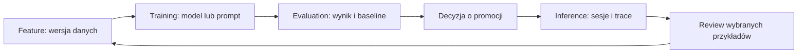

# FTI — plan spójnego interfejsu inspirowanego W&B

Data przeglądu: 2026-09-11. Status: propozycja do projektowania i implementacji.

Uzupełnienia: [braki funkcjonalne względem W&B](FTI_FEATURE_GAPS.md) oraz [lista funkcji platformy](FTI_FEATURE_CATALOG.md).

Rekomendacja: zachować Feature / Training / Inference jako główną oś pracy, dołożyć wspólne wzorce nawigacji, tabel, szczegółów i wykresów oraz wydzielić ustawienia osobiste i administrację. Z W&B przejąć organizację pracy wokół obiektów i kontekstu. Wygląd oprzeć na istniejącym systemie aiwatchera i dopracować jego czytelność.

## 1. Co zostało sprawdzone

W zalogowanej przeglądarce obejrzałem Home, menu profilu i konta, ustawienia organizacji (Users i Settings), ustawienia osobiste, profil, workspace projektu, wykres w powiększeniu i szczegóły runu. Dokumentację przejrzałem dla Models, Weave, ARIA i HiveMind; wizualnie obejrzałem stronę dokumentacji i referencyjny dashboard kosztów HiveMind.

FTI oceniłem na podstawie aktualnego kodu panelu: nawigacji, shellu, profilu, stylów, wykresów oraz ekranów Training, Evaluation i Experiments. Istniejący screenshot Explore pokazuje starszą nawigację, dlatego nie traktuję go jako dowodu aktualnego układu. Nie uruchamiałem lokalnej aplikacji; responsywność FTI wymaga weryfikacji podczas wdrożenia. ARIA i HiveMind ocenione są na podstawie dokumentacji, nie działania tych usług na koncie.

Ten dokument rozdziela obserwacje W&B, ustalenia z kodu i proponowane funkcje. Nowe ustawienia, projekty, zapisane widoki oraz asystent nie są deklaracją już istniejących możliwości backendu.

## 2. Co przejąć, a co zmienić

| Obszar | Obserwacja W&B | Decyzja dla FTI |
| --- | --- | --- |
| Home | Ostatnia aktywność, wyszukiwanie, zakres osobisty/organizacyjny, ostatnie projekty i raporty | Start roboczy: ostatnie obiekty, aktywne zadania, rzeczy wymagające uwagi. Zakresy pokazywać tylko przy rzeczywistym wsparciu |
| Nawigacja | Globalne menu zmienia się w nawigację projektu; breadcrumb zachowuje kontekst | Stała oś F/T/I, sidebar aktualnej sekcji, breadcrumb obiektu. Jeden zestaw linków dla każdego poziomu |
| Workspace | Lista runów po lewej, sekcje wykresów po prawej, filtry, grupowanie, sortowanie, konfiguracja kolumn | Wspólny wzorzec lista + analiza; zaznaczenie wiąże tabelę, wykres i szczegóły |
| Run | Osobne Charts, Overview, Logs, Files, Artifacts | Jeden kanoniczny ekran danego typu obiektu z sekcjami odpowiednimi do dostępnych danych |
| Profil i konto | Osobiste ustawienia oddzielone od użytkowników, zespołów i konfiguracji organizacji | Trzy zakresy: osobisty, projektowy i administracyjny; administracja poza F/T/I |
| Wygląd aplikacji | Ciemny header, jasna powierzchnia, cienkie obramowania, niewielkie zaokrąglenia, oszczędny akcent turkusowy | Zachować neutralne powierzchnie i oszczędny akcent, użyć własnego niebieskiego FTI; wspólne zasady dla light/dark |
| Ustawienia | Długi rząd zakładek; na obserwowanej szerokości występuje przewijanie i łamanie etykiet | Osobny SettingsLayout z krótkim pionowym menu |
| Gęstość | W workspace trzy wąskie wykresy obok listy runów; nazwy projektów i runów bywają obcięte | Liczba kolumn zależna od szerokości samej przestrzeni roboczej; kontrola gęstości i łatwe ujawnienie pełnej nazwy |
| Profil publiczny | Intro, raporty, projekty, aktywność, udostępnianie profilu | Profil roboczy z rolą, preferencjami i ostatnią pracą. Publiczne portfolio poza pierwszym zakresem |
| Motyw | User settings opisuje dark mode jako beta i nieoptymalny pod względem dostępności | Oba motywy muszą przejść te same kryteria dostępności |

Źródła obserwacji: [Home](https://wandb.ai/home), [ustawienia organizacji](https://wandb.ai/account-settings/mkubasz-ood-org/), [ustawienia osobiste](https://wandb.ai/settings), [workspace](https://wandb.ai/mkubasz-ood/qwen3-4b-flow-php-sft). Wygląd odnosi się do sesji z dnia przeglądu.

## 3. Separacja produktu w FTI

Trzy sekcje odpowiadają na trzy pytania: **z czego uczymy**, **co poprawiliśmy**, **jak działa w użyciu**. Ustawienia odpowiadają na inne pytanie: kto i na jakich zasadach może pracować.

| Sekcja | Własne obszary | Granica odpowiedzialności |
| --- | --- | --- |
| Feature | Datasets, Data Curation, Annotations, przegląd rozmów do korpusu | Źródła, jakość danych, etykietowanie, selekcja i wersjonowanie materiału |
| Training | Training runs, Models, Experiments, Evaluation, Prompts | Warianty, uczenie, porównanie jakości, wersje modelu/promptu i decyzja o promocji |
| Inference | Observability: Explore, Live, Query, Metrics, Runs; Workflows | Przebieg wykonania, błędy, czas, koszty i diagnostyka działającego systemu |
| Ustawienia osobiste | Profil, wygląd, preferencje pracy | Zmiany dotyczące jednego użytkownika |
| Administracja | Integracje i możliwości instancji; docelowo polityki, dostęp, audyt | Konfiguracja systemu i uprawnień, bez mieszania z analizą danych |

Zachować aktualne ścieżki i klasyfikację z `app/navigation.ts` w pierwszym wdrożeniu. Usunięcie powtórzenia etykiety „Training” z sidebaru można uzyskać przez grupę Runs / Models bez zmiany adresów. „Conversations” w Feature warto nazwać „Conversation review”, żeby odróżnić przygotowanie danych od oglądania sesji w Inference.

Workflows są przekrojowym mechanizmem wykonania, choć obecnie mają dom w Inference. W F i T dodawać kontekstowe odnośniki do właściwego wykonania oraz powrót do obiektu źródłowego. Nie budować trzech osobnych list historii. Ewentualne przeniesienie Workflows do wspólnego obszaru wymaga osobnej decyzji architektonicznej i migracji nawigacji.

### Jeden obiekt, jeden właściciel

Dataset ma kanoniczny widok w Feature; Training i Evaluation pokazują odnośnik do konkretnej wersji. Model i prompt mają wersje w Training; Inference pokazuje wykorzystaną wersję, jeżeli producent ją zarejestrował. Ewaluacja ma jeden raport, dostępny także przez odnośnik z modelu lub sesji. Run treningowy i run inferencyjny mają różne kontrakty danych — wspólny wygląd nie oznacza połączenia ich magazynów.



To proponowana ścieżka produktu. Każda strzałka musi mieć identyfikator i dowód powiązania; brak zarejestrowanego związku oznacza „brak powiązania”, nie automatyczne dopasowanie po nazwie.

### Kontekst, widok i uprawnienia to różne rzeczy

Projekt/środowisko określa zakres pracy; F/T/I wybiera etap; filtr wybiera dane; zapisany widok przechowuje sposób ich oglądania. Żaden filtr ani element menu nie stanowi bariery dostępu — uprawnienia egzekwuje serwer.

Nie zakładać, że istniejący `project` w Annotations oznacza globalny projekt całej platformy. Przed dodaniem globalnego przełącznika potrzebny jest audyt kontraktów i zakresów danych. W instancji bez takiego modelu wystarczy nazwa instancji i rzeczywiste filtry obszaru. Hierarchia organizacja → zespół → projekt jest opcją rozwoju, nie warunkiem poprawy UX.

## 4. Układ i nawigacja

Docelowa kompozycja pulpitu:

```text
Logo / kontekst          Feature  Training  Inference         Szukaj  Pomoc  Avatar
────────────────────────────────────────────────────────────────────────────────
Menu sekcji       Breadcrumb: Training / Runs / nazwa
                  Nazwa obiektu + status                  Główna akcja / Więcej
                  Zakres czasu · filtry · zapisany widok
                  ┌────────────────┬─────────────────────────────────────────┐
                  │ Lista / tabela │ Wykresy, porównanie lub szczegóły        │
                  └────────────────┴─────────────────────────────────────────┘
```

1. Header zawiera globalne działania. Pomoc zachowuje kontekst strony; wyszukiwarka pozwala znaleźć stronę lub obiekt. Asystent pojawia się dopiero z realną funkcją i uprawnieniami.
2. Sidebar rozwija aktywny obszar, jak dziś. Zakładki w treści służą wyłącznie różnym aspektom jednego obiektu; nie powtarzają menu obszaru.
3. Breadcrumb zawiera nazwę i typ obiektu; ID można skopiować. Długie nazwy mają pełną wersję po fokusie i na ekranie szczegółów.
4. Główny przycisk występuje raz na poziomie strony. Rzadkie operacje trafiają do „Więcej”. Zapis, uruchomienie i promocja mają różne etykiety.
5. Domyślny dashboard pokazuje kilka odpowiedzi na konkretne pytania. Edytor dowolnego układu i automatyczne generowanie panelu dla każdej metryki są późniejszym rozszerzeniem.
6. Na małym ekranie pasek globalny upraszcza się, menu otwiera jako dostępny drawer, a lista i szczegóły przełączają się zamiast ściskać. To proponowana zmiana obecnych dwóch poziomych rzędów nawigacji mobilnej; należy porównać oba warianty na prototypie.

Stan analizy pozostaje w URL: filtry, sortowanie, identyfikator obiektu i porównywane wersje. Lokalnie zapisujemy motyw, gęstość i szerokość paneli. Zapisany widok wymaga określenia właściciela, zakresu i wersji schematu; publiczny link nie nadaje uprawnień. Dotychczasowe `NavArea.carries` pozostaje jawne — zmiana widoku nie może przenosić przypadkowych filtrów.

## 5. Wspólny język wizualny i komponenty

Poniższe wartości są propozycją startową do walidacji na ekranach FTI, nie pomiarem CSS W&B.

| Element | Propozycja |
| --- | --- |
| Powierzchnie | Tło, panel, powierzchnia podniesiona; cienkie obramowanie; cień głównie dla menu/dialogu |
| Kolory | Zachować niebieski akcent aiwatchera. Rozdzielić tokeny: akcja, status, seria danych, rola w grafie |
| Typografia | 14 px treść aplikacji, 12–13 px metadane, 20–24 px tytuł; monospace dla ID/kodu, cyfry tabelaryczne dla metryk |
| Odstępy | Skala 4/8/12/16/24/32 px; padding panelu 16–24 px |
| Kontrolki | Domyślnie wysokość 36–40 px; większe cele dotykowe, gęsty wariant dla tabel |
| Sidebar | Około 224–240 px, zwinięty 56 px; dostępna nazwa każdej ikony |
| Panele | Promień 6–8 px; wspólne nagłówki i toolbar; bez obudowywania każdego fragmentu osobną kartą |
| Motywy | System / Light / Dark; niezależnie sprawdzony kontrast statusów, wykresów i fokusów |
| Ruch | Krótkie przejścia; live animuje tylko rzeczywistą aktywność; respektowanie reduced motion |

Pierwszy zestaw wspólnych elementów: `PageHeader`, `Breadcrumbs`, `FilterBar`, `DataTable`, `DetailPanel`, `ChartFrame`, `MetricCard`, `StatusBadge`, `EmptyState`, `SettingsLayout`, dostępne menu i dialog. Nazwy są robocze. Budować je na rzeczywistych potrzebach co najmniej dwóch ekranów, zgodnie z obecną zasadą vertical slices.

Każdy ekran rozróżnia: ładowanie, brak danych, brak wyników filtra, brak dostępu, nieaktywną integrację, błąd i dane nieaktualne. Treść błędu podaje następny krok. Parametry środowiska i szczegóły techniczne umieszczać w rozwijanej diagnostyce, gdy nie są potrzebne zwykłemu użytkownikowi.

## 6. Profil i ustawienia

Menu avatara: tożsamość i rola → Profil → Preferencje → Administracja, jeśli dostępna → Wyloguj, jeśli obsługiwane. Nie dodawać pustego menu tożsamości w instalacji bez logowania.

| Zakres | Zawartość | Warunek realizacji |
| --- | --- | --- |
| Profil | Nazwa, avatar, role, grupy, źródło tożsamości | Dane IdP tylko do odczytu, jeśli aplikacja nie jest ich właścicielem |
| Preferencje | Motyw, gęstość, strefa czasu, format dat, domyślny zakres czasu | Pierwsza wersja może przechowywać preferencje lokalnie |
| Projekt | Integracje projektu, schemat danych, domyślne widoki, polityki treści | Dopiero po potwierdzeniu wspólnego modelu projektu i API |
| Instancja / organizacja | Dostęp, integracje, retencja, konta techniczne, audyt | Pokazywać wyłącznie obsługiwane możliwości; rozróżniać konfigurację odczytywaną i edytowalną |
| Powiadomienia | Subskrypcje użytkownika | Oddzielić od reguł alertów zespołu/projektu; wymaga backendu dostarczania |

Formularze mają opis zakresu, lokalne błędy i jednoznaczny stan zapisu. Preferencje można zapisywać automatycznie z potwierdzeniem; konfiguracja wielopolowa powinna mieć „Zapisz zmiany” i ochronę niezapisanego formularza. Sekrety wymagają własnego przepływu; nie są zwykłymi polami profilu. Nie kopiować billing/seats do produktu bez odpowiedniego modelu biznesowego.

W aktualnym `user-menu.tsx` są role ARIA, ale brak kompletnego sterowania klawiaturą i zarządzania fokusem. Pierwszy etap powinien uzupełnić ten kontrakt, najlepiej przez sprawdzony dostępny prymityw. [WAI-ARIA APG: Menu Button](https://www.w3.org/WAI/ARIA/apg/patterns/menu-button/).

## 7. Wykresy, tabele i analiza

Najpierw wspólny kontrakt wykresu, potem decyzja o bibliotece. Obecne SVG wystarczą do prostych form; wybór bardziej rozbudowanego silnika należy oprzeć na próbie z realną liczbą punktów, interakcjami i wymaganiami dostępności.

| Potrzeba | Forma | Interakcja / informacja obowiązkowa |
| --- | --- | --- |
| Training | Krzywe loss i jakości, osobne panele dla różnych jednostek | Porównanie wybranych runów, krok/epoka/czas, pełne wartości; smoothing domyślnie wyłączony |
| Evaluation | Tabela kandydat–baseline, delty i szczegóły przypadków | Kierunek poprawy, rozmiar próby, wersja datasetu i suite, split; nieporównywalność jasno opisana |
| Inference | Trendy latency, błędów, tokenów i kosztu | Jeden zakres czasu, percentyle i mianownik błędów; kliknięcie prowadzi do odpowiadających sesji |
| Trace | Waterfall + drzewo | Czas rozpoczęcia, długość, rodzic, równoległość i status; szczegóły bez utraty listy |
| Feature | Rozkłady, kompletność, przyczyny odrzuceń | Przejście od agregatu do rekordów i transformacji; liczba znanych/odrzuconych przykładów |
| Koszt | Trend oraz rozbicie według modelu/wersji | Waluta, źródło ceny, pokrycie danych i oznaczenie estymacji; brak kosztu nie staje się zerem |

Kolor serii przypisać do stabilnej tożsamości. W `LearningCurve` obecna implementacja używa indeksu w przefiltrowanej liście i modulo cztery; jest to sprzeczne z intencją opisaną w tokenach. Po usunięciu jednej serii pozostałe mogą zmienić kolor. Naprawić i dodać alternatywne kodowanie linią/etykietą.

Wykres potrzebuje także jednostek osi, legendy dostępnej klawiaturą, odczytu punktów lub równoważnej tabeli danych, fullscreen i jasnego resetowania zoomu. Braki danych nie powinny tworzyć pozornego ciągłego pomiaru. Normalizacja jest jawnym trybem z opisem; domyślnie oddzielamy metryki o różnych jednostkach.

Tabela: wspólny toolbar, sensowne domyślne kolumny, sortowanie, wybór kolumn i paginacja serwerowa tam, gdzie API ją obsługuje. Wirtualizacja ogranicza renderowanie, nie zastępuje stronicowania danych. Akcje grupowe są widoczne po zaznaczeniu. Szczegóły otwierają panel z trwałym URL i poprawnym powrotem przez Back.

Zachować uczciwość istniejącego FTI: nie rysować procentowego postępu treningu bez znanego planu epok; pokazywać ostatni sygnał bez automatycznego uznawania ciszy za awarię. Live powinien informować o rozłączeniu, opóźnieniu i ograniczeniach filtra.

## 8. Jak zastosować Models, Weave, ARIA i HiveMind

**Models → Training i powiązania z Feature.** W&B łączy śledzenie eksperymentów, wersje danych i modeli oraz zarządzanie cyklem ML. Dla FTI priorytetem jest porównanie runów i widoczne pochodzenie modelu. Rejestr nie powinien być kolejną niezależną listą kopii obiektów. [W&B Models](https://docs.wandb.ai/models), [Experiments](https://docs.wandb.ai/models/track).

**Weave → Inference oraz kontrolowany powrót do Feature.** Dokumentacja integracji rozróżnia harnessy, SDK agentowe i OpenTelemetry; to dobry wzorzec ekranu „Podłącz źródło”: wybór sposobu integracji, konkretna instrukcja, oczekiwanie na pierwszy sygnał i link do wyniku. Widoki aktywności prowadzą od agregatów przez rozmowę do spanów i waterfall. W FTI można adaptować przejście „wybrany przykład → review → dataset”, zachowując istniejącą kontrolę odczytu treści i pochodzenie przykładu. [Integracje](https://docs.wandb.ai/weave/agent-integration-quickstart), [widok aktywności](https://docs.wandb.ai/weave/guides/tracking/view-agent-activity).

**ARIA → późniejszy asystent kontekstowy.** Dokumentacja pokazuje analizę eksperymentów, tworzenie wykresów i raportów, pracę w tle i pamięć projektu. W FTI proponuję panel z jawnym zakresem danych, odnośnikami do dowodów, stanem zadania i możliwością przerwania. Pierwszy zakres: odczyt i proponowanie filtrów; uruchamianie zadań dopiero z istniejącym modelem uprawnień i podglądem parametrów. Nie zastępować asystentem podstawowej nawigacji. [ARIA overview](https://docs.wandb.ai/aria/overview).

**HiveMind → opcjonalna analityka pracy z agentami.** Dokumentacja odróżnia sesje tworzenia oprogramowania od obserwacji aplikacji; pokazuje zużycie, szacowany koszt i wyniki pracy. W FTI taki dashboard musi mieć osobny zakres danych, jeśli zostanie zbudowany. Nie sumować sesji deweloperskich i ruchu produkcyjnego jako jednego KPI. Same tokeny i liczba sesji nie stanowią miary jakości pracy. [HiveMind](https://docs.wandb.ai/hivemind).

**Dokumentacja → pomoc kontekstowa.** Przejąć wyszukiwanie, hierarchię produktu, krótkie quickstarty, spis treści i stałe miejsce pomocy. Typografia redakcyjna dokumentacji W&B nie powinna dyktować typografii gęstych tabel FTI. [Dokumentacja W&B](https://docs.wandb.ai/).

## 9. Aktualne standardy i kryteria jakości

Cel dostępności: WCAG 2.2 AA. Obejmuje pełną obsługę klawiaturą, widoczny i niezasłonięty fokus, kontrast tekstu co najmniej 4,5:1 dla zwykłego tekstu, 3:1 dla dużego tekstu i wymaganych elementów nietekstowych; cele wskazywania minimum 24 × 24 CSS px z wyjątkami normy. Preferencja produktu dla dotyku: około 44 px. Przeciąganie paneli ma mieć alternatywę przyciskami; tooltip nie może być jedynym sposobem poznania informacji. Sprawdzić reflow przy 320 CSS px; tabele i płótna mogą mieć uzasadnione przewijanie w swojej części, bez poziomego przewijania całej aplikacji. [WCAG 2.2](https://www.w3.org/TR/WCAG22/).

Cel wydajności w pomiarach rzeczywistych, p75: LCP ≤ 2,5 s, INP ≤ 200 ms, CLS ≤ 0,1. To cele do zmierzenia, nie obecne wyniki panelu. W dashboardach dodatkowo mierzyć filtrowanie, otwieranie szczegółów i stabilność przy streamingu. Ładować panele poza viewportem na żądanie, zachowywać ich rozmiar i oznaczać redukcję liczby punktów. [Core Web Vitals](https://web.dev/articles/vitals).

Dla interoperacyjności używać mapowania do aktualnych konwencji OpenTelemetry GenAI, z przypiętą wersją schematu i testami zgodności. Dotychczasowa strona OTel informuje obecnie o przeniesieniu konwencji do osobnego repozytorium — przed implementacją adaptera sprawdzić jego bieżącą wersję i status poszczególnych pól. To kontrakt techniczny, nie standard wyglądu. [Komunikat OpenTelemetry](https://opentelemetry.io/docs/specs/semconv/gen-ai/).

## 10. Kolejność wdrożenia

| Etap | Konkretny rezultat | Zależności i odbiór |
| --- | --- | --- |
| 0. Kontrakty i prototyp | Mapa ekranów, granice F/T/I, trzy makiety: Training workspace, Inference detail, Settings | Zweryfikować aktualny panel w przeglądarce, role i zakres `project`; wybrać rzeczywiste przykłady danych |
| 1. Fundament UX | PageHeader, breadcrumb, dostępne menu profilu, SettingsLayout, tokeny i responsywny shell | Deep link podświetla poprawną sekcję; Back działa; pełna klawiatura; bez naruszenia obecnych przekierowań |
| 2. Tabele i wykresy | Pilotaż na Training runs i Observability; wspólny ChartFrame, stabilne kolory, czytelne stany | Usunięcie serii nie zmienia pozostałych kolorów; filtry i zakres czasu zgodne między tabelą a wykresem |
| 3. Przepływ F→T→I | Linki wersji danych/modelu/promptu, porównanie i powrót do review | Najpierw uzupełnić brakujące identyfikatory i związek variant→trace; nie prezentować hipotetycznych joinów |
| 4. Personalizacja i konfiguracja | Preferencje, zapisane widoki, pomoc przy integracji; administracja według możliwości backendu | Lokalny widok oznaczony jako lokalny; współdzielenie i role sprawdzone po stronie API |
| 5. Asystent i dodatkowa analityka | Odczytowy asystent kontekstowy; opcjonalny dashboard sesji deweloperskich | Dostęp do danych zgodny z użytkownikiem, jawne źródła odpowiedzi i oddzielne zakresy kosztu |

Pierwszy zakres implementacji powinien obejmować etap 1 i pilotaż etapu 2. Nie wymaga globalnych organizacji ani nowego backendu asystenta. Szacunek czasu dopiero po etapie 0, ponieważ zapis widoków, globalne projekty i eksperymenty wymagają odrębnych kontraktów serwera.

### Miejsca zmian w repozytorium

| Miejsce | Zakres |
| --- | --- |
| `apps/panel/src/app/navigation.ts` i `shell.tsx` | Jedno źródło menu, breadcrumb, responsywność, wejścia do ustawień |
| `apps/panel/src/shared/components/user-menu.tsx` | Pełny kontrakt klawiatury/fokusu i linki do ustawień |
| `apps/panel/src/styles.css` | Tokeny powierzchni, gęstości i motywów; walidacja obu palet |
| `apps/panel/src/shared/components/charts/` | ChartFrame, tożsamość serii, odczyt danych i interakcje |
| `apps/panel/src/features/training/` i `features/observability/` | Dwa reprezentatywne pilotaże, następnie adaptacja innych obszarów |
| `apps/panel/src/features/experiments/` | Osobny zakres funkcjonalny: dziś ekran opisuje brak związku wariantu z trace |
| Nowe `features/settings/` oraz `routes/` | Preferencje i konfiguracja według faktycznych API; bez importów między feature'ami |

Zachować istniejącą separację feature'ów oraz generowanie klienta API. Nowe kontrakty wprowadzać od backendu i generacji, bez ręcznej edycji wygenerowanych plików.

### Scenariusze odbioru

1. Użytkownik otwiera bezpośredni link do runu i rozpoznaje etap, obiekt oraz zakres; powrót przywraca listę i filtry.
2. Porównuje dwa treningi, usuwa jeden, a tożsamość wizualna drugiego pozostaje stała; zna dataset, split i jednostki.
3. Przechodzi z błędu w agregacie do trace i właściwego spanu; zakres czasu i wybrany obiekt nie giną.
4. Zgłasza przykład do review i widzi jego pochodzenie; brak roli do treści nie ujawnia treści przez podgląd ani asystenta.
5. Zmienia motyw klawiaturą i wraca do pracy; admin settings nie pojawiają się jako czwarty etap FTI.
6. Pusta integracja, filtr bez wyników i błąd serwera mają różne komunikaty; nieznany koszt i postęp nie są zerem.
7. Ekrany działają w obu motywach przy szerokościach 1440, 1024 i 390 px, a reflow i fokus są sprawdzone osobno.

Po implementacji: `npm run check:architecture`, `npm run typecheck`, `npm test`, `npm run build` w panelu oraz ręczne scenariusze klawiatury, motywów i responsywności. Testy zachowania mają obejmować powyższe ścieżki; same screenshoty nie potwierdzają dostępności ani poprawności danych.

W tym przeglądzie powstał wyłącznie plan. Nie zmieniono kodu aplikacji i nie uruchamiano testów implementacji.
