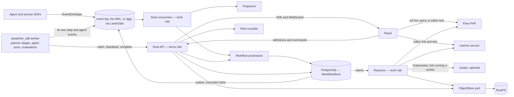
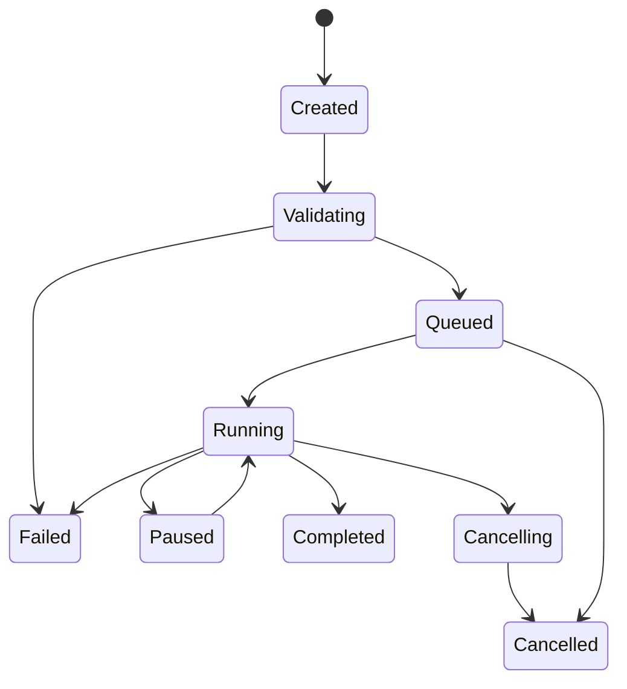

# Pipeline and Workflow Execution Architecture

- **Status:** implementation plan — revision 4. Phases 0–7 and 10–13 are
  delivered, as is Phase 14's authored gate. **Section 28 is the entry point**
  and owns the delivery order and the acceptance gates; its *What is left* is
  the current list. Section 43 records implementation history, qualified by
  43.35. Revision 2's cross-repository review remains in section 33.
- **Audience:** maintainers of the Rust API, event pipeline, curation services,
  panel, the Python SDK, and the planner and `ai_spirit_agent` integrations
- **Last updated:** 2026-09-08
- **Related decisions:** ADR 0002, 0004, 0008, 0011, 0012, 0014, 0016, 0018,
  0021, 0022, 0023, 0024, and — written from this plan — 0025 and 0026

## 1. Executive summary

aiwatcher should own durable pipeline execution in Rust. The panel authors
definitions, edits code and configuration, sends commands, follows links, and
renders state; it does not compile, sequence, retry, resume, or publish a
pipeline.

Execution engines remain separate:

- Flow PHP executes its query DSL and remains directly useful in Observability;
- the marimo service edits, previews, and executes notebook code outside the API
  process;
- a **worker** — `aiwatcher_sdk.worker`, a Python process holding a worker
  token — pulls step attempts and runs a registered function, a container's
  entry point, an agent turn or an evaluation suite (sections 36–37). This is
  how planner's stages and an `ai_spirit_agent` graph run without an HTTP
  service in front of them;
- an external orchestrator is no longer one of them: the Flyte engine and its
  port were removed by AW-4 (2026-09-11), and a step that needs a pod of its
  own is to get one from this engine (section 37);
- the Rust API coordinates aiwatcher-managed executions and preserves their
  history and context.

The storage split is intentional:

- the **event log** — the built-in write-ahead log by default, Apache Iggy
  through the LaserData SDK when `AIWATCHER_BUS=laser` — is the durable source
  and replay backbone for agent, observability **and execution** facts. The
  engine publishes its own facts onto it, as a producer like any other
  (section 34);
- PostgreSQL, behind a `WorkflowStore` port with in-memory and single-file
  adapters beside it, is the transactional source of truth for workflow
  instance streams, execution state, inbox/outbox, worker claims, processor
  checkpoints, artifact metadata and cache indexes. It is introduced for
  **execution only**; moving the observability read models into it is a
  separate decision with its own gate (Phase 8);
- RustFS, behind the existing `ObjectStore` port, stores immutable large
  artifacts such as row sets, code snapshots, previews, and logs; the ones
  that are somebody's words stay in the worker's own store by default, and the
  conversation archive's crypt seals them when a definition asks for that
  (section 40.4);
- process memory is an optimisation only. No correctness decision may depend on
  a warm cache or an open browser tab.

The design borrows four compatible ideas:

1. **Emmett:** commands express intent, events express facts; a workflow is
   `decide + evolve + initial_state`; each workflow instance has a durable inbox
   and outbox; consumers deliver and processors own useful work and checkpoints.
2. **Temporal:** workflow definitions are separate from executions; external
   effects are idempotent activities; history, rather than process memory,
   enables recovery.
3. **Prefect:** only runs have states; steps have independent attempts, retries,
   and persisted results; a cache hit is an explicit execution state.
4. **Flyte 2:** runtime environments belong to tasks, and tasks exchange typed
   references to artifacts. Flyte itself left aiwatcher with AW-4; the ideas
   stay.

Revision 2 adds what checking the plan against three codebases showed
(section 33). The durable-job rules already exist in `aiwatcher-jobs` and are
called, not copied. The engine port and its Flyte adapter already existed and
were kept — until AW-4 removed both; the `ExecutionBackend` trait of revision 1 is
dropped for an `ExecutionOwner` on the run (section 24). The object store
cannot serve as the workflow stream, which is what settles PostgreSQL
(section 7.1). And two of the three things this engine is for — planner's
house import and `ai_spirit_agent`'s graphs — need a Python worker rather than
another HTTP runtime. Two execution modes follow: a **compiled plan** whose
decider is Rust, and a **hosted decider** whose decisions are made by a worker
and whose history is kept here (section 40.3). `ai_spirit_agent`'s
`agentic.workflow` is already an Emmett-shaped engine on SQLite; the hosted
mode gives it a shared store and changes nothing in its decider.

This plan supersedes the execution part of ADR 0024 and, for managed runs,
ADR 0014's browser-mediated persistence. Their block vocabulary, server-side
validation and content-addressed versions remain; the browser must no longer
drive the chain. It narrows ADR 0008's "the binary does not know the optional
services exist" to the *API role*: the work role reaches them, from
configuration (section 27). It decides the question ADR 0016 deferred —
whether aiwatcher may be a producer on its own log — in favour (section 34).
Section 33.5 lists every decision it touches.

## 2. Goals

### 2.1 Product goals

- Build a dataset using only Flow PHP.
- Build a dataset using Flow PHP followed by one or more marimo steps.
- Preserve Flow PHP as the Observability query surface.
- Open a Flow or marimo editor with the exact historical source context for a
  saved pipeline revision or execution.
- Run, retry, resume, cancel, and inspect a pipeline after the originating panel
  tab has closed.
- Reuse the execution model for agent, search, and ML workflows.
- ~~Connect Planner and an external engine later without changing the panel
  contract.~~ Withdrawn: planner removed Flyte, and AW-4 removed the engine.
- Link every execution and step attempt to aiwatcher observability.
- Keep large data outside the event log and PostgreSQL rows.
- Run planner's four-stage house import unattended, one pod per stage, with no
  Flyte in the cluster — proven byte-identical to the in-process path first
  (section 39.4).
- Give an `ai_spirit_agent` graph a durable join, a resumable turn and a human
  step, without moving an LLM call into Rust (section 40).
- Let a person approve a step — a promotion, a tool call — from the panel, and
  let the execution wait for it across a restart (section 41).

### 2.2 Engineering goals

- At-least-once delivery without duplicated side effects.
- Optimistic concurrency per workflow instance.
- Atomic recording of workflow input, decisions, state projection, and outbox.
- Independent processor checkpoints and failure policies.
- Deterministic, testable workflow decisions.
- Content-addressed artifacts and cache keys.
- Rebuildable asynchronous projections.
- A local development path that does not require RustFS or PostgreSQL.
- One lease, one retry rule and one content address, shared with
  `aiwatcher-jobs` rather than re-derived.
- A worker that needs no inbound address, no bucket credential and no role
  wider than "run what was scheduled for me".

## 3. Non-goals

- Reimplement Temporal, Prefect, or Flyte inside aiwatcher.
- Reimplement Flyte's typed literal system, map tasks, dynamic sub-workflows
  or its console. What planner used of Flyte was smaller than that (section
  39.1). The `Engine` owner kept for the rest went with AW-4 (section 39.5).
- Execute arbitrary PHP or Python code inside the Rust API process — nor an
  LLM call, an agent turn or a notebook.
- Turn the panel into a workflow worker.
- Put dataset rows, notebook source, or large logs directly in log messages.
- Put conversation content — an agent's inter-node text, a prompt, a
  completion — in a workflow message, a PostgreSQL row or a plain artifact.
  Section 40.4 is the rule.
- Replace RQ, Redis Streams or SQLite *inside* a producer's own process. The
  worker protocol is what those talk to, not what replaces them.
- Make every Observability query a durable workflow execution.
- Mirror every internal Flyte task as an aiwatcher-owned retry state machine.
- Promise exactly-once network calls. The system provides at-least-once
  delivery plus idempotent effects and deduplicated state transitions.

## 4. Terminology

The repository currently uses "workflow" for several related but different
things. The implementation should use these names consistently:

| Term | Meaning |
|---|---|
| `CurationPipelineDefinition` | Authored source/transform/notebook/approval/view blocks |
| `WorkflowDefinition` | An authored or registered agent/search/ML workflow |
| `DefinitionRevision` | Immutable content-addressed version of either definition |
| `ExecutionPlan` | Server-compiled, immutable runtime-neutral graph |
| `ExecutionRun` | One attempt to execute a pinned plan revision |
| `StepRun` | Logical state of one plan step in an execution |
| `StepAttempt` | One physical attempt to perform a step |
| `WorkflowStream` | Ordered inbox and outbox messages for one execution |
| `ArtifactRef` | Immutable reference to data or code stored outside the message |
| `ContextSnapshot` | Exact code, source, parameters, and upstream artifacts seen by a step |
| `RuntimeBinding` | Adapter and execution configuration for one step: Flow, marimo, a worker task, a container job, an agent turn, a human input — section 35 |
| `ObservedWorkflow` | Graph reconstructed from external telemetry, not necessarily launchable |
| `ExecutionOwner` | Who decides for an execution: `local` (the Rust decider) or `worker` (a hosted decider — section 40.3). Any other owner read back is kept as written — shown, never scheduled or decided (section 24) |
| `ExecutionMode` | `compiled` — a static plan the Rust decider schedules; `hosted` — a worker runs `decide` and this system keeps the history |
| `Worker` | A process holding a worker token that claims step attempts by pulling, runs one task or agent turn per attempt, and reports facts — `aiwatcher_sdk.worker` (section 36) |
| `TaskRef` | `name@version`: the registered name and pinned code version a worker must match to claim a `PythonTask` attempt |
| `PodTemplate` | A named, operator-written pod shape a `ContainerJob` step refers to and never carries (section 37) |

A curation pipeline, a planner workflow and an agent graph may all compile to
an `ExecutionPlan`, but they remain distinct authoring experiences — and an
agent graph compiles only to its *shape*; its decisions stay in the worker.

## 5. Architectural principles

### 5.1 Commands are intentions; events are facts

Commands use imperative names:

- `StartExecution`
- `ExecuteFlowStep`
- `ExecuteNotebookStep`
- `RetryStep`
- `CancelExecution`
- `PublishDataset`

Events use past-tense facts:

- `ExecutionRequested`
- `ExecutionStarted`
- `FlowStepCompleted`
- `StepRetryScheduled`
- `DatasetPublished`
- `ExecutionFailed`
- `ExecutionCancelled`

An HTTP request is translated to a command. A successful command decision
appends facts and possibly further commands. An API must never write a
`Completed` event merely because it intends to start work.

### 5.2 Decisions are pure; effects are reactors

The core workflow shape follows Emmett's Decider pattern:

```rust
pub trait Workflow {
    type State;
    type Input;
    type Output;

    fn initial_state() -> Self::State;

    fn decide(
        state: &Self::State,
        input: &Self::Input,
    ) -> Result<Vec<Self::Output>, DecisionError>;

    fn evolve(state: Self::State, event: &WorkflowEvent) -> Self::State;
}
```

`decide` performs no I/O, reads no wall clock, and generates no random values.
Time, ids, resolved revisions, and policies needed by a decision arrive in the
input. This makes replay and scenario testing straightforward.

Flow calls, marimo calls, RustFS writes, and dataset publication
are effects. Dedicated reactors execute them and report facts back to the
workflow.

### 5.3 Definitions, plans, and runs are different records

A definition is editable. A revision is immutable. A compiled plan pins exactly
one revision. A run pins exactly one plan.

Editing a pipeline while an older run is active creates a new revision; it does
not mutate or reinterpret the active run.

### 5.4 Data moves by reference

Step commands and events carry `ArtifactRef`, not a list of rows. This keeps
log messages, PostgreSQL transactions, SSE payloads, and workflow histories
bounded.

Small control values may stay inline. The default limits should be:

- command/event payload: 256 KiB maximum;
- inline result: 64 KiB maximum;
- anything larger: immutable artifact.

### 5.5 The owner of an execution owns its retries

- For a local aiwatcher execution, Rust owns step scheduling and retries.
- An execution delegated as a whole to an external engine, which that engine
  would have retried, is gone with the engine (AW-4, 2026-09-11).
- For a hosted decider (section 40.3), the worker owns its decisions and this
  system owns the lease, the redelivery and the retry of the *attempt*. One
  attempt is retried by the store, never by the worker's own loop as well.
- A `ContainerJob` sets `backoffLimit: 0` for the same reason: the store counts
  attempts, and a Job that retried on its own would be a second orchestrator.

This prevents two nested orchestrators from independently retrying the same
work.

## 6. System topology



The direct panel-to-Flow and panel-to-marimo arrows are limited to ad-hoc
queries, editing, validation, and explicit developer tests. Durable `run`,
`retry`, `resume`, `cancel`, and `publish` commands always go through Rust.

Two process roles share one binary (section 27): **serve** holds the API, the
store and the object store, and opens no socket to Flow, marimo or the
cluster; **work** holds the consumers, the workflow processor and the
reactors, and is the only role that reaches those. A worker pod holds neither
the store nor a bucket credential — it reads and writes artifacts through
URLs its claim carried. The projectors still read the log directly, as today:
the in-memory read model, the span assembler and the live hub are unchanged
by this plan (section 33.2).

## 7. Sources of truth

| Information | Source of truth | Rebuildable copy |
|---|---|---|
| Agent/LLM/tool telemetry | the event log (`AIWATCHER_BUS`: WAL, or Iggy) | the in-memory read model, Victoria backends |
| Execution facts — `execution.*`, and `step.*` / `artifact.produced` for engine-run steps | PostgreSQL workflow stream, published to the log through the outbox (section 34) | the workflow fold, the waterfall, VictoriaTraces |
| Pipeline/workflow definition and its revisions | the object store, as today (`pipelines/{id}/versions/{revision}.json`) | none needed; the head is derived |
| Compiled plan (`plan_id`) | PostgreSQL, keyed by definition revision | recompiled from the revision |
| Workflow instance history | PostgreSQL workflow stream | the facts on the log; never the decisions |
| Hosted-decider history (section 40.3) | PostgreSQL workflow stream, appended by the worker under expected version | the worker's local SQLite is a cache, never the truth |
| Current run/step state | PostgreSQL inline projection | rebuildable from workflow stream |
| Worker claim and lease | PostgreSQL `step_attempts` | none — a lost claim expires |
| External processor checkpoint | PostgreSQL per processor | Iggy consumer offset is transport state |
| Large step result | RustFS/ObjectStore | none unless explicitly replicated |
| A step payload that is somebody's words | the worker's own store under `payloads: external` (the default), or the archive's crypt under `sealed` (section 40.4) | references, digests and sizes in the stream; never the text |
| Artifact metadata and lineage | PostgreSQL | rebuildable partly from execution events |
| Step cache index | PostgreSQL | can be dropped and rebuilt lazily |
| Hot API cache | process memory | always disposable |

Definitions stay where ADR 0014 and ADR 0024 put them. Revision 1 moved them to
PostgreSQL; revision 2 does not, because the registry already versions a
pipeline by content, writes the version before the head, and answers 501 with
the variable when no store is configured — and a definition in PostgreSQL would
be readable exactly when a dataset version naming it is not. What PostgreSQL
gains is the *compiled* plan, which is derived.

### 7.1 Why workflow history is in PostgreSQL

The log remains the event backbone, but a workflow decision requires one atomic
operation:

1. deduplicate and record the input;
2. check the expected workflow stream version;
3. append all output facts and commands;
4. update the immediate run/step read model;
5. write outbox records;
6. advance the processor checkpoint.

PostgreSQL can perform those writes in one transaction. The current Laser/Iggy
adapter provides ordered offsets and at-least-once delivery, but it does not
provide a transaction spanning Iggy and the PostgreSQL state. Treating an Iggy
offset as an event-sourced aggregate version would leave a dual-write gap.

Two alternatives were checked before keeping this decision in revision 2.

**The object store cannot be the stream.** Compare-and-append over S3 needs a
conditional put (`If-None-Match: *`), and RustFS's handling of `If-None-Match`
and `If-Match` is an open issue on both the read and the write side
(rustfs/rustfs#791, #1458 — unquoted ETags are rejected outright). A CAS that
works on MinIO and not on the store this system ships is a CAS that works in
CI. `aiwatcher-jobs` gets away without one because its jobs have a single
writer under a lease and a cursor that only moves forward; a workflow stream
has a decider, a reactor and a worker racing to append.

**Iggy cannot be the stream either, yet.** It offers ordered offsets, consumer
groups and at-least-once delivery, no append-with-expected-version, no
cross-topic transaction, and runs as a single node with clustering planned.
If it later exposes a proven atomic per-stream append with expected revision
and an inbox/outbox boundary, this decision can be revisited behind the port.

PostgreSQL does all six steps in one transaction, and one already runs in the
`planner` namespace this system is installed into — `planner-postgres`, which
Flyte's `flyte-binary` also used until planner removed it. ADR 0009's
`install | external | none` applies to it as to every other backend:
`detect-stack.py` reports one, and a second PostgreSQL beside an existing one
is the mistake that ADR exists to prevent.

Behind the port, three adapters, in the pattern `memory | wal | laser` and
`none | memory | file | s3` already set: `memory` for tests; `file` — a
single-process append log under `AIWATCHER_DATA_DIR`, locked the way the WAL
is, for `just dev` and `just pii-demo`; and `postgres`. The contract suite in
section 29.2 runs against all three. A managed run that needs more than one
process — a worker, a container job, a second API replica — refuses to start on
`file` and names `AIWATCHER_WORKFLOW_STORE`, so that a development store never
becomes a production one by omission.

## 8. Messages and metadata

The current `EventEnvelope` and `RecordedEvent` are good telemetry contracts.
Workflow control should reuse their metadata concepts without forcing runtime
commands into the telemetry event catalog.

```rust
pub struct MessageMetadata {
    pub schema_version: u16,
    pub message_id: MessageId,
    pub occurred_at: OffsetDateTime,
    pub recorded_at: OffsetDateTime,
    pub source: Source,
    pub tenant_id: Option<String>,

    pub correlation_id: CorrelationId,
    pub causation_id: CausationId,
    pub trace_id: Option<TraceId>,
    pub span_id: Option<SpanId>,

    pub workflow_id: Option<String>,
    pub workflow_run_id: Option<String>,
    pub step_id: Option<String>,
    pub attempt: Option<u32>,
}

pub enum WorkflowMessage {
    Command(WorkflowCommand),
    Event(WorkflowEvent),
}
```

Rules:

- `message_id` is globally unique and stable across redelivery.
- `correlation_id` is normally the execution id.
- `causation_id` is the input message that caused this output.
- a reactor completion event is caused by its execution command.
- schema versions are explicit; unknown future major versions are rejected or
  parked, never partially decoded.
- secrets, raw prompts, dataset rows, notebook source and an agent's
  inter-node text are forbidden in workflow messages — the last of these is
  conversation content, and section 40.4 says where it goes.
- the *facts* this engine publishes are catalog entries (section 34); the
  *commands* are not, and are never published to the log — they live in the
  store and are claimed from it (section 11.1).

`EventEnvelope.kind` already carries `MessageKind::Command`, documented as
"on the wire from day one so adding control commands later is not a breaking
change" and constructed nowhere in the workspace. This plan is its first user:
a command in the store is `kind: command`, the projector's fold ignores
commands as it ignores unknown types, and a command that ever does reach the
log is parked by the dead-letter sink rather than folded.

## 9. PostgreSQL model

The following schema is illustrative. Migrations should use the repository's
chosen SQL library and naming conventions.

### 9.1 Definitions and revisions

Revision 1 put `execution_definitions` and `execution_definition_revisions`
here. Revision 2 does not (section 7): a definition is an authored,
content-addressed object in the registry's object store, beside the recipes
and the dataset versions that name it — `pipelines/{id}/versions/{revision}.json`
under a head written after the version. A `WorkflowDefinition` of another kind
(a planner workflow, an agent graph) is stored the same way under its own
prefix, registered through the API or the SDK, idempotent by content as
`workflow()` already is on the log. PostgreSQL holds what is *derived* from a
revision — the compiled plan.

The revision is a SHA-256 digest of canonical authored fields. Presentation
coordinates may either be included in the authored revision or moved to a
separate mutable layout record.

Revision 2 keeps the definition table out of PostgreSQL (section 7) and keeps
ADR 0024's revision as it is: `save_pipeline` digests the whole request,
positions included, and a test asserts that moving a block is a new revision.
That is the *authored* revision, and it is what `produced_by` names. What
execution needs is a second digest, `plan_id = sha256(compiled plan)`, over the
executable fields only — steps, bindings, parameters, pinned code — which is
what the cache keys and what `workflow.declared` carries as its version
(section 34). Two pipelines that differ only in layout compile to one
`plan_id`, so a canvas tidy-up invalidates nothing; and the authored revision
still names the picture somebody saved, which is what provenance is for.

```sql
create table execution_plans (
    plan_id text primary key,
    definition_kind text not null,
    definition_name text not null,
    revision text not null,
    plan jsonb not null,
    compiled_at timestamptz not null,
    unique (definition_kind, definition_name, revision)
);
```

### 9.2 Workflow stream

```sql
create table workflow_messages (
    workflow_run_id uuid not null,
    stream_version bigint not null,
    message_id uuid not null,
    kind text not null check (kind in ('command', 'event')),
    direction text not null check (direction in ('input', 'output')),
    message_type text not null,
    data jsonb not null,
    metadata jsonb not null,
    occurred_at timestamptz not null,
    recorded_at timestamptz not null default now(),
    primary key (workflow_run_id, stream_version),
    unique (workflow_run_id, message_id)
);
```

The unique message constraint is the durable inbox. Recording input and output
in the same stream makes every decision explainable and replayable.

### 9.3 Run and step projections

```sql
create table execution_runs (
    execution_id uuid primary key,
    plan_id text not null references execution_plans,
    owner text not null,          -- local | worker; other text reads back as unknown
    mode text not null,           -- compiled | hosted
    state_type text not null,
    state_name text not null,
    requested_by text not null,
    input jsonb not null,
    external_execution_id text,
    owner_state jsonb,            -- the worker's own phase; shown beside, never merged
    lease_owner text,             -- hosted mode: the one decider at a time
    lease_expires_at timestamptz,
    run_id text,
    trace_id text,
    created_at timestamptz not null,
    started_at timestamptz,
    ended_at timestamptz,
    last_message_version bigint not null default 0
);

create table step_runs (
    execution_id uuid not null references execution_runs,
    step_id text not null,
    runtime text not null,
    state_type text not null,
    state_name text not null,
    current_attempt integer not null default 0,
    input_artifacts jsonb not null default '[]',
    output_artifacts jsonb not null default '[]',
    context_id uuid,
    started_at timestamptz,
    ended_at timestamptz,
    primary key (execution_id, step_id)
);

create table step_attempts (
    execution_id uuid not null,
    step_id text not null,
    attempt integer not null,
    command_id uuid not null unique,
    queue text,                   -- worker queue this attempt is claimable on; null for reactor-run steps
    task_ref text,                -- name@version a worker must match
    lease_owner text,
    lease_expires_at timestamptz,
    state text not null,          -- claimable | claimed | running | awaiting_input | completed | failed | crashed
    error jsonb,
    started_at timestamptz,
    ended_at timestamptz,
    primary key (execution_id, step_id, attempt),
    foreign key (execution_id, step_id)
      references step_runs (execution_id, step_id)
);

create table awaiting_inputs (
    execution_id uuid not null,
    step_id text not null,
    attempt integer not null,
    request jsonb not null,       -- what is being asked: kind, choices, the role that may answer, deadline
    requested_at timestamptz not null,
    deadline timestamptz,
    answered_by text,
    answered_at timestamptz,
    response jsonb,               -- a bare decision inline; a ref when the answer is content (section 41)
    primary key (execution_id, step_id, attempt)
);
```

`state_type` drives orchestration. `state_name` is a user-facing refinement,
following Prefect's distinction between a stable state type and descriptive
names such as `AwaitingRetry` or `Cached`.

A worker's claim is a row of `step_attempts` in state `claimable` on one of its
queues, taken with `SELECT … FOR UPDATE SKIP LOCKED` and given
`lease_expires_at = now() + LEASE_SECONDS` — the constant from
`aiwatcher-jobs`, and `lease_expired` is the function that reads it back.
This is the one place PostgreSQL is used as a queue, and it is bounded: one row
per claim, one heartbeat per half-lease (section 36).

### 9.4 Outbox, checkpoints, and processing inbox

```sql
create table outbox_messages (
    message_id uuid primary key,
    topic text not null,
    partition_key text not null,
    payload jsonb not null,
    available_at timestamptz not null default now(),
    attempts integer not null default 0,
    published_at timestamptz,
    last_error text
);

create table processor_checkpoints (
    processor_id text primary key,
    source text not null,
    checkpoint jsonb not null,
    updated_at timestamptz not null
);

create table processed_messages (
    processor_id text not null,
    message_id uuid not null,
    processed_at timestamptz not null,
    primary key (processor_id, message_id)
);
```

`processed_messages` may be retained for the replay horizon or compacted after
the source retention boundary. Workflow input deduplication remains permanent
inside `workflow_messages`.

### 9.5 Artifacts, lineage, and cache

```sql
create table artifacts (
    artifact_id uuid primary key,
    tenant_id text not null,
    kind text not null,
    uri text not null,
    digest text not null,
    size_bytes bigint not null,
    media_type text not null,
    schema_ref text,
    produced_by_execution uuid,
    produced_by_step text,
    created_at timestamptz not null,
    unique (tenant_id, digest, kind)
);

create table artifact_lineage (
    output_artifact_id uuid not null references artifacts,
    input_artifact_id uuid not null references artifacts,
    execution_id uuid not null references execution_runs,
    step_id text not null,
    primary key (output_artifact_id, input_artifact_id, step_id)
);

create table step_cache (
    tenant_id text not null,
    cache_key text not null,
    artifact_ids jsonb not null,
    policy jsonb not null,
    created_at timestamptz not null,
    expires_at timestamptz,
    invalidated_at timestamptz,
    primary key (tenant_id, cache_key)
);
```

## 10. Atomic command handling

One workflow input is handled as follows:

```text
BEGIN
  load stream at expected_version
  if message_id already exists: return previous result
  fold events with evolve
  run decide(state, input)
  append input message
  append every output event and command
  update execution_runs and step_runs inline
  insert output commands/events into outbox
  advance processor checkpoint when input came from the log
COMMIT
```

Concurrency is guarded by the primary key on stream version plus either:

- `SELECT ... FOR UPDATE` on the execution row; or
- compare-and-append with a unique `(workflow_run_id, stream_version)` insert.

Prefer compare-and-append with a bounded retry around the pure decision. Use a
PostgreSQL advisory lock only for coarse maintenance work such as a projection
rebuild, not as the normal correctness mechanism for every workflow command.

## 11. Log topology: Iggy and LaserData

This section applies when `AIWATCHER_BUS=laser`. The default WAL has one
stream and one position by construction, so every rule below holds there
trivially; the rules are written for the backend where they can be broken.

### 11.1 Topics

Keep the existing stream and event topic:

```text
stream: aiwatcher
  topic: events             agent, LLM, tool, runtime, workflow and execution facts
  dead letters              as today — the DeadLetterSink, not a topic
```

A `commands` topic is **deferred**. Revision 1 planned one; revision 2 found
that with the store transactional, a command is a row a reactor or a worker
claims — `SKIP LOCKED` for the reactors in the work role, a long-poll for a
worker (section 36) — and a second topic with its own consumer group and
checkpoint would carry what the store already holds, and would need an outbox
of its own to be published safely. Facts go to the log through the one outbox
so that the live SSE, the workflow fold, the waterfall and the traces see them
with no second path (section 34).

What would make the topic right: a reactor fleet large enough that claim
polling on PostgreSQL is the *measured* bottleneck, or a producer that wants to
consume commands without holding PostgreSQL credentials — section 40.6's
transport adapter is the candidate. The outbox exists by then, and adding a
topic to it is small.

An alternative `workflow-events` topic is justified only if workflow traffic
needs independent retention or access control. Start with one topic and use
message type subscriptions in processors.

Agent, service and worker SDK credentials publish to `events` only. A worker
publishes under the `run_id` its claim named and no other; the ingest layer
checks that against the token (section 36.2).

### 11.2 Partition keys

- telemetry: `run:<run_id>`;
- workflow control: `workflow:<workflow_run_id>`.

This preserves the ordering needed within one decision scope without requiring
global ordering.

### 11.3 Partitions and checkpoints

The current adapter deliberately uses one partition and a scalar checkpoint.
That is safe for the initial implementation. Before increasing the partition
count, replace scalar correctness checkpoints with a per-partition vector:

```json
{
  "stream": "aiwatcher",
  "topic": "events",
  "positions": { "0": 18291, "1": 17804 }
}
```

Iggy consumer group offsets are transport state. The PostgreSQL
`processor_checkpoints` record is the application-level proof that a processor's
durable output was committed.

Recommendation: run one Iggy consumer group per independently failing
processor. A shared consumer may fan out only to processors with the same
durability and backpressure policy; it must resume from the earliest processor
checkpoint.

### 11.4 Consumer and processor boundary

Following Emmett, a consumer only:

1. connects to a message source;
2. fetches or subscribes in source-appropriate batches;
3. forwards messages to processors;
4. applies backpressure;
5. reports `CaughtUp` when replay reaches the live tail.

Projectors, reactors, and workflows independently own:

- supported message types;
- checkpoint persistence;
- idempotency;
- retry/skip/stop policy;
- dead-letter policy;
- target-specific batching.

## 12. Runtime-neutral execution plan

The panel sends authored configuration. Rust validates and compiles it to a
runtime-neutral plan:

```rust
pub struct ExecutionPlan {
    pub plan_id: String,
    pub definition_id: String,
    pub revision: String,
    pub steps: Vec<PlanStep>,
    pub edges: Vec<PlanEdge>,
}

pub struct PlanStep {
    pub id: String,
    pub runtime: RuntimeBinding,
    pub inputs: Vec<InputBinding>,
    pub outputs: Vec<OutputDeclaration>,
    pub retry: RetryPolicy,
    pub timeout: Duration,
    pub cache: CachePolicy,
}

pub enum RuntimeBinding {
    FlowPhp(FlowStepSpec),
    Marimo(MarimoStepSpec),
    PublishDataset(PublishDatasetSpec),
    PythonTask(PythonTaskSpec),             // a worker runs a registered function — section 36
    ContainerJob(ContainerJobSpec),         // a PythonTask in a Kubernetes Job — section 37
    AgentTurn(AgentTurnSpec),               // a worker runs one agent turn — section 40
    HumanInput(HumanInputSpec),             // waits for a command — section 41
}
```

A variant that launched a workflow whole on an external engine was declared,
never produced, and removed with the engine by AW-4 (2026-09-11).

Section 35 is the table: where each executes, who owns its retries, what it
may carry. Each `*Spec` names a binding and its parameters and never a host;
every executor's address is configuration.

The first curation authoring model may remain a chain. The compiled plan should
already use nodes and edges so agent/search/ML workflows can use a DAG without
changing execution records. A compiler rejects unsupported joins or fan-out for
a runtime rather than asking the panel to guess semantics.

The compiler folds a source and its transforms into **one** `FlowPhp` step
whose `blocks` lists the authored block ids, because Flow executes one
pipeline. The panel lights three boxes from one `step.started` — the fact the
browser used to synthesise with its `'run as one Flow query'` note — and the
one-step-per-query rule is what makes "no transform after a notebook" a
compiler refusal rather than a runtime surprise.

## 13. Execution state model

### 13.1 Run states



Stable state types:

- `scheduled`
- `pending`
- `running`
- `awaiting_input`
- `completed`
- `failed`
- `crashed`
- `cancelled`
- `paused`

User-facing names may include `Validating`, `Queued`, `AwaitingRetry`, `Cached`,
`Cancelling`, and `TimedOut`.

`awaiting_input` is a stable type of its own rather than a name for `paused`,
because the two resume differently. A paused run resumes on `resume`, from
whoever may pause. A waiting step resumes on the *input it asked for*, from the
role the step declared, and its lease is released while it waits — a worker
that parked an attempt to ask a question does not hold a pod for the answer
(section 41).

### 13.2 Step attempt rules

- A `StepRun` represents the logical step across attempts.
- A `StepAttempt` is immutable after reaching a terminal state.
- Retry increments `attempt`; it never rewrites the failed attempt.
- `retry step` reuses pinned inputs and code from its `ContextSnapshot`.
- `rerun from step` creates a new execution unless explicitly documented as a
  repair of the same execution.
- A cache hit creates a completed step run named `Cached` and records the cache
  key and reused artifact ids.
- Infrastructure loss is `Crashed`; deterministic user-code failure is
  `Failed`; exceeding a deadline is a failed state named `TimedOut`.

## 14. Reactor contract

A reactor handles one effect command:

```rust
#[async_trait]
pub trait ActivityExecutor: Send + Sync {
    fn runtime(&self) -> RuntimeKind;

    async fn execute(
        &self,
        command: ActivityCommand,
        context: ActivityContext,
    ) -> Result<ActivityResult, ActivityError>;
}
```

Execution procedure:

1. deduplicate by `command_id`;
2. claim or renew the step-attempt lease;
3. load and verify input artifact digests;
4. call the runtime with the stable idempotency key
   `<execution>/<step>/<attempt>`;
5. stream or upload output to the ObjectStore;
6. verify digest and size;
7. append `StepCompleted` or `StepFailed` to the workflow input;
8. acknowledge/advance its processor checkpoint only after the completion fact
   is durable.

A timeout does not prove that a remote service did not finish. Before retrying,
the reactor queries the runtime by idempotency key when the runtime supports it.
Flow and marimo endpoints should be extended to support this lookup for managed
executions — sections 15.4 and 16.4 say exactly how much.

The lease is `aiwatcher_jobs::LEASE_SECONDS` and `lease_expired`, the attempt
rule is `after_failure` with `MAX_ATTEMPTS`, and step 8's ordering is
`aiwatcher_jobs::ORDERING`. The execution crate holds no second copy of any of
them; ADR 0022 says why a copy is worse than a call.

A worker is a reactor that runs outside the process (section 36): the same
eight steps, with the claim replacing the consumer and the completion call
replacing the append.

## 15. Flow PHP

Flow PHP remains a reusable query runtime, not a curation-only implementation.

### 15.1 Ad-hoc mode

Used by:

- Observability Query;
- Flow code validation;
- an explicit developer preview/test.

The panel may call Flow directly in this mode. The operation is not durable and
must be labelled as such. The panel still obtains the source context and
generated full script from Rust; it does not infer upstream blocks itself.

### 15.2 Managed mode

Used by:

- Flow-only dataset builds;
- Flow steps in a larger curation;
- scheduled or unattended work;
- runs that need retry, artifacts, or provenance.

Rust compiles the complete Flow script:

```text
source block + source arguments + transform tail + bounded output
```

The reactor sends that script and a stable execution id to Flow. Flow returns a
bounded inline preview or writes/streams a full result that becomes an artifact.

### 15.3 Source context

`FlowStepSpec` must retain a structured source in addition to the generated DSL:

```rust
pub struct FlowSourceRef {
    pub dataset: String,
    pub arguments: BTreeMap<String, String>,
    pub resolved_revision: Option<String>,
    pub window: Option<ResolvedWindow>,
    pub cursor: Option<String>,
}
```

A historical editor context regenerates the script from this pinned structure,
not from the current pipeline head.

### 15.4 What the query service needs

Today `POST /flow/query` is request/response with no key: nothing is keyed,
resumed or deduplicated, and the service is deliberately stateless (ADR 0008,
ADR 0014). Managed mode adds one field and one route:

```text
POST /flow/query          {pipeline, window_seconds, execution_id?}
GET  /flow/executions/{execution_id}      → running | done {digest, rows} | absent
```

`execution_id` is `<execution>/<step>/<attempt>`. The service keeps the answer
for the reactor's lookup window only — minutes, in memory — and what it
remembers is that it ran and what the result hashed to, never the rows: those
go to the artifact the reactor uploads. ADR 0014 refused to give the PHP
service an S3 client, and this keeps that refusal. A second replica behind a
load balancer answers `absent` for the other replica's execution, which the
reactor treats as "retry", and a retry of a deterministic query over the same
window writes the same digest.

**As built.** "In memory" is a note in the system temp directory, because a PHP
process has no memory between requests and `php -S` and PHP-FPM both fork: a
static array would answer `absent` to whichever worker took the lookup, which
is the bug this route removes arriving from another direction. The note is
scoped to one host and expires with the lookup window, which is the property
the paragraph above asks for. `POST /flow/query` also gained `digest` on its
answer — the service's own fingerprint of its own encoding, never compared
against the reactor's digest of the bytes it stored (section 43.14). And the
reactor's `done` answer is two reads rather than one: this route says whether
the query is still executing, and the object store's receipt says what the
finished attempt produced.

## 16. marimo

The notebook service remains outside the Rust process because it executes
arbitrary Python code.

### 16.1 Code revision

**Target behaviour; not yet complete.** The current implementation pins a
digest and refuses drift against the runtime's current file. It does not keep
the historical source needed to run after that file changes. Work 5 in section
28 closes that gap.

On save, the completed path must:

1. the notebook service validates the source as a marimo app;
2. Rust stores a content-addressed source snapshot through `ObjectStore`;
3. the artifact catalog records the code artifact and digest;
4. the pipeline revision pins that digest.

The working notebook file is an editable materialisation. The immutable code
artifact is the execution source of truth.

### 16.2 Data context

Staging must be keyed by context, never only by notebook name:

```text
<execution_id>/<step_id>/<attempt>/input
<execution_id>/<step_id>/<attempt>/params
<execution_id>/<step_id>/<attempt>/output
```

Opening a notebook from an old run resolves that run's upstream artifact and
parameters. Editing the same notebook from two pipelines therefore cannot
silently replace the data shown by the other pipeline.

### 16.3 Editor sessions

**Planned in work 5; context staging already exists.** Rust issues a short-lived
`EditorSession` containing:

- context id;
- notebook code revision;
- input artifact reference;
- parameters;
- runtime URL or route;
- permissions and expiry;
- a signed token or server-side opaque session id.

The marimo service materialises this context for its live app. An editor test is
allowed to use unsaved code but must be marked `ad_hoc`; a managed run always
pins code first.

### 16.4 What the notebook runtime needs

`POST /ml-pipeline/run` gains `context_id`, and staging moves from
`.data/blocks/{notebook}/` to `.data/contexts/{context_id}/` — the change
ADR 0024 already named as the one its staging would need. The live app for a
block reads the context the block's last run staged, so two pipelines editing
one notebook stop overwriting each other's rows, and an old execution's editor
shows that execution's input. The service's own docstring still holds: it
runs notebook code with no sandbox, binds to localhost and has no
authentication of its own. Phase 4's editor session is what changes that, and
until then a `Marimo` step is a development-profile binding: the compiler
refuses it in a plan whose store is `postgres` unless
`AIWATCHER_ML_PIPELINE_TRUSTED=true` says an operator has put something in
front of it.

## 17. Artifacts and RustFS

### 17.1 Artifact contract

```rust
pub struct ArtifactRef {
    pub artifact_id: String,
    pub kind: ArtifactKind,
    pub uri: String,
    pub digest: String,
    pub size_bytes: u64,
    pub media_type: String,
    pub schema_ref: Option<String>,
}
```

Recommended object layout:

```text
artifacts/<tenant>/<kind>/<sha256-prefix>/<sha256>/data
artifacts/<tenant>/<kind>/<sha256-prefix>/<sha256>/manifest.json
```

Keys are immutable. A human name such as `training/pii-clean` is a PostgreSQL
alias or dataset version pointing at an artifact digest, never the object key's
identity.

`ArtifactRef` exists once already: `aiwatcher_training::package::ArtifactRef`,
with `name`, `uri`, `digest`, `size_bytes`, `content_type` and a **required**
digest (ADR 0023). It moves to `aiwatcher-core` with its field names unchanged
and `kind` and `schema_ref` added. The workflow fold's own artifact record —
the one `artifact.produced` feeds — gains a `digest` it reads when present and
never requires, because a producer pointing at somebody else's bytes may not
know it; an engine-published `artifact.produced` always carries one.

A `file://` on a shared volume is a pointer nothing outside the cluster can
verify. It is accepted as a `uri` and is never the *only* one: a step that
hands on a path also reports the object-store copy's digest, or reports no
artifact (section 37).

### 17.2 Availability modes

- production managed executions: durable ObjectStore required;
- development: filesystem ObjectStore adapter is acceptable;
- unit tests: in-memory ObjectStore adapter;
- ad-hoc preview: a bounded inline result is acceptable and may optionally be
  promoted to an artifact.

If no durable ObjectStore is configured, the API must refuse an unattended run
that requires resumable intermediate data instead of pretending it is durable.

## 18. Cache

The cache key is content-derived:

```text
sha256(
  runtime kind
  + runtime implementation version
  + resolved code digest
  + ordered input artifact digests
  + canonical parameters
  + relevant environment fingerprint
  + output schema version
)
```

Rules:

- cache is opt-in per step or runtime policy;
- all inputs must be immutable and digest-addressed;
- moving a canvas block does not change the key;
- a moving time window is not cacheable until resolved to exact bounds/cursor;
- agent/LLM steps are not cacheable by default;
- notebook steps require a pinned source digest;
- Flow steps require a pinned source revision or resolved dataset artifact;
- a cache hit is recorded in workflow history and lineage;
- deleting the cache index never loses an authoritative result;
- cache invalidation marks entries invalid; it does not mutate old executions.

Do not add Redis initially. PostgreSQL stores the cache index, RustFS stores
cached bytes, and process memory may cache hot metadata by revision.

## 19. Editor context API

The panel must not reconstruct upstream context. It asks Rust:

```http
GET /api/v1/executions/{execution_id}/steps/{step_id}/context
GET /api/v1/curation-pipelines/{name}/revisions/{revision}/blocks/{block_id}/context
```

Representative response:

```json
{
  "context_id": "...",
  "runtime": "flow_php",
  "definition_revision": "sha256:...",
  "code_revision": "sha256:...",
  "source": {
    "kind": "dataset",
    "name": "hub_rows",
    "arguments": { "dataset": "...", "split": "train" }
  },
  "input_artifacts": [],
  "parameters": {},
  "resolved_script": "data_frame()...",
  "actions": {
    "validate": { "method": "POST", "href": "..." },
    "test": { "method": "POST", "href": "..." },
    "open_editor": { "method": "GET", "href": "..." }
  }
}
```

The API returns allowed actions because state and permission determine which
commands are valid. The panel renders them; it does not duplicate the state
machine.

## 20. Product API

Current curation and managed execution routes:

```text
POST /api/v1/curation-pipelines
GET  /api/v1/curation-pipelines
GET  /api/v1/curation-pipelines/{name}/revisions/{revision}/blocks/{block_id}/context
GET  /api/v1/curation-pipelines/{name}/schedule
PUT  /api/v1/curation-pipelines/{name}/schedule
DELETE /api/v1/curation-pipelines/{name}/schedule

POST /api/v1/executions
GET  /api/v1/executions/{execution_id}

POST /api/v1/executions/{execution_id}/commands/cancel
POST /api/v1/executions/{execution_id}/commands/pause
POST /api/v1/executions/{execution_id}/commands/resume
POST /api/v1/executions/{execution_id}/steps/{step_id}/commands/retry
POST /api/v1/executions/{execution_id}/steps/{step_id}/input

GET  /api/v1/executions/{execution_id}/steps/{step_id}/context
```

`POST /api/v1/editor-sessions` remains planned in work 5.

The execution list is served by the existing workflow fold, not by a second
`GET /executions` projection. The generated OpenAPI contract describes current
routes; the worker/engine resources below remain future scope.

A live stream of one execution is **not** in that list, and 43.21 says why: it
was written before ADR_0026, which put a managed run's facts on the log under
the execution's own id. `/api/v1/workflow-executions/{id}/stream` already
follows one.

Planned resources for the worker and hosted decider:

```text
POST /api/v1/definitions                         register a WorkflowDefinition (editor); idempotent by content
GET  /api/v1/definitions?kind=…                  curation_pipeline | workflow | agent_graph, each row naming its kind

POST /api/v1/executions/{execution_id}/stream    hosted decider: append at expected version (worker)
GET  /api/v1/executions/{execution_id}/stream    page the stream (viewer); payloads as refs, never inline

POST /api/v1/worker/claims                       section 36.1 (worker)
POST /api/v1/worker/attempts/{ref}/heartbeat
POST /api/v1/worker/attempts/{ref}/complete
POST /api/v1/worker/attempts/{ref}/fail
POST /api/v1/worker/attempts/{ref}/await
```

The engine routes ADR 0016 added — a catalogue of what an external engine could
start, and its launches — were removed by AW-4 (2026-09-11), and Phase 9's
alias with them. `/definitions` is what this system could start, and there is
no second list beside it.

Start request for the current compiled curation path:

```json
{
  "target": {
    "kind": "curation_pipeline",
    "name": "curation/pii-detection",
    "revision": "sha256:..."
  },
  "parameters": {}
}
```

Whole-execution `mode: "preview"` is outside the current delivery scope.
`mode`, `backend` and `publish` are not accepted fields on this request.
The compiled plan determines publication; bounded step previews and explicit
ad-hoc editor tests remain available. Revisit simulation only for a named use
case that needs to run without publishing (section 28, work 5).

The response is `202 Accepted` once the command and workflow input are durable.
It identifies the accepted execution. Reading the run and applying its commands
returns `RunView`, containing `execution` and the server-derived `allowed`
actions. The change from the earlier bare `RunProjection` is recorded on the
`RunView` schema itself, so it reaches the contract and every generated client
(work 4).

The target command contract is a stable `Idempotency-Key`: a retried intention
must not create additional work. Do not infer that every current mutation
satisfies it. In particular, the schedule's `run_now` currently derives its ID
from a wall-clock second; work 3 must make a retry across seconds return the
original result and cover partial success of start plus schedule persistence.

## 21. Panel boundary

The panel may:

- edit blocks, edges, scripts, notebook code, and parameters;
- send authored definitions to Rust;
- ask Rust to validate or compile;
- perform explicitly labelled ad-hoc Flow/marimo tests;
- submit run/cancel/retry/resume/publish commands;
- render run, step, attempt, artifact, and event state;
- follow runtime/editor links supplied by Rust;
- subscribe to SSE/WebSocket updates.

The panel must not:

- compute executable ordering;
- compile source and transform blocks into the authoritative Flow script;
- fetch current notebook revisions to pin them;
- pass rows from Flow to marimo;
- decide retry eligibility or delay;
- publish a managed run's dataset itself;
- infer source context from the currently visible draft;
- assume a runtime URL or deployment topology;
- decide who owns a run.

A useful mechanical acceptance check is that the pipeline route no longer
imports or calls browser-side `orderOf`, `compileFlow`, `runQuery`,
`runNotebook`, or `publishDataset` for managed execution.

## 22. Observability linkage

Every managed execution has:

- `workflow_id`: stable definition identity;
- `workflow_run_id`: aiwatcher execution identity;
- `run_id`: one runtime/process execution; several run ids may belong to one
  workflow run;
- `step_id` and `attempt`;
- `trace_id` and span context where applicable.

The initiating HTTP command seeds correlation. Every output event inherits that
correlation and names the input message as causation.

Reactor calls create spans around the external operation. Workflow lifecycle
events remain control-plane events and must not be mistaken for LLM/tool spans.
Agent events produced inside a workflow carry both `run_id` and
`workflow_run_id`, preserving the existing ability to assemble one workflow
execution across multiple runtime processes.

The PostgreSQL execution view links to the log-backed event stream and to
Victoria traces; it does not copy prompt or completion content into telemetry.

Section 34 is the other half of this: the engine *is* a producer, and the
workflow fold, the waterfall and the live channel draw a managed execution
from the same events they draw everything else from.

## 23. Projections and rebuilding

Use two projection modes:

1. **Inline projection** for the small current state required to accept the next
   workflow command: `execution_runs`, `step_runs`, and current artifact links.
   It is updated atomically with workflow messages.
2. **Asynchronous projection** for lists, analytics, metrics, search, and
   external integrations. It consumes the log and owns an independent checkpoint.

For an asynchronous read-model migration:

1. deploy a versioned projection table or schema;
2. acquire a rebuild lease/advisory lock;
3. replay from the beginning into the new version;
4. continue until its checkpoint reaches the chosen log head;
5. validate counts, invariants, and lag;
6. atomically switch the query alias/view;
7. retain the old projection for rollback;
8. remove it after the rollback window.

Do not truncate the serving projection while rebuilding it in production.

## 24. Planner and Flyte 2

**Superseded in part by AW-4 (2026-09-11).** Flyte left aiwatcher, and the
`Engine` owner with it; the owner itself stands. The first paragraph below is
kept as the history of why there is an owner at all.

Revision 1 introduced an `ExecutionBackend` trait here, with a local and a
Flyte implementation. Revision 2 drops it. Checking the code found
`core::engine::WorkflowEngine` already doing the external half — catalog,
interface, version-pinned launch, execution polling — with a Flyte 2 gateway
adapter in `aiwatcher-pipeline` that also implements `WorkflowRunner`, a
loopback stand-in admin for its tests, and a guardrail that its phase is never
merged into a status folded from the log. A second trait covering the same
calls would be the second rule set this repository refuses everywhere else.

So an execution has an **owner**, and the owner decides which code path runs:

```rust
pub enum ExecutionOwner {
    Local,               // the Rust decider schedules; reactors and workers execute the steps
    Worker,              // a hosted decider — the worker decides, this system keeps the history
    Unknown(String),     // an owner this build does not know, kept as written
}
```

- A `Local` execution has steps, attempts, leases and a cache here, and its
  steps are any binding in section 35.
- A `Worker` execution has one lease — the decider's — and a stream the
  worker appends to under expected version; section 40.3.
- An `Unknown` owner is text this build does not recognise, kept exactly as it
  was written. It is listed and shown, and nothing claims, schedules or decides
  for it. An `engine:<name>` owner from before AW-4 would read back this way,
  though nothing ever wrote one.

Cancel goes to the owner: the store for `Local`, the worker's lease and a
`CancelRequested` in the stream for `Worker`.

What planner ran, the four levels at which it could integrate, and the path by
which a `Local` execution took Flyte's place in its cluster are sections 38 and
39. planner removed Flyte on 2026-09-09 and runs its four stages through the
worker boundary. What it gave up — a pod per stage — comes back through
`ContainerJob` (section 37, Phase 12, reopened by AW-4), not through an engine.

## 25. Security and tenancy

- Definitions and artifacts are tenant-scoped in PostgreSQL and ObjectStore
  keys.
- Agent SDK credentials may publish events but not workflow commands.
- Only Editor or higher may save code or definitions.
- Only authorised roles may run, cancel, retry, or publish.
- Runtime endpoints are internal; editor links are short-lived and scoped.
- Flow dataset/source names are validated against the server-side catalog.
- Notebook code never runs in the API process.
- Secrets are referenced by name and injected by the runtime; they are never
  stored in definitions, messages, editor contexts, or artifacts.
- Artifact reads verify digest and enforce the same tenant/role gate as their
  metadata.
- Outbound source fetching retains the existing bounded downloader and SSRF
  protections.

## 26. Failure, retry, and cancellation policy

Classify failures before deciding to retry:

| Class | Examples | Default |
|---|---|---|
| validation | invalid graph, unknown source, bad parameters | fail without retry |
| user code | Flow parse error, notebook assertion | fail without automatic retry |
| transient runtime | connection reset, 503, worker unavailable | exponential retry with jitter |
| timeout/unknown | caller timed out after dispatch | query by idempotency key, then retry if absent |
| infrastructure crash | expired worker lease | mark attempt crashed, schedule next attempt |
| policy | cancelled, permission revoked, artifact quarantined | stop and record reason |

Recommended defaults:

- maximum automatic attempts: 3;
- exponential delays: 1 s, 5 s, 30 s with jitter;
- explicit per-runtime timeout;
- heartbeats/lease renewal for work longer than half the lease;
- manual retry preserves historical attempts;
- cancellation is cooperative first, forced termination only where the runtime
  supports it safely.

## 27. Crate and module plan

Owned execution semantics get a crate of their own rather than growing inside
the Flyte adapter crate, `aiwatcher-pipeline` — which AW-4 then removed with
the engine (2026-09-11).

Recommended dependency direction:

```text
aiwatcher-core
  message metadata, ids, ArtifactRef, shared ports

aiwatcher-jobs
  leases, retry rules, resumable job primitives

aiwatcher-datasets
  curation definition and dataset domain

aiwatcher-execution              NEW
  plan IR, compiler contracts, workflow decider, states, cache keys,
  ExecutionOwner, the worker claim rules,
  WorkflowStore / ArtifactCatalog / ActivityExecutor ports,
  the memory, file and postgres WorkflowStore adapters
  — postgres behind a `postgres` cargo feature, sqlx optional

aiwatcher-api
  definitions, commands, reads, context, SSE, the worker routes

aiwatcher-server
  PostgreSQL, the log, ObjectStore, reactors, roles, shutdown wiring;
  behind a `kube` cargo feature, the ContainerJob reactor: one Job per
  attempt from a named pod template, deleted on cancel (section 37)
```

The Kubernetes client was drawn here as an `aiwatcher-kube` crate. AW-4
corrects it to a feature of `aiwatcher-server`, where executors live — the
shape `laser` and `postgres` already have, and the finding below that the
argument for a crate was untrue.

And in `sdk/python`:

```text
aiwatcher_sdk/worker/            NEW — a registry client (httpx, tenacity, raises)
  claim, heartbeat, complete, fail, await; the @task registry; run-attempt
aiwatcher_sdk/integrations/agentic.py
  gains declare_graph, the hosted-decider EventStore and the transport (section 40)
```

The worker half is never imported by the telemetry half: `aiwatcher_sdk`
itself stays on `urllib` and must never take an agent down, and a worker that
cannot reach the engine has no work and should stop.

**Corrected while building it.** Revision 2 proposed
`aiwatcher-execution-postgres` as its own crate, "so sqlx is out of every build
that does not set the feature, exactly as `laser` keeps laser_sdk out". That
reason does not survive being checked: `laser` is **not** a crate. `laser_sdk`
and the ~360 crates beneath it are kept out of `aiwatcher-bus` by an *optional
dependency behind a feature*, from a module beside `memory` and `wal` — and it
is a far heavier dependency than sqlx. A separate crate would also have been the
first vendor-named crate in the workspace, which the layering comment at the top
of `Cargo.toml` and the `aiwatcher-pipeline`-not-`aiwatcher-flyte` precedent
both rule out. So the adapter is `store::postgres`, behind a `postgres` feature,
and `cargo deny --all-features` covers it.

The feature carries the same dependency discipline the crate would have:
`default-features = false` with `postgres` only, because sqlx's defaults pull
`sqlx-mysql`, which depends on `rsa` — the crate this workspace already refused
for `jsonwebtoken`, since RUSTSEC-2023-0071 has no fixed release. No `macros`
and no `migrate` either: both live in `sqlx-macros`, which wants a live database
at *compile* time.

Runtime-specific compilation should not leak into the panel:

- curation structure validation stays with the dataset domain;
- compilation from curation blocks to `ExecutionPlan` belongs in
  `aiwatcher-execution`;
- Flow script generation belongs in a Flow runtime compiler module;
- Flow/marimo HTTP clients implement activity-executor ports.

**Process roles.** One binary, two roles: `aiwatcher serve` holds the API, the
read model, the store and the object store; `aiwatcher work` holds the outbox
publisher and the reactors, and is the only role that opens a socket to Flow,
marimo or the cluster. `just dev` runs both **in one process** with
the `file` store; a deployment runs them as two Deployments with different
network policies, and the one that holds cluster credentials is the one that
holds no ingress. This is how ADR 0008's "the binary does not know the optional
services exist" survives as a statement about the *API*.

**Corrected while building it, twice.** Revision 2 put "the consumers" in
`work`. The projector *is* the read model the API answers from, in process,
under a memory contract — so it runs in `serve`, and what runs in `work` is the
outbox (section 43.12). And the split needs three shared backends rather than
one: the store, the log the outbox publishes to, and the object store one role
writes a step's result into for the other to read. All three are refused at
start-up by name (section 43.11), and a single-node install needs none of them
because both roles are one process.

## 28. Migration plan

**Delivery order as of 2026-09-11.** Works 1–6 are closed, and so are Phase 13
and Phase 14 as far as this repository goes. Phases 8 and 15 stay behind their
own gates; Phase 9 is withdrawn and Phase 12 reopened, because the owner has
decided that Flyte leaves aiwatcher and that the engine starts its own pods —
[AW-4](specs/AW-4-retire-flyte-and-run-steps-in-pods-of-our-own/_index.md). Phase 0–15 labels are
kept because ADRs, kickoff documents and code comments cite them by number —
they name feature scope, not an order that requires every lower-numbered phase
before a higher-numbered one.

A document for finished work is deleted rather than kept as a closure note —
the kickoffs for works 1–6 and for mid-attempt input, and the two reviews whose
findings they closed. The one kickoff that remains,
[join hardening](KICKOFF_JOIN_HARDENING.md), is named under *What is left*. What survives a review is its **findings**, kept in
43.35, and the tests each work item names below: a test that runs is better
evidence than a document that says it passed.

### Delivered, in one line each

The reasoning that produced these is [§43](#43-what-building-it-changed), which
keeps one entry per thing the code said back. What follows is the outline and
where to check it.

| # | Work | What it settled | Evidence |
|---|---|---|---|
| 1 | Upgrade compatibility (R4) | Staged removal: a release may not remove what the release before it names, so 0005 re-adds what 0003 dropped — including for a database already at schema 4 — and neither a rolling upgrade nor an image rollback needs a coordinated stop. | `tests/postgres_upgrade.rs`, `just test-postgres`, [INSTALL.md](INSTALL.md#upgrading-its-schema) |
| 2 | Local commit and restart recovery (A1) | An intent journal rather than a local database, because the adapter's identity is the write-ahead log's shape: `PendingCommit` is `fsync`ed before the five writes of one decision, and `recover` runs at `open` **and** at the top of every `append`. Three defects came with it — a torn tail read as end-of-stream, a lock `SIGKILL` could not release, and the file half of migration 0004. | seven tests in `store/file.rs`, each with a negative control |
| 3 | Scheduler correctness (R1, R2, R3, R5, R7) | Slots enumerated by local calendar date with a DST policy stated per cadence; admission taken in the transaction that writes it; a transient failure leaving the slot due rather than recording a refusal; configuration and slot outcomes given different writers; `effective_from` bounding catch-up. | `schedule/rule.rs`, `schedule/slot.rs`, the storage contract |
| 4 | Truthful panel errors (R6) | One reader for every server answer — `answerOf`, `answerOrNone`, `confirmDone` in `lib/result.ts` — because the generated client resolves on a refusal and four call sites had grown four copies of the same helper. The panel gained its first test runner with it. | ten panel tests against the real client and a stubbed `fetch` |
| 5 | Historical code, editor sessions, canvas (Phases 4, 6, 7) | The notebook runtime keeps every revision and a step names its pin, so an edit strands no earlier run; `GET /executions/{id}/blocks` maps authored blocks to plan steps from the pinned plan; an editor session is resolved server-side and carries **no token**, because the runtime it would be presented to cannot check one. | `just ml-pipeline-check`; thirteen runtime, five HTTP and twelve panel tests |
| 6 | The worker protocol, then Planner (Phases 10, 11 L2) | Queue-scoped ingest tokens that only ever narrow; `Reactor::take`/`settle`/`resume`, so only `perform` crosses the wire; proxied artifacts rather than presigned URLs; `aiwatcher_sdk.worker` and `Runtime`; a second compiler for registered workflows, which are also schedulable through one `compile_head`; Planner's four stages byte-identical to the direct path. | `just test-worker-runtime`, `just test-worker-protocol`; Planner's `test_house_orchestrator_parity.py` and `just ml-aiwatcher-import` |

Two things work 6 deliberately does **not** claim: one pod per stage, and the
removal of Flyte from Planner's chart. The first is Phase 12, which AW-4
reopens; the second happened in planner without it (below).

### What exists now

| Capability | State |
|---|---|
| Decisions and workflow facts (Phases 0–3) | Plan and compiler, pure decider, the atomic six-write handler, the outbox producer, the workflow fold; partial-commit recovery journalled and fault-tested |
| Stores | `memory`, `file`, `postgres` and `duckdb` under one contract suite; ten migrations with an upgrade suite, retention, and the combined and split charts |
| Managed Flow and marimo (Phases 5–6) | Both executors, artifacts, lookup, publication, and a run that resolves its pinned source |
| Context (Phase 4) | Artifact metadata, lineage, the cache index, `ContextSnapshot`, context-keyed staging, the code a step ran, a server-resolved editor session |
| Panel (Phase 7) | Managed run, controls, allowed actions, URL restoration, one reader for every server answer, a canvas that lights only at the revision it compiled |
| Scheduler | Cadence, CRUD, transactional admission, per-slot outcomes, `next_run` computed on the server |
| Worker (Phases 10, 11 Level 2) | The protocol, the Python `Runtime`, the authoring path, schedules for registered workflows, Planner on the boundary |
| Hosted decider (Phase 13) | **Closed** — the append route, the decider lease, `AiwatcherEventStore`, the timer table and its tick, the `sealed` refusal, and a join on the stream rather than in process memory |
| Human input (Phase 14) | **Closed in this repository** — both authored surfaces have a gate: a curation's `approval` block and a workflow step's `approval`, compiling to one `HumanInput` binding, answered through one route and one panel control, with the role each question names required on top of the editor floor, and a deadline the timer table delivers. A worker stops mid-attempt with `TaskContext.ask`: the attempt parks, its lease is released, and the answer resumes it as the next attempt of the step (43.40). Nothing yet asks from an agent's `before_tool_execute` |

### What is left

**Phase 13 is closed.** The append route, the decider lease,
`AiwatcherEventStore`, the timers and the `sealed` refusal all landed, and the
join moved out of process memory onto the stream — `StreamJoinLedger` beside
`MemoryJoinLedger` behind one `JoinLedger` port. Its exit passes: a fan-out of
three survives a worker restart between the second and third completion and
fires the summarizer once. **Phase 14's authored gate is closed too**:
`BlockSpec::Approval` compiles to the `HumanInput` binding that already existed,
so a curation chain can stop and wait for a person.

**[Hardening the graph join](KICKOFF_JOIN_HARDENING.md)** — mostly in
`ai_spirit_agent`, and parked with AW-2. The join works; these three reduce what
happens when it goes wrong. Scope the stream to a turn
(`graph:<graph_id>:<turn_id>`) rather than to a graph; make the claim takeable
over, taken before the work rather than after; put a deadline on the join, so a
node that never arrives is a failure somebody sees instead of silence.

**An attempt that stops to ask — closed**, and its kickoff deleted with the
work. `WorkReport::Parked` carries the question, `AttemptWrite::Park` keeps the
attempt's row and drops its lease, `ProvideInput` against a parked attempt
schedules the next attempt of the step with the answers kept on the step, and
the deadline rides Phase 13's timer row (43.40, `tests/mid_attempt_input.rs`).
`TaskContext.ask` is how `aiwatcher_sdk.worker` asks.

**In planner's repository, and now closed** — its kickoff deleted with the work.
As of 2026-09-09: the timing defect work 6 left behind is one authored
table (`STAGE_BUDGET_SECONDS`) with two readers, the Tilt profile ran the import
end to end — which is what found `AIWATCHER_WORKFLOW_STORE` and
`AIWATCHER_PROMPT_STORE` being wrong there — one pod per import is a recorded
decision rather than a default (39.4), and `helm template` and `uv.lock` render
and pin nothing from Flyte. What is left over from that session is planner's
own: `just lint-ml` is red on a scratch file committed by accident, and `mypy`
reports five pre-existing errors in its test suite. The third — nothing
validating `deploy/config.json` against `config.schema.json`, which is how
`flyteEnabled` outlived its own removal — is closed by
`tests/test_deploy_config_schema.py`.

**Phase 14 — human input.** Delivered in this repository. What is left is an
agent's, below, and a control channel that has to earn its gate first.

Both authored surfaces have one. A curation's `approval` block compiles to the
`HumanInput` binding and `order_of` refuses it where a Flow step would then have
nothing to read; a registered workflow's step carries an `approval` and is
ordered by the `after` its author already writes. One binding, one answer route,
one panel control — the pipeline's run card and the Workflows view share it,
because a run that parked with no way to answer had every control except the one
that mattered. What a valid question is lives once, in
`aiwatcher_core::human_input`, so the two surfaces cannot come to disagree. A
gate raises the answer route's editor floor and never lowers it — `editor` or
`admin`, required where the question is (43.38). And it may carry a deadline
with an `on_timeout` of `fail | skip | answer`: `decide` resolves the instant
from the clock in its input, the handler derives the timer row from the fact,
and the tick delivers it (43.39).

- ~~**`await` from inside an attempt.**~~ **Closed** (43.40). A claimed attempt
  parks, its lease is released, and the answer resumes it as a new attempt of
  the same step. What nothing does yet is the use §41 named first: an agent's
  `before_tool_execute` asking through `TaskContext.ask` before a tool runs.
  That is a capability in `aiwatcher_agentic`, not a protocol change.
- **The first control message on `/api/v1/live`** — and this one deserves its
  gate re-argued before anybody builds it. It was specified when the panel had
  no other way to hear about a question; the run card now re-reads on every
  stream frame, so the question appears on its own, and the answer goes by a
  REST route that is tested. An inbound control channel would be a *second* way
  to send one command. Build it when something needs to answer without a request
  — not because §41 named it.

*What Phase 14 does not need:* approval inside a composed graph's turn, which is
`agentic_graph`'s work in the application, parked with AW-2.

**Behind their own gates, with nothing building them.**

- **Phase 12** — container jobs, and Flyte out of Planner's chart. **Reopened by
  AW-4** (2026-09-11): the owner wants the engine to start its own pods, and
  AW-4's investigation weighs that against what follows. It asked for a
  concrete need for one pod per stage and Planner had none: its Flyte resource
  declaration was a single value for all four tasks. `ContainerJob` appears
  nowhere in the workspace. §39.4 records what was accepted instead — four
  attempts in one worker pod, whose limits already match Flyte's task envelope.
- ~~**Phase 9**~~ — engine-owned executions. **Withdrawn** (AW-4): Flyte leaves
  aiwatcher, and with it the engine an execution would have been owned by.
- **Phase 8** — read models in PostgreSQL. Gate: a measured replay-on-start over
  a minute, or history wanted past `AIWATCHER_MAX_RUNS`.
- ~~**Phase 15**~~ — evaluation and distributed mode. **Delivered**:
  distributed mode by AW-2 Phase F, the evaluation half by AW-5 (2026-09-11).

**Measurements and follow-ups.**

- ~~A receipt lookup loads the whole execution stream.~~ **Closed.** It reads a
  bounded prefix for the plan — every stream opens with `ExecutionRequested`, so
  a handful of rows folds a run that has one — and asks the store for the
  outcome, which `postgres` and `duckdb` answer from migration 0009's index.
- ~~Schedules wait for a compiler for another definition kind.~~ **Closed.** The
  second kind arrived: `compile_head` covers `CurationPipeline` and `Workflow`,
  and both are schedulable through it.
- **Still open:** measure slot lateness and backlog, and artifact and staging
  growth, before designing observability or a reference-aware GC. Workflow
  retention does not clean every artifact or staged context, and nothing in the
  workspace measures any of it.
- **Still open:** Flow `join` waits for a concrete sub-pipeline use case, and
  schedule window and parameter policy must be explicit before promising
  "process the previous day".
- ~~Level 0 in `ai_spirit_agent`~~ **Closed** by AW-2: the tracer tee is
  committed and passed by `build_compiled_graph_system`, and a composed graph
  declares its shape (`just e2e-agent-graph`).
- planner's Level 0 is delivered for the `direct` and `cache` branches (§38).
  What is left of it is one file: `app/agents/_app/_harness.py` names no tracer,
  so the market-research harness's `AgentStepTrace` reaches nothing, while the
  personal assistant beside it emits full traces.
- planner's own leftovers, none of which came from the work that found them:
  `just lint-ml` is red on a scratch file committed by accident, `mypy` reports
  five pre-existing errors in its test suite. The schema gate that let
  `flyteEnabled` outlive its own removal is closed.

The original phase scopes follow, kept because other documents and the ADRs cite
them by number. The delivered ones are one line each; the rest keep their scope
and their exit, because they are what is left.

### Phases 0–7, 10 and 11 — delivered

| Phase | Scope, in one line |
|---|---|
| 0 | The ADRs: 0025 for managed execution, 0026 for the engine as a producer on its own log |
| 1 | The `WorkflowStore` port and three adapters under one contract suite |
| 2 | The execution domain: the compiled plan and its `plan_id`, the states, the attempts, pure `decide`/`evolve`, the atomic command handler |
| 3 | The engine as producer: `execution.*` and `Subject::Execution`, the outbox publishing after commit, the workflow fold drawing a managed run with no special case |
| 4 | Artifacts and context: metadata, lineage, the cache index, `ContextSnapshot` and its two routes |
| 5 | Flow-only managed execution, end to end under the server |
| 6 | Flow plus marimo: the fourth executor, pinned code revisions, the editor session |
| 7 | The panel: start, follow, command and restore a managed run, and a canvas that follows one |
| 10 | The worker protocol: the queue scope, claim/heartbeat/result, proxied artifacts, `aiwatcher_sdk.worker`, and `just dev` running one worker |
| 11 | Planner Levels 0 and 2: the four stages as `PythonTask` steps, byte-identical to the direct path |

### Phase 8 — PostgreSQL observability read models — **deferred, own gate**

Revision 1 placed this in sequence. It is not required by anything above or
below it: the in-memory read model, its caps and `rebuild_on_start` are the
existing design, and the engine's facts reach the panel through them
(Phase 3). Moving the folds into PostgreSQL reverses "the read model is a fold
over the log" and the 512 MB memory contract, and deserves its own ADR.

**Gate:** replay-on-start at full retention exceeds a minute somebody has
measured, or history beyond `AIWATCHER_MAX_RUNS` is wanted. Until then,
nothing here builds it.

### Phase 9 — engine-owned executions — **withdrawn** (AW-4)

Withdrawn with the engine: AW-4 removed the engine port and its routes on
2026-09-11, so nothing below will be built. The scope is kept because other
documents cite Phase 9 by number.

- `ExecutionOwner::Engine` over the existing `WorkflowEngine`; no new trait.
- `WorkflowEngine::cancel`.
- An execution record for a launched engine run, with `owner_state` refreshed
  on request and never merged.
- `POST /api/v1/engine/launches` becomes `POST /executions` with an engine
  target; the old route stays as an alias for one release.

**Exit:** the panel starts local or engine-owned work through the same
execution API, and an engine run whose pods published nothing shows the
disagreement.

### Phase 12 — container jobs, and Flyte out of planner's chart — **reopened** (AW-4)

- A `kube` feature of `aiwatcher-server` (AW-4 corrects the crate of section
  27); named pod templates as chart values, each with its own image allowlist.
- `ContainerJob` binding, opt-in per step; a worker started per attempt; lease
  by heartbeat; a cancel that deletes the pod, and the pod's log kept.
- planner's `kubernetes` profile naming a template on its four stages, in Tilt
  against real k3s (no Devbox) — planner's own commit.
- GPU later. ~~`flyteEnabled` readable for one release as the fallback~~ and
  ~~section 39.4's removal list~~ are done: planner removed Flyte on
  2026-09-09, before this phase.

**Exit:** the house import runs one pod per stage on k3s, byte-identical to the
one-pod path, and an out-of-memory stage fails its own attempt and nothing
else.

### Phase 13 — the hosted decider

**Closed.** Every item below landed, and the exit passes.

- ~~`ExecutionOwner::Worker`, the decider lease, the append route with expected
  version and `Idempotency-Key`~~ — done, and the timers with them.
- ~~The payload policy, `external | sealed`~~ — done: a `sealed` run is refused
  without the conversation archive, at start and in configuration.
- ~~`AiwatcherEventStore` in `aiwatcher_sdk.integrations.agentic`~~ — done.
- ~~`agentic_graph`'s join buckets as events in the stream; the graph declared
  and traced~~ — done, the last half by AW-2 (40.2).

**Exit:** a searcher → summarizer graph with a fan-out of three survives a
worker restart between the second and third completion and fires the
summarizer once.

### Phase 14 — human input and the control path

**Delivered in this repository**, except the control message and an agent's
tool-call gate; *What is left* above has both.

- `HumanInput` binding; `await` from inside an attempt; timers with
  `on_timeout`.
- The first control message on `/api/v1/live`; the panel's first dialog.
- planner's promotion as a `HumanInput` step for `admin`; an agent tool call
  gated by `before_tool_execute`.

**Exit:** a promotion waits across an API restart and is answered from the
panel by an admin; a tool call is approved from the panel and the turn
continues.

### Phase 15 — evaluation and distributed mode

**Delivered.** The exit passes: `just e2e-optimise`.

- ~~`EvaluationSuite` binding over `record_evaluation`~~ — withdrawn by AW-5.
  An evaluation is a worker task, and what was missing was not a runtime but
  three joins:
  - a report names the run and step that measured it;
  - an optimisation names the held-out reports its scores came from;
  - `production` refuses a candidate the verdict turned down.

  The question to an admin is asked from inside the promote step, and only
  when the verdict admitted, so a rejected candidate is never put to anybody
  and no plan needed a conditional edge. planner's SIMBA optimiser is the first
  real user, as planner's own ticket.
- ~~`AiwatcherTransport` for `agentic_runtime.distributed`~~ — delivered by
  AW-2 Phase F, with two deliberate departures from 40.6 (see there).

**Exit:** an optimise-evaluate-promote definition runs end to end with the
verdict computed server-side, as ADR 0011 requires.

## 29. Verification strategy

### 29.1 Workflow decision tests

Use table-driven event-sourcing scenarios:

```text
Given: ExecutionStarted, FlowStepCompleted
When:  NotebookStepFailed(transient)
Then:  StepRetryScheduled, ExecuteNotebookStep(attempt=2)
```

Test every state transition, invalid command, duplicate input, cancellation
race, and retry limit without I/O.

### 29.2 Storage contract tests

Run the same workflow-store suite against memory, file and PostgreSQL adapters:

- append at expected version;
- reject conflicting version;
- duplicate input returns original result;
- input, outputs, inline projection, checkpoint, and outbox are atomic;
- outbox publication is safely repeatable;
- replay reconstructs identical state.

The successful-append suite is necessary but insufficient. Add partial-write
recovery and process-death tests for the file adapter (work 2), and upgrade,
mixed-version and rollback coverage for PostgreSQL (work 1). Tests must prove
the adapter's documented guarantees, including repair after deduplication.

Run the same artifact suite against in-memory, filesystem, and RustFS adapters:

- digest verified on write and read;
- immutable key behaviour;
- duplicate digest deduplication;
- interrupted upload is not published as complete;
- tenant access isolation.

### 29.3 Failure-injection tests

Kill or disconnect components at each boundary:

- after Flow accepted work but before the HTTP response;
- after artifact upload but before `StepCompleted`;
- after PostgreSQL commit but before the outbox publishes to the log;
- after log delivery but before processor checkpoint commit;
- during a projection rebuild;
- while cancelling a running notebook;
- while two workers race to claim the same attempt.

The review adds boundaries that must be covered before the scheduler is
treated as reliable (works 2–3):

- between stream, projection, outbox, attempt and checkpoint writes on file;
- after a slot start commits but before its outcome or checkpoint is written;
- while definition lookup or execution start fails transiently but checkpoint
  persistence is healthy;
- while a tick holds a stale schedule and PUT/DELETE commits;
- while two work replicas admit different overdue slots with the projector
  delayed or absent from the work process;
- during a retried `run_now` across a wall-clock second and after partial
  start/schedule persistence.

Every test must demonstrate either recovery or an explicit terminal state; none
may leave a silently stuck run.

### 29.4 End-to-end acceptance cases

1. Submit a Flow-only dataset build, close the panel, restart the API worker,
   and observe one published dataset version.
2. Run Flow plus marimo, fail the notebook once, retry it, and prove Flow was not
   rerun when its artifact is reusable.
3. Redeliver every command and completion event and prove no duplicate artifact
   publication.
4. Open a block from an old execution and prove its source, parameters, code
   digest, and input sample match that execution.
5. Change the notebook head and prove an old execution still runs or displays
   the pinned source.
6. Rebuild a PostgreSQL projection next to the serving version and switch only
   after it catches up.
7. Run Observability Flow queries with the managed pipeline worker disabled.
8. ~~Run local curation with Flyte absent.~~ Moot since AW-4: no build carries
   Flyte.
9. ~~Delegate an external workflow and prove aiwatcher does not retry its
   internal tasks.~~ Withdrawn with the engine (AW-4).
10. Run planner's four stages as worker tasks and diff the `ReviewRecord`
    against the `direct` path — the assertion `test_house_stage_artifacts.py`
    made for Flyte, made for this.
11. Kill a worker mid-attempt; prove the lease expires, the attempt is
    `Crashed`, and the next attempt writes byte-identical artifacts.
12. Run two workers on one queue; prove every attempt is claimed exactly once
    and a completion after a lost lease is refused.
13. Race two deciders on one hosted execution; prove exactly one 409 and one
    appended decision.
14. Start a hosted execution under the default policy with the archive off;
    prove it runs and the stream holds references, digests and sizes and no
    text. Start one under `payloads: sealed` with the archive off; prove the
    refusal names both variables and nothing was stored.
15. Restart the API while a `HumanInput` step waits; prove its timeout fires
    once, and an answer after the deadline is refused.
16. Run a managed execution and prove the workflow tab draws it from the
    log's `workflow.declared` and `step.*` alone, with the PostgreSQL
    projection disabled for reads.
17. Upgrade from schema 2/3 and reopen schema 4; prove the chosen old/new
    deployment procedure and rollback path, preserving waiting attempts.
    **Done** — `tests/postgres_upgrade.rs`, work item 1.
18. Interrupt a local commit after each write, retry and reopen; all accepted
    work is recoverable, and SIGKILL does not require abandoning the run.
    **Done** — `store/file.rs`'s test module, work item 2.
19. In split `serve/work`, process two overdue slots on two workers under
    `overlap=skip` with delayed projection; allow at most one active execution.
    **Done** — work item 3.
20. Recover from a transient slot-start failure without losing that slot or
    duplicating one that committed before a response was lost.
    **Done** — work item 3.
21. Edit, disable and delete schedules during a tick; no stale writer undoes
    the user action. Create/re-enable during downtime using the chosen effective
    time and catch-up policy; no slot predates its applicable schedule version.
    **Done** — work item 3.
22. Compare one interval with many ticks across both DST transitions, including
    daily 02:30 in Warsaw; match the same slots and `next_after` policy.
    **Done** — work item 3.
23. Retry `run_now` across seconds and around partial persistence; return the
    original execution with a recoverable schedule operation.
    **Done** — work item 3.
24. Exercise panel 403/409/503 and successful DELETE 204; only 404 is absence,
    failures do not enter success handlers, and refused writes preserve forms.
25. Render a matching canvas from server-provided block mapping; edit the draft
    and show revision drift instead of applying the old run's states.

Each case belongs to its work/feature gate in section 28. For example, Phase 8's
projection migration case does not block worker delivery; cases 17–24 close
current reliability gaps. Record new evidence when closing a gate rather than
reusing the review's baseline test counts as proof.

### 29.5 The rule for planner and `ai_spirit_agent`

Neither integration is verified in aiwatcher's CI, and neither should be:
they pin an SDK revision and run their own suites. What aiwatcher owes them is
a stand-in at the boundary they call — for the worker routes, a stand-in
engine that hands out claims from a fixture and records completions, so
planner's `test_house_stage_artifacts.py` and `agentic`'s durable tests run
with no aiwatcher process. planner's `fake_services/` is the same pattern
pointed the other way.

## 30. Operational recommendations

- Run API and background consumers/workers as separate process roles even if
  they share one binary.
- Give each processor a stable id, consumer group, checkpoint, lag metric, and
  dead-letter count.
- Expose readiness separately for PostgreSQL, the log, ObjectStore, Flow,
  marimo and the cluster. Optional runtime failure must not make unrelated
  APIs unready; the serve role's readiness never includes Flow, marimo or the
  cluster, because it never reaches them.
- Count claims per queue, claim latency, attempts per step, lease expiries and
  workers seen in the last lease; a queue with claimable attempts and no
  worker in a lease is the alert that replaces "the pod is pending".
- Alert on workflow runs with an expired lease and no scheduled retry.
- Measure input lag, processing duration, retry count, artifact bytes, cache hit
  ratio, and outbox age.
- Bound every queue, batch, result, diagnostic, and history query.
- Retain workflow history longer than the log's retention when it is the
  audit record.
- Back up PostgreSQL and RustFS consistently enough that artifact metadata never
  points permanently at a lost object without detection.
- Verify artifact digests during restore and before reuse from cache.

## 31. Principal risks and mitigations

| Risk | Mitigation |
|---|---|
| Two orchestrators retry the same work | Store an explicit owner — `local` or `worker` — and let exactly one party retry an attempt (5.5) |
| Log/PostgreSQL dual-write loss | Transactional PostgreSQL outbox with idempotent publication to the log |
| Runtime completed after client timeout | Runtime lookup by stable idempotency key before retry |
| Browser logic diverges from server | API returns compiled context, states, and valid actions |
| Old editor opens current data | Immutable `ContextSnapshot` and context-keyed marimo staging |
| Huge workflow history | Store artifacts by reference; paginate history; consider execution continuation only when needed |
| Cache returns stale moving-window data | Resolve the source snapshot before keying; disable cache otherwise |
| Projection corruption during rebuild | Versioned blue/green projection and independent checkpoint |
| More Iggy partitions break scalar resume | Gate partition increase on vector checkpoints |
| Arbitrary notebook compromises API | Separate runtime process, internal network, scoped artifact access |
| A worker token leaks | The `worker` scope can claim, heartbeat, complete, fail and await attempts on its own queues, publish under the run its claim named, and read the artifacts its claim referenced — nothing else, and the role behind it is still capped at `editor` |
| A hosted decider and the store disagree about history | Append with expected version, `Idempotency-Key` per append, the worker's local store is a cache; a 409 is the worker's signal to reload |
| Conversation content leaks into execution rows | The stream holds references, digests and sizes; the content is in the worker's own store (`external`, the default) or sealed through the archive's crypt (`sealed`); never plaintext in aiwatcher, and never on the log |
| Cluster credentials in the process that serves HTTP | Only the work role holds a kubeconfig; the serve role has no cluster or runtime sockets; a worker pod has neither the store nor a bucket credential |
| A plan carries a pod spec somebody wrote | A `ContainerJob` names an operator-written template and overrides `cpu`, `memory`, `gpu` only; images are allowlisted by registry prefix |
| planner's PVC hand-off is invisible to lineage | The step reports `file://` on the PVC and the RustFS copy's digest; lineage names the digest |
| Two publishers for one node | `data.published_by` on every engine- or worker-published step event; the fold flags a node with two |
| The engine as producer floods its own log | One `workflow.declared` per execution, one `step.*` pair per attempt, one `artifact.produced` per artifact; nothing per decision, per retry scheduled or per heartbeat |

## 32. Recommended decisions

1. Make PostgreSQL authoritative for workflow instance history and current
   execution state — behind a `WorkflowStore` port, with `memory` and `file`
   adapters beside it, and for execution only.
2. Keep the event log — WAL by default, Iggy/LaserData when configured —
   authoritative for agent telemetry, and use it as the distribution and
   replay backbone for committed execution *facts*.
3. Use the Emmett-style `decide/evolve/initial_state` model for owned workflow
   decisions.
4. Store workflow input and generated output messages in the same per-execution
   stream.
5. Separate consumers, projectors, reactors, and workflow processors, and put
   the reactors in a work role that is the only one to reach a runtime.
6. Store large immutable results and code in RustFS through `ObjectStore`; store
   references and lineage in PostgreSQL; keep somebody's words out of both —
   references by default, sealed on request.
7. Keep Flow PHP directly available for Observability and explicit ad-hoc
   editing, but route durable execution through Rust.
8. Key marimo data staging by immutable execution context, not notebook name.
9. Compile authored UI definitions to a server-owned `ExecutionPlan`; keep the
   definitions themselves in the registry's object store.
10. ~~Keep an external engine as an optional execution owner through the
    existing port, never duplicate its internal orchestration, and add no
    second engine trait.~~ Withdrawn by AW-4 (2026-09-11): the engine and its
    port are removed, and nothing replaces them.
11. Start with one Iggy partition; require vector checkpoints before scaling it
    out.
12. Do not add Redis until measured PostgreSQL/ObjectStore metadata access
    proves a separate distributed cache is necessary.
13. The engine is a producer on its own log: `execution.*` in the catalog, no
    spans, and every managed run drawn by the existing folds (section 34).
14. Commands live in the store and are claimed; no `commands` topic until
    claim polling is the measured bottleneck (section 11.1).
15. A worker pulls, holds an ingest token scoped `worker` and still capped at
    `editor`, and needs no inbound address, no bucket credential and no
    cluster credential (section 36).
16. A `ContainerJob` names an operator-written pod template and an allowlisted
    image, runs one attempt, and retries nothing itself (section 37).
17. planner instruments its stages first (Level 0), then runs them on a
    worker in the `local` profile, then on container jobs in Tilt, and Flyte
    leaves its chart only when the review is byte-identical at every step
    (section 39.4). In the event Flyte left planner's chart on 2026-09-09,
    before container jobs existed, with the four stages in one pod (39.4).
18. An agent graph runs as a hosted decider: the worker decides, this system
    keeps the history, and nothing in `agentic` is rewritten (section 40.3).
19. A hosted execution's payloads follow a policy the definition chooses:
    `external` by default — references only, the content stays in the
    worker's own store — or `sealed` through the conversation archive's crypt,
    which is refused without a key (section 40.4).
20. A human step is a stable state with its own resume command and role,
    delivered over the WebSocket that was always going to carry it
    (section 41).

## 33. Reality check: the plan against the code

Revision 1 was written from the ADRs; revision 2 read the crates, the two
optional services, the panel, the SDK, planner and `ai_spirit_agent`. Everything
that check turned up has since been built or decided, so the comparison is kept
as its findings rather than as its evidence — what a reader needs from it now is
which assumptions were wrong and which decisions it moved.

**What the plan assumed and did not exist.** No PostgreSQL anywhere in the
workspace, no transactional outbox, no `commands` topic, no `ExecutionBackend`,
no editor sessions, no idempotency keys, no cache index or lineage tables, and no
managed execution at all — a run was `runPipeline` in the browser with the rows
in a JavaScript variable. So Phase 1 was new infrastructure rather than a
migration, `ExecutionBackend` was dropped for `ExecutionOwner` (§24), the
`commands` topic stayed deferred (§11.1), and the rest arrived across phases 4–7.

**What existed and the plan had not used.** `aiwatcher-jobs` already held the
lease, the retry decision, `version_of` and `ORDERING`, which §9.3, §14 and §36
now call rather than re-derive. The write-ahead log — not Iggy — is the default
backend, which is why the topology says "the log". And the engine port with its
Flyte gateway was already there, so `ExecutionOwner` sat beside it rather than
replacing it — until AW-4 removed the port and left the owner.

**What planner and `ai_spirit_agent` actually run** is §38 and §40, both current.
planner's four stages now run on the worker boundary behind a `PipelineRunner`
port, so its three orchestrators are adapters over one chain rather than three
copies of it. `agentic.workflow` already has the worker half of a hosted
decider — an `EventStore` port, expected-version appends, a cached decision
across OCC retries — and its in-process join is the gap Phase 13 fills.

### 33.5 The decisions this plan touches

| ADR | What this plan does to it |
|---|---|
| 0008 Flow is parsed, never executed | Unchanged. "The binary does not know the optional services exist" is narrowed to the serve role (section 27). |
| 0012 The graph comes from the declaration | Unchanged, and relied on: the engine declares its plan (section 34). |
| 0014 The browser coordinates execution and persistence | Superseded for managed runs; its "what would make this wrong" is this plan. Ad-hoc mode keeps it. |
| 0016 Inventory, never history; no launch on the log | Superseded by AW-4 (2026-09-11): the engine is removed. Its deferred question — recording a launch on the log — was decided in favour first (section 34), and that stands, because the producer is aiwatcher's own engine. |
| 0018 A training run is a record | Unchanged; a `TrainingRun` is a worker task that writes those records (38, Level 3). |
| 0021 Content is encrypted, retained separately, erasable | Unchanged for the log and the archive. A hosted execution's payloads stay out of aiwatcher by default and go through the archive's crypt when a definition chooses `sealed` (40.4). |
| 0022 One job primitive | Unchanged, and called rather than copied. |
| 0023 A declared package | Unchanged; `ArtifactRef` is promoted from it. |
| 0024 The chain is driven from the browser | Superseded for managed runs. Its blocks, its validator, its revision and its `produced_by` stay. |

## 34. The engine is a producer on its own log

ADR 0016 declined to record a launch on the log because "it would make
aiwatcher a producer on its own log, and the event catalog is the SDK's
contract with every agent that publishes." Revision 1 of this plan made it one
anyway — the outbox publishes to the log — without saying so. This section
says so and draws the line.

**Decision.** A managed execution is a producer like any other. Its facts ride
the log under `source.service = "aiwatcher-execution"`, and the folds that
exist draw them:

| The engine does | It publishes | Which the panel already shows as |
|---|---|---|
| compiles a plan and starts a run | `workflow.declared` — the plan's steps as nodes and its edges, `workflow_id` = the definition, `workflow_run_id` = the execution, `version` = `plan_id` | the graph, every step `Pending` |
| dispatches an attempt, and a reactor or a worker runs it | `step.started` / `step.completed` / `step.failed`, `data.node` = the step id, `data.call_id` = the attempt, `data.published_by` = `engine \| worker` | a node execution and a span in the waterfall; attempts distinct by call id, as ADR 0012 says |
| stores a result | `artifact.produced` with `uri`, `digest`, `size_bytes`, `node` | what a node handed on |
| a worker runs an agent turn | whatever the worker's own tracer publishes under the same `run_id` and `workflow_run_id` | the LLM and tool spans inside the step |
| changes execution state | `execution.requested \| started \| paused \| awaiting_input \| resumed \| completed \| failed \| cancelled` — **new** catalog entries, `Subject::Execution`, `forms_span = false` | nothing yet; the execution view reads them in Phase 7 |

What the engine does *not* publish: commands, decisions, retries scheduled,
leases, heartbeats. The *why* stays in the workflow stream, which is what
PostgreSQL is for. The log gets facts about work; the store keeps the
reasoning.

**Why this rather than a second read path.** The workflow fold, the waterfall,
`Pending`, the live SSE with `Last-Event-ID`, VictoriaTraces and the `model`
and `tool` dimensions all exist and all read the log. A PostgreSQL execution
view that duplicated them would be the second implementation this repository
refuses everywhere, and the panel would show two pictures of one run. The
PostgreSQL projection (9.3) is for *accepting the next command*; the execution
API reads it for the run's own page and its allowed actions, never for a list
the fold already serves.

**The one strict rule.** The engine publishes through the outbox after commit
— never from the handler, never before. A `step.completed` on the log for an
attempt the store does not consider complete is the split-brain this design
exists to prevent, and it is the same ordering as `ORDERING`, in the fourth
place it applies.

**Who publishes a step's events.** Exactly one party per attempt. A `Local`
execution's reactor publishes them for the steps it ran; a worker publishes
them for the attempts it ran, through its own client, because it is the
process that ran them and its agent spans nest under them; an `Engine`
execution's pods publish their own and the engine publishes none. The fold
flags a node that received two.

**Cost.** `execution.*` is an SDK release: eight event types,
`Subject::Execution`, a `forms_span` arm, and a line in `event-catalog.md`.
That is the cost ADR 0016 named, paid once, deliberately — and it buys
"who started what, when, and what came of it" for every execution, which is
the question ADR 0016 said would reopen the decision.

**What would make this wrong.** An engine that publishes per decision rather
than per fact would flood the log it observes: one `workflow.declared` per
execution, one `step.*` pair per attempt, one `artifact.produced` per
artifact, and nothing else. Or a producer that also publishes `step.*` for a
node the engine runs — the `published_by` flag is there to make that visible,
not to resolve it; the resolution is that a managed step's producer code does
not open its own `node()` scope.

## 35. Runtime bindings: the complete taxonomy

| Binding | Executes in | Reached by | Owner of retries | In → out | Cacheable | May carry content |
|---|---|---|---|---|---|---|
| `FlowPhp` | `services/query/flow` | the work role, HTTP, `AIWATCHER_FLOW_URL` | Rust | compiled script + resolved source → rows artifact | with a pinned source revision or a resolved window | no beyond what retention already holds |
| `Marimo` | `services/ml_pipeline`, a subprocess per run | the work role, HTTP, `AIWATCHER_ML_PIPELINE_URL` | Rust | input artifact + params → output artifact | with a pinned notebook digest | yes — a PII notebook by definition; a development-profile binding until Phase 4 (16.4) |
| `PublishDataset` | the serve role — the registry | in-process | Rust; idempotent by content | artifact → dataset version with `produced_by` and `execution_id` | n/a | rows as today |
| `PythonTask` | a worker process | pulled by the worker (36) | Rust for the attempt | JSON ≤ 64 KiB inline, else `ArtifactRef` | with `task_ref` version + input digests | what the task writes is the task's own storage; it reports refs |
| `ContainerJob` | a Kubernetes Job the reactor creates, running a worker for one attempt (37) | the work role, the cluster API, a named template | Rust; `backoffLimit: 0` | as `PythonTask` | as `PythonTask` | as `PythonTask` |
| `AgentTurn` | a worker running `agentic` | pulled | Rust for the attempt; the tool loop is inside one attempt | refs (40.4) | never | yes — by policy: references by default, sealed on request |
| `HumanInput` | nobody — it waits | a command on the execution API (41) | n/a; a timeout is a policy | a request document → a decision, or a response ref | never | when the answer is words, under the same policy |

A row for a workflow launched whole on an external engine was declared and
never produced; AW-4 removed it with the engine (2026-09-11).

Rules that hold across the table:

1. Every executor's address is configuration — `AIWATCHER_FLOW_URL`,
   `AIWATCHER_ML_PIPELINE_URL`, the pod's service account for the cluster. A
   `PlanStep` names a binding and its parameters, never a host. The reasoning
   is ADR 0012's, unchanged.
2. No binding executes code in the serve role. `PublishDataset` runs there
   and executes none: it writes a content-addressed version.
3. A binding that can hold content declares it. Under the default policy
   that costs nothing; a plan whose content-bearing steps choose `sealed`
   without an archive and a key is refused naming both (40.4).
4. Retries are owned once (5.5).
5. A binding is added by adding a variant, an executor and a row here. The
   panel renders a binding it does not know as a step with a name and a
   state, never as an error; what it needs per binding is only which editor
   to open.
6. There is no `EvaluationSuite`. It was drawn as a row here and turned out
   to be a `PythonTask` with a fixed shape (AW-5). An evaluation is a worker
   task that records its report through `TaskContext.record_evaluation`, which
   names the run and the step, and aiwatcher still runs no suite (ADR 0010).
   A binding of its own is worth adding when a panel needs to draw an
   evaluation step as one, or when the server consumes the report.

Two plans, as examples. The PII curation: one `FlowPhp` step whose `blocks`
lists the source and two transforms, one `Marimo` step, one `PublishDataset`.
planner's house import: four `PythonTask` steps in the `local` profile and
four `ContainerJob` steps in the `kubernetes` one, the artifacts as `file://`
on the PVC with the RustFS copy's digest, and a `review` output on the last.

## 36. The worker protocol

Two of the three things this engine is for run Python that nobody wants behind
an HTTP service. planner's stages are functions taking `(payload, JsonStore)`
that planner's own job queue already runs — an RQ worker when this was
written, an Iggy job queue since planner removed RQ; an agent turn is a `DurableWorkflowExecutor`
call that a Redis Streams service already runs. The worker protocol is what
that process speaks to this engine, and it changes nothing about what the
process does between a claim and a completion.

### 36.1 Shape

Pull, never push:

```text
POST /api/v1/worker/claims
     {queues: [...], worker_id, tasks: [name@version, ...], capacity, wait_seconds ≤ 30}
     → 200 [{attempt_ref, step, task_ref, inputs, artifacts: [{ref, get_url}],
             run_id, workflow_run_id, lease_until}]
     → 204 nothing claimable

POST /api/v1/worker/attempts/{ref}/heartbeat   {progress?}
     → 200 {lease_until}  |  409 lease lost

POST /api/v1/worker/attempts/{ref}/complete    {outputs, artifacts: [{name, put_url_used, digest, size_bytes}]}
POST /api/v1/worker/attempts/{ref}/fail        {error, retryable}
POST /api/v1/worker/attempts/{ref}/await       {request}        — the attempt parks (41)
     each with Idempotency-Key; a repeat returns the first answer
```

Why pull: a worker behind a NAT, in a Job, on a laptop needs no address, no
ingress and no inbound port — the same reason every producer *publishes* here
and nothing calls it back. The engine never learns a worker's address, which
is the property ADR 0012 and ADR 0016 spent two decisions keeping for the
runner and the engine endpoints. It also means a worker can be a thread in a
process that exists for another reason: planner's import worker, a notebook.

Why long-poll rather than a queue client: a claim is `SELECT … FOR UPDATE SKIP
LOCKED` on `step_attempts` in state `claimable` for the worker's queues and
task refs, with `lease_until = now() + LEASE_SECONDS`; the connection is held
up to thirty seconds and wakes on a `NOTIFY`. One row per claim, one heartbeat
per half-lease. Section 11.1 says what would make this the wrong transport.

### 36.2 Identity and role

A worker holds a **worker token**, which is an ingest token with a scope.
`AIWATCHER_AUTH_INGEST_TOKENS` entries gain an optional scope list —
`ingest`, `worker`, or both — and a token scoped `worker` may claim,
heartbeat, complete, fail and await attempts *on its own queues*; publish
events under the `run_id` its claim named, which the ingest layer checks
against the token; and read the artifacts its claim referenced, through the
URLs the claim carried. The role behind it stays what `identity_from_ingest_token`
hard-codes today — `editor`, never from the group mapping — and the scope is
what the worker routes check on top of it. There is no fourth role and no new
principal: `Role` stays an ordered three, and a worker token that is also
scoped `ingest` is simply the agent's token with one more thing it may do.

The guardrail "never let an ingest token be more than an editor" is
**amended**, not defended: what the scope adds is claim-and-complete on the
queues the token names, which is below `editor`, not above it. A leaked worker
token can therefore do one thing an agent's token cannot: run steps somebody
else scheduled, and lie about their outcome — the trust any worker already
has, and no more. Settled with the maintainer (section 42, decision 5); the
change is one paragraph in `CLAUDE.md` and a note on ADR 0013, not an ADR.

### 36.3 What a worker runs

```python
from aiwatcher_sdk.worker import Worker, task, TaskContext

@task("planner.house.acquire", version=IMAGE_DIGEST)
def acquire(inputs: dict, ctx: TaskContext) -> dict:
    # planner's own function, unchanged
    return acquire_house_assets(**inputs, storage=ctx.storage)

Worker(url, token, queues=["planner-import"]).run()
```

`TaskContext` carries the attempt reference; the `run_id` and
`workflow_run_id` to publish under — the worker's `AiwatcherClient` is opened
on them, so a `run.agent(...)` inside the task lands inside the step's span;
`read_artifact(ref)` and `write_artifact(bytes | path, kind)` through the
presigned or proxied URLs the claim carried, because a worker holds no bucket
credential; and `heartbeat()`, called for it from a thread every
`LEASE_SECONDS / 2`.

A `version` is required. A claim names `task_ref = name@version`, a worker
advertises the versions it has, and a worker whose version differs **does not
see the attempt**. This is what pins code for a `PythonTask` the way the
notebook digest pins a `Marimo` step; planner's image digest is the natural
version, and a definition registered from an image names that digest.

`aiwatcher-worker run-attempt --ref <attempt_ref>` is the same loop for
exactly one attempt, claimed by reference rather than from a queue: what a
`ContainerJob` pod runs (37).

### 36.4 Rules

- A completion after a lost lease is refused with 409 and its outputs
  discarded; the worker logs it and moves on. The next attempt redoes the
  work, byte-identical when the task is deterministic — the property
  `test_house_stage_artifacts.py` already asserts of planner's stages.
- A task must be idempotent in its *own* stores per
  `(execution, step, attempt)`, because at-least-once is the contract.
  planner's stages already are: stage directories derived from the source
  digest, `sha256`-keyed RustFS keys.
- Inputs above 64 KiB are refs (5.4). planner's stage payloads carry paths,
  not pages, and are under that; `max_inline_io_bytes = 50 MiB` was Flyte's
  answer to the same question, and here the answer is the artifact.
- `retryable` on `fail` is the task's claim about the error, as
  `after_failure` says; the store applies `MAX_ATTEMPTS` and section 26's
  delays. A `PermanentMessageError` in `agentic_runtime.distributed` maps to
  `retryable: false` and nothing else changes.
- The worker half of the SDK is a **registry client**: httpx and tenacity,
  every method raises, never imported by the telemetry half. A worker that
  cannot reach the engine has no work and stops.
- Local development: `just dev` runs one worker in the same process tree
  against the `file` store, over the same HTTP.
- The stand-in for tests hands out claims from a fixture and records what
  came back (29.5), so planner's and `agentic`'s suites need no aiwatcher.

## 37. Container jobs on Kubernetes

**Reopened by AW-4 (2026-09-11), and not built.** This is Phase 12's design,
and it gets an ADR before its first line of code. Where AW-4's spec differs,
the spec wins: templates and their image allowlists are chart values, one
allowlist per template; the client is a `kube` feature of `aiwatcher-server`;
a step sets CPU and memory within the template's ceilings and never names a
namespace, a node, a service account or a secret; and GPU is later.

Flyte's one load-bearing feature in planner was a pod per stage: an image,
resources, and a pod template with a PVC, a ConfigMap and five secrets. A
`ContainerJob` is a `PythonTask` whose worker is started for it.

- The reactor, in the work role, holds a service-account kubeconfig and
  creates a `batch/v1 Job` per attempt: the image from the binding —
  allowlisted by registry prefix in `AIWATCHER_KUBE_IMAGE_ALLOWLIST` —
  `backoffLimit: 0`, `activeDeadlineSeconds` = the step's timeout,
  `ttlSecondsAfterFinished`, and the pod shape from a **named** entry in
  `AIWATCHER_KUBE_POD_TEMPLATES`. A plan that carried a full pod spec would
  carry a `hostPath` and a `privileged: true` from anybody who may save a
  definition; a plan names a template an operator wrote, exactly as planner's
  `_task_pod_template()` is one an operator wrote. Per-step overrides are
  `cpu`, `memory` and `gpu` — the three planner's `Resources(...)` sets — and
  nothing else.
- The pod's command is `aiwatcher-worker run-attempt --ref <attempt_ref>`. It
  claims that attempt by reference, heartbeats, runs, completes, exits. The
  worker token is a projected secret named by the template; the attempt
  reference and the run ids are env.
- Lease is heartbeat, as everywhere. The reactor also watches the Job: a pod
  that died without a `fail` is `Crashed` when its lease expires — the store's
  rule, not the Job's — and a Job that finished while its attempt is still
  `claimed` is a worker that died between complete and exit, whose completion
  is already durable.
- Cancel deletes the Job with a grace period; the attempt's state comes from
  the lease, not from the deletion.
- Artifacts: an RWX PVC in the template is planner's hand-off and stays one.
  A step reports `artifact.produced` with `file:///data/…` **and** the
  object-store copy's digest, because a `file://` on a PVC is a pointer
  nothing outside the cluster can verify (17).
- The Kubernetes client is a cargo feature, `kube`, off by default, as
  `laser` is: a plain build creates no Jobs, and a `ContainerJob` step answers
  501 naming `AIWATCHER_KUBE`.
- Credentials, by role: the serve role holds the store and the object store;
  the work role holds those and the cluster; a worker pod holds a worker token
  and nothing else.
- GPU and queueing: a `gpu` override becomes a resource request and, when
  `AIWATCHER_KUBE_QUEUE` names one, a Kueue `LocalQueue` label. Queueing is
  Kueue's job, not this reactor's.

## 38. planner: four integration levels

Each level is independent of the ones after it and useful on its own.

**Level 0 — observe.** **Delivered 2026-09-09, in two halves that arrived
separately.** An import run through the `aiwatcher` orchestrator publishes
`workflow.declared`, `step.*` and `artifact.produced` on its own, because the
engine is a producer (ADR 0026) — the workflow tab draws it with no planner code
at all, and planner publishing beside it would be the two-publishers case the
guardrail forbids. The `direct` and `cache` branches have no such engine, so
they declare the shape themselves: `declared_house_import(job_id)` opens the
workflow with the planner job's own id, `SilentImportGraph` is the "telemetry is
off" case written once rather than as four `if`s, and a cache hit reports the
stages it skipped. That path reports **no** artifacts, and deliberately: `direct`
hands stages on by value in memory, so there is no reference to publish, and an
`artifact.produced` with no `uri` is dropped rather than listed as a row nobody
can open. `trace_aiwatcher_agent` now nests inside the managed run instead of
minting its own, so a model call made inside a stage stops landing in a
different run, trace and workflow.

What is left of Level 0 is one item: the market-research harness's
`AgentStepTrace` maps one-to-one onto `run.agent(...).step(...)`, and
`app/agents/_app/_harness.py` still names no tracer. Needs nothing from this
plan.

**Level 1 — launch through the engine.** **Moot.** planner removed Flyte on
2026-09-09 and AW-4 removed aiwatcher's engine on 2026-09-11, so there is
nothing to launch through. It had been skipped (section 42, decision 10).

**Level 2 — the stages as worker tasks.** ~~The path this plan builds.~~
**Delivered 2026-09-09**, as a hybrid of the two shapes below: the queue's
worker *is* the aiwatcher worker — `AiwatcherRunner` serves the pool in the
process that started the execution — while the FastAPI handler still enqueued
a job rather than starting an execution itself. The queue was RQ then; planner
has since moved to an Iggy job queue and removed RQ. Keeping a queue in front
costs one hop and buys the `JobRecord` lifecycle the Go API and the SPA already
poll; moving the start into the handler is a separate change with its own
reason. Two shapes, as they were written, and what was built takes the worker
half of the second:

- planner's RQ job stops calling `flyte.run` and does
  `POST /api/v1/executions {target: {kind: "workflow", name:
  "planner/house-import@<image digest>"}, inputs: {...}}`, then polls the
  execution — the `run.wait()` shape RQ already has; or
- the RQ worker *is* the worker: `Worker(queues=["planner-import"])` with the
  four functions registered as `@task`s, and the FastAPI handler starts an
  execution instead of enqueueing a job. The definition is registered at
  start-up by the SDK, idempotent by content as `workflow()` already is, so the
  engine knows the four steps, their `task_ref`s and the image.

In the `local` profile each stage is a `PythonTask`; in `kubernetes`, a
`ContainerJob`. That choice is a *profile* on the definition, configuration
on the aiwatcher side — the `flyte_enabled` branch, replaced. **What shipped
replaced that branch with `importOrchestrator` on the runtime profile,
defaulting to `aiwatcher` — `direct | flyte | aiwatcher` when it shipped,
`direct | aiwatcher` since planner removed Flyte (39.4, step 5). `ContainerJob`
does not exist yet, so `kubernetes` runs four `PythonTask` attempts inside the
one import-worker pod rather than four pods.** That pod carries the envelope
Flyte's task had — `cpu 250m–4`, `memory 1Gi–6Gi`, one replica — and the
stages run one at a time, so the sizing holds; what is gone is the isolation,
and section 37 is where it comes back. `artifact_manifest["orchestrator"]` was
`"aiwatcher" | "flyte" | "direct" | "cache"` when this was written; a run
started since Flyte's removal cannot say `"flyte"`. planner's own
`_progress(20/45/70/90)` and `JobRecord.progress` stay, because the SPA polls
the Go API for them; the step events are in addition, not instead. Needs
Phases 1–3 and 10–12.

**Level 3 — the cycle as one definition.** `curate (annotation export) →
train (ContainerJob, a GPU template) → evaluate (a task recording a report) → promote
(HumanInput, admin)`. `app/training/run.py` does not exist yet; when it is
written it should be a worker task from the first line, because the kickoff
doc's `preflight`, `register_model` and `just ml-promote` map onto steps
directly and the promotion refusal is already server-side (ADR 0018). The
`HumanInput` for promotion is the one place this engine asks a person, and it
is the right one: `check_promotable` refuses what cannot be promoted, and a
human decides what may. Needs Phases 13–15.

## 39. Replacing Flyte 2 in planner

**Done in planner on 2026-09-09; kept as the record.** planner removed Flyte
and runs its four stages through aiwatcher's worker boundary, all four in one
pod (39.4); AW-4 then removed aiwatcher's own engine (2026-09-11). The one
piece of 39.1's right-hand column still unbuilt is `ContainerJob` — Phase 12,
reopened by AW-4. The tables below describe planner as it was.

### 39.1 What planner uses of Flyte, honestly

| Feature | Used? | Where it goes |
|---|---|---|
| A container per task, from a specific image | yes, load-bearing (`PLANNER_FLYTE_TASK_IMAGE`, with the nested-task fallback) | `ContainerJob` |
| A pod template — emptyDir workdir, the RWX PVC, a ConfigMap, five `secretKeyRef`s | yes, heavily; the largest surface | a named template in `AIWATCHER_KUBE_POD_TEMPLATES` |
| Resource requests and limits | yes; no GPU, no node selector | per-step `cpu` / `memory` overrides |
| Retries | no — `retries=` is set nowhere | the store's `MAX_ATTEMPTS`; a gain |
| Caching | disabled; planner caches itself at two levels Flyte never sees | the step cache stays opt-in and off |
| Typed interfaces | `str` in, `str` out, `max_inline_io_bytes = 50 MiB` | JSON ≤ 64 KiB inline, else `ArtifactRef` |
| Artifacts and lineage | not used; the PVC and `manifest.json` are the hand-off | `artifact.produced` with a digest; a gain |
| Launch plans, schedules | not used; every run was an RQ job (an Iggy job queue since planner removed RQ) | none; a Kubernetes CronJob posting `/executions`, if ever |
| The console | used, and paid for: a second Deployment, an ingress, three middlewares, an Authentik provider, three fix commits | the panel's execution view, behind aiwatcher's own SSO |
| Secrets | plain `secretKeyRef`s written into the template | the same, in the template |
| Code bundling per run | used, with the `include=` workaround | the image *is* the code; `task_ref` version = image digest; nothing uploaded |
| Flyte's own PostgreSQL and object store | shared with planner's | freed |

### 39.2 What leaves the cluster

The `planner-flyte` Deployment; the `planner-flyte-console` Deployment on its
unpinned tag; the `flyte-binary` subchart and its credential and storage
block; the `planner-flyte-bootstrap` Helm hook Job; the `verify-rustfs-flyte`
init container; the `planner-flyte` RustFS bucket; the Flyte entry in
`planner-postgres-ingress`; three Traefik ingress objects and the Authentik
proxy provider; the privileged `flyte-devbox` container in Tilt; and the
`flyte>=2.6.10` and `kubernetes>=34` dependencies — all gone as of 2026-09-09.
What is to arrive, with Phase 12: the aiwatcher work role with a `kube` feature
and a service account that may create Jobs in `planner`, and one named pod
template that is the `_task_pod_template()` planner had, written as YAML.

### 39.3 What must not leave

The PVC hand-off, the per-stage manifests, `persist_review_artifacts` into
RustFS, the extraction cache, the in-process path and its tests, and the Go
API's `JobRecord`. All of them are planner's own code and already
orchestrator-agnostic; the kickoff doc's rule that the inline path and the
orchestrated path are one product is what this plan is built to keep.

### 39.4 The migration, in the order that keeps the test green

1. Level 0 instrumentation. No engine involved. **Done** — the `aiwatcher`
   branch publishes its own facts, and `direct` and `cache` declare their
   shape (38, Level 0).
2. ~~`PythonTask` workers in the `local` profile beside `direct`~~ **done.** The
   assertion landed in `tests/test_house_orchestrator_parity.py` rather than in
   `test_house_stage_artifacts.py`, because it needed a fixture of its own: two
   storage roots, since a second run over the first one's directory hits the
   extraction cache and executes no stage at all.
3. `ContainerJob` in Tilt against real k3s, no Devbox;
   `orchestrator = "aiwatcher"`; the same assertion. **Deferred, and step 4
   went ahead of it — see the decision below. Reopened by AW-4 as Phase 12.**
4. ~~Flip the `kubernetes` profile.~~ **Done, and out of order.** Every shipped
   profile except `local` now names `aiwatcher`, with `ContainerJob` still
   unwritten — so `kubernetes` runs the four stages in the import worker rather
   than in four pods. The fallback switch is **not** `flyteEnabled`, which was
   removed rather than kept: two fields describing one choice are two answers
   that may disagree, and a boolean could not say "aiwatcher" anyway. Flyte
   stayed reachable by naming it — `PLANNER_IMPORT_ORCHESTRATOR=flyte` — for
   the one release a fallback should last, and step 5 closed it.
5. ~~Remove 39.2's list.~~ **Done.** `app/flyte_pipelines.py` is gone whole
   rather than halved — everything in it was the adapter or a re-export shim,
   and the three test files that imported `run_house_import_flow` through the
   shim now import `app.pipelines.house_import`. `ORCHESTRATORS` is
   `(direct, aiwatcher)`, so `flyte` is an unknown value and therefore a
   refusal, which is a stronger guarantee than "no profile selects it" and is
   what `test_zaden_orkiestrator_poza_tymi_dwoma_nie_istnieje` now asserts.
   `helm template` and `uv.lock` render no Flyte.

**One pod, not four — decided rather than defaulted.** Step 4 landed before
step 3, so every shipped profile except `local` names `aiwatcher` while
`ContainerJob` is unwritten: the four stages run in sequence inside the import
worker's own pod. That is a change from Flyte, it is what planner ships, and it
stays.

Four things were checked in planner's tree before deciding, and all four say
the same:

- the import worker's pod already carries the Flyte task's envelope — `cpu`
  250m–4, `memory` 1Gi–6Gi, one replica — so the ceiling is the one that was
  already provisioned;
- the stages are sequential, so peak usage is what one pod per stage would have
  peaked at anyway;
- Flyte's resource declaration was **a single value for all four** tasks, so
  nobody ever differentiated a stage and no per-step `cpu`/`memory` override is
  being given up;
- cache, retries, timeouts, GPU and fan-out were unset in every one of them.

What *is* given up is isolation, and only isolation: a stage that exhausts
memory now kills the process the other three run in, where Flyte would have
killed one pod of four. That is the trigger for reversing this, and it is the
only one — an OOM kill traced to one stage, or a stage that comes to need
resources the other three do not. When it fires, the order returns to plan and
§37 goes in *before* 39.2's removals: `ContainerJob`, `AttemptTemplate`, and
the `kube` feature. That is Rust work and a phase of its own.

Deciding the other way today would mean writing §37 to buy an isolation nothing
has asked for yet, against a workload whose peak is one OpenCV pass.

**Reopened by the owner on 2026-09-11 (AW-4).** The need named is the isolation
above, which one pod for four stages does not give. §37 goes in as Phase 12,
opt-in per step; planner's change to name a template on its four stages is
planner's own commit.

**What the Tilt run found, which the laptop could not.** Step 1's gate — the
same import in the `tilt` profile rather than in a `tmp_path` — failed on the
first attempt, and it failed correctly: `just run` leaves
`AIWATCHER_WORKFLOW_STORE` at `file`, whose `multi_process` is `false`, and the
four steps are claimed by a worker in another process. `check_capacity` refused
the plan and named the variable, so the import ended `failed` rather than
running half of itself. The laptop gate never saw it because it sets `memory`,
which claims `multi_process` — one process holds the whole store. planner's Tilt
now points that server at the PostgreSQL already in its stack, and at the RustFS
already in its stack: without the second, a step's artifacts were content
addresses in a directory on somebody's laptop rather than objects in the object
store the deployment has. Both are one-line configuration; neither was
discoverable without running it.

A cold `tilt ci` then found the consequence of the fix: a server that needs
those two at start-up is one that races them, and the loser is a `serve_cmd`
that does not come back by itself. The resource declares them now, and the
whole stack — smoke test included — comes up green from nothing.


### 39.5 The gate

Replacing is right when: the four stages are Flyte's only workload (true);
retries, caching, scheduling and typed IO are unused (true); the console's
value is the graph, which the workflow tab draws with `Pending` and Flyte's
does not (true); and the operating cost is measured in fix commits and a
privileged container in every developer's Tilt (eight, and one).

It becomes wrong when planner needs what a `ContainerJob` does not do: a map
over hundreds of floors as hundreds of pods with backpressure; dynamic
sub-workflows generated at run time by task code; GPU scheduling across nodes
with a queue. Kueue under a `ContainerJob` covers the third; the first two are
an orchestrator's job. `ExecutionOwner::Engine` was kept alive to leave that
door open, and AW-4 closed it: reopening it is a new decision with an ADR of its
own, not a variant waiting to be used. Level 1 went with the engine.

## 40. Agent workflows: `ai_spirit_agent`

### 40.1 What is already the same shape

| `agentic.workflow` | This plan |
|---|---|
| `EventStore.append_to_stream(expected_version)`, `ConcurrencyConflictError` | `workflow_messages` compare-and-append (10) |
| `DurableWorkflowExecutor`: input + outbox in one append, duplicates by causation, cached decision across OCC retries | section 10, and the decision cache is the reason a hosted decider retries a 409 without a second LLM call |
| `ProcessorLock`, `lease_seconds = 300` | `LEASE_SECONDS`, `lease_expired` |
| `DurableMessageBus.replay_pending()` on start | the outbox publisher |
| `Saga.schedule_timeout` / `due_timeouts` / `fire_timeout` | the store's timers (40.3) |
| `CheckpointStore`, `CompareAndSwapCheckpointStore` | `processor_checkpoints` |
| `DistributedService`: `max_delivery_attempts = 3`, `PermanentMessageError`, dead-letter streams, `XAUTOCLAIM` | `MAX_ATTEMPTS`, `retryable: false`, the dead-letter sink, lease expiry |
| `RecordedMessageMetadata` — 60 fields | `metadata jsonb` on a stream row |

The difference is *where*. `agentic.workflow` keeps this per process on
SQLite; in lab 6, one private SQLite per agent worker, so there is no shared
history, and a join across two workers has no store it can live in. That is
the gap this plan fills, and the only one worth filling: nothing in `agentic`
needs rewriting to use it.

### 40.2 Level 0 — observe: one line, then thirty

- `build_compiled_graph_system` builds its `WorkflowRuntime` without a tracer
  (`compiler.py:728`), so the graph preview emits no span at all while the
  personal assistant emits full traces. Passing `create_tracer()` is one line
  and the highest-value change in the repository.
- Commit the tee in `agentic_runtime/trace.py`; add `aiwatcher_sdk` as an
  optional extra so the lazy import can succeed.
- `aiwatcher_sdk.integrations.agentic` gains `declare_graph(graph)`:
  `AgentNode.node_id` → a node, `Connection` → an edge, `execution_id =
  turn_id`; a `GraphDispatchEvent` → `agent.message(to=target, kind="handoff",
  channel="graph")`; each agent-node turn → `flow.node(node_id,
  agent_id=alias, attempt=attempt_no)`. Then the panel draws the graph with
  `Pending` nodes and the dispatches as *messages*, not edges — and a fan-out
  that is serial today is visible as serial.

### 40.3 The hosted decider

An agent graph cannot be a compiled plan. Its conditions are LLM-decided, its
fan-out is chosen by a `planner` node at run time, and its join arity is
discovered. Temporal's answer is the right one here, and `agentic.workflow`
already has the worker half of it: **the decider runs in the worker; the
history lives here.**

- `ExecutionOwner::Worker(task_ref)`, `mode = hosted`. The execution is
  started from the worker — `client.executions.start(definition, inputs)` —
  or from the panel against a registered `agent_graph` definition.
- The worker's `EventStore` protocol gets a second implementation:
  `AiwatcherEventStore(execution_id)`, whose `append_to_stream(stream,
  events, expected_version)` is `POST /api/v1/executions/{id}/stream
  {expected_version, messages, Idempotency-Key}` and whose `read_stream` and
  `read_all` page `GET …/stream`. `ConcurrencyConflictError` is the 409.
  `DurableWorkflowExecutor` then works unchanged over a shared store, and
  `CompiledGraphSystem`'s in-memory dicts — the join above all:
  `_expected_completion_counts`, `_completion_buckets` and `_last_inputs`,
  `compiler.py:188-194` — become events in that stream, which is the first
  change `agentic_graph` needs and one it needs anyway. (An earlier revision of
  this section said "eight dicts"; the class holds six and three of them are the
  join.)
- What the engine does for a hosted execution: expected-version append (the
  inbox); dedup by message id; **one lease on the execution** — one decider at
  a time, `ProcessorLock`'s semantics, in `execution_runs.lease_*`; the facts
  to the log with the worker as `published_by` (34); a status projection for
  the panel; timers — `schedule_timeout` becomes a row, and the store appends
  `TimeoutElapsed` to the stream when it is due, the one *active* thing the
  engine does for a hosted run; and `HumanInput` (41).
- What the engine does *not* do: interpret the messages. It knows
  `TurnStarted` and `TurnCompleted` to project a status and nothing else; the
  metadata is `jsonb`; the payload is a ref (40.4).
- A worker that lost the lease and appends gets a 409 and reloads; its cached
  decision means it does not call the model again to find out it lost.

### 40.4 The content rule

Every hop in an agent graph carries a string of text
(`GraphDispatchEvent.text`), and the messages a `DurableWorkflowExecutor`
appends carry prompts, completions and tool results. That is conversation
content. ADR 0021's rule about the *log* is absolute and stays: never on the
event log, so the facts — `step.*`, `agent.message` — carry `from`, `to`,
`kind`, digests and sizes, never text, the same rule as a finding. Where the
content itself lives is a **policy the definition chooses**, and the default
is the free one:

```yaml
payloads: external | sealed      # per definition; AIWATCHER_EXECUTION_PAYLOADS sets the default
```

- **`external` — the default.** The stream row holds a reference, the
  plaintext digest and the size; the content stays where the worker keeps it
  — `agentic`'s SQLite, MLflow, the archive if the agent writes turns there
  (`payload_ref = conversation://<turn>`). aiwatcher retains nothing, so
  "never retain content by default" holds trivially, and a hosted execution
  starts with no archive, no key and no flag. The metadata — the 60 fields —
  is stored plain; it is what a review queue needs and it carries no text.
  The consequence, stated rather than hidden: an erasure request in aiwatcher
  deletes the references, and the content in the worker's store is the
  worker's responsibility. A team that wants erasure to reach the words
  chooses the next mode.
- **`sealed` — the private option.** The payload is stored through the
  conversation archive's crypt — AES-256-GCM under a per-object derived key
  with the key path as associated data — on the archive's retention clock,
  erasable by subject, readable in the panel by an `admin` one turn at a time
  as the archive already is. It needs `AIWATCHER_CONVERSATION_ARCHIVE` and
  `AIWATCHER_CONVERSATION_KEYS`, and a definition that chooses it without
  them is refused naming both; a plan is never silently downgraded to
  `external`. This is the mode planner's review flow and anything under a
  retention obligation should pick, and it is the one that grows: a finding
  scanner over sealed payloads is the archive's `redaction::scan`, unchanged.
- **There is no `plain`.** A plaintext payload in the object store is
  readable by every process holding the bucket's credentials — every registry
  — which is ADR 0021's argument for the key. A definition that wants its
  words readable in aiwatcher chooses `sealed`; one that wants them readable
  elsewhere keeps `external` and reads them there.

The policy is on the definition rather than the deployment so that one
instance can run a development graph on `external` and a governed one on
`sealed`; the deployment sets the default and may pin it with
`AIWATCHER_EXECUTION_PAYLOADS_LOCKED=true`, which refuses a definition that
tries to lower it.

### 40.5 What a graph declaration needs

The `AgentGraph` document is enough to draw and not enough to register. To be
a `WorkflowDefinition` of kind `agent_graph` it needs, in `agentic_graph`:
`node_id` as the key, with the alias as display only (today a rename re-keys
every workflow); a declared `kind` with parameters per node — `llm`,
`tool_agent(max_turns, usage_limits)`, `router`, `planner`, `join(arity)`,
`output`, `human` — instead of a name matched by an `if/elif` chain that
raises for anything unlisted; the edge's `message_type` read, with
`dispatch | join | binds` explicit rather than inferred from the target's
name; secrets by name only (`api_key_env` survives; session-scoped
`runtime_secrets` do not); and the limits that are Python arguments today in
the document. These are the same changes its own compiler needs to stop
guessing, and the validator it has gains what it lacks — a cycle check and a
reachability check — from `order_of`'s example.

### 40.6 Distributed mode, and evaluation

**Delivered by AW-2 Phase F**, as
`aiwatcher_agentic.runtime.distributed.AiwatcherTransport`:
- a hop is `POST /executions` of the target agent's one-step workflow, keyed
  by the message id;
- consume is a worker claim on the target agent's queue;
- ack is the claim's result;
- idle entries are reclaimed by lease expiry;
- a dead letter is a failed step.

Lab 6 runs on it with no broker. Two departures from what this section
planned, both deliberate:

- **A hop is a run, not a row in one shared history.** Nothing in a hosted
  execution can be claimed, so three workers sharing one history would have
  nothing to take. Only replies are appended, to a mailbox execution per
  address.
- **A claim carries no liveness.** A hop to a registered agent with no worker
  waits in its queue, so the question a caller needs answered is whether the
  agent exists, which a definition says. The registry's capabilities come
  from the definitions, and its heartbeats are gone.

`RedisStreamsTransport` no longer exists anywhere. Iggy replaced it, and Iggy
went too.

**The evaluation half is AW-5.** planner runs a catalog gate and SIMBA
optimisation. `packages/evaluation` has MIPROv2 and scorers, and records
nothing to aiwatcher yet. The cycle is:

`evaluate(baseline) → optimise → evaluate(candidate, held-out) →
record_optimization → promote`

It is a registered workflow of ordinary worker tasks, and `just
e2e-optimise` runs it. Each report names its run and step. The optimisation
names both held-out reports. `promote` asks an admin, from inside the attempt,
only when the verdict admitted. `production` refuses a candidate the verdict
turned down.

ADR 0011's verdict stays server-side, computed from the scores the client sent.
Deriving them from the reports is gated on a producer caught sending numbers
its reports do not show. MLflow stays where it is — completions, and the
scorers that read them — because this plan moves no content.

## 41. Human input and the control path

- A `HumanInput` step waits from the start. A worker may also stop to ask from
  inside an attempt — a tool call an `AbstractCapability.before_tool_execute`
  hook wants approved — and the attempt parks: its lease is released, its row
  stays as `AttemptWrite::Park`, its state is `awaiting_input`, and nothing
  holds a pod for the answer. **Compiled runs only.** A hosted run's worker
  owns its own decisions and appends a park to its own stream; building
  anything here for it would be a second decider (43.40).
- The worker says so with `WorkReport::Parked`, the third report shape. It is a
  report and not a decision: it goes through `Reactor::settle` like the other
  two, and the question is validated by `aiwatcher_core::human_input` — the
  same rule set a canvas block and a workflow step are refused by, because a
  worker's park is a third surface authoring one thing.
- It resumes on `POST /api/v1/executions/{id}/steps/{step}/input {response}`
  from the role the step declared — `editor` by default, `admin` for a
  promotion. For a `HumanInput` step that *completes* it; for an attempt that
  stopped mid-work it schedules a **new** attempt of the same step, so the one
  that asked stays immutable. The answers accumulate on the step and the
  assignment carries them, because the resumed attempt re-runs from the
  beginning and would otherwise ask the same question again.
- A timeout is a policy on the *question*: `on_timeout: fail | skip |
  default(response)`, fired by the store's timer, once, and refused as an
  answer after the deadline. On the question rather than only on the plan
  because a question has two authors, and the plan that pinned a task's code
  says nothing about what that task chose to ask (43.40).
- Delivery to a person is the WebSocket that was always going to carry it:
  `/api/v1/live` gets its first control message, `awaiting_input`, and the
  panel gets its first dialog — the trigger `CLAUDE.md` names for Radix and
  TanStack Form.
- The response is inline when it is a bare decision (`approve | reject |
  choose`) and a reference under the execution's payload policy when the
  answer is words (40.4).
- `execution.awaiting_input` and `execution.resumed` on the log carry who
  asked and who answered; the answer's content does not.

## 42. Open decisions

Identifiers 1–20 are stable and are cited elsewhere, so a settled decision keeps
its number and loses its argument: what a reader needs from a settled one is the
answer and where the reasoning lives.

### Settled

| # | Decision | Answer |
|---|---|---|
| 1 | PostgreSQL for execution | Yes, behind the port, with `file` for development (7.1) |
| 4 | The engine as producer | Yes (34, ADR_0026). It cost an SDK release |
| 5 | Worker identity | An ingest token with a queue scope, no fourth role; the "at most an editor" guardrail amended to name it (36.2) |
| 7 | The hosted decider | Built: Phase 13 is closed, and `agentic_graph`'s join was its first user (§28) |
| 8 | Hosted payloads | A per-definition policy, `external` by default and `sealed` as the private option; no `plain` (40.4). The refusal is built: a `sealed` run without the conversation archive is refused at start and in configuration |
| 9 | Layout in the revision | Keep ADR_0024's revision, digesting the whole authored request; `plan_id` digests the executable fields only (9.1) |
| 10 | Level 1 for planner | Skip (38); moot since AW-4 removed the engine |
| 11 | Where `app/training/run.py` is written | As a worker task from the start (38, Level 3) |
| 12 | `execution_id` on a dataset version | A separate provenance field beside `produced_by`, never a change to its format |
| 13 | Who owns the pod templates | The aiwatcher chart, as values, because the work role reads them — each template with its own image allowlist; planner supplies its own under a documented key. Settled by the owner in AW-4 |
| 14 | Absolute bounds on the windowed list routes | One optional `as_of` on the two routes Flow reads with a window, not `from`/`to` replacing the relative window (43.18) |
| 15 | A second query engine, run locally | A transform stays **Flow DSL text**; a second engine reads `FlowSourceRef` and re-authors the transforms. Structure beside the text was rejected as two authored representations free to drift (43.22, and CLAUDE.md's guardrail) |
| 16 | Upgrade compatibility (work 1) | Staged removal over two releases; an applied migration is never edited (work 1, [INSTALL.md](INSTALL.md#upgrading-its-schema)) |
| 17 | Local commit recovery (work 2) | A recoverable commit journal, because the adapter's identity is the write-ahead log's shape (work 2) |
| 18 | Scheduler authority and semantics (work 3) | Admission and slot state transactional, product history on the log; DST, catch-up, overlap and `run_now` identity all settled in work 3 |
| 19 | Canvas mapping (work 5) | A server-provided mapping from authored blocks to pinned plan steps; an edited draft displays drift (work 5) |
| 20 | Scope choices for this delivery | Whole-execution preview excluded until a named simulation use case requires it; `WorkflowStore::attempt()` retained as the contract suite's observation point, with that purpose documented on the trait |

### Still open

2. **Phase 8 read models.** Deferred, own ADR. Settled by a measured
   replay-on-start time or a wish for history past the memory caps.
3. **A `commands` topic.** Deferred (11.1); commands are store rows and
   `MessageKind::Command` stays constructed nowhere. Settled by measured claim
   latency or a consumer that must not hold PostgreSQL credentials.
6. **Jobs or Kueue for GPU work.** Build `ContainerJob`; add a Kueue label when
   queueing is needed. An external engine is no longer an option — AW-4
   removed it, and map tasks and dynamic graphs are out of its scope (39.5).
   GPU is later: Phase 12, reopened by AW-4, starts without it.

## 43. What building it changed

One entry per place where a plan checked against three repositories still turned
out to be wrong, or where something only appeared once there was code to run.
These were long arguments while the work was in flight; now that it is delivered
they are kept as the finding and its consequence, because that is what a reader
needs and what the guardrails cite. **The rule each produced lives in
`CLAUDE.md`, and the numbers below are stable — several are cited from there and
from the ADRs.**

### 43.1 The PostgreSQL crate was a crate for a reason that was not true

The justification was an analogy to `laser`, and `laser` is a **cargo feature on
`aiwatcher-bus`**, not a crate. A separate one would also have been the
workspace's first vendor-named crate. The adapter is `store::postgres` behind a
`postgres` feature; §27 is corrected. The lesson is narrower than "prefer
features": an analogy is a claim about the code, and this one was never checked
against the file it named.

### 43.2 The contract suite had to move before the third adapter could exist

Written as test functions, a second adapter could only ever have had a *similar*
suite. The properties are `aiwatcher_execution::testing` behind a `testing`
feature, as `async fn`s over `&dyn WorkflowStore`, so a fourth adapter costs one
call. Sharing a store immediately found two bugs **in the suite** — a fixed queue
name let one property claim another's attempt, and outbox assertions counted rows
where they had to name a `message_id` — both of which would have appeared first
in CI and been read as adapter bugs.

### 43.3 `AppendOutcome::Duplicate` needed a stated meaning

`memory` and `file` disagreed about which version a duplicate reports, and only
the contract suite compares two adapters. Settled on the input's own version: an
append reports the new head, a duplicate reports where the input landed, and they
differ on purpose.

### 43.4 A cursor cannot always ride a decision

An input the inbox has already handled has no decision to be atomic with, and
leaving the cursor behind re-reads it forever. `advance_checkpoint` is a plain
write done afterwards — `aiwatcher_jobs::ORDERING`'s right way round, since a
crash in between re-reads a message the inbox already knows.

### 43.5 A claimant cannot tell a takeover from a fresh claim

`claim_attempt` returns the row it just claimed, so `lease_owner` already names
the caller. `AttemptRow::previous_owner` is set at the one moment the row knows
it is changing hands and skipped when a holder renews, so a takeover asks the
runtime what happened and a fresh attempt does not.

### 43.6 `awaiting_input` had to be excluded from claiming, not only from termination

`is_claimable` was "not terminal, no live lease, past any delay", and
`awaiting_input` is not terminal — so a step waiting for a person was run again
five minutes after somebody was asked. A waiting attempt resumes on its answer,
from the role that may give it, and never because time passed. Both the Rust
predicate and the PostgreSQL partial index carry it.

### 43.7 A reactor claims by runtime and therefore never sees a worker's row

A `PythonTask` step is invisible to a reactor, because it carries a queue and a
queued attempt belongs to whoever holds that queue. That is why the reactor's "no
executor for this runtime" branch is defensive rather than reachable: the filter
is built from the registry, so a process never claims what it cannot run.

### 43.8 A worker that stopped to ask needed a decider arm

`ActivityResult::awaiting` parks an attempt, and the decider had no arm for a
question raised from *inside* a running one. Added, with the limit written down:
the answer **completes** the step, which is right for a `HumanInput` and is the
half of §41 that is still missing for a turn that wants to continue.

### 43.10 A report's message id has to name the attempt, not the event

A report's id *is* the inbox key, and derived from the execution and the event
name it collided on the second step of a two-step plan: the decider never heard,
and the step sat `pending` behind a lease nothing released. It is now
`report/{execution}/{step}/{attempt}/{what}`. The general half nobody had stated:
a derived id must name everything that distinguishes what it identifies, and
"everything" is easy to under-count when the first plan you run has one step.

### 43.11 Splitting the binary in two makes three backends stop being per-process

The workflow store (`file` locks and the second process fails), the log (`memory`
and `wal` are one process's, so the facts land where nobody folds them) and the
object store (which fails loudly and three attempts late). All three are refused
in `Config::validate` by name, and a single-node install needs none of them.

### 43.12 The projector belongs to `serve`, not to `work`

The projector *is* the read model the API answers from, in process, under
`AIWATCHER_MAX_SPANS_TOTAL`'s memory contract — so a `serve` role without it
answers every read from an empty fold. `work` runs the outbox and the reactors.
Moving the folds out of process is Phase 8, behind its own gate.

### 43.13 `ResolvedWindow` was a pin the query service could not honour

`POST /flow/query` took a *duration*, so what survived a retry was the window's
width and not its bounds. Tolerable until the cache was wired, at which point a
key claiming a span over drifting rows is a hit answering the wrong question.
Closed in 43.18.

### 43.14 "It ran" and "here is what it produced" are two questions

The **service** answers whether it is still executing a key — nothing else can
know that. The object store's **receipt** answers what the finished attempt
produced. `done` with no receipt is the honest gap between them. The two digests
are of different encodings by different languages and are never compared to each
other; what is compared is the service's answer against the one recorded in the
receipt.

### 43.15 Wiring the cache made a latent unsoundness reachable

`CachePolicy::ByContent` sat on every Flow and notebook step from the day the
compiler was written while `cache_key` was called only by its own tests. A
declared cache the system does not have is worse than no cache, because somebody
reads the policy and believes the second identical run is free. Wiring it is what
found the bug — and it is the reason a policy field with no reader is now a
guardrail of its own.

### 43.16 The outbox was a queue that never forgot

`mark_published` set a timestamp and the filter skipped it, so every fact this
engine ever published stayed in the store. Nothing reads those rows: the fact is
on the event log. They are deleted now in all three adapters, and the `file`
adapter — which rewrites the whole outbox on every publish — was paying for the
memory quadratically.

### 43.17 One retry budget was sized for a job shard

Three attempts over 1 s/5 s/30 s tolerates thirty-six seconds of outage, which is
right for a job shard and wrong for a step that depends on a service. The budget
is per failure kind: `Transient` means nothing ran, so it gets ten attempts over
ten minutes, while `Timeout` and `Infrastructure` keep three.

### 43.18 A window keeps its shape and gains an end

One optional `as_of`, not the absolute-bounds rewrite decision 14 was drafted
for. Absent, the window is relative and a pasted link still means "the last hour"
when it is opened; present, it is a closed span two reads agree on, which is what
makes a windowed Flow step cacheable. Whether the run *happened* under those
conditions stays the executor's answer, on `ActivityResult::cacheable`.

### 43.19 Phase 4 was three bullets and two of them had no reader

`ContextSnapshot` and its two routes have readers — a person reopening an old
block, and a panel that must not reconstruct one — and were built. The other two
would have been writers nobody read, and were deferred to Phase 6. The same
judgement 43.15 was about, made *before* the code rather than after.

### 43.20 Five commands the state machine had and nobody could send

Cancel, pause, resume, retry and provide-input were implemented in `decide` with
scenario tests, and the API exposed none of them: both halves correct, the tests
green, the capability unreachable. Building the routes settled the command id
rule — `execution + command name` makes a Pause *after* a Resume read as a
redelivery of the first Pause, so the run's version is the discriminator.

### 43.21 The execution stream was already there

§20's `GET /executions/{id}/stream` was written before ADR_0026, and ADR_0026 is
what makes it unnecessary: a managed run's facts carry the execution as their
`workflow_run_id`, and `/workflow-executions/{id}/stream` scopes by that field. It
is struck rather than built, and a test keeps the reason true.

### 43.22 The query vocabulary was a queue, not a boundary

ADR_0008's rule is about **dispatch**, and what had grown around it was a
hand-written list of 37 names plus a `match` arm each. Flow ships 239 functions,
so the list was a queue. `Dsl\Registry` derives the vocabulary from return-type
namespace and refuses any parameter that takes a callable; adding a name by hand
now means the rule did not cover it. The list of things this language "could not
do" — arithmetic, joins, window functions — turned out to be the list's, not
Flow's.

### 43.23 Phase 7, at the size that was actually missing

The plan said "thin the panel". What was actually missing was that **nothing in
the panel called `POST /api/v1/executions` at all** — every managed run so far had
been started with curl. The decision worth keeping from it: the stream is the
signal and the projection is the truth, so every frame re-reads the execution
rather than parsing a payload.

### 43.24 Phase 6, and the two Phase 4 items it was holding

The notebook executor is the fourth `ActivityExecutor` and the last runtime a
curation chain needs. With it, the pinned revision is checked twice — before
anything runs and against what the subprocess imported — and a staged file is
keyed by the run's context rather than by the notebook, so two pipelines sharing
a notebook stop overwriting each other's rows.

### 43.25 The store grew and the chart could not hold it

Nothing forgot anything: streams, attempt rows and projections were never pruned.
`prune(before, limit)` is on every adapter with `store::prunable` as the rule,
terminal executions only, the whole execution together, and a pending outbox row
keeping its execution alive. Retention stays off by default, because the stream
is the only copy of a run's explanation.

### 43.26 A dead guard that was not inert

An `evolve` arm that could not fire, describing a rule that was not true. Dead
code that states something false is worse than dead code, because the next reader
believes it.

### 43.27 What is served and what is reachable are two lists

Seven routes had no caller — every one served, tested and reachable by `curl`,
and nothing in the panel sent one. The fix that keeps them from drifting again is
`RunView`: every command route and `GET /executions/{id}` return the projection
**and** what may be done to it, so the browser never re-implements `decide`'s
preconditions.

### 43.28 An error from aiwatcher arrived as a missing array path

Flow's pipeline is lazy, so by the time it pulled `rows` out of the body there
was no status left to branch on, and a 501 naming an unset variable reached a
person as `Path "rows" does not exists`. `CheckedClient` throws at the seam with
aiwatcher's own message, and relays a permanent answer as a 4xx so a managed step
reads it as `UserCode` rather than retrying a flag that is still off.

### 43.29 CI proved nothing about the store a deployment uses

Seven jobs, and none ran the PostgreSQL adapter, `services/query/flow` or
`services/ml_pipeline`. The word "postgres" did not appear in the workflow file,
while `postgres` is behind a cargo feature precisely so it is not built by
accident — which also means it is not tested by accident.

### 43.30 The runtime could not answer while it was working

`run_notebook` is a blocking `subprocess.run` and was called straight from an
`async` handler, so the event loop was held for the length of every run —
measured at 657 ms of a 704 ms run. The one route that exists to be answered
*while* a notebook runs could not be, and marimo's live app is served by the same
process.

### 43.31 The scheduler that decides nothing

The tick supplies an *interval* and `Schedule::slots_between` answers what fell in
it, purely. Catch-up falls out of that inversion — a slot missed during an outage
is simply inside the next interval — and the tick rate becomes an operational
choice rather than a correctness one. A loop asking "is it 09:00?" answers no at
10:05 and loses the day's run with nothing to say so.

### 43.32 A schedule with no history is a schedule nobody can check

A schedule refused every morning for a week looked, from the panel, exactly like
one that had been working. The tick records the slot, the outcome and the reason
on the schedule head — the *scheduler's* decision, never the run's outcome, which
is the log's answer one click away and would be free to disagree if copied.

### 43.33 Four dead timestamps, and the reason they stayed dead

`RunProjection` and `AttemptRecord` carried four timestamps with no writer and no
reader. The interesting part is not the deletion: **writing them would have been
wrong**, because when a run started and ended is the log fold's answer and an
attempt's is the span assembler's. The projection is for accepting the next
command and for the run's own page.

### 43.34 A finished attempt is not a row

A completion wrote a terminal row under the same key, so the claim table held one
row per attempt of every execution the store still had — and the `file` adapter
re-read, re-parsed, re-serialised and `fsync`ed all of it on every claim and
every heartbeat, measured at 458 ms over fifty thousand rows. A settlement is now
the row ceasing to exist; `awaiting_input` keeps its row, because it is not an
ending.

### 43.35 The review reopened guarantees, not the implemented feature set

A review on 2026-09-08 ran every suite green and then reproduced three cases
none of them covered: a deleted schedule restored by a stale writer, different
DST slots for one interval versus many ticks, and a file commit whose retry and
reopen left no outbox row and no attempt. That narrowed the acceptance claims
the notes above had made; it erased none of the features that worked. A second
review, on 2026-09-09, did the same for the worker protocol — a committed report
whose reply was lost, an attempt nobody could target, a declared output nobody
checked, and a workflow fold inferring success from one completed child.

Works 1–6 close all of it, and the findings are recorded here rather than in the
review documents, which are deleted: a finding that produced a test belongs
beside the rule it produced, and one that produced nothing was not a finding.
**The lesson is the one worth keeping** — a green suite is evidence about what
it covers and says nothing about the rest, and every case above was reachable by
a reproduction nobody had written.

### 43.36 A gate is in the chain and not in the data

The compiler carried one cursor and used it for two things: the plan edge, which
is what makes a step wait for the one before it, and the input binding, which is
what a step reads. An approval produces nothing — answering *is* its completion,
so `StepCompleted` carries no outputs — so the block after a gate would have been
bound to an output no step declares. Two cursors now: `previous` for the edge,
`rows_from` for the last step that actually produced rows.

`RuntimeBinding::blocks()` answered `None` for a wait, which was right while
nothing drew one. `step_for_block` falls back to the step id, so opening the
block would have worked; `blocks_by_step`, which is the map the canvas reads,
returned an empty list — and the box would have stayed dark for exactly the time
it was the only thing the run was waiting on. `HumanInputSpec` gained `block`,
as `MarimoStepSpec` and `PublishDatasetSpec` already had.

The placement rule turned out to be one rule under a narrow name. "No transform
after a notebook" is really "a Flow step reads its rows from the catalog, so it
reads past nothing", and an approval is the second thing it reads past. One rule
with two endings, so a refusal names what is in the way.

### 43.37 The second gate found the first one's assumptions

A workflow step is the other authored surface, and putting a gate in it turned
three things up. `WorkflowTask` could not become a tagged union: a definition is
content-addressed and stored, an internally tagged enum has no default tag, and
every revision saved before gates existed would have stopped parsing. `approval`
is a field, the fields a running step needs are skipped when empty, and the test
that keeps that true asserts the new field is absent from what a revision
digests.

`RuntimeBinding::blocks()` said `None` meant *not drawn on a canvas* and did not
mean it: `Marimo`, `PublishDataset` and `HumanInput` all answered `Some(&[])`
when their `block` was absent, which reads as "drawn, and covering nothing".
Nothing had noticed, because one compiler always set it. Two compilers producing
one binding is where it bites — a workflow gate has no canvas — so the three now
answer `None`, and `step_for_block`'s fallback to the step id works as its
docstring always said.

And the placement problem did not recur. A curation chain needed two cursors
because the edge and the data binding are the same drawn line; a workflow states
`after` and `inputs` separately, so a gate needs no special case at all.

### 43.38 The role a gate names had a reader and not a check, until it did

`HumanInputSpec::role` reached `execution.awaiting_input` on the log and the
step's context, and no authorization decision anywhere: the answer route
required the editor role and read nothing stricter, so a gate saying `admin`
would have read as a check nobody makes. The gate shipped admitting `editor`
only, refusing anything else **by name**, which made the refusal the field's
reader — and then the route grew the check the field had been describing.

`apply` holds the editor floor for every command; `provide_input` adds the role
the question named, read from the projection it has already loaded. That is why
the rule could not live on the route: which role may answer is a fact about the
*step*, out of the pinned plan, and the route cannot know it in advance. An
authored gate now admits `editor` and `admin` and refuses anything weaker,
because a gate only ever raises the floor — the shape a worker queue already
has. The test that keeps it honest is a workflow whose **first** step is a gate,
which is the one way to park a run at a question with no service running: a
curation cannot be shaped that way, because its chain starts where the rows come
from.

The panel keeps the same rule from the other end, and found a defect of its own
in doing it: `useCan` collapses "nobody has answered yet" into `false`, which is
right for hiding a button and wrong for telling somebody they may not do
something. `useRoleDecision` keeps the two apart, and the controls stay up while
the session is being read.

Two things the plan expected to be missing were already there. The run card
renders a question's `prompt` and turns its `choices` into buttons, and
`ContextSnapshot::allowed` already carried `Answer` only while a step held a
question — so what this delivery added on that side is the role gate and a test
asserting the buttons are *exactly* the declared answers rather than merely
including them.

### 43.39 A deadline was called wiring and was a design

The note this delivery started from said a gate with a timeout would be
"plumbing, not a design, once the timers land". The timers had landed, and
[`handler.rs`] said so in its own words — *a compiled run schedules no timers:
they are a hosted decider's, and `decide` has no vocabulary for one* — while
`fire` delivered only to `ExecutionMode::Hosted`. A gate is a compiled run's
step. Three things were missing rather than one, and each turned out to be a
decision.

**`decide` still gains no vocabulary for a timer.** A deadline is a
*consequence* of a question having been asked, so the row follows the fact:
`InputRequested` carrying a deadline schedules one and anything ending that step
retires it, both derived in the handler, in the transaction that already holds
the decision. The instant itself is resolved in `decide` from the clock that
arrives in its input, which is what makes a replay reach the same moment —
`TraceId::derive`'s rule, for a moment rather than an id.

**The timer id names the attempt.** A retry asks the question again, and the row
the first attempt left must not fire on the second. The other guardrail in the
same place: only a step the plan gave a clock to is cancelled, because a
`Cancel` for every step that ends is a write per step per transaction that the
`file` adapter pays for by rewriting its table.

**The effect-command guard was about who is asking, and read as if it were about
what is being sent.** `TimeoutInput` is an effect — no caller may post one — and
the engine delivering its own timer went through the same door and was refused
by it. `ExecutionHandler::deliver` is that door, and it is deliberately the only
one: one crate-private method, one caller, and everything after it identical.

`skip` also turned out not to be `StepSkipped`. That event marks what will *not*
run because a parent failed, and a run whose steps are not all `Completed` never
completes — so a skipped gate would have left the run open for ever. It emits
`StepCompleted` with no result and, deliberately, **no** `InputProvided`: the
history says the question was asked and never answered, and a run that recorded
an answer there would be claiming somebody made a decision. `answer` does record
one, attributed to `aiwatcher/timeout`, because the one record of a human
decision has to say when there was not one.

### 43.40 A worker's question has no plan step to read a policy from

The mid-attempt park was described as one feature and was two, and the split is
the same one `dispatch_ready` already makes: for a **hosted** run the worker owns
the decision and appends a park to its own stream, so nothing in the protocol
changes; for a **compiled** run's `PythonTask` attempt the worker holds a lease
it has to renew and the engine decides. Only the second needed building, and
what it needed was a third `WorkReport`.

**The claim table had the shape and no writer.** 43.34 kept `awaiting_input`'s
row on the argument that a question is not an ending, and
`AttemptRow::is_claimable` has excluded that state ever since — but nothing ever
wrote one, because the only thing that parked was a `HumanInput` step and those
reach the claim table never. `AttemptWrite::Park` is the third shape: the row
stays, the lease goes. Left running instead, the lease would simply expire and
the next claimant would run the work again, having been told nothing about the
question.

**The deadline was said to follow for free, and half of it did.** The timer row
is derived from `InputRequested` carrying one, and a worker's park emits the same
fact, so scheduling worked untouched. Cancelling did not: `has_deadline` asked
the *plan* whether the step was an authored gate with a clock, which is true of
nothing a worker parks. The row would have been left behind, still coming for a
question that was over. It is read from the decision's own facts now, because
`evolve` clears `awaiting` on the very events a cancel follows — by then the
question that had the clock is already gone.

**And `on_timeout` moved onto the question.** `TimeoutInput` resolved the policy
by matching `RuntimeBinding::HumanInput` on the pinned plan; a `PythonTask` spec
has none, so a lapsed deadline on a parked attempt was refused as `NoSuchStep`
and the run stayed parked for ever behind a clock that had already passed. A
question has two authors — the plan for a gate it declared, the worker for one it
chose to ask — so the policy rides on the request, copied from the spec when the
decider schedules a gate. The plan stays as the fallback, for streams written
before the field existed.

**An answer is not always a result.** `ProvideInput` completed the step, which is
right for a `HumanInput` — that step *is* the question — and wrong for one that
stopped in the middle of its own work, where the answer is an input to the rest
of it. That schedules attempt *n+1*, so the attempt that asked stays immutable
and re-running from the beginning is the rule every retry already lives under.
The answers are kept on the **step** and accumulate: attempt two replays to the
first question and has to read it rather than ask again, and a task that asks
twice needs both by attempt three. It also makes the step uncacheable — a human
decision is addressed by nothing, so two runs answered differently would
otherwise share a key.

**And the resume walked past the rule that retires a finished attempt.** A park
keeps its row deliberately, so the resume dispatched attempt *n+1* and left the
parked one where it was — one row per park, for ever, which is the claim table
growing with the history. `InputProvided` retires it in the same decision: the
attempt that asked is read back from the stream and the projection, which is the
same reasoning that says nothing reads a finished attempt out of that table.

**And an answer nobody gave is still an answer.** Writing that rule in
`ProvideInput` left `OnTimeout::Answer` with its own copy, and the two disagreed
the moment the first was corrected: the timeout completed the step outright, so a
parked worker attempt was left `Completed` at the attempt that never finished,
with no outputs — anything bound to its rows read nothing, which is the failure
that looks like a success. Both doors go through one `answer_lands` now. The
composition around it was the second half of the same mistake: a `continue_after`
shared by all three policies declared the run finished over a step `Answer` had
just re-scheduled, so it belongs to `Skip` alone.

### 43.41 Two numbers that decided nothing because nobody had them

The plan called observability and a reference-aware collector "designs waiting on
a measurement", and the measurement was never taken — so both stayed open on an
argument nobody could settle. Four figures now exist, and where each lives was
decided by which process can see it.

**Lateness is measured to the tick that found the slot**, not to the moment the
run started: the second folds the store's latency and the compiler's into a
number that is supposed to be about the clock. It rides with the *backlog* from
the same tick, because reading either alone misleads — one slot four minutes
behind is a busy tick, forty is an instance that has fallen behind, and the
lateness is identical in both. Reporting comes after the slots are started and a
sink that is down costs a graph, never a run.

**Artifact growth is a walk, hourly, and a count rather than an opinion.**
Whether an object is still *reachable* is a question about every execution's
stream, and retention has been deleting those — so what can honestly be reported
is what is there, and the shape of the curve over weeks is what says whether a
collector is worth building.

**Staging is measured by the notebook runtime, because nothing else can see
it.** `services/ml_pipeline` keys staged rows by a hash of the context in its own
scratch directory; the Rust binary cannot list that disk and a zero reported from
there would be worse than no number at all. `GET /ml-pipeline/staging` answers
it, on demand rather than on a health poll — it is a `stat` per staged file and
the figure moves over days. That directory only grows: a stage overwrites its own
context and leaves every other one, one per attempt of every managed step that
reached a notebook.

Both halves report an age as **absent** rather than zero when there is nothing to
date. "Empty" and "everything here is from today" are different states, and a
zero says the second.

### 43.9 What did not need changing

Worth recording, because a plan is only useful if its right parts are visible
too. `decide` performing no I/O made the optimistic retry loop obviously correct
and let twenty scenario tests run with no store at all. Deriving ids instead of
generating them meant redelivery needed no special case anywhere. The plan being
a graph from the start, with a chain as the first authoring model, cost nothing
and already carries fan-out and join. And ADR_0026 held under the sharpest test
available: the workflow fold draws a managed execution with **no** special case
for it.

## 44. Revision history

- **Revision 1** (2026-09-04): written from ADR 0002–0024 and the Emmett,
  Temporal, Prefect and Flyte 2 references.
- **Revision 2** (2026-09-04): checked against the aiwatcher workspace,
  `services/`, `apps/panel`, `sdk/python`, planner and `ai_spirit_agent`.
  Sections 33–42 added. Revised in place: 1, 2, 3, 4, 5.5, 6, 7, 8, 9.1, 9.3,
  11.1, 12, 13.1, 14, 15.4, 16.4, 17, 22, 24, 27, 28, 29.4–29.5, 30, 31, 32.
  Dropped: `ExecutionBackend`, the `commands` topic, PostgreSQL definition
  tables, Phase 8 from the sequence.
- **Revision 2.1** (2026-09-04): two decisions settled by the maintainer —
  the worker is an ingest token with a scope, not a fourth role (36.2); a
  hosted execution's payloads follow a per-definition policy, `external` by
  default and `sealed` on request, instead of mandatory sealing (40.4).
  planner's three SDK pins unified on `45f0000`.
- **Revision 3** (2026-09-05): Phases 0–3 built, and the plan corrected by what
  building them showed. Section 43 is the record. Revised in place: 27 (the
  PostgreSQL adapter is a feature, not a crate), the Phase 0–3 status. Nine
  findings, of which four are corrections to this document and five are rules
  the code needed and the plan had not stated.
- **Revision 3.1** (2026-09-08): reordered remaining delivery after the review.
  Section 28 now owns a capability table, six open work items and their
  acceptance gates, mirrored at the time by a kickoff file since deleted. Reopened file recovery,
  scheduler and migration guarantees; clarified historical notebook source,
  preview scope and current versus planned API behaviour. Extended section 29's
  failure/acceptance cases, added decisions 16–20 and the qualifications in
  43.35. Documentation update only; implementation fixes remain open.
- **Revision 4** (2026-09-09): works 1–6 delivered, and this document trimmed to
  match. What is built is now an outline — section 28 keeps one line per work
  item and one table of the delivered phases, section 33 keeps its findings
  rather than its evidence, section 42 keeps a settled decision's answer without
  its argument, and section 43 keeps one entry per finding, with every number
  intact because `CLAUDE.md` and the ADRs cite them. What is *open* is stated in
  full: Phase 13, whose append route and decider lease exist and whose event
  store, timers, `sealed` refusal and graph join do not; Flyte's removal from
  planner's chart, in planner's repository; and phases 8, 9, 12, 14 and 15
  behind their own gates.
- **Revision 4.1** (2026-09-11): AW-4 — Flyte removed from aiwatcher, and
  ADR 0016 superseded. Phase 9 withdrawn and Phase 12 reopened; the `Engine`
  owner replaced by an unknown owner that nothing schedules; the external
  workflow binding removed. Revised in place: 1, 2.1, 2.2, 3, 4, 5.2, 5.5, 6,
  7.1, 9.3, 11.2, 12, 20, 21, 22, 24, 27, 28, 29.4, 29.5, 30, 31, 32, 33, 33.5,
  35, 36, 37, 38, 39, 42 (decision 13 settled).

## 45. References

- [Emmett repository](https://github.com/event-driven-io/emmett)
- [Emmett workflows and sagas](https://event-driven-io.github.io/emmett/guides/workflows.html)
- [Emmett command handling](https://event-driven-io.github.io/emmett/guides/command-handling.html)
- [Consumers, projectors, reactors, and workflows in Emmett](https://event-driven.io/en/consumers_processors_in_emmett/)
- [Rebuilding event-driven read models safely](https://event-driven.io/en/rebuilding_event_driven_read_models/)
- [Emmett workflow engine RFC](https://github.com/event-driven-io/emmett/pull/257)
- [Temporal Workflows](https://docs.temporal.io/workflows)
- [Temporal Activities](https://docs.temporal.io/activities)
- [Temporal Workflow Execution](https://docs.temporal.io/workflow-execution)
- [Prefect flows](https://docs.prefect.io/v3/concepts/flows)
- [Prefect states](https://docs.prefect.io/v3/concepts/states)
- [Prefect persisted results](https://docs.prefect.io/v3/advanced/results)
- [Flyte 2 migration and execution model](https://www.union.ai/docs/v2/flyte/user-guide/migration/flyte-2/)
- [Flyte 2 tasks](https://www.union.ai/docs/v2/flyte/user-guide/core-concepts/tasks)
- [Flyte 2: tasks and workflows — no `@workflow`, everything is a task](https://www.union.ai/docs/v2/flyte/api-reference/migration/tasks-and-workflows/)
- [Flyte 2 task configuration — `TaskEnvironment` carries image, resources, cache, secrets](https://www.union.ai/docs/v2/flyte/user-guide/migration/flyte-2/configuration/)
- [Flyte artifacts](https://www.union.ai/docs/v2/union/user-guide/artifacts/)
- [RustFS: `If-None-Match` support — open issue #791](https://github.com/rustfs/rustfs/issues/791)
- [RustFS: conditional requests fail on unquoted ETags — issue #1458](https://github.com/rustfs/rustfs/issues/1458)
- [Amazon S3 conditional writes](https://docs.aws.amazon.com/AmazonS3/latest/userguide/conditional-writes.html)
- [Apache Iggy architecture — append-only log, partitions, consumer groups, single node](https://iggy.apache.org/docs/introduction/architecture/)
- [Apache Iggy top-level project announcement, with the roadmap](https://iggy.apache.org/blogs/2026/08/24/apache-iggy-top-level-project-tlp-graduation/)
- [Kueue — job queueing on Kubernetes](https://kueue.sigs.k8s.io/)

In the neighbouring repositories, the files this revision was checked against:

- planner: `planner-mlplatform/app/flyte_pipelines.py`,
  `planner-mlplatform/app/pipelines/house.py`,
  `planner-mlplatform/app/tasks.py`, `planner-mlplatform/app/observability.py`,
  `planner-mlplatform/tests/test_house_stage_artifacts.py`,
  `deploy/helm/planner/values.yaml`, `deploy/helm/planner/templates/flyte-bootstrap.yaml`,
  `deploy/docker-compose.tilt.yml`, `docs/floor-plan-model-kickoff.md`.
- `ai_spirit_agent`: `packages/agentic/src/agentic/workflow/` (`durable.py`,
  `saga.py`, `sqlite_event_store.py`, `processor.py`, `message_bus.py`,
  `messages.py`), `packages/agentic/src/agentic/observability.py`,
  `packages/agentic_graph/src/agentic_graph/{models,compiler,runtime,registry}.py`,
  `packages/agentic_runtime/src/agentic_runtime/{runtime,trace}.py`,
  `packages/agentic_runtime/src/agentic_runtime/distributed/{transport,service}.py`,
  `packages/workshops/src/workshops/resumable_research/`,
  `packages/workshops/diagrams.md`.
