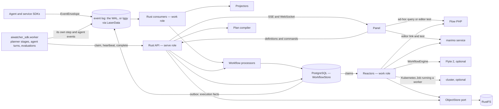
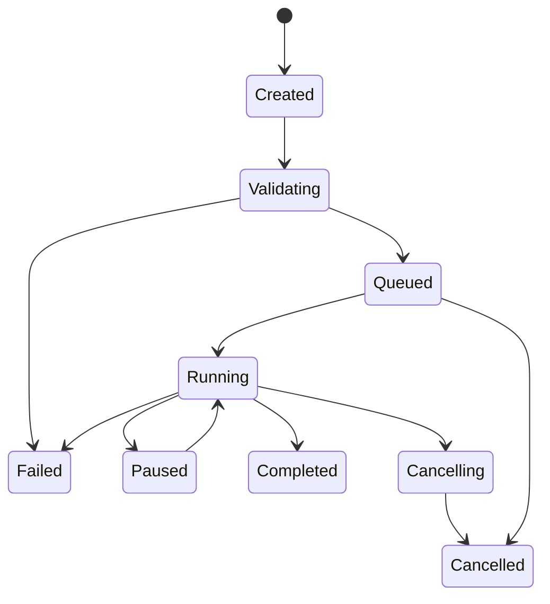

# Pipeline and Workflow Execution Architecture

- **Status:** implementation plan — revision 3. Phases 0–3 are built; section
  43 records what building them changed in this document, and the note above
  Phase 0 says exactly what exists. Revision 2 was checked against the
  aiwatcher crates and services, against planner, and against
  `ai_spirit_agent` (section 33)
- **Audience:** maintainers of the Rust API, event pipeline, curation services,
  panel, the Python SDK, and the planner and `ai_spirit_agent` integrations
- **Last updated:** 2026-09-05
- **Related decisions:** ADR 0002, 0004, 0008, 0011, 0012, 0014, 0016, 0018,
  0021, 0022, 0023, 0024, and — written from this plan — 0025 and 0026

## 1. Executive summary

aiwatcher should own durable pipeline execution in Rust. The panel authors
definitions, edits code and configuration, sends commands, follows links, and
renders state; it does not compile, sequence, retry, resume, or publish a
pipeline.

Execution engines remain separate:

- Flow PHP executes its query DSL and remains directly useful in Observability;
- the marimo service edits, previews, and executes notebook code outside the API
  process;
- a **worker** — `aiwatcher_sdk.worker`, a Python process holding a worker
  token — pulls step attempts and runs a registered function, a container's
  entry point, an agent turn or an evaluation suite (sections 36–37). This is
  how planner's stages and an `ai_spirit_agent` graph run without an HTTP
  service in front of them;
- Flyte 2 may execute externally registered workflows through the existing
  `WorkflowEngine` port, and stays the answer for what a worker cannot do
  (section 39.5);
- the Rust API coordinates aiwatcher-managed executions and preserves their
  history and context.

The storage split is intentional:

- the **event log** — the built-in write-ahead log by default, Apache Iggy
  through the LaserData SDK when `AIWATCHER_BUS=laser` — is the durable source
  and replay backbone for agent, observability **and execution** facts. The
  engine publishes its own facts onto it, as a producer like any other
  (section 34);
- PostgreSQL, behind a `WorkflowStore` port with in-memory and single-file
  adapters beside it, is the transactional source of truth for workflow
  instance streams, execution state, inbox/outbox, worker claims, processor
  checkpoints, artifact metadata and cache indexes. It is introduced for
  **execution only**; moving the observability read models into it is a
  separate decision with its own gate (Phase 8);
- RustFS, behind the existing `ObjectStore` port, stores immutable large
  artifacts such as row sets, code snapshots, previews, and logs; the ones
  that are somebody's words stay in the worker's own store by default, and the
  conversation archive's crypt seals them when a definition asks for that
  (section 40.4);
- process memory is an optimisation only. No correctness decision may depend on
  a warm cache or an open browser tab.

The design borrows four compatible ideas:

1. **Emmett:** commands express intent, events express facts; a workflow is
   `decide + evolve + initial_state`; each workflow instance has a durable inbox
   and outbox; consumers deliver and processors own useful work and checkpoints.
2. **Temporal:** workflow definitions are separate from executions; external
   effects are idempotent activities; history, rather than process memory,
   enables recovery.
3. **Prefect:** only runs have states; steps have independent attempts, retries,
   and persisted results; a cache hit is an explicit execution state.
4. **Flyte 2:** runtime environments belong to tasks, tasks exchange typed
   references to artifacts, and an external engine can own an execution without
   changing the product-facing API.

Revision 2 adds what checking the plan against three codebases showed
(section 33). The durable-job rules already exist in `aiwatcher-jobs` and are
called, not copied. The engine port `WorkflowEngine` and its Flyte adapter
already exist and are kept; the `ExecutionBackend` trait of revision 1 is
dropped for an `ExecutionOwner` on the run (section 24). The object store
cannot serve as the workflow stream, which is what settles PostgreSQL
(section 7.1). And two of the three things this engine is for — planner's
house import and `ai_spirit_agent`'s graphs — need a Python worker rather than
another HTTP runtime. Two execution modes follow: a **compiled plan** whose
decider is Rust, and a **hosted decider** whose decisions are made by a worker
and whose history is kept here (section 40.3). `ai_spirit_agent`'s
`agentic.workflow` is already an Emmett-shaped engine on SQLite; the hosted
mode gives it a shared store and changes nothing in its decider.

This plan supersedes the execution part of ADR 0024 and, for managed runs,
ADR 0014's browser-mediated persistence. Their block vocabulary, server-side
validation and content-addressed versions remain; the browser must no longer
drive the chain. It narrows ADR 0008's "the binary does not know the optional
services exist" to the *API role*: the work role reaches them, from
configuration (section 27). It decides the question ADR 0016 deferred —
whether aiwatcher may be a producer on its own log — in favour (section 34).
Section 33.5 lists every decision it touches.

## 2. Goals

### 2.1 Product goals

- Build a dataset using only Flow PHP.
- Build a dataset using Flow PHP followed by one or more marimo steps.
- Preserve Flow PHP as the Observability query surface.
- Open a Flow or marimo editor with the exact historical source context for a
  saved pipeline revision or execution.
- Run, retry, resume, cancel, and inspect a pipeline after the originating panel
  tab has closed.
- Reuse the execution model for agent, search, and ML workflows.
- Connect Planner and Flyte later without changing the panel contract.
- Link every execution and step attempt to aiwatcher observability.
- Keep large data outside the event log and PostgreSQL rows.
- Run planner's four-stage house import unattended, one pod per stage, with no
  Flyte in the cluster — proven byte-identical to the in-process path first
  (section 39.4).
- Give an `ai_spirit_agent` graph a durable join, a resumable turn and a human
  step, without moving an LLM call into Rust (section 40).
- Let a person approve a step — a promotion, a tool call — from the panel, and
  let the execution wait for it across a restart (section 41).

### 2.2 Engineering goals

- At-least-once delivery without duplicated side effects.
- Optimistic concurrency per workflow instance.
- Atomic recording of workflow input, decisions, state projection, and outbox.
- Independent processor checkpoints and failure policies.
- Deterministic, testable workflow decisions.
- Content-addressed artifacts and cache keys.
- Rebuildable asynchronous projections.
- A local development path that does not require Flyte, RustFS or PostgreSQL.
- One lease, one retry rule and one content address, shared with
  `aiwatcher-jobs` rather than re-derived.
- A worker that needs no inbound address, no bucket credential and no role
  wider than "run what was scheduled for me".

## 3. Non-goals

- Reimplement Temporal, Prefect, or Flyte inside aiwatcher.
- Reimplement Flyte's typed literal system, map tasks, dynamic sub-workflows
  or its console. What planner uses of Flyte is smaller than that (section
  39.1); what it might need later keeps the `Engine` owner alive (section
  39.5).
- Execute arbitrary PHP or Python code inside the Rust API process — nor an
  LLM call, an agent turn or a notebook.
- Turn the panel into a workflow worker.
- Put dataset rows, notebook source, or large logs directly in log messages.
- Put conversation content — an agent's inter-node text, a prompt, a
  completion — in a workflow message, a PostgreSQL row or a plain artifact.
  Section 40.4 is the rule.
- Replace RQ, Redis Streams or SQLite *inside* a producer's own process. The
  worker protocol is what those talk to, not what replaces them.
- Make every Observability query a durable workflow execution.
- Mirror every internal Flyte task as an aiwatcher-owned retry state machine.
- Promise exactly-once network calls. The system provides at-least-once
  delivery plus idempotent effects and deduplicated state transitions.

## 4. Terminology

The repository currently uses "workflow" for several related but different
things. The implementation should use these names consistently:

| Term | Meaning |
|---|---|
| `CurationPipelineDefinition` | Authored source/transform/notebook/view blocks |
| `WorkflowDefinition` | An authored or registered agent/search/ML workflow |
| `DefinitionRevision` | Immutable content-addressed version of either definition |
| `ExecutionPlan` | Server-compiled, immutable runtime-neutral graph |
| `ExecutionRun` | One attempt to execute a pinned plan revision |
| `StepRun` | Logical state of one plan step in an execution |
| `StepAttempt` | One physical attempt to perform a step |
| `WorkflowStream` | Ordered inbox and outbox messages for one execution |
| `ArtifactRef` | Immutable reference to data or code stored outside the message |
| `ContextSnapshot` | Exact code, source, parameters, and upstream artifacts seen by a step |
| `RuntimeBinding` | Adapter and execution configuration for one step: Flow, marimo, a worker task, a container job, an agent turn, a human input, an engine — section 35 |
| `ObservedWorkflow` | Graph reconstructed from external telemetry, not necessarily launchable |
| `ExecutionOwner` | Who decides for an execution: `local` (the Rust decider), `engine:<name>` (an external engine read through `WorkflowEngine`), `worker` (a hosted decider — section 40.3) |
| `ExecutionMode` | `compiled` — a static plan the Rust decider schedules; `hosted` — a worker runs `decide` and this system keeps the history |
| `Worker` | A process holding a worker token that claims step attempts by pulling, runs one task or agent turn per attempt, and reports facts — `aiwatcher_sdk.worker` (section 36) |
| `TaskRef` | `name@version`: the registered name and pinned code version a worker must match to claim a `PythonTask` attempt |
| `PodTemplate` | A named, operator-written pod shape a `ContainerJob` step refers to and never carries (section 37) |

A curation pipeline, a planner workflow and an agent graph may all compile to
an `ExecutionPlan`, but they remain distinct authoring experiences — and an
agent graph compiles only to its *shape*; its decisions stay in the worker.

## 5. Architectural principles

### 5.1 Commands are intentions; events are facts

Commands use imperative names:

- `StartExecution`
- `ExecuteFlowStep`
- `ExecuteNotebookStep`
- `RetryStep`
- `CancelExecution`
- `PublishDataset`

Events use past-tense facts:

- `ExecutionRequested`
- `ExecutionStarted`
- `FlowStepCompleted`
- `StepRetryScheduled`
- `DatasetPublished`
- `ExecutionFailed`
- `ExecutionCancelled`

An HTTP request is translated to a command. A successful command decision
appends facts and possibly further commands. An API must never write a
`Completed` event merely because it intends to start work.

### 5.2 Decisions are pure; effects are reactors

The core workflow shape follows Emmett's Decider pattern:

```rust
pub trait Workflow {
    type State;
    type Input;
    type Output;

    fn initial_state() -> Self::State;

    fn decide(
        state: &Self::State,
        input: &Self::Input,
    ) -> Result<Vec<Self::Output>, DecisionError>;

    fn evolve(state: Self::State, event: &WorkflowEvent) -> Self::State;
}
```

`decide` performs no I/O, reads no wall clock, and generates no random values.
Time, ids, resolved revisions, and policies needed by a decision arrive in the
input. This makes replay and scenario testing straightforward.

Flow calls, marimo calls, RustFS writes, Flyte launches, and dataset publication
are effects. Dedicated reactors execute them and report facts back to the
workflow.

### 5.3 Definitions, plans, and runs are different records

A definition is editable. A revision is immutable. A compiled plan pins exactly
one revision. A run pins exactly one plan.

Editing a pipeline while an older run is active creates a new revision; it does
not mutate or reinterpret the active run.

### 5.4 Data moves by reference

Step commands and events carry `ArtifactRef`, not a list of rows. This keeps
log messages, PostgreSQL transactions, SSE payloads, and workflow histories
bounded.

Small control values may stay inline. The default limits should be:

- command/event payload: 256 KiB maximum;
- inline result: 64 KiB maximum;
- anything larger: immutable artifact.

### 5.5 The owner of an execution owns its retries

- For a local aiwatcher execution, Rust owns step scheduling and retries.
- For an execution delegated as a whole to an engine (Flyte, through
  `WorkflowEngine`), that engine owns its internal task retries and
  scheduling. aiwatcher records the external execution id and shows the
  engine's phase **beside** the status folded from the log, never merged into
  it — the existing guardrail, unchanged.
- For a hosted decider (section 40.3), the worker owns its decisions and this
  system owns the lease, the redelivery and the retry of the *attempt*. One
  attempt is retried by the store, never by the worker's own loop as well.
- A `ContainerJob` sets `backoffLimit: 0` for the same reason: the store counts
  attempts, and a Job that retried on its own would be a second orchestrator.
- aiwatcher may retry the initial engine launch only while it cannot know
  whether the engine accepted it, using an idempotency key or lookup by
  external execution name.

This prevents two nested orchestrators from independently retrying the same
work.

## 6. System topology



The direct panel-to-Flow and panel-to-marimo arrows are limited to ad-hoc
queries, editing, validation, and explicit developer tests. Durable `run`,
`retry`, `resume`, `cancel`, and `publish` commands always go through Rust.

Two process roles share one binary (section 27): **serve** holds the API, the
store and the object store, and opens no socket to Flow, marimo, an engine or
the cluster; **work** holds the consumers, the workflow processor and the
reactors, and is the only role that reaches those. A worker pod holds neither
the store nor a bucket credential — it reads and writes artifacts through
URLs its claim carried. The projectors still read the log directly, as today:
the in-memory read model, the span assembler and the live hub are unchanged
by this plan (section 33.2).

## 7. Sources of truth

| Information | Source of truth | Rebuildable copy |
|---|---|---|
| Agent/LLM/tool telemetry | the event log (`AIWATCHER_BUS`: WAL, or Iggy) | the in-memory read model, Victoria backends |
| Execution facts — `execution.*`, and `step.*` / `artifact.produced` for engine-run steps | PostgreSQL workflow stream, published to the log through the outbox (section 34) | the workflow fold, the waterfall, VictoriaTraces |
| Pipeline/workflow definition and its revisions | the object store, as today (`pipelines/{id}/versions/{revision}.json`) | none needed; the head is derived |
| Compiled plan (`plan_id`) | PostgreSQL, keyed by definition revision | recompiled from the revision |
| Workflow instance history | PostgreSQL workflow stream | the facts on the log; never the decisions |
| Hosted-decider history (section 40.3) | PostgreSQL workflow stream, appended by the worker under expected version | the worker's local SQLite is a cache, never the truth |
| Current run/step state | PostgreSQL inline projection | rebuildable from workflow stream |
| Worker claim and lease | PostgreSQL `step_attempts` | none — a lost claim expires |
| External processor checkpoint | PostgreSQL per processor | Iggy consumer offset is transport state |
| Large step result | RustFS/ObjectStore | none unless explicitly replicated |
| A step payload that is somebody's words | the worker's own store under `payloads: external` (the default), or the archive's crypt under `sealed` (section 40.4) | references, digests and sizes in the stream; never the text |
| Artifact metadata and lineage | PostgreSQL | rebuildable partly from execution events |
| Step cache index | PostgreSQL | can be dropped and rebuilt lazily |
| Hot API cache | process memory | always disposable |

Definitions stay where ADR 0014 and ADR 0024 put them. Revision 1 moved them to
PostgreSQL; revision 2 does not, because the registry already versions a
pipeline by content, writes the version before the head, and answers 501 with
the variable when no store is configured — and a definition in PostgreSQL would
be readable exactly when a dataset version naming it is not. What PostgreSQL
gains is the *compiled* plan, which is derived.

### 7.1 Why workflow history is in PostgreSQL

The log remains the event backbone, but a workflow decision requires one atomic
operation:

1. deduplicate and record the input;
2. check the expected workflow stream version;
3. append all output facts and commands;
4. update the immediate run/step read model;
5. write outbox records;
6. advance the processor checkpoint.

PostgreSQL can perform those writes in one transaction. The current Laser/Iggy
adapter provides ordered offsets and at-least-once delivery, but it does not
provide a transaction spanning Iggy and the PostgreSQL state. Treating an Iggy
offset as an event-sourced aggregate version would leave a dual-write gap.

Two alternatives were checked before keeping this decision in revision 2.

**The object store cannot be the stream.** Compare-and-append over S3 needs a
conditional put (`If-None-Match: *`), and RustFS's handling of `If-None-Match`
and `If-Match` is an open issue on both the read and the write side
(rustfs/rustfs#791, #1458 — unquoted ETags are rejected outright). A CAS that
works on MinIO and not on the store this system ships is a CAS that works in
CI. `aiwatcher-jobs` gets away without one because its jobs have a single
writer under a lease and a cursor that only moves forward; a workflow stream
has a decider, a reactor and a worker racing to append.

**Iggy cannot be the stream either, yet.** It offers ordered offsets, consumer
groups and at-least-once delivery, no append-with-expected-version, no
cross-topic transaction, and runs as a single node with clustering planned.
If it later exposes a proven atomic per-stream append with expected revision
and an inbox/outbox boundary, this decision can be revisited behind the port.

PostgreSQL does all six steps in one transaction, and one already runs in the
`planner` namespace this system is installed into — Flyte's `flyte-binary`
points at `planner-postgres`. ADR 0009's `install | external | none` applies to
it as to every other backend: `detect-stack.py` reports one, and a second
PostgreSQL beside an existing one is the mistake that ADR exists to prevent.

Behind the port, three adapters, in the pattern `memory | wal | laser` and
`none | memory | file | s3` already set: `memory` for tests; `file` — a
single-process append log under `AIWATCHER_DATA_DIR`, locked the way the WAL
is, for `just dev` and `just pii-demo`; and `postgres`. The contract suite in
section 29.2 runs against all three. A managed run that needs more than one
process — a worker, a container job, a second API replica — refuses to start on
`file` and names `AIWATCHER_WORKFLOW_STORE`, so that a development store never
becomes a production one by omission.

## 8. Messages and metadata

The current `EventEnvelope` and `RecordedEvent` are good telemetry contracts.
Workflow control should reuse their metadata concepts without forcing runtime
commands into the telemetry event catalog.

```rust
pub struct MessageMetadata {
    pub schema_version: u16,
    pub message_id: MessageId,
    pub occurred_at: OffsetDateTime,
    pub recorded_at: OffsetDateTime,
    pub source: Source,
    pub tenant_id: Option<String>,

    pub correlation_id: CorrelationId,
    pub causation_id: CausationId,
    pub trace_id: Option<TraceId>,
    pub span_id: Option<SpanId>,

    pub workflow_id: Option<String>,
    pub workflow_run_id: Option<String>,
    pub step_id: Option<String>,
    pub attempt: Option<u32>,
}

pub enum WorkflowMessage {
    Command(WorkflowCommand),
    Event(WorkflowEvent),
}
```

Rules:

- `message_id` is globally unique and stable across redelivery.
- `correlation_id` is normally the execution id.
- `causation_id` is the input message that caused this output.
- a reactor completion event is caused by its execution command.
- schema versions are explicit; unknown future major versions are rejected or
  parked, never partially decoded.
- secrets, raw prompts, dataset rows, notebook source and an agent's
  inter-node text are forbidden in workflow messages — the last of these is
  conversation content, and section 40.4 says where it goes.
- the *facts* this engine publishes are catalog entries (section 34); the
  *commands* are not, and are never published to the log — they live in the
  store and are claimed from it (section 11.1).

`EventEnvelope.kind` already carries `MessageKind::Command`, documented as
"on the wire from day one so adding control commands later is not a breaking
change" and constructed nowhere in the workspace. This plan is its first user:
a command in the store is `kind: command`, the projector's fold ignores
commands as it ignores unknown types, and a command that ever does reach the
log is parked by the dead-letter sink rather than folded.

## 9. PostgreSQL model

The following schema is illustrative. Migrations should use the repository's
chosen SQL library and naming conventions.

### 9.1 Definitions and revisions

Revision 1 put `execution_definitions` and `execution_definition_revisions`
here. Revision 2 does not (section 7): a definition is an authored,
content-addressed object in the registry's object store, beside the recipes
and the dataset versions that name it — `pipelines/{id}/versions/{revision}.json`
under a head written after the version. A `WorkflowDefinition` of another kind
(a planner workflow, an agent graph) is stored the same way under its own
prefix, registered through the API or the SDK, idempotent by content as
`workflow()` already is on the log. PostgreSQL holds what is *derived* from a
revision — the compiled plan.

The revision is a SHA-256 digest of canonical authored fields. Presentation
coordinates may either be included in the authored revision or moved to a
separate mutable layout record.

Revision 2 keeps the definition table out of PostgreSQL (section 7) and keeps
ADR 0024's revision as it is: `save_pipeline` digests the whole request,
positions included, and a test asserts that moving a block is a new revision.
That is the *authored* revision, and it is what `produced_by` names. What
execution needs is a second digest, `plan_id = sha256(compiled plan)`, over the
executable fields only — steps, bindings, parameters, pinned code — which is
what the cache keys and what `workflow.declared` carries as its version
(section 34). Two pipelines that differ only in layout compile to one
`plan_id`, so a canvas tidy-up invalidates nothing; and the authored revision
still names the picture somebody saved, which is what provenance is for.

```sql
create table execution_plans (
    plan_id text primary key,
    definition_kind text not null,
    definition_name text not null,
    revision text not null,
    plan jsonb not null,
    compiled_at timestamptz not null,
    unique (definition_kind, definition_name, revision)
);
```

### 9.2 Workflow stream

```sql
create table workflow_messages (
    workflow_run_id uuid not null,
    stream_version bigint not null,
    message_id uuid not null,
    kind text not null check (kind in ('command', 'event')),
    direction text not null check (direction in ('input', 'output')),
    message_type text not null,
    data jsonb not null,
    metadata jsonb not null,
    occurred_at timestamptz not null,
    recorded_at timestamptz not null default now(),
    primary key (workflow_run_id, stream_version),
    unique (workflow_run_id, message_id)
);
```

The unique message constraint is the durable inbox. Recording input and output
in the same stream makes every decision explainable and replayable.

### 9.3 Run and step projections

```sql
create table execution_runs (
    execution_id uuid primary key,
    plan_id text not null references execution_plans,
    owner text not null,          -- local | engine:<name> | worker
    mode text not null,           -- compiled | hosted
    state_type text not null,
    state_name text not null,
    requested_by text not null,
    input jsonb not null,
    external_execution_id text,
    owner_state jsonb,            -- the engine's or the worker's own phase; shown beside, never merged
    lease_owner text,             -- hosted mode: the one decider at a time
    lease_expires_at timestamptz,
    run_id text,
    trace_id text,
    created_at timestamptz not null,
    started_at timestamptz,
    ended_at timestamptz,
    last_message_version bigint not null default 0
);

create table step_runs (
    execution_id uuid not null references execution_runs,
    step_id text not null,
    runtime text not null,
    state_type text not null,
    state_name text not null,
    current_attempt integer not null default 0,
    input_artifacts jsonb not null default '[]',
    output_artifacts jsonb not null default '[]',
    context_id uuid,
    started_at timestamptz,
    ended_at timestamptz,
    primary key (execution_id, step_id)
);

create table step_attempts (
    execution_id uuid not null,
    step_id text not null,
    attempt integer not null,
    command_id uuid not null unique,
    queue text,                   -- worker queue this attempt is claimable on; null for reactor-run steps
    task_ref text,                -- name@version a worker must match
    lease_owner text,
    lease_expires_at timestamptz,
    state text not null,          -- claimable | claimed | running | awaiting_input | completed | failed | crashed
    error jsonb,
    started_at timestamptz,
    ended_at timestamptz,
    primary key (execution_id, step_id, attempt),
    foreign key (execution_id, step_id)
      references step_runs (execution_id, step_id)
);

create table awaiting_inputs (
    execution_id uuid not null,
    step_id text not null,
    attempt integer not null,
    request jsonb not null,       -- what is being asked: kind, choices, the role that may answer, deadline
    requested_at timestamptz not null,
    deadline timestamptz,
    answered_by text,
    answered_at timestamptz,
    response jsonb,               -- a bare decision inline; a ref when the answer is content (section 41)
    primary key (execution_id, step_id, attempt)
);
```

`state_type` drives orchestration. `state_name` is a user-facing refinement,
following Prefect's distinction between a stable state type and descriptive
names such as `AwaitingRetry` or `Cached`.

A worker's claim is a row of `step_attempts` in state `claimable` on one of its
queues, taken with `SELECT … FOR UPDATE SKIP LOCKED` and given
`lease_expires_at = now() + LEASE_SECONDS` — the constant from
`aiwatcher-jobs`, and `lease_expired` is the function that reads it back.
This is the one place PostgreSQL is used as a queue, and it is bounded: one row
per claim, one heartbeat per half-lease (section 36).

### 9.4 Outbox, checkpoints, and processing inbox

```sql
create table outbox_messages (
    message_id uuid primary key,
    topic text not null,
    partition_key text not null,
    payload jsonb not null,
    available_at timestamptz not null default now(),
    attempts integer not null default 0,
    published_at timestamptz,
    last_error text
);

create table processor_checkpoints (
    processor_id text primary key,
    source text not null,
    checkpoint jsonb not null,
    updated_at timestamptz not null
);

create table processed_messages (
    processor_id text not null,
    message_id uuid not null,
    processed_at timestamptz not null,
    primary key (processor_id, message_id)
);
```

`processed_messages` may be retained for the replay horizon or compacted after
the source retention boundary. Workflow input deduplication remains permanent
inside `workflow_messages`.

### 9.5 Artifacts, lineage, and cache

```sql
create table artifacts (
    artifact_id uuid primary key,
    tenant_id text not null,
    kind text not null,
    uri text not null,
    digest text not null,
    size_bytes bigint not null,
    media_type text not null,
    schema_ref text,
    produced_by_execution uuid,
    produced_by_step text,
    created_at timestamptz not null,
    unique (tenant_id, digest, kind)
);

create table artifact_lineage (
    output_artifact_id uuid not null references artifacts,
    input_artifact_id uuid not null references artifacts,
    execution_id uuid not null references execution_runs,
    step_id text not null,
    primary key (output_artifact_id, input_artifact_id, step_id)
);

create table step_cache (
    tenant_id text not null,
    cache_key text not null,
    artifact_ids jsonb not null,
    policy jsonb not null,
    created_at timestamptz not null,
    expires_at timestamptz,
    invalidated_at timestamptz,
    primary key (tenant_id, cache_key)
);
```

## 10. Atomic command handling

One workflow input is handled as follows:

```text
BEGIN
  load stream at expected_version
  if message_id already exists: return previous result
  fold events with evolve
  run decide(state, input)
  append input message
  append every output event and command
  update execution_runs and step_runs inline
  insert output commands/events into outbox
  advance processor checkpoint when input came from the log
COMMIT
```

Concurrency is guarded by the primary key on stream version plus either:

- `SELECT ... FOR UPDATE` on the execution row; or
- compare-and-append with a unique `(workflow_run_id, stream_version)` insert.

Prefer compare-and-append with a bounded retry around the pure decision. Use a
PostgreSQL advisory lock only for coarse maintenance work such as a projection
rebuild, not as the normal correctness mechanism for every workflow command.

## 11. Log topology: Iggy and LaserData

This section applies when `AIWATCHER_BUS=laser`. The default WAL has one
stream and one position by construction, so every rule below holds there
trivially; the rules are written for the backend where they can be broken.

### 11.1 Topics

Keep the existing stream and event topic:

```text
stream: aiwatcher
  topic: events             agent, LLM, tool, runtime, workflow and execution facts
  dead letters              as today — the DeadLetterSink, not a topic
```

A `commands` topic is **deferred**. Revision 1 planned one; revision 2 found
that with the store transactional, a command is a row a reactor or a worker
claims — `SKIP LOCKED` for the reactors in the work role, a long-poll for a
worker (section 36) — and a second topic with its own consumer group and
checkpoint would carry what the store already holds, and would need an outbox
of its own to be published safely. Facts go to the log through the one outbox
so that the live SSE, the workflow fold, the waterfall and the traces see them
with no second path (section 34).

What would make the topic right: a reactor fleet large enough that claim
polling on PostgreSQL is the *measured* bottleneck, or a producer that wants to
consume commands without holding PostgreSQL credentials — section 40.6's
transport adapter is the candidate. The outbox exists by then, and adding a
topic to it is small.

An alternative `workflow-events` topic is justified only if workflow traffic
needs independent retention or access control. Start with one topic and use
message type subscriptions in processors.

Agent, service and worker SDK credentials publish to `events` only. A worker
publishes under the `run_id` its claim named and no other; the ingest layer
checks that against the token (section 36.2).

### 11.2 Partition keys

- telemetry: `run:<run_id>`;
- workflow control: `workflow:<workflow_run_id>`;
- an external Flyte execution: `workflow:<aiwatcher_execution_id>`.

This preserves the ordering needed within one decision scope without requiring
global ordering.

### 11.3 Partitions and checkpoints

The current adapter deliberately uses one partition and a scalar checkpoint.
That is safe for the initial implementation. Before increasing the partition
count, replace scalar correctness checkpoints with a per-partition vector:

```json
{
  "stream": "aiwatcher",
  "topic": "events",
  "positions": { "0": 18291, "1": 17804 }
}
```

Iggy consumer group offsets are transport state. The PostgreSQL
`processor_checkpoints` record is the application-level proof that a processor's
durable output was committed.

Recommendation: run one Iggy consumer group per independently failing
processor. A shared consumer may fan out only to processors with the same
durability and backpressure policy; it must resume from the earliest processor
checkpoint.

### 11.4 Consumer and processor boundary

Following Emmett, a consumer only:

1. connects to a message source;
2. fetches or subscribes in source-appropriate batches;
3. forwards messages to processors;
4. applies backpressure;
5. reports `CaughtUp` when replay reaches the live tail.

Projectors, reactors, and workflows independently own:

- supported message types;
- checkpoint persistence;
- idempotency;
- retry/skip/stop policy;
- dead-letter policy;
- target-specific batching.

## 12. Runtime-neutral execution plan

The panel sends authored configuration. Rust validates and compiles it to a
runtime-neutral plan:

```rust
pub struct ExecutionPlan {
    pub plan_id: String,
    pub definition_id: String,
    pub revision: String,
    pub steps: Vec<PlanStep>,
    pub edges: Vec<PlanEdge>,
}

pub struct PlanStep {
    pub id: String,
    pub runtime: RuntimeBinding,
    pub inputs: Vec<InputBinding>,
    pub outputs: Vec<OutputDeclaration>,
    pub retry: RetryPolicy,
    pub timeout: Duration,
    pub cache: CachePolicy,
}

pub enum RuntimeBinding {
    FlowPhp(FlowStepSpec),
    Marimo(MarimoStepSpec),
    PublishDataset(PublishDatasetSpec),
    PythonTask(PythonTaskSpec),             // a worker runs a registered function — section 36
    ContainerJob(ContainerJobSpec),         // a PythonTask in a Kubernetes Job — section 37
    AgentTurn(AgentTurnSpec),               // a worker runs one agent turn — section 40
    HumanInput(HumanInputSpec),             // waits for a command — section 41
    EvaluationSuite(EvaluationSuiteSpec),   // a worker runs a suite and records the report
    ExternalWorkflow(ExternalWorkflowSpec), // WorkflowEngine::launch — Flyte
}
```

Section 35 is the table: where each executes, who owns its retries, what it
may carry. Each `*Spec` names a binding and its parameters and never a host;
every executor's address is configuration.

The first curation authoring model may remain a chain. The compiled plan should
already use nodes and edges so agent/search/ML workflows can use a DAG without
changing execution records. A compiler rejects unsupported joins or fan-out for
a runtime rather than asking the panel to guess semantics.

The compiler folds a source and its transforms into **one** `FlowPhp` step
whose `blocks` lists the authored block ids, because Flow executes one
pipeline. The panel lights three boxes from one `step.started` — the fact the
browser used to synthesise with its `'run as one Flow query'` note — and the
one-step-per-query rule is what makes "no transform after a notebook" a
compiler refusal rather than a runtime surprise.

## 13. Execution state model

### 13.1 Run states



Stable state types:

- `scheduled`
- `pending`
- `running`
- `awaiting_input`
- `completed`
- `failed`
- `crashed`
- `cancelled`
- `paused`

User-facing names may include `Validating`, `Queued`, `AwaitingRetry`, `Cached`,
`Cancelling`, and `TimedOut`.

`awaiting_input` is a stable type of its own rather than a name for `paused`,
because the two resume differently. A paused run resumes on `resume`, from
whoever may pause. A waiting step resumes on the *input it asked for*, from the
role the step declared, and its lease is released while it waits — a worker
that parked an attempt to ask a question does not hold a pod for the answer
(section 41).

### 13.2 Step attempt rules

- A `StepRun` represents the logical step across attempts.
- A `StepAttempt` is immutable after reaching a terminal state.
- Retry increments `attempt`; it never rewrites the failed attempt.
- `retry step` reuses pinned inputs and code from its `ContextSnapshot`.
- `rerun from step` creates a new execution unless explicitly documented as a
  repair of the same execution.
- A cache hit creates a completed step run named `Cached` and records the cache
  key and reused artifact ids.
- Infrastructure loss is `Crashed`; deterministic user-code failure is
  `Failed`; exceeding a deadline is a failed state named `TimedOut`.

## 14. Reactor contract

A reactor handles one effect command:

```rust
#[async_trait]
pub trait ActivityExecutor: Send + Sync {
    fn runtime(&self) -> RuntimeKind;

    async fn execute(
        &self,
        command: ActivityCommand,
        context: ActivityContext,
    ) -> Result<ActivityResult, ActivityError>;
}
```

Execution procedure:

1. deduplicate by `command_id`;
2. claim or renew the step-attempt lease;
3. load and verify input artifact digests;
4. call the runtime with the stable idempotency key
   `<execution>/<step>/<attempt>`;
5. stream or upload output to the ObjectStore;
6. verify digest and size;
7. append `StepCompleted` or `StepFailed` to the workflow input;
8. acknowledge/advance its processor checkpoint only after the completion fact
   is durable.

A timeout does not prove that a remote service did not finish. Before retrying,
the reactor queries the runtime by idempotency key when the runtime supports it.
Flow and marimo endpoints should be extended to support this lookup for managed
executions — sections 15.4 and 16.4 say exactly how much.

The lease is `aiwatcher_jobs::LEASE_SECONDS` and `lease_expired`, the attempt
rule is `after_failure` with `MAX_ATTEMPTS`, and step 8's ordering is
`aiwatcher_jobs::ORDERING`. The execution crate holds no second copy of any of
them; ADR 0022 says why a copy is worse than a call.

A worker is a reactor that runs outside the process (section 36): the same
eight steps, with the claim replacing the consumer and the completion call
replacing the append.

## 15. Flow PHP

Flow PHP remains a reusable query runtime, not a curation-only implementation.

### 15.1 Ad-hoc mode

Used by:

- Observability Query;
- Flow code validation;
- an explicit developer preview/test.

The panel may call Flow directly in this mode. The operation is not durable and
must be labelled as such. The panel still obtains the source context and
generated full script from Rust; it does not infer upstream blocks itself.

### 15.2 Managed mode

Used by:

- Flow-only dataset builds;
- Flow steps in a larger curation;
- scheduled or unattended work;
- runs that need retry, artifacts, or provenance.

Rust compiles the complete Flow script:

```text
source block + source arguments + transform tail + bounded output
```

The reactor sends that script and a stable execution id to Flow. Flow returns a
bounded inline preview or writes/streams a full result that becomes an artifact.

### 15.3 Source context

`FlowStepSpec` must retain a structured source in addition to the generated DSL:

```rust
pub struct FlowSourceRef {
    pub dataset: String,
    pub arguments: BTreeMap<String, String>,
    pub resolved_revision: Option<String>,
    pub window: Option<ResolvedWindow>,
    pub cursor: Option<String>,
}
```

A historical editor context regenerates the script from this pinned structure,
not from the current pipeline head.

### 15.4 What the query service needs

Today `POST /flow/query` is request/response with no key: nothing is keyed,
resumed or deduplicated, and the service is deliberately stateless (ADR 0008,
ADR 0014). Managed mode adds one field and one route:

```text
POST /flow/query          {pipeline, window_seconds, execution_id?}
GET  /flow/executions/{execution_id}      → running | done {digest, rows} | absent
```

`execution_id` is `<execution>/<step>/<attempt>`. The service keeps the answer
for the reactor's lookup window only — minutes, in memory — and what it
remembers is that it ran and what the result hashed to, never the rows: those
go to the artifact the reactor uploads. ADR 0014 refused to give the PHP
service an S3 client, and this keeps that refusal. A second replica behind a
load balancer answers `absent` for the other replica's execution, which the
reactor treats as "retry", and a retry of a deterministic query over the same
window writes the same digest.

**As built.** "In memory" is a note in the system temp directory, because a PHP
process has no memory between requests and `php -S` and PHP-FPM both fork: a
static array would answer `absent` to whichever worker took the lookup, which
is the bug this route removes arriving from another direction. The note is
scoped to one host and expires with the lookup window, which is the property
the paragraph above asks for. `POST /flow/query` also gained `digest` on its
answer — the service's own fingerprint of its own encoding, never compared
against the reactor's digest of the bytes it stored (section 43.14). And the
reactor's `done` answer is two reads rather than one: this route says whether
the query is still executing, and the object store's receipt says what the
finished attempt produced.

## 16. marimo

The notebook service remains outside the Rust process because it executes
arbitrary Python code.

### 16.1 Code revision

On save:

1. the notebook service validates the source as a marimo app;
2. Rust stores a content-addressed source snapshot through `ObjectStore`;
3. PostgreSQL records the code artifact and digest;
4. the pipeline revision pins that digest.

The working notebook file is an editable materialisation. The immutable code
artifact is the execution source of truth.

### 16.2 Data context

Staging must be keyed by context, never only by notebook name:

```text
<execution_id>/<step_id>/<attempt>/input
<execution_id>/<step_id>/<attempt>/params
<execution_id>/<step_id>/<attempt>/output
```

Opening a notebook from an old run resolves that run's upstream artifact and
parameters. Editing the same notebook from two pipelines therefore cannot
silently replace the data shown by the other pipeline.

### 16.3 Editor sessions

Rust issues a short-lived `EditorSession` containing:

- context id;
- notebook code revision;
- input artifact reference;
- parameters;
- runtime URL or route;
- permissions and expiry;
- a signed token or server-side opaque session id.

The marimo service materialises this context for its live app. An editor test is
allowed to use unsaved code but must be marked `ad_hoc`; a managed run always
pins code first.

### 16.4 What the notebook runtime needs

`POST /ml-pipeline/run` gains `context_id`, and staging moves from
`.data/blocks/{notebook}/` to `.data/contexts/{context_id}/` — the change
ADR 0024 already named as the one its staging would need. The live app for a
block reads the context the block's last run staged, so two pipelines editing
one notebook stop overwriting each other's rows, and an old execution's editor
shows that execution's input. The service's own docstring still holds: it
runs notebook code with no sandbox, binds to localhost and has no
authentication of its own. Phase 4's editor session is what changes that, and
until then a `Marimo` step is a development-profile binding: the compiler
refuses it in a plan whose store is `postgres` unless
`AIWATCHER_ML_PIPELINE_TRUSTED=true` says an operator has put something in
front of it.

## 17. Artifacts and RustFS

### 17.1 Artifact contract

```rust
pub struct ArtifactRef {
    pub artifact_id: String,
    pub kind: ArtifactKind,
    pub uri: String,
    pub digest: String,
    pub size_bytes: u64,
    pub media_type: String,
    pub schema_ref: Option<String>,
}
```

Recommended object layout:

```text
artifacts/<tenant>/<kind>/<sha256-prefix>/<sha256>/data
artifacts/<tenant>/<kind>/<sha256-prefix>/<sha256>/manifest.json
```

Keys are immutable. A human name such as `training/pii-clean` is a PostgreSQL
alias or dataset version pointing at an artifact digest, never the object key's
identity.

`ArtifactRef` exists once already: `aiwatcher_training::package::ArtifactRef`,
with `name`, `uri`, `digest`, `size_bytes`, `content_type` and a **required**
digest (ADR 0023). It moves to `aiwatcher-core` with its field names unchanged
and `kind` and `schema_ref` added. The workflow fold's own artifact record —
the one `artifact.produced` feeds — gains a `digest` it reads when present and
never requires, because a producer pointing at somebody else's bytes may not
know it; an engine-published `artifact.produced` always carries one.

A `file://` on a shared volume is a pointer nothing outside the cluster can
verify. It is accepted as a `uri` and is never the *only* one: a step that
hands on a path also reports the object-store copy's digest, or reports no
artifact (section 37).

### 17.2 Availability modes

- production managed executions: durable ObjectStore required;
- development: filesystem ObjectStore adapter is acceptable;
- unit tests: in-memory ObjectStore adapter;
- ad-hoc preview: a bounded inline result is acceptable and may optionally be
  promoted to an artifact.

If no durable ObjectStore is configured, the API must refuse an unattended run
that requires resumable intermediate data instead of pretending it is durable.

## 18. Cache

The cache key is content-derived:

```text
sha256(
  runtime kind
  + runtime implementation version
  + resolved code digest
  + ordered input artifact digests
  + canonical parameters
  + relevant environment fingerprint
  + output schema version
)
```

Rules:

- cache is opt-in per step or runtime policy;
- all inputs must be immutable and digest-addressed;
- moving a canvas block does not change the key;
- a moving time window is not cacheable until resolved to exact bounds/cursor;
- agent/LLM steps are not cacheable by default;
- notebook steps require a pinned source digest;
- Flow steps require a pinned source revision or resolved dataset artifact;
- a cache hit is recorded in workflow history and lineage;
- deleting the cache index never loses an authoritative result;
- cache invalidation marks entries invalid; it does not mutate old executions.

Do not add Redis initially. PostgreSQL stores the cache index, RustFS stores
cached bytes, and process memory may cache hot metadata by revision.

## 19. Editor context API

The panel must not reconstruct upstream context. It asks Rust:

```http
GET /api/v1/executions/{execution_id}/steps/{step_id}/context
GET /api/v1/curation-pipelines/{name}/revisions/{revision}/blocks/{block_id}/context
```

Representative response:

```json
{
  "context_id": "...",
  "runtime": "flow_php",
  "definition_revision": "sha256:...",
  "code_revision": "sha256:...",
  "source": {
    "kind": "dataset",
    "name": "hub_rows",
    "arguments": { "dataset": "...", "split": "train" }
  },
  "input_artifacts": [],
  "parameters": {},
  "resolved_script": "data_frame()...",
  "actions": {
    "validate": { "method": "POST", "href": "..." },
    "test": { "method": "POST", "href": "..." },
    "open_editor": { "method": "GET", "href": "..." }
  }
}
```

The API returns allowed actions because state and permission determine which
commands are valid. The panel renders them; it does not duplicate the state
machine.

## 20. Product API

Suggested resource model:

```text
POST /api/v1/curation-pipelines
GET  /api/v1/curation-pipelines
GET  /api/v1/curation-pipelines/{name}
GET  /api/v1/curation-pipelines/{name}/revisions/{revision}

POST /api/v1/executions
GET  /api/v1/executions
GET  /api/v1/executions/{execution_id}
GET  /api/v1/executions/{execution_id}/events
GET  /api/v1/executions/{execution_id}/stream

POST /api/v1/executions/{execution_id}/commands/cancel
POST /api/v1/executions/{execution_id}/commands/pause
POST /api/v1/executions/{execution_id}/commands/resume
POST /api/v1/executions/{execution_id}/steps/{step_id}/commands/retry

GET  /api/v1/executions/{execution_id}/steps/{step_id}/context
POST /api/v1/editor-sessions
```

Revision 2 adds the routes the worker, the hosted decider and the human step
need:

```text
POST /api/v1/definitions                         register a WorkflowDefinition (editor); idempotent by content
GET  /api/v1/definitions?kind=…                  curation_pipeline | workflow | agent_graph, each row naming its kind

POST /api/v1/executions/{execution_id}/stream    hosted decider: append at expected version (worker)
GET  /api/v1/executions/{execution_id}/stream    page the stream (viewer); payloads as refs, never inline

POST /api/v1/executions/{execution_id}/steps/{step_id}/input   answer a HumanInput (the role the step declared)

POST /api/v1/worker/claims                       section 36.1 (worker)
POST /api/v1/worker/attempts/{ref}/heartbeat
POST /api/v1/worker/attempts/{ref}/complete
POST /api/v1/worker/attempts/{ref}/fail
POST /api/v1/worker/attempts/{ref}/await
```

`POST /api/v1/engine/launches` becomes `POST /executions` with an engine
target and stays as an alias for one release (Phase 9). `/api/v1/engine` and
its catalog stay what ADR 0016 made them — what an *engine* could start — and
`/definitions` is what *this system* could start; the panel's picker shows
both, each row naming its source, and never merges them into one list that
cannot say which is which.

Start request:

```json
{
  "target": {
    "kind": "curation_pipeline",
    "name": "curation/pii-detection",
    "revision": "sha256:..."
  },
  "mode": "preview",
  "backend": "local",
  "parameters": {},
  "publish": false
}
```

The response is `202 Accepted` once the command and workflow input are durable.
It returns an execution representation plus links for valid next actions.

All mutating command endpoints accept an `Idempotency-Key`. Repeating the same
key returns the original command result.

## 21. Panel boundary

The panel may:

- edit blocks, edges, scripts, notebook code, and parameters;
- send authored definitions to Rust;
- ask Rust to validate or compile;
- perform explicitly labelled ad-hoc Flow/marimo tests;
- submit run/cancel/retry/resume/publish commands;
- render run, step, attempt, artifact, and event state;
- follow runtime/editor links supplied by Rust;
- subscribe to SSE/WebSocket updates.

The panel must not:

- compute executable ordering;
- compile source and transform blocks into the authoritative Flow script;
- fetch current notebook revisions to pin them;
- pass rows from Flow to marimo;
- decide retry eligibility or delay;
- publish a managed run's dataset itself;
- infer source context from the currently visible draft;
- assume a runtime URL or deployment topology;
- decide whether Flyte or the local engine owns a run.

A useful mechanical acceptance check is that the pipeline route no longer
imports or calls browser-side `orderOf`, `compileFlow`, `runQuery`,
`runNotebook`, or `publishDataset` for managed execution.

## 22. Observability linkage

Every managed execution has:

- `workflow_id`: stable definition identity;
- `workflow_run_id`: aiwatcher execution identity;
- `run_id`: one runtime/process execution; several run ids may belong to one
  workflow run;
- `step_id` and `attempt`;
- `trace_id` and span context where applicable;
- `external_execution_id` for Flyte or another engine.

The initiating HTTP command seeds correlation. Every output event inherits that
correlation and names the input message as causation.

Reactor calls create spans around the external operation. Workflow lifecycle
events remain control-plane events and must not be mistaken for LLM/tool spans.
Agent events produced inside a workflow carry both `run_id` and
`workflow_run_id`, preserving the existing ability to assemble one workflow
execution across multiple runtime processes.

The PostgreSQL execution view links to the log-backed event stream and to
Victoria traces; it does not copy prompt or completion content into telemetry.

Section 34 is the other half of this: the engine *is* a producer, and the
workflow fold, the waterfall and the live channel draw a managed execution
from the same events they draw everything else from.

## 23. Projections and rebuilding

Use two projection modes:

1. **Inline projection** for the small current state required to accept the next
   workflow command: `execution_runs`, `step_runs`, and current artifact links.
   It is updated atomically with workflow messages.
2. **Asynchronous projection** for lists, analytics, metrics, search, and
   external integrations. It consumes the log and owns an independent checkpoint.

For an asynchronous read-model migration:

1. deploy a versioned projection table or schema;
2. acquire a rebuild lease/advisory lock;
3. replay from the beginning into the new version;
4. continue until its checkpoint reaches the chosen log head;
5. validate counts, invariants, and lag;
6. atomically switch the query alias/view;
7. retain the old projection for rollback;
8. remove it after the rollback window.

Do not truncate the serving projection while rebuilding it in production.

## 24. Planner and Flyte 2

Revision 1 introduced an `ExecutionBackend` trait here, with a local and a
Flyte implementation. Revision 2 drops it. Checking the code found
`core::engine::WorkflowEngine` already doing the external half — catalog,
interface, version-pinned launch, execution polling — with a Flyte 2 gateway
adapter in `aiwatcher-pipeline` that also implements `WorkflowRunner`, a
loopback stand-in admin for its tests, and a guardrail that its phase is never
merged into a status folded from the log. A second trait covering the same
calls would be the second rule set this repository refuses everywhere else.

So an execution has an **owner**, and the owner decides which code path runs:

```rust
pub enum ExecutionOwner {
    Local,               // the Rust decider schedules; reactors and workers execute the steps
    Engine(EngineRef),   // WorkflowEngine::launch; the engine schedules and retries its own tasks
    Worker(TaskRef),     // a hosted decider — the worker decides, this system keeps the history
}
```

- A `Local` execution has steps, attempts, leases and a cache here, and its
  steps are any binding in section 35.
- A `Worker` execution has one lease — the decider's — and a stream the
  worker appends to under expected version; section 40.3.
- An `Engine` execution has one record, the external id, and `owner_state`
  refreshed by `WorkflowEngine::execution` on request. It is shown beside the
  status the workflow fold derives from what the engine's pods published, and
  the two are allowed to disagree, because a disagreement is a producer nobody
  instrumented. aiwatcher records the metadata and the artifact lineage the
  engine reports and never reschedules the engine's internal tasks. Engine
  artifact references are linked when accessible and copied to RustFS only for
  retention, governance or locality.

Cancel goes to the owner: the store for `Local`, the worker's lease and a
`CancelRequested` in the stream for `Worker`, `WorkflowEngine` gains a
`cancel` — its sixth method, the one it lacks — for `Engine`.

What planner runs today, the four levels at which it can integrate, and the
path by which a `Local` execution takes Flyte's place in its cluster are
sections 38 and 39. The short version: planner uses one launch-plan-free
`TaskEnvironment`, no retries, no caching, no schedules and no typed IO beyond
`str`; the in-process path is the default profile and is tested byte-identical;
and the console is the part that cost the most fix commits. `Engine` stays for
what a worker cannot do.

## 25. Security and tenancy

- Definitions and artifacts are tenant-scoped in PostgreSQL and ObjectStore
  keys.
- Agent SDK credentials may publish events but not workflow commands.
- Only Editor or higher may save code or definitions.
- Only authorised roles may run, cancel, retry, or publish.
- Runtime endpoints are internal; editor links are short-lived and scoped.
- Flow dataset/source names are validated against the server-side catalog.
- Notebook code never runs in the API process.
- Secrets are referenced by name and injected by the runtime; they are never
  stored in definitions, messages, editor contexts, or artifacts.
- Artifact reads verify digest and enforce the same tenant/role gate as their
  metadata.
- Outbound source fetching retains the existing bounded downloader and SSRF
  protections.

## 26. Failure, retry, and cancellation policy

Classify failures before deciding to retry:

| Class | Examples | Default |
|---|---|---|
| validation | invalid graph, unknown source, bad parameters | fail without retry |
| user code | Flow parse error, notebook assertion | fail without automatic retry |
| transient runtime | connection reset, 503, worker unavailable | exponential retry with jitter |
| timeout/unknown | caller timed out after dispatch | query by idempotency key, then retry if absent |
| infrastructure crash | expired worker lease | mark attempt crashed, schedule next attempt |
| policy | cancelled, permission revoked, artifact quarantined | stop and record reason |

Recommended defaults:

- maximum automatic attempts: 3;
- exponential delays: 1 s, 5 s, 30 s with jitter;
- explicit per-runtime timeout;
- heartbeats/lease renewal for work longer than half the lease;
- manual retry preserves historical attempts;
- cancellation is cooperative first, forced termination only where the runtime
  supports it safely.

## 27. Crate and module plan

Keep `aiwatcher-pipeline` as the external workflow-engine integration boundary.
Add a separate crate for owned execution semantics rather than turning the
Flyte adapter crate into the entire application orchestrator.

Recommended dependency direction:

```text
aiwatcher-core
  message metadata, ids, ArtifactRef, shared ports

aiwatcher-jobs
  leases, retry rules, resumable job primitives

aiwatcher-datasets
  curation definition and dataset domain

aiwatcher-execution              NEW
  plan IR, compiler contracts, workflow decider, states, cache keys,
  ExecutionOwner, the worker claim rules,
  WorkflowStore / ArtifactCatalog / ActivityExecutor ports,
  the memory, file and postgres WorkflowStore adapters
  — postgres behind a `postgres` cargo feature, sqlx optional

aiwatcher-kube                   NEW, behind a `kube` cargo feature
  the ContainerJob reactor: creates one Job per attempt from a named pod
  template, watches it, deletes it on cancel (section 37)

aiwatcher-pipeline
  WorkflowEngine adapters, initially Flyte — unchanged in role; gains cancel

aiwatcher-api
  definitions, commands, reads, context, SSE, the worker routes

aiwatcher-server
  PostgreSQL, the log, ObjectStore, reactors, roles, shutdown wiring
```

And in `sdk/python`:

```text
aiwatcher_sdk/worker/            NEW — a registry client (httpx, tenacity, raises)
  claim, heartbeat, complete, fail, await; the @task registry; run-attempt
aiwatcher_sdk/integrations/agentic.py
  gains declare_graph, the hosted-decider EventStore and the transport (section 40)
aiwatcher_sdk/integrations/flyte.py
  unchanged
```

The worker half is never imported by the telemetry half: `aiwatcher_sdk`
itself stays on `urllib` and must never take an agent down, and a worker that
cannot reach the engine has no work and should stop.

**Corrected while building it.** Revision 2 proposed
`aiwatcher-execution-postgres` as its own crate, "so sqlx is out of every build
that does not set the feature, exactly as `laser` keeps laser_sdk out". That
reason does not survive being checked: `laser` is **not** a crate. `laser_sdk`
and the ~360 crates beneath it are kept out of `aiwatcher-bus` by an *optional
dependency behind a feature*, from a module beside `memory` and `wal` — and it
is a far heavier dependency than sqlx. A separate crate would also have been the
first vendor-named crate in the workspace, which the layering comment at the top
of `Cargo.toml` and the `aiwatcher-pipeline`-not-`aiwatcher-flyte` precedent
both rule out. So the adapter is `store::postgres`, behind a `postgres` feature,
and `cargo deny --all-features` covers it.

The feature carries the same dependency discipline the crate would have:
`default-features = false` with `postgres` only, because sqlx's defaults pull
`sqlx-mysql`, which depends on `rsa` — the crate this workspace already refused
for `jsonwebtoken`, since RUSTSEC-2023-0071 has no fixed release. No `macros`
and no `migrate` either: both live in `sqlx-macros`, which wants a live database
at *compile* time.

Runtime-specific compilation should not leak into the panel:

- curation structure validation stays with the dataset domain;
- compilation from curation blocks to `ExecutionPlan` belongs in
  `aiwatcher-execution`;
- Flow script generation belongs in a Flow runtime compiler module;
- Flow/marimo HTTP clients implement activity-executor ports;
- Flyte remains a `WorkflowEngine` adapter.

**Process roles.** One binary, two roles: `aiwatcher serve` holds the API, the
read model, the store and the object store; `aiwatcher work` holds the outbox
publisher and the reactors, and is the only role that opens a socket to Flow,
marimo, an engine or the cluster. `just dev` runs both **in one process** with
the `file` store; a deployment runs them as two Deployments with different
network policies, and the one that holds cluster credentials is the one that
holds no ingress. This is how ADR 0008's "the binary does not know the optional
services exist" survives as a statement about the *API*.

**Corrected while building it, twice.** Revision 2 put "the consumers" in
`work`. The projector *is* the read model the API answers from, in process,
under a memory contract — so it runs in `serve`, and what runs in `work` is the
outbox (section 43.12). And the split needs three shared backends rather than
one: the store, the log the outbox publishes to, and the object store one role
writes a step's result into for the other to read. All three are refused at
start-up by name (section 43.11), and a single-node install needs none of them
because both roles are one process.

## 28. Migration plan

Revision 2 keeps the order of revision 1 through Phase 7, changes what
Phases 1, 3 and 9 build, moves Phase 8 behind its own gate, and adds Phases
10–15 for the worker, planner, the hosted decider and the human step. Each
phase names its exit; a phase without a green exit does not start the next.

> **Implementation status, 2026-09-05.** Phases 0, 1, 2, 3 and 5 are done.
> Phase 4 is **not**, and Phase 5 was built without it: what it needed of
> artifacts is a content-addressed put, a verified read and a receipt, which is
> `aiwatcher-server`'s `execution::artifacts` rather than the catalog tables and
> editor sessions Phase 4 describes. Section 45 records what building it
> changed in this document.
>
> **Recorded.** ADR_0025 (the server owns managed execution) and ADR_0026 (the
> engine is a producer on its own log). ADR_0014 and ADR_0024 marked partially
> superseded. `CLAUDE.md` has the terminology table of section 4 and thirteen
> new guardrails.
>
> **In `aiwatcher-core`.** `Subject::Execution` and eight `execution.*` types,
> `forms_span = false`. `ArtifactRef` moved here from `aiwatcher-training` with
> `kind` and `schema_ref` added, defaulted and skipped so every stored
> `ModelPackage` reads and re-writes byte-identically.
>
> **In `aiwatcher-execution`.** The plan IR and `plan_id`; the states; the
> messages; the pure `decide`/`evolve`; the cache key; the compiler from
> ADR_0024's blocks, with the Flow script generator ported from the panel line
> for line; the `WorkflowStore` port with `memory`, `file` and `postgres`
> adapters; the atomic command handler of section 10; the attempt claim table of
> 9.3; the fact encoder of section 34; the outbox publisher; the
> `ActivityExecutor` and `ArtifactCatalog` ports of sections 14, 17 and 18; and
> the reactor loop that claims, runs and reports.
>
> **In `aiwatcher-projector`.** The workflow fold records `data.published_by`
> and `NodeState::has_two_publishers` flags a node with two.
>
> **Wired, in `aiwatcher-server`.** `AIWATCHER_WORKFLOW_STORE`
> (`memory | file | postgres`, `file` by default under `AIWATCHER_DATA_DIR`,
> `postgres` behind a cargo feature); `AIWATCHER_ROLE` and the `serve` / `work`
> arguments; the outbox publisher and the reactor loops as background tasks;
> `execution::artifacts` — the object store's sixth prefix, with the receipt of
> section 43.14; `execution::flow` — the Flow activity executor, addressed by
> `AIWATCHER_FLOW_URL`; and `execution::publish` — the `PublishDataset`
> executor, which runs in `serve` because it executes nothing.
>
> **In `aiwatcher-api`.** `POST /api/v1/executions` and
> `GET /api/v1/executions/{id}`, as a module facade. No list: the workflow fold
> already serves one, and a second would be ADR_0026's two pictures of one run.
>
> **In `services/flow`.** Section 15.4 as written: `execution_id` on
> `POST /flow/query`, and `GET /flow/executions/{id}` answering
> `running | done {digest, rows} | absent`. The service remembers that it ran
> and what the result hashed to, never the rows.
>
> **Proven.** The Phase 5 exit, by hand and end to end: a saved pipeline
> submitted over HTTP, the client gone, the process killed mid-run, and one
> published dataset version carrying `produced_by` and `execution_id` after the
> restart. The Phase 3 exit, in
> `aiwatcher-projector/tests/managed_execution.rs`, and again in that run — the
> managed execution draws itself in the existing workflow tab with `Pending`
> nodes, from `workflow.declared` and `step.*` alone, with no second read path
> and no panel work. The Phase 1 exit, three times over: the contract suite is
> `aiwatcher_execution::testing` behind a `testing` feature, and all three
> adapters assert the same sixteen properties rather than three similar sets.
> `just postgres-up && just test-postgres` runs it against a real database.
>
> **Not built, and each blocks something named:**
>
> * Phase 4's artifact metadata, lineage and cache **tables**, and its editor
>   sessions and `ContextSnapshot`. `ArtifactCatalog` has a memory adapter and
>   no durable one, and nothing wires it: a cache hit is therefore impossible
>   today, and an old block cannot be opened with its historical context.
> * Section 20's `mode: "preview"`. A managed step already reports a bounded
>   inline preview *beside* its artifact, which is what a canvas renders; what
>   does not exist is a whole execution that runs at simulation size and
>   publishes nothing. `POST /executions` refuses the field by name rather than
>   ignoring it.
> * The marimo activity executor, which is Phase 6.
> * Any panel change. `POST /executions` has no caller in the browser, so the
>   Pipeline view still drives a chain itself — Phase 7, and ADR_0025 is
>   explicit that the ad-hoc path stays either way.
> * Anything in `deploy/`: no PostgreSQL installed or reported through
>   `detect-stack.py` as ADR_0009 requires, and no NetworkPolicy for the two
>   roles.
> * Everything from Phase 8 on.

### Phase 0 — record the decisions

- Add an ADR superseding the browser-execution decision in ADR 0024 and,
  for managed runs, ADR 0014's browser-mediated persistence.
- Add an ADR for section 34: the engine is a producer on its own log, with
  `execution.*` in the catalog. This is the question ADR 0016 deferred.
- Amend the ingest-token guardrail in `CLAUDE.md` for the `worker` scope
  (section 36.2) and add a note to ADR 0013; the role model stays at three, so
  no ADR of its own.
- Keep ADR 0024's block types and validation unless the new compiler exposes a
  concrete incompatibility.
- Add terminology from section 4 to `CLAUDE.md` and public architecture docs;
  fix the three-way SDK pin drift in planner while there (section 33.3).

**Exit:** maintainers agree on storage authority, execution ownership, the
producer decision and the panel boundary.

### Phase 1 — the WorkflowStore port and three adapters

- Define `WorkflowStore` in `aiwatcher-execution`: append at expected version,
  load, dedup by message id, inline projection, outbox, checkpoints, claims.
- Implement `memory` and `file` adapters in the crate; `postgres` in
  `aiwatcher-execution-postgres` behind a feature, with configuration, pool,
  health, migrations, and ADR 0009's `install | external | none` in the chart.
- Run the contract suite (29.2) against all three.

**Exit:** a pure test workflow survives process restart and duplicate input on
every adapter, and a multi-process run refuses to start on `file`.

### Phase 2 — execution domain

- `ExecutionPlan`, `plan_id`, `ExecutionOwner`, states with `awaiting_input`,
  attempts, policies, workflow messages.
- Pure `decide/evolve/initial_state` for a linear plan, then a DAG.
- Scenario tests: given-events / when-command / then-messages.
- Canonical plan and cache-key encoders; the compiler from ADR 0024 blocks.

**Exit:** the state machine schedules, completes, fails, retries, cancels,
waits and resumes without performing I/O.

### Phase 3 — the engine as a producer

- Add `execution.*` and `Subject::Execution` to the catalog with
  `forms_span = false`; release both SDKs.
- The outbox publisher writes committed facts to the log through the
  configured bus — `workflow.declared` for a started plan, `step.*` per
  attempt with `data.published_by`, `artifact.produced` with a digest.
- The workflow fold reads engine-published steps and flags a node with two
  publishers.
- Reactor consumers claim from the store; processor checkpoints in the store.
- Preserve the one-partition scalar checkpoint; document the vector gate.

**Exit:** redelivery and restart do not duplicate a workflow decision, and a
managed execution draws itself in the existing workflow tab with `Pending`
nodes — before any panel work.

### Phase 4 — artifacts and context

- Promote `aiwatcher_training::package::ArtifactRef` to core.
- Add artifact metadata, lineage, and cache tables.
- Store results and code snapshots through `ObjectStore`.
- Implement `ContextSnapshot` and editor-session APIs.
- Change marimo staging keys from notebook name to context id (16.4).

**Exit:** an old Flow or marimo block opens with its exact historical data and
code revision.

### Phase 5 — Flow-only managed execution

- Move authoritative Flow script compilation from TypeScript to Rust.
- Add `execution_id` and the lookup route to the query service (15.4).
- Add a Flow activity executor with idempotency, timeout, and result artifact.
- Implement preview and full modes.
- Implement Flow-only dataset publication as a managed plan: `produced_by`
  and `execution_id` on the version.
- Leave Observability Query and explicit editor tests available.

**Exit:** a dataset can be built using only Flow with the browser closed after
submission.

### Phase 6 — Flow plus marimo

- Add the marimo activity executor.
- Pin notebook source artifacts on managed save/run.
- Pass upstream artifact references and context ids.
- Persist stdout/stderr as bounded diagnostics or artifacts.
- Add retry from the failed notebook step without rerunning Flow when its input
  artifact is valid.

**Exit:** the existing PII example runs end to end under Rust orchestration.

### Phase 7 — thin the panel

- Replace browser `runPipeline` with `POST /executions`.
- Replace local block ordering and compilation with server validation/preview.
- Render allowed action links from API state.
- Follow execution SSE rather than synthesising block outcomes locally.
- Remove panel-driven publication of managed results.

**Exit:** closing or refreshing the panel cannot affect execution progress,
and `data-curation.pipeline.tsx` imports none of `orderOf`, `compileFlow`,
`runQuery`, `runNotebook`, `publishDataset` for a managed run.

### Phase 8 — PostgreSQL observability read models — **deferred, own gate**

Revision 1 placed this in sequence. It is not required by anything above or
below it: the in-memory read model, its caps and `rebuild_on_start` are the
existing design, and the engine's facts reach the panel through them
(Phase 3). Moving the folds into PostgreSQL reverses "the read model is a fold
over the log" and the 512 MB memory contract, and deserves its own ADR.

**Gate:** replay-on-start at full retention exceeds a minute somebody has
measured, or history beyond `AIWATCHER_MAX_RUNS` is wanted. Until then,
nothing here builds it.

### Phase 9 — engine-owned executions

- `ExecutionOwner::Engine` over the existing `WorkflowEngine`; no new trait.
- `WorkflowEngine::cancel`.
- An execution record for a launched engine run, with `owner_state` refreshed
  on request and never merged.
- `POST /api/v1/engine/launches` becomes `POST /executions` with an engine
  target; the old route stays as an alias for one release.

**Exit:** the panel starts local or engine-owned work through the same
execution API, and an engine run whose pods published nothing shows the
disagreement.

### Phase 10 — the worker protocol

- The `worker` scope on `AIWATCHER_AUTH_INGEST_TOKENS`, and the amended
  guardrail.
- The claim, heartbeat, complete, fail and await routes; `SKIP LOCKED`
  claims with `NOTIFY` wake-ups.
- `aiwatcher_sdk.worker`: `@task`, `Worker`, `TaskContext`, `run-attempt`.
- `PythonTask` binding; presigned or proxied artifact URLs on the claim.
- `just dev` runs one worker.

**Exit:** a two-step plan runs on a worker on a laptop; killing the worker
mid-attempt expires the lease and the next attempt completes.

### Phase 11 — planner, Levels 0 and 2

- Level 0 in planner: `workflow()`, `node()`, `artifact()` around the four
  stages on both branches and the cache branch; `workflow_run_id = job_id`
  on the vectorizer's run; the market-research harness traced.
- Level 2 in the `local` profile: the four functions as `@task`s, the RQ job
  as the worker, `orchestrator = "aiwatcher"`.
- `test_house_stage_artifacts.py` asserts the review is byte-identical to
  `direct`.

**Exit:** planner's house import appears in the workflow tab with pending
stages, and runs on a worker with Flyte off.

### Phase 12 — container jobs, and Flyte out of planner's chart

- `aiwatcher-kube` behind the `kube` feature; named pod templates in
  configuration; image allowlist.
- `ContainerJob` binding; a worker started per attempt; lease by heartbeat.
- planner's `kubernetes` profile on `ContainerJob` in Tilt against real k3s
  (no Devbox); `flyteEnabled` readable for one release as the fallback.
- Section 39.4's removal list.

**Exit:** the house import runs one pod per stage on k3s with no Flyte
component installed, byte-identical, and the chart is smaller by the list in
39.2.

### Phase 13 — the hosted decider

- `ExecutionOwner::Worker`, the decider lease, the append route with expected
  version and `Idempotency-Key`, timers.
- The payload policy, `external | sealed`; `sealed` refused without a key,
  `external` needing nothing.
- `AiwatcherEventStore` in `aiwatcher_sdk.integrations.agentic`, satisfying
  `agentic.workflow.EventStore`.
- `agentic_graph`'s join buckets as events in the stream; the graph declared
  and traced (40.2).

**Exit:** a searcher → summarizer graph with a fan-out of three survives a
worker restart between the second and third completion and fires the
summarizer once.

### Phase 14 — human input and the control path

- `HumanInput` binding; `await` from inside an attempt; timers with
  `on_timeout`.
- The first control message on `/api/v1/live`; the panel's first dialog.
- planner's promotion as a `HumanInput` step for `admin`; an agent tool call
  gated by `before_tool_execute`.

**Exit:** a promotion waits across an API restart and is answered from the
panel by an admin; a tool call is approved from the panel and the turn
continues.

### Phase 15 — evaluation and distributed mode (optional)

- `EvaluationSuite` binding over `record_evaluation`; planner's catalog gate
  and `ai_spirit_agent`'s DeepEval scenarios as steps.
- `AiwatcherTransport` for `agentic_runtime.distributed`, if lab 6's shape
  is wanted on a shared history (40.6).

**Exit:** an optimise-evaluate-promote definition runs end to end with the
verdict computed server-side, as ADR 0011 requires.

## 29. Verification strategy

### 29.1 Workflow decision tests

Use table-driven event-sourcing scenarios:

```text
Given: ExecutionStarted, FlowStepCompleted
When:  NotebookStepFailed(transient)
Then:  StepRetryScheduled, ExecuteNotebookStep(attempt=2)
```

Test every state transition, invalid command, duplicate input, cancellation
race, and retry limit without I/O.

### 29.2 Storage contract tests

Run the same workflow-store suite against in-memory and PostgreSQL adapters:

- append at expected version;
- reject conflicting version;
- duplicate input returns original result;
- input, outputs, inline projection, checkpoint, and outbox are atomic;
- outbox publication is safely repeatable;
- replay reconstructs identical state.

Run the same artifact suite against in-memory, filesystem, and RustFS adapters:

- digest verified on write and read;
- immutable key behaviour;
- duplicate digest deduplication;
- interrupted upload is not published as complete;
- tenant access isolation.

### 29.3 Failure-injection tests

Kill or disconnect components at each boundary:

- after Flow accepted work but before the HTTP response;
- after artifact upload but before `StepCompleted`;
- after PostgreSQL commit but before the outbox publishes to the log;
- after log delivery but before processor checkpoint commit;
- during a projection rebuild;
- while cancelling a running notebook;
- while two workers race to claim the same attempt.

Every test must demonstrate either recovery or an explicit terminal state; none
may leave a silently stuck run.

### 29.4 End-to-end acceptance cases

1. Submit a Flow-only dataset build, close the panel, restart the API worker,
   and observe one published dataset version.
2. Run Flow plus marimo, fail the notebook once, retry it, and prove Flow was not
   rerun when its artifact is reusable.
3. Redeliver every command and completion event and prove no duplicate artifact
   publication.
4. Open a block from an old execution and prove its source, parameters, code
   digest, and input sample match that execution.
5. Change the notebook head and prove an old execution still runs or displays
   the pinned source.
6. Rebuild a PostgreSQL projection next to the serving version and switch only
   after it catches up.
7. Run Observability Flow queries with the managed pipeline worker disabled.
8. Run local curation with Flyte absent.
9. Delegate an external workflow to Flyte and prove aiwatcher does not retry its
   internal tasks.
10. Run planner's four stages as worker tasks and diff the `ReviewRecord`
    against the `direct` path — the assertion `test_house_stage_artifacts.py`
    already makes for Flyte, made for this.
11. Kill a worker mid-attempt; prove the lease expires, the attempt is
    `Crashed`, and the next attempt writes byte-identical artifacts.
12. Run two workers on one queue; prove every attempt is claimed exactly once
    and a completion after a lost lease is refused.
13. Race two deciders on one hosted execution; prove exactly one 409 and one
    appended decision.
14. Start a hosted execution under the default policy with the archive off;
    prove it runs and the stream holds references, digests and sizes and no
    text. Start one under `payloads: sealed` with the archive off; prove the
    refusal names both variables and nothing was stored.
15. Restart the API while a `HumanInput` step waits; prove its timeout fires
    once, and an answer after the deadline is refused.
16. Run a managed execution and prove the workflow tab draws it from the
    log's `workflow.declared` and `step.*` alone, with the PostgreSQL
    projection disabled for reads.

### 29.5 The rule for planner and `ai_spirit_agent`

Neither integration is verified in aiwatcher's CI, and neither should be:
they pin an SDK revision and run their own suites. What aiwatcher owes them is
a stand-in at the boundary they call — the loopback admin `aiwatcher-pipeline`
already has for Flyte, and its equivalent for the worker routes: a stand-in
engine that hands out claims from a fixture and records completions, so
planner's `test_house_stage_artifacts.py` and `agentic`'s durable tests run
with no aiwatcher process. planner's `fake_services/` is the same pattern
pointed the other way.

## 30. Operational recommendations

- Run API and background consumers/workers as separate process roles even if
  they share one binary.
- Give each processor a stable id, consumer group, checkpoint, lag metric, and
  dead-letter count.
- Expose readiness separately for PostgreSQL, the log, ObjectStore, Flow,
  marimo, the engine and the cluster. Optional runtime failure must not make
  unrelated APIs unready; the serve role's readiness never includes Flow,
  marimo, the engine or the cluster, because it never reaches them.
- Count claims per queue, claim latency, attempts per step, lease expiries and
  workers seen in the last lease; a queue with claimable attempts and no
  worker in a lease is the alert that replaces "the pod is pending".
- Alert on workflow runs with an expired lease and no scheduled retry.
- Measure input lag, processing duration, retry count, artifact bytes, cache hit
  ratio, and outbox age.
- Bound every queue, batch, result, diagnostic, and history query.
- Retain workflow history longer than the log's retention when it is the
  audit record.
- Back up PostgreSQL and RustFS consistently enough that artifact metadata never
  points permanently at a lost object without detection.
- Verify artifact digests during restore and before reuse from cache.

## 31. Principal risks and mitigations

| Risk | Mitigation |
|---|---|
| Two orchestrators retry the same work | Store explicit backend owner; local and Flyte paths are exclusive |
| Log/PostgreSQL dual-write loss | Transactional PostgreSQL outbox with idempotent publication to the log |
| Runtime completed after client timeout | Runtime lookup by stable idempotency key before retry |
| Browser logic diverges from server | API returns compiled context, states, and valid actions |
| Old editor opens current data | Immutable `ContextSnapshot` and context-keyed marimo staging |
| Huge workflow history | Store artifacts by reference; paginate history; consider execution continuation only when needed |
| Cache returns stale moving-window data | Resolve the source snapshot before keying; disable cache otherwise |
| Projection corruption during rebuild | Versioned blue/green projection and independent checkpoint |
| More Iggy partitions break scalar resume | Gate partition increase on vector checkpoints |
| Arbitrary notebook compromises API | Separate runtime process, internal network, scoped artifact access |
| A worker token leaks | The `worker` scope can claim, heartbeat, complete, fail and await attempts on its own queues, publish under the run its claim named, and read the artifacts its claim referenced — nothing else, and the role behind it is still capped at `editor` |
| A hosted decider and the store disagree about history | Append with expected version, `Idempotency-Key` per append, the worker's local store is a cache; a 409 is the worker's signal to reload |
| Conversation content leaks into execution rows | The stream holds references, digests and sizes; the content is in the worker's own store (`external`, the default) or sealed through the archive's crypt (`sealed`); never plaintext in aiwatcher, and never on the log |
| Cluster credentials in the process that serves HTTP | Only the work role holds a kubeconfig; the serve role has no cluster or runtime sockets; a worker pod has neither the store nor a bucket credential |
| A plan carries a pod spec somebody wrote | A `ContainerJob` names an operator-written template and overrides `cpu`, `memory`, `gpu` only; images are allowlisted by registry prefix |
| planner's PVC hand-off is invisible to lineage | The step reports `file://` on the PVC and the RustFS copy's digest; lineage names the digest |
| Two publishers for one node | `data.published_by` on every engine- or worker-published step event; the fold flags a node with two |
| The engine as producer floods its own log | One `workflow.declared` per execution, one `step.*` pair per attempt, one `artifact.produced` per artifact; nothing per decision, per retry scheduled or per heartbeat |

## 32. Recommended decisions

1. Make PostgreSQL authoritative for workflow instance history and current
   execution state — behind a `WorkflowStore` port, with `memory` and `file`
   adapters beside it, and for execution only.
2. Keep the event log — WAL by default, Iggy/LaserData when configured —
   authoritative for agent telemetry, and use it as the distribution and
   replay backbone for committed execution *facts*.
3. Use the Emmett-style `decide/evolve/initial_state` model for owned workflow
   decisions.
4. Store workflow input and generated output messages in the same per-execution
   stream.
5. Separate consumers, projectors, reactors, and workflow processors, and put
   the reactors in a work role that is the only one to reach a runtime.
6. Store large immutable results and code in RustFS through `ObjectStore`; store
   references and lineage in PostgreSQL; keep somebody's words out of both —
   references by default, sealed on request.
7. Keep Flow PHP directly available for Observability and explicit ad-hoc
   editing, but route durable execution through Rust.
8. Key marimo data staging by immutable execution context, not notebook name.
9. Compile authored UI definitions to a server-owned `ExecutionPlan`; keep the
   definitions themselves in the registry's object store.
10. Keep Flyte as an optional execution owner through the existing
    `WorkflowEngine`, never duplicate its internal orchestration, and add no
    second engine trait.
11. Start with one Iggy partition; require vector checkpoints before scaling it
    out.
12. Do not add Redis until measured PostgreSQL/ObjectStore metadata access
    proves a separate distributed cache is necessary.
13. The engine is a producer on its own log: `execution.*` in the catalog, no
    spans, and every managed run drawn by the existing folds (section 34).
14. Commands live in the store and are claimed; no `commands` topic until
    claim polling is the measured bottleneck (section 11.1).
15. A worker pulls, holds an ingest token scoped `worker` and still capped at
    `editor`, and needs no inbound address, no bucket credential and no
    cluster credential (section 36).
16. A `ContainerJob` names an operator-written pod template and an allowlisted
    image, runs one attempt, and retries nothing itself (section 37).
17. planner instruments its stages first (Level 0), then runs them on a
    worker in the `local` profile, then on container jobs in Tilt, and Flyte
    leaves its chart only when the review is byte-identical at every step
    (section 39.4).
18. An agent graph runs as a hosted decider: the worker decides, this system
    keeps the history, and nothing in `agentic` is rewritten (section 40.3).
19. A hosted execution's payloads follow a policy the definition chooses:
    `external` by default — references only, the content stays in the
    worker's own store — or `sealed` through the conversation archive's crypt,
    which is refused without a key (section 40.4).
20. A human step is a stable state with its own resume command and role,
    delivered over the WebSocket that was always going to carry it
    (section 41).

## 33. Reality check: the plan against the code

Revision 1 was written from the ADRs. Revision 2 read the crates, the two
optional services, the panel, the SDK, planner and `ai_spirit_agent`. This
section is what that changed, with the file that decided each point, so the
next reader can check it again rather than trust it.

### 33.1 What the plan assumed and does not exist

| Assumed | Found | Consequence |
|---|---|---|
| PostgreSQL | No database dependency anywhere in the workspace — no `sqlx`, `postgres`, `sea-orm` or `diesel` in any `Cargo.toml` or `.rs`. Every durable store is the WAL (`aiwatcher-bus/src/adapters/wal.rs`) or `Arc<dyn ObjectStore>` (`aiwatcher-core/src/prompts.rs:818`). The only PostgreSQL in the repo is authentik's own. | Phase 1 is new infrastructure, not a migration. It goes behind a port with `memory` and `file` adapters, in the pattern `memory \| wal \| laser` and `none \| memory \| file \| s3` already set. |
| A transactional outbox | None. The guarantee today is an ordering discipline stated three times: `Checkpointer`'s "never commit before the side effect" (`aiwatcher-bus/src/ports.rs:246`), the projector's six-step loop with the checkpoint last (`aiwatcher-projector/src/pipeline.rs:1-18`), and `aiwatcher_jobs::ORDERING` (`aiwatcher-jobs/src/lib.rs:65`). | The outbox is the fourth statement of the same rule and cites the first three. |
| A `commands` topic | `LaserConfig` has one topic (`laser.rs:99`). `MessageKind::Command` is on the envelope and constructed nowhere. | Deferred; commands are store rows (section 11.1). The variant becomes used. |
| `ExecutionBackend` | Absent. `WorkflowEngine` is present (`aiwatcher-core/src/engine.rs:511`) with a Flyte 2 gateway adapter (`aiwatcher-pipeline`, 1 938 lines) that also implements `WorkflowRunner`, a loopback stand-in admin (`tests/admin.rs`), and an end-to-end suite through `wiring::build`. | Dropped for `ExecutionOwner` (section 24). |
| `ArtifactRef` in core | Exists in `aiwatcher-training/src/package.rs:166` with a required digest. The browser passes *rows* between blocks in memory (`apps/panel/src/lib/pipeline.ts:204-228`). | Promoted, not invented (section 17). |
| Editor sessions | None. The notebook editor is an `<iframe>` on an unauthenticated marimo app (`block-inspector.tsx:337`; `services/ml_pipeline/ml_pipeline/service.py:15-19` says so). | Phase 4 as planned; until then a `Marimo` step is a development-profile binding (16.4). |
| Idempotency keys | Zero hits for `idempotency` across crates, services, panel and SDK. `POST /flow/query` and `POST /ml-pipeline/run` are plain request/response. Flyte launches are idempotent only through a derived execution name (`flyte.rs:653`). | One field per runtime (15.4, 16.4); `Idempotency-Key` on every mutating execution route. |
| Managed execution | A run is `runPipeline` in the browser (`pipeline.ts:161`) with the rows in a JS variable; nothing server-side records that a pipeline ran. | The reason for the plan. Phase 7's acceptance check stands. |
| Cache index, lineage tables | None. Scale today: 1 000 rows per dataset version (`aiwatcher-datasets/src/lib.rs:29`) and per notebook run (`ml_pipeline/config.py:22`). | Phase 4; the cache is opt-in and the first pipelines will not use it. |

### 33.2 What exists and the plan did not use

- **`aiwatcher-jobs`** — `JobState`, `ShardRef`, `lease_expired`,
  `after_failure`, `version_of`, `progress`, `ORDERING`, `LEASE_SECONDS = 300`,
  `MAX_ATTEMPTS = 3`, proven by the conversation export and the Hub importer.
  Revision 1 re-derived every one of them in section 26. Revision 2 calls
  them (sections 9.3, 14, 36) and keeps the crate's own decision: rules shared
  as functions, records not shared — `ExecutionRun` and `StepAttempt` are
  their own records, and there is no `Job<Payload>`.
- **The WAL is the default backend.** `BackendKind::Wal` is `#[default]`
  (`aiwatcher-server/src/config.rs:51`), the chart ships `bus: wal`,
  `docker-compose.yml` runs no broker, and `laser` is a cargo feature a
  default image refuses to start on. Revision 1's topology said Iggy in every
  sentence; revision 2 says "the log".
- **The engine port and its adapter.** Catalog, interface reading, literal
  binding (`literals.rs`, both `snake_case` and `camelCase` on the wire),
  version pinning, `workflow_run_id` as a label and as a declared input, an
  API that mints the id and requires `admin`. All of it stays.
- **The workflow fold** (`aiwatcher-projector/src/workflows.rs`, 2 166 lines):
  `workflow.declared` → catalog, `step.*` → node execution with a six-key
  `node_key` fallback, `Pending` for what has not run, a declared-versus-
  observed flag, two-tier caps, running executions never evicted. Revision 1
  gave PostgreSQL a run/step projection for the panel; revision 2 gives it one
  for *deciding* and lets the fold keep drawing (section 34).
- **`produced_by`** on a dataset version: provenance, not identity
  (`dataset_identity` excludes it, `lib.rs:553`). Kept; a managed publish adds
  `execution_id` beside it rather than changing its format.
- **`pipeline.rs`** in `aiwatcher-datasets`: `order_of` reports every problem
  at once as a 422 with `details`; the revision digests the whole request,
  positions included, and a test asserts it. Revision 2 keeps that and adds
  `plan_id` (section 9.1).
- **The scalar `Checkpoint`** and the one-partition rule (`laser.rs:32-45`);
  `Last-Event-ID` resume depends on the scalar (`api/live.rs:3-5`). Section
  11.3 stands unchanged.
- **`forms_span`**: `Subject::Eval | Subject::Workflow` form no span
  (`catalog.rs:258`). `Subject::Execution` follows them.
- **The security invariants** the plan must keep, each with a file: the engine
  and runner endpoints come from configuration and never from an event or a
  body (`core/ports.rs:291`, `runner/lib.rs:14`, `values.yaml:299`);
  `EngineRef::valid_part` rejects path traversal (`engine.rs:108`); absence is
  a 501, never a no-op (`ports.rs:287`, `engine.rs:507`); authentication wraps
  the whole router and `is_public` is the only exception list
  (`api/routes.rs:9`, `auth.rs:65`); a role is checked per handler; an ingest
  token is an editor and no more.

### 33.3 What planner actually runs

- **The four stages are the house import** — `acquire_house_assets`,
  `normalize_house_assets`, `analyze_house_assets`, `assemble_house_review` in
  `planner-mlplatform/app/pipelines/house.py`, chained by `house_import_flow`
  in `app/flyte_pipelines.py`. Not curate → train → evaluate → serve.
  `app/training/` is an empty package; the design is
  `docs/floor-plan-model-kickoff.md` (5 320 lines, "do implementacji"), and
  two runs have already happened against it (`data/training/smoke-1.json`,
  `wide-1.json`) — including the one whose `validation.score = 0.0` with
  `best_epoch = 0` was registered anyway, which is the incident behind the
  "never fit against an empty split" guardrail.
- **Flyte 2, precisely.** One `TaskEnvironment`, image from
  `PLANNER_FLYTE_TASK_IMAGE`, a pod template with an emptyDir workdir, the RWX
  PVC `planner-import-data` at `/data`, a ConfigMap and five `secretKeyRef`s;
  resources 250 m–4 CPU, 1–6 Gi; `cache="disable"`; **no `retries=`, no launch
  plans, no schedules, no `workflow_run_id` input**. Tasks take and return JSON
  strings under `max_inline_io_bytes = 50 MiB`; the PVC is the hand-off. The
  code bundle is uploaded per run with an `include=` list that exists because
  the production image has no Ruff. Invocation is
  `flyte.run(house_import_flow, …).wait()` from inside an RQ job with
  `job_timeout = 600`. Nothing is registered anywhere.
- **Consequence for ADR 0016.** `/api/v1/engine/workflows` lists launch plans,
  and planner has none. The engine tab is empty against planner's cluster
  today — the "what would make this wrong" case ADR 0016 itself named.
  `EntityKind::Task` exists and the task path is a change inside
  `aiwatcher-pipeline`; it is worth making only if Flyte stays (39.5).
- **Flyte's footprint in the chart:** `flyte-binary` v2 (one pod, 200 m/512 Mi
  requests), a console on an unpinned `latest`, a bootstrap Job, a
  `verify-rustfs-flyte` init container, the `planner-flyte` bucket, a
  PostgreSQL NetworkPolicy rule, three Traefik objects and an Authentik proxy
  provider with a root-to-`/v2` redirect, a privileged Devbox container in
  Tilt — and at least eight fix commits with their reasons in code comments.
  Flyte shares `planner-postgres`, which is why a PostgreSQL already exists in
  the namespace aiwatcher is installed into.
- **The in-process path is the default.** `flyte_enabled` is `false` in the
  `local` profile, every test runs it, and
  `tests/test_house_stage_artifacts.py:156` asserts the Flyte path produces a
  byte-identical `ReviewRecord` differing only in
  `artifact_manifest["orchestrator"]`. The kickoff doc states the rule:
  "the port makes the inline path and Flyte identical; a separate path is two
  products."
- **planner ↔ aiwatcher today:** agent traces for the floor-plan vectorizer
  only (`trace_aiwatcher_agent`, `conversation_id = job_id`), evaluation
  reports from the DeepEval catalogue gate, the prompt registry with SIMBA
  optimisation records. **Zero** `workflow.declared`, `step.*`,
  `artifact.produced` or `agent.message`. The workflow graph of ADR 0012 has
  no producer in the codebase that motivated it. The market-research harness
  (`app/agents/harness.py`) is untraced and keeps its own `AgentStepTrace`.
  MLflow is gone entirely (commit `ddf6d9d`).
- **Three SDK pins, two of them stale when checked:** `45f0000` in
  `pyproject.toml` and `uv.lock`, `14bbe03` in
  `deploy/scripts/setup-local-aiwatcher.sh`, `14bbe03` quoted in the kickoff
  doc. Unified on `45f0000` on 2026-09-04, uncommitted in planner; the rule
  going forward is that the script and the doc quote the pyproject pin and
  nothing else.

### 33.4 What `ai_spirit_agent` actually runs

- **`agentic.workflow` is already an event-sourced engine** — the README
  credits Emmett. `SQLiteEventStore` with `append_to_stream(expected_version)`
  and `ConcurrencyConflictError`; `DurableMessageBus.replay_pending()` on
  start; `DurableWorkflowExecutor` appending input and outbox in one write,
  detecting duplicates by causation, and caching a successful decision across
  OCC retries "so an LLM call is not repeated"; `ProcessorLock` with
  `lease_seconds = 300`; `Saga` with `schedule_timeout`, `due_timeouts`,
  `fire_timeout`; `CheckpointStore` and `CompareAndSwapCheckpointStore`. This
  is sections 5, 9 and 10 of this plan — in Python, per process, on SQLite.
- **`agentic_graph`** is a 44-line model (`AgentNode`, `Connection`,
  `AgentGraph`) and an 848-line compiler that lowers it onto that engine.
  Registration keys are aliases slugified from display names; an edge's
  `message_type` exists and is never read; join arity is discovered at run
  time; `dispatch_mode` is `broadcast` or `route_one` with a throwaway
  `RouterAgent`; a `planner` node fans out dynamically; fan-out is executed
  *serially* though the diagram draws `par`; the join lives in eight
  process-memory dicts; the default bus is `InMemoryMessageBus`; **no tracer
  is wired** (`compiler.py:728` → `NoopLLMTracer`); no checkpoint, no
  interrupt, no human step. Its own validation is structural and has no cycle
  or reachability check.
- **Distributed mode** (`agentic_runtime/distributed/`): Redis Streams,
  per-agent workers each with a *private* SQLite, `XAUTOCLAIM`, dead-letter
  streams, `max_delivery_attempts = 3`, a service registry with capabilities
  and heartbeats. Lab 6 runs three such workers; there is no shared history.
- **The aiwatcher tee exists and is uncommitted:**
  `agentic_runtime/src/agentic_runtime/trace.py` tees
  `aiwatcher_tracer(service="ai-spirit-agent")` onto the MLflow tracer when
  `AIWATCHER_URL` is set, lazily and fail-soft. `aiwatcher_sdk` is in no
  `pyproject.toml` and not in `uv.lock`. The contract that call fixes —
  `aiwatcher_tracer(service)` and `tee(...)` in
  `aiwatcher_sdk.integrations.agentic`, satisfying the five-hook `LLMTracer`
  protocol — is what section 40.2 builds on.
- **`workshops/resumable_research`** is the reference resume implementation:
  process history in a SQLite event stream, a materialised artifact with
  `revision` and `content_sha256`, a pending-operation journal reconciled
  before every step, and `resume()` that never re-runs a completed search.
- **Evaluation** is DeepEval scenarios and MLflow trace scorers over a
  Postgres + MinIO + server MLflow; the prompt registry is MLflow's. Nothing
  here moves; section 40.6 says how a suite becomes a step.

### 33.5 The decisions this plan touches

| ADR | What this plan does to it |
|---|---|
| 0008 Flow is parsed, never executed | Unchanged. "The binary does not know the optional services exist" is narrowed to the serve role (section 27). |
| 0012 The graph comes from the declaration | Unchanged, and relied on: the engine declares its plan (section 34). |
| 0014 The browser coordinates execution and persistence | Superseded for managed runs; its "what would make this wrong" is this plan. Ad-hoc mode keeps it. |
| 0016 Inventory, never history; no launch on the log | Rule 1 unchanged. The deferred question — recording a launch on the log — is decided in favour (section 34). `ExecutionBackend` never replaces `WorkflowEngine`. |
| 0018 A training run is a record | Unchanged; a `TrainingRun` is a worker task that writes those records (38, Level 3). |
| 0021 Content is encrypted, retained separately, erasable | Unchanged for the log and the archive. A hosted execution's payloads stay out of aiwatcher by default and go through the archive's crypt when a definition chooses `sealed` (40.4). |
| 0022 One job primitive | Unchanged, and called rather than copied. |
| 0023 A declared package | Unchanged; `ArtifactRef` is promoted from it. |
| 0024 The chain is driven from the browser | Superseded for managed runs. Its blocks, its validator, its revision and its `produced_by` stay. |

## 34. The engine is a producer on its own log

ADR 0016 declined to record a launch on the log because "it would make
aiwatcher a producer on its own log, and the event catalog is the SDK's
contract with every agent that publishes." Revision 1 of this plan made it one
anyway — the outbox publishes to the log — without saying so. This section
says so and draws the line.

**Decision.** A managed execution is a producer like any other. Its facts ride
the log under `source.service = "aiwatcher-execution"`, and the folds that
exist draw them:

| The engine does | It publishes | Which the panel already shows as |
|---|---|---|
| compiles a plan and starts a run | `workflow.declared` — the plan's steps as nodes and its edges, `workflow_id` = the definition, `workflow_run_id` = the execution, `version` = `plan_id` | the graph, every step `Pending` |
| dispatches an attempt, and a reactor or a worker runs it | `step.started` / `step.completed` / `step.failed`, `data.node` = the step id, `data.call_id` = the attempt, `data.published_by` = `engine \| worker` | a node execution and a span in the waterfall; attempts distinct by call id, as ADR 0012 says |
| stores a result | `artifact.produced` with `uri`, `digest`, `size_bytes`, `node` | what a node handed on |
| a worker runs an agent turn | whatever the worker's own tracer publishes under the same `run_id` and `workflow_run_id` | the LLM and tool spans inside the step |
| changes execution state | `execution.requested \| started \| paused \| awaiting_input \| resumed \| completed \| failed \| cancelled` — **new** catalog entries, `Subject::Execution`, `forms_span = false` | nothing yet; the execution view reads them in Phase 7 |

What the engine does *not* publish: commands, decisions, retries scheduled,
leases, heartbeats. The *why* stays in the workflow stream, which is what
PostgreSQL is for. The log gets facts about work; the store keeps the
reasoning.

**Why this rather than a second read path.** The workflow fold, the waterfall,
`Pending`, the live SSE with `Last-Event-ID`, VictoriaTraces and the `model`
and `tool` dimensions all exist and all read the log. A PostgreSQL execution
view that duplicated them would be the second implementation this repository
refuses everywhere, and the panel would show two pictures of one run. The
PostgreSQL projection (9.3) is for *accepting the next command*; the execution
API reads it for the run's own page and its allowed actions, never for a list
the fold already serves.

**The one strict rule.** The engine publishes through the outbox after commit
— never from the handler, never before. A `step.completed` on the log for an
attempt the store does not consider complete is the split-brain this design
exists to prevent, and it is the same ordering as `ORDERING`, in the fourth
place it applies.

**Who publishes a step's events.** Exactly one party per attempt. A `Local`
execution's reactor publishes them for the steps it ran; a worker publishes
them for the attempts it ran, through its own client, because it is the
process that ran them and its agent spans nest under them; an `Engine`
execution's pods publish their own and the engine publishes none. The fold
flags a node that received two.

**Cost.** `execution.*` is an SDK release: eight event types,
`Subject::Execution`, a `forms_span` arm, and a line in `event-catalog.md`.
That is the cost ADR 0016 named, paid once, deliberately — and it buys
"who started what, when, and what came of it" for every execution, which is
the question ADR 0016 said would reopen the decision.

**What would make this wrong.** An engine that publishes per decision rather
than per fact would flood the log it observes: one `workflow.declared` per
execution, one `step.*` pair per attempt, one `artifact.produced` per
artifact, and nothing else. Or a producer that also publishes `step.*` for a
node the engine runs — the `published_by` flag is there to make that visible,
not to resolve it; the resolution is that a managed step's producer code does
not open its own `node()` scope.

## 35. Runtime bindings: the complete taxonomy

| Binding | Executes in | Reached by | Owner of retries | In → out | Cacheable | May carry content |
|---|---|---|---|---|---|---|
| `FlowPhp` | `services/flow` | the work role, HTTP, `AIWATCHER_FLOW_URL` | Rust | compiled script + resolved source → rows artifact | with a pinned source revision or a resolved window | no beyond what retention already holds |
| `Marimo` | `services/ml_pipeline`, a subprocess per run | the work role, HTTP, `AIWATCHER_ML_PIPELINE_URL` | Rust | input artifact + params → output artifact | with a pinned notebook digest | yes — a PII notebook by definition; a development-profile binding until Phase 4 (16.4) |
| `PublishDataset` | the serve role — the registry | in-process | Rust; idempotent by content | artifact → dataset version with `produced_by` and `execution_id` | n/a | rows as today |
| `PythonTask` | a worker process | pulled by the worker (36) | Rust for the attempt | JSON ≤ 64 KiB inline, else `ArtifactRef` | with `task_ref` version + input digests | what the task writes is the task's own storage; it reports refs |
| `ContainerJob` | a Kubernetes Job the reactor creates, running a worker for one attempt (37) | the work role, the cluster API, a named template | Rust; `backoffLimit: 0` | as `PythonTask` | as `PythonTask` | as `PythonTask` |
| `AgentTurn` | a worker running `agentic` | pulled | Rust for the attempt; the tool loop is inside one attempt | refs (40.4) | never | yes — by policy: references by default, sealed on request |
| `HumanInput` | nobody — it waits | a command on the execution API (41) | n/a; a timeout is a policy | a request document → a decision, or a response ref | never | when the answer is words, under the same policy |
| `EvaluationSuite` | a worker | pulled | Rust | dataset ref + prompt version → `record_evaluation` from the worker's client | never | the report is a document on the log, as ADR 0010 says, with ADR 0010's warning |
| `ExternalWorkflow` | the engine's pods | `WorkflowEngine::launch` | the engine | bound to the declared interface | the engine's | the engine's |

Rules that hold across the table:

1. Every executor's address is configuration — `AIWATCHER_FLOW_URL`,
   `AIWATCHER_ML_PIPELINE_URL`, `AIWATCHER_FLYTE_ENDPOINT`, the pod's service
   account for the cluster. A `PlanStep` names a binding and its parameters,
   never a host. The reasoning is ADR 0012's and ADR 0016's, unchanged.
2. No binding executes code in the serve role. `PublishDataset` runs there
   and executes none: it writes a content-addressed version.
3. A binding that can hold content declares it. Under the default policy
   that costs nothing; a plan whose content-bearing steps choose `sealed`
   without an archive and a key is refused naming both (40.4).
4. Retries are owned once (5.5).
5. A binding is added by adding a variant, an executor and a row here. The
   panel renders a binding it does not know as a step with a name and a
   state, never as an error; what it needs per binding is only which editor
   to open.

Two plans, as examples. The PII curation: one `FlowPhp` step whose `blocks`
lists the source and two transforms, one `Marimo` step, one `PublishDataset`.
planner's house import: four `PythonTask` steps in the `local` profile and
four `ContainerJob` steps in the `kubernetes` one, the artifacts as `file://`
on the PVC with the RustFS copy's digest, and a `review` output on the last.

## 36. The worker protocol

Two of the three things this engine is for run Python that nobody wants behind
an HTTP service. planner's stages are functions taking `(payload, JsonStore)`
that an RQ worker already runs; an agent turn is a `DurableWorkflowExecutor`
call that a Redis Streams service already runs. The worker protocol is what
that process speaks to this engine, and it changes nothing about what the
process does between a claim and a completion.

### 36.1 Shape

Pull, never push:

```text
POST /api/v1/worker/claims
     {queues: [...], worker_id, tasks: [name@version, ...], capacity, wait_seconds ≤ 30}
     → 200 [{attempt_ref, step, task_ref, inputs, artifacts: [{ref, get_url}],
             run_id, workflow_run_id, lease_until}]
     → 204 nothing claimable

POST /api/v1/worker/attempts/{ref}/heartbeat   {progress?}
     → 200 {lease_until}  |  409 lease lost

POST /api/v1/worker/attempts/{ref}/complete    {outputs, artifacts: [{name, put_url_used, digest, size_bytes}]}
POST /api/v1/worker/attempts/{ref}/fail        {error, retryable}
POST /api/v1/worker/attempts/{ref}/await       {request}        — the attempt parks (41)
     each with Idempotency-Key; a repeat returns the first answer
```

Why pull: a worker behind a NAT, in a Job, on a laptop needs no address, no
ingress and no inbound port — the same reason every producer *publishes* here
and nothing calls it back. The engine never learns a worker's address, which
is the property ADR 0012 and ADR 0016 spent two decisions keeping for the
runner and the engine endpoints. It also means a worker can be a thread in a
process that exists for another reason: planner's RQ worker, a notebook.

Why long-poll rather than a queue client: a claim is `SELECT … FOR UPDATE SKIP
LOCKED` on `step_attempts` in state `claimable` for the worker's queues and
task refs, with `lease_until = now() + LEASE_SECONDS`; the connection is held
up to thirty seconds and wakes on a `NOTIFY`. One row per claim, one heartbeat
per half-lease. Section 11.1 says what would make this the wrong transport.

### 36.2 Identity and role

A worker holds a **worker token**, which is an ingest token with a scope.
`AIWATCHER_AUTH_INGEST_TOKENS` entries gain an optional scope list —
`ingest`, `worker`, or both — and a token scoped `worker` may claim,
heartbeat, complete, fail and await attempts *on its own queues*; publish
events under the `run_id` its claim named, which the ingest layer checks
against the token; and read the artifacts its claim referenced, through the
URLs the claim carried. The role behind it stays what `identity_from_ingest_token`
hard-codes today — `editor`, never from the group mapping — and the scope is
what the worker routes check on top of it. There is no fourth role and no new
principal: `Role` stays an ordered three, and a worker token that is also
scoped `ingest` is simply the agent's token with one more thing it may do.

The guardrail "never let an ingest token be more than an editor" is
**amended**, not defended: what the scope adds is claim-and-complete on the
queues the token names, which is below `editor`, not above it. A leaked worker
token can therefore do one thing an agent's token cannot: run steps somebody
else scheduled, and lie about their outcome — the trust any worker already
has, and no more. Settled with the maintainer (section 42, decision 5); the
change is one paragraph in `CLAUDE.md` and a note on ADR 0013, not an ADR.

### 36.3 What a worker runs

```python
from aiwatcher_sdk.worker import Worker, task, TaskContext

@task("planner.house.acquire", version=IMAGE_DIGEST)
def acquire(inputs: dict, ctx: TaskContext) -> dict:
    # planner's own function, unchanged
    return acquire_house_assets(**inputs, storage=ctx.storage)

Worker(url, token, queues=["planner-import"]).run()
```

`TaskContext` carries the attempt reference; the `run_id` and
`workflow_run_id` to publish under — the worker's `AiwatcherClient` is opened
on them, so a `run.agent(...)` inside the task lands inside the step's span;
`read_artifact(ref)` and `write_artifact(bytes | path, kind)` through the
presigned or proxied URLs the claim carried, because a worker holds no bucket
credential; and `heartbeat()`, called for it from a thread every
`LEASE_SECONDS / 2`.

A `version` is required. A claim names `task_ref = name@version`, a worker
advertises the versions it has, and a worker whose version differs **does not
see the attempt**. This is what pins code for a `PythonTask` the way the
notebook digest pins a `Marimo` step; planner's image digest is the natural
version, and a definition registered from an image names that digest.

`aiwatcher-worker run-attempt --ref <attempt_ref>` is the same loop for
exactly one attempt, claimed by reference rather than from a queue: what a
`ContainerJob` pod runs (37).

### 36.4 Rules

- A completion after a lost lease is refused with 409 and its outputs
  discarded; the worker logs it and moves on. The next attempt redoes the
  work, byte-identical when the task is deterministic — the property
  `test_house_stage_artifacts.py` already asserts of planner's stages.
- A task must be idempotent in its *own* stores per
  `(execution, step, attempt)`, because at-least-once is the contract.
  planner's stages already are: stage directories derived from the source
  digest, `sha256`-keyed RustFS keys.
- Inputs above 64 KiB are refs (5.4). planner's stage payloads carry paths,
  not pages, and are under that; `max_inline_io_bytes = 50 MiB` was Flyte's
  answer to the same question, and here the answer is the artifact.
- `retryable` on `fail` is the task's claim about the error, as
  `after_failure` says; the store applies `MAX_ATTEMPTS` and section 26's
  delays. A `PermanentMessageError` in `agentic_runtime.distributed` maps to
  `retryable: false` and nothing else changes.
- The worker half of the SDK is a **registry client**: httpx and tenacity,
  every method raises, never imported by the telemetry half. A worker that
  cannot reach the engine has no work and stops.
- Local development: `just dev` runs one worker in the same process tree
  against the `file` store, over the same HTTP.
- The stand-in for tests hands out claims from a fixture and records what
  came back (29.5), so planner's and `agentic`'s suites need no aiwatcher.

## 37. Container jobs on Kubernetes

Flyte's one load-bearing feature in planner is a pod per stage: an image,
resources, and a pod template with a PVC, a ConfigMap and five secrets. A
`ContainerJob` is a `PythonTask` whose worker is started for it.

- The reactor, in the work role, holds a service-account kubeconfig and
  creates a `batch/v1 Job` per attempt: the image from the binding —
  allowlisted by registry prefix in `AIWATCHER_KUBE_IMAGE_ALLOWLIST` —
  `backoffLimit: 0`, `activeDeadlineSeconds` = the step's timeout,
  `ttlSecondsAfterFinished`, and the pod shape from a **named** entry in
  `AIWATCHER_KUBE_POD_TEMPLATES`. A plan that carried a full pod spec would
  carry a `hostPath` and a `privileged: true` from anybody who may save a
  definition; a plan names a template an operator wrote, exactly as planner's
  `_task_pod_template()` is one an operator wrote. Per-step overrides are
  `cpu`, `memory` and `gpu` — the three planner's `Resources(...)` sets — and
  nothing else.
- The pod's command is `aiwatcher-worker run-attempt --ref <attempt_ref>`. It
  claims that attempt by reference, heartbeats, runs, completes, exits. The
  worker token is a projected secret named by the template; the attempt
  reference and the run ids are env.
- Lease is heartbeat, as everywhere. The reactor also watches the Job: a pod
  that died without a `fail` is `Crashed` when its lease expires — the store's
  rule, not the Job's — and a Job that finished while its attempt is still
  `claimed` is a worker that died between complete and exit, whose completion
  is already durable.
- Cancel deletes the Job with a grace period; the attempt's state comes from
  the lease, not from the deletion.
- Artifacts: an RWX PVC in the template is planner's hand-off and stays one.
  A step reports `artifact.produced` with `file:///data/…` **and** the
  object-store copy's digest, because a `file://` on a PVC is a pointer
  nothing outside the cluster can verify (17).
- The Kubernetes client is a cargo feature, `kube`, off by default, as
  `laser` is: a plain build creates no Jobs, and a `ContainerJob` step answers
  501 naming `AIWATCHER_KUBE`.
- Credentials, by role: the serve role holds the store and the object store;
  the work role holds those and the cluster; a worker pod holds a worker token
  and nothing else.
- GPU and queueing: a `gpu` override becomes a resource request and, when
  `AIWATCHER_KUBE_QUEUE` names one, a Kueue `LocalQueue` label. Queueing is
  Kueue's job, not this reactor's — which is the line past which Flyte is the
  better answer again (39.5).

## 38. planner: four integration levels

Each level is independent of the ones after it and useful on its own.

**Level 0 — observe.** Missing today (33.3). Two SDK calls in
`run_house_import_flow`: `client.workflow("house-import", nodes=[acquire,
normalize, analyze, persist], edges=[…], execution_id=job_id)` and `with
flow.node(stage, attempt=…)` around each stage — on the Flyte branch, the
direct branch and the cache branch, the last as a `step.completed` with
`data.cached = true`. One `flow.artifact(...)` per stage manifest with the
RustFS digest after `persist_review_artifacts`. And `trace_aiwatcher_agent`
gains `workflow_run_id=job_id`, so the vectorizer's run joins the traversal
instead of being a row of its own. About thirty lines. Result: the workflow
tab shows planner for the first time, `Pending` stages included, whichever
orchestrator ran — the point of ADR 0012. Separately, the market-research
harness's `AgentStepTrace` maps one-to-one onto `run.agent(...).step(...)`.
Needs nothing from this plan.

**Level 1 — launch through the engine.** Blocked by planner, not aiwatcher:
`/api/v1/engine` lists launch plans and planner registers nothing — it calls
`flyte.run` per request. Either planner registers `house_import_flow` with a
`workflow_run_id` input, or `aiwatcher-pipeline` adds the task path
ADR 0016 foresaw. Worth doing only if Flyte stays. **Recommendation: skip.**

**Level 2 — the stages as worker tasks.** The path this plan builds. Two
shapes, and the second is better:

- planner's RQ job stops calling `flyte.run` and does
  `POST /api/v1/executions {target: {kind: "workflow", name:
  "planner/house-import@<image digest>"}, inputs: {...}}`, then polls the
  execution — the `run.wait()` shape RQ already has; or
- the RQ worker *is* the worker: `Worker(queues=["planner-import"])` with the
  four functions registered as `@task`s, and the FastAPI handler starts an
  execution instead of enqueueing a job. The definition is registered at
  start-up by the SDK, idempotent by content as `workflow()` already is, so the
  engine knows the four steps, their `task_ref`s and the image.

In the `local` profile each stage is a `PythonTask`; in `kubernetes`, a
`ContainerJob`. That choice is a *profile* on the definition, configuration
on the aiwatcher side — the `flyte_enabled` branch, replaced. Both
orchestrator strings survive: `artifact_manifest["orchestrator"]` becomes
`"aiwatcher" | "direct" | "cache"`. planner's own `_progress(20/45/70/90)` and
`JobRecord.progress` stay, because the SPA polls the Go API for them; the step
events are in addition, not instead. Needs Phases 1–3 and 10–12.

**Level 3 — the cycle as one definition.** `curate (annotation export) →
train (ContainerJob, a GPU template) → evaluate (EvaluationSuite) → promote
(HumanInput, admin)`. `app/training/run.py` does not exist yet; when it is
written it should be a worker task from the first line, because the kickoff
doc's `preflight`, `register_model` and `just ml-promote` map onto steps
directly and the promotion refusal is already server-side (ADR 0018). The
`HumanInput` for promotion is the one place this engine asks a person, and it
is the right one: `check_promotable` refuses what cannot be promoted, and a
human decides what may. Needs Phases 13–15.

## 39. Replacing Flyte 2 in planner

### 39.1 What planner uses of Flyte, honestly

| Feature | Used? | Where it goes |
|---|---|---|
| A container per task, from a specific image | yes, load-bearing (`PLANNER_FLYTE_TASK_IMAGE`, with the nested-task fallback) | `ContainerJob` |
| A pod template — emptyDir workdir, the RWX PVC, a ConfigMap, five `secretKeyRef`s | yes, heavily; the largest surface | a named template in `AIWATCHER_KUBE_POD_TEMPLATES` |
| Resource requests and limits | yes; no GPU, no node selector | per-step `cpu` / `memory` overrides |
| Retries | no — `retries=` is set nowhere | the store's `MAX_ATTEMPTS`; a gain |
| Caching | disabled; planner caches itself at two levels Flyte never sees | the step cache stays opt-in and off |
| Typed interfaces | `str` in, `str` out, `max_inline_io_bytes = 50 MiB` | JSON ≤ 64 KiB inline, else `ArtifactRef` |
| Artifacts and lineage | not used; the PVC and `manifest.json` are the hand-off | `artifact.produced` with a digest; a gain |
| Launch plans, schedules | not used; every run is an RQ job | none; a Kubernetes CronJob posting `/executions`, if ever |
| The console | used, and paid for: a second Deployment, an ingress, three middlewares, an Authentik provider, three fix commits | the panel's execution view, behind aiwatcher's own SSO |
| Secrets | plain `secretKeyRef`s written into the template | the same, in the template |
| Code bundling per run | used, with the `include=` workaround | the image *is* the code; `task_ref` version = image digest; nothing uploaded |
| Flyte's own PostgreSQL and object store | shared with planner's | freed |

### 39.2 What leaves the cluster

The `planner-flyte` Deployment; the `planner-flyte-console` Deployment on its
unpinned tag; the `flyte-binary` subchart and its credential and storage
block; the `planner-flyte-bootstrap` Helm hook Job; the `verify-rustfs-flyte`
init container; the `planner-flyte` RustFS bucket; the Flyte entry in
`planner-postgres-ingress`; three Traefik ingress objects and the Authentik
proxy provider; the privileged `flyte-devbox` container in Tilt; and the
`flyte>=2.6.10` and `kubernetes>=34` dependencies. What arrives: the aiwatcher
work role with a `kube` feature and a service account that may create Jobs in
`planner`, and one named pod template that is today's `_task_pod_template()`
written as YAML.

### 39.3 What must not leave

The PVC hand-off, the per-stage manifests, `persist_review_artifacts` into
RustFS, the extraction cache, the in-process path and its tests, and the Go
API's `JobRecord`. All of them are planner's own code and already
orchestrator-agnostic; the kickoff doc's rule that the inline path and the
orchestrated path are one product is what this plan is built to keep.

### 39.4 The migration, in the order that keeps the test green

1. Level 0 instrumentation. No engine involved.
2. `PythonTask` workers in the `local` profile beside `direct`;
   `test_house_stage_artifacts.py` asserts an identical `ReviewRecord`.
3. `ContainerJob` in Tilt against real k3s, no Devbox;
   `orchestrator = "aiwatcher"`; the same assertion.
4. Flip the `kubernetes` profile. Keep `flyteEnabled` readable for one
   release as the fallback switch.
5. Remove 39.2's list. Delete `app/flyte_pipelines.py`'s Flyte half; the
   `run_house_import_flow` branch reads a profile instead.

### 39.5 The gate

Replacing is right when: the four stages are Flyte's only workload (true);
retries, caching, scheduling and typed IO are unused (true); the console's
value is the graph, which the workflow tab draws with `Pending` and Flyte's
does not (true); and the operating cost is measured in fix commits and a
privileged container in every developer's Tilt (eight, and one).

It becomes wrong when planner needs what a `ContainerJob` does not do: a map
over hundreds of floors as hundreds of pods with backpressure; dynamic
sub-workflows generated at run time by task code; GPU scheduling across nodes
with a queue. Kueue under a `ContainerJob` covers the third; the first two are
an orchestrator's job, and `ExecutionOwner::Engine` is kept alive precisely so
that door stays open. It also becomes wrong if a second team on the same
cluster registers real launch plans — then Level 1 pays for itself.

## 40. Agent workflows: `ai_spirit_agent`

### 40.1 What is already the same shape

| `agentic.workflow` | This plan |
|---|---|
| `EventStore.append_to_stream(expected_version)`, `ConcurrencyConflictError` | `workflow_messages` compare-and-append (10) |
| `DurableWorkflowExecutor`: input + outbox in one append, duplicates by causation, cached decision across OCC retries | section 10, and the decision cache is the reason a hosted decider retries a 409 without a second LLM call |
| `ProcessorLock`, `lease_seconds = 300` | `LEASE_SECONDS`, `lease_expired` |
| `DurableMessageBus.replay_pending()` on start | the outbox publisher |
| `Saga.schedule_timeout` / `due_timeouts` / `fire_timeout` | the store's timers (40.3) |
| `CheckpointStore`, `CompareAndSwapCheckpointStore` | `processor_checkpoints` |
| `DistributedService`: `max_delivery_attempts = 3`, `PermanentMessageError`, dead-letter streams, `XAUTOCLAIM` | `MAX_ATTEMPTS`, `retryable: false`, the dead-letter sink, lease expiry |
| `RecordedMessageMetadata` — 60 fields | `metadata jsonb` on a stream row |

The difference is *where*. `agentic.workflow` keeps this per process on
SQLite; in lab 6, one private SQLite per agent worker, so there is no shared
history, and a join across two workers has no store it can live in. That is
the gap this plan fills, and the only one worth filling: nothing in `agentic`
needs rewriting to use it.

### 40.2 Level 0 — observe: one line, then thirty

- `build_compiled_graph_system` builds its `WorkflowRuntime` without a tracer
  (`compiler.py:728`), so the graph preview emits no span at all while the
  personal assistant emits full traces. Passing `create_tracer()` is one line
  and the highest-value change in the repository.
- Commit the tee in `agentic_runtime/trace.py`; add `aiwatcher_sdk` as an
  optional extra so the lazy import can succeed.
- `aiwatcher_sdk.integrations.agentic` gains `declare_graph(graph)`:
  `AgentNode.node_id` → a node, `Connection` → an edge, `execution_id =
  turn_id`; a `GraphDispatchEvent` → `agent.message(to=target, kind="handoff",
  channel="graph")`; each agent-node turn → `flow.node(node_id,
  agent_id=alias, attempt=attempt_no)`. Then the panel draws the graph with
  `Pending` nodes and the dispatches as *messages*, not edges — and a fan-out
  that is serial today is visible as serial.

### 40.3 The hosted decider

An agent graph cannot be a compiled plan. Its conditions are LLM-decided, its
fan-out is chosen by a `planner` node at run time, and its join arity is
discovered. Temporal's answer is the right one here, and `agentic.workflow`
already has the worker half of it: **the decider runs in the worker; the
history lives here.**

- `ExecutionOwner::Worker(task_ref)`, `mode = hosted`. The execution is
  started from the worker — `client.executions.start(definition, inputs)` —
  or from the panel against a registered `agent_graph` definition.
- The worker's `EventStore` protocol gets a second implementation:
  `AiwatcherEventStore(execution_id)`, whose `append_to_stream(stream,
  events, expected_version)` is `POST /api/v1/executions/{id}/stream
  {expected_version, messages, Idempotency-Key}` and whose `read_stream` and
  `read_all` page `GET …/stream`. `ConcurrencyConflictError` is the 409.
  `DurableWorkflowExecutor` then works unchanged over a shared store, and
  `CompiledGraphSystem`'s eight in-memory dicts — the join buckets above all —
  become events in that stream, which is the first change `agentic_graph`
  needs and one it needs anyway.
- What the engine does for a hosted execution: expected-version append (the
  inbox); dedup by message id; **one lease on the execution** — one decider at
  a time, `ProcessorLock`'s semantics, in `execution_runs.lease_*`; the facts
  to the log with the worker as `published_by` (34); a status projection for
  the panel; timers — `schedule_timeout` becomes a row, and the store appends
  `TimeoutElapsed` to the stream when it is due, the one *active* thing the
  engine does for a hosted run; and `HumanInput` (41).
- What the engine does *not* do: interpret the messages. It knows
  `TurnStarted` and `TurnCompleted` to project a status and nothing else; the
  metadata is `jsonb`; the payload is a ref (40.4).
- A worker that lost the lease and appends gets a 409 and reloads; its cached
  decision means it does not call the model again to find out it lost.

### 40.4 The content rule

Every hop in an agent graph carries a string of text
(`GraphDispatchEvent.text`), and the messages a `DurableWorkflowExecutor`
appends carry prompts, completions and tool results. That is conversation
content. ADR 0021's rule about the *log* is absolute and stays: never on the
event log, so the facts — `step.*`, `agent.message` — carry `from`, `to`,
`kind`, digests and sizes, never text, the same rule as a finding. Where the
content itself lives is a **policy the definition chooses**, and the default
is the free one:

```yaml
payloads: external | sealed      # per definition; AIWATCHER_EXECUTION_PAYLOADS sets the default
```

- **`external` — the default.** The stream row holds a reference, the
  plaintext digest and the size; the content stays where the worker keeps it
  — `agentic`'s SQLite, MLflow, the archive if the agent writes turns there
  (`payload_ref = conversation://<turn>`). aiwatcher retains nothing, so
  "never retain content by default" holds trivially, and a hosted execution
  starts with no archive, no key and no flag. The metadata — the 60 fields —
  is stored plain; it is what a review queue needs and it carries no text.
  The consequence, stated rather than hidden: an erasure request in aiwatcher
  deletes the references, and the content in the worker's store is the
  worker's responsibility. A team that wants erasure to reach the words
  chooses the next mode.
- **`sealed` — the private option.** The payload is stored through the
  conversation archive's crypt — AES-256-GCM under a per-object derived key
  with the key path as associated data — on the archive's retention clock,
  erasable by subject, readable in the panel by an `admin` one turn at a time
  as the archive already is. It needs `AIWATCHER_CONVERSATION_ARCHIVE` and
  `AIWATCHER_CONVERSATION_KEYS`, and a definition that chooses it without
  them is refused naming both; a plan is never silently downgraded to
  `external`. This is the mode planner's review flow and anything under a
  retention obligation should pick, and it is the one that grows: a finding
  scanner over sealed payloads is the archive's `redaction::scan`, unchanged.
- **There is no `plain`.** A plaintext payload in the object store is
  readable by every process holding the bucket's credentials — every registry
  — which is ADR 0021's argument for the key. A definition that wants its
  words readable in aiwatcher chooses `sealed`; one that wants them readable
  elsewhere keeps `external` and reads them there.

The policy is on the definition rather than the deployment so that one
instance can run a development graph on `external` and a governed one on
`sealed`; the deployment sets the default and may pin it with
`AIWATCHER_EXECUTION_PAYLOADS_LOCKED=true`, which refuses a definition that
tries to lower it.

### 40.5 What a graph declaration needs

The `AgentGraph` document is enough to draw and not enough to register. To be
a `WorkflowDefinition` of kind `agent_graph` it needs, in `agentic_graph`:
`node_id` as the key, with the alias as display only (today a rename re-keys
every workflow); a declared `kind` with parameters per node — `llm`,
`tool_agent(max_turns, usage_limits)`, `router`, `planner`, `join(arity)`,
`output`, `human` — instead of a name matched by an `if/elif` chain that
raises for anything unlisted; the edge's `message_type` read, with
`dispatch | join | binds` explicit rather than inferred from the target's
name; secrets by name only (`api_key_env` survives; session-scoped
`runtime_secrets` do not); and the limits that are Python arguments today in
the document. These are the same changes its own compiler needs to stop
guessing, and the validator it has gains what it lacks — a cycle check and a
reachability check — from `order_of`'s example.

### 40.6 Distributed mode, and evaluation

`AiwatcherTransport`, implementing the protocol `RedisStreamsTransport`
implements: publish → append; consume → a worker claim with the queue equal to
the target agent; ack → complete; `XAUTOCLAIM` → lease expiry; a dead letter →
the sink. Lab 6's three workers then share one history, and the service
registry's capabilities and heartbeats become what a claim advertises.
Deferred until the hosted mode works with one worker (Phase 15).

`packages/evaluation` runs DeepEval scenarios and MLflow scorers; planner runs
a DeepEval gate and SIMBA optimisation. As `EvaluationSuite` steps they are
what turns "optimise a prompt" into a definition: `evaluate(baseline) →
optimise → evaluate(candidate, held-out) → record_optimization →
HumanInput(promote?)`. ADR 0011's verdict stays server-side; the step feeds
it. MLflow stays where it is — completions, and the scorers that read them —
because this plan moves no content.

## 41. Human input and the control path

- A `HumanInput` step waits from the start. A worker may also `await` from
  inside an attempt — a tool call an `AbstractCapability.before_tool_execute`
  hook wants approved — and the attempt parks: its lease is released, its
  state is `awaiting_input`, and nothing holds a pod for the answer.
- It resumes on `POST /api/v1/executions/{id}/steps/{step}/input {response}`
  from the role the step declared — `editor` by default, `admin` for a
  promotion — and the resumed attempt is a *new* attempt of the same step with
  the response in its inputs, so the attempt that asked stays immutable.
- A timeout is a policy on the step: `on_timeout: fail | skip |
  default(response)`, fired by the store's timer, once, and refused as an
  answer after the deadline.
- Delivery to a person is the WebSocket that was always going to carry it:
  `/api/v1/live` gets its first control message, `awaiting_input`, and the
  panel gets its first dialog — the trigger `CLAUDE.md` names for Radix and
  TanStack Form.
- The response is inline when it is a bare decision (`approve | reject |
  choose`) and a reference under the execution's payload policy when the
  answer is words (40.4).
- `execution.awaiting_input` and `execution.resumed` on the log carry who
  asked and who answered; the answer's content does not.

## 42. Open decisions

Each with the recommendation and what would settle it.

1. **PostgreSQL for execution.** Yes, behind the port, with `file` for
   development. Settled by the object-store and Iggy findings in 7.1.
2. **Phase 8 read models.** Deferred, own ADR. Settled by a measured
   replay-on-start time or a wish for history past the memory caps.
3. **A `commands` topic.** Deferred (11.1). Settled by measured claim
   latency or a consumer that must not hold PostgreSQL credentials.
4. **The engine as producer.** Yes (34). Costs an SDK release.
5. **Worker identity.** *Settled by the maintainer:* an ingest token with a
   `worker` scope, no fourth role, the "at most an editor" guardrail amended
   to name the scope (36.2).
6. **Jobs, Kueue, or Flyte for GPU work.** Build `ContainerJob`; add a Kueue
   label when queueing is needed; keep `Engine` for map tasks and dynamic
   graphs (39.5).
7. **The hosted decider.** Yes, after the compiled mode runs end to end; the
   first user is `agentic_graph`'s join.
8. **Hosted payloads.** *Settled by the maintainer:* a per-definition policy,
   `external` by default and `sealed` as the private option; no `plain`
   (40.4).
9. **Layout in the revision.** Keep ADR 0024's revision; add `plan_id` (9.1).
10. **Level 1 for planner.** Skip (38).
11. **Where `app/training/run.py` is written.** As a worker task from the
    start (38, Level 3).
12. **`execution_id` on a dataset version.** A separate provenance field
    beside `produced_by`, not a change to its format.
13. **Who owns the pod templates.** The aiwatcher chart, as values, because
    the work role reads them; planner's chart supplies its own under a
    documented key. Settled by whoever writes the second template.
14. **Absolute bounds on the windowed list routes.** *Settled by building it,
    smaller than it was drafted* (43.18). Not `from`/`to` replacing the
    relative window, which `window::cutoff` argues against and which would
    have touched every windowed route — one optional `as_of`, on the two
    routes Flow reads with a window. Absent it is now and every link means
    what it meant; present the window is a closed span, and a windowed Flow
    step is cacheable.
15. **A second query engine, run locally.** Open, and worth keeping possible
    rather than building: DuckDB from a console over the same authored
    source, for the case where the corpus is on the machine somebody is
    sitting at. Nothing forecloses it — `RuntimeBinding` is an enum of
    bindings and never a host, `ActivityExecutor` assumes no transport, and
    `FlowSourceRef` keeps the source **structured** beside the generated
    script (15.3), which is what a second compiler would read. What *would*
    foreclose it is a transform block whose only representation is Flow DSL
    text, which is what `BlockSpec::Transform` is today: a SQL compiler could
    not read it, so a DuckDB engine would take the source and not the
    transforms. Settled by whoever wants the second engine, and cheapest to
    fix before there are many saved transforms.

## 43. What building it changed

Phases 0–3 are written. This section is what the code said back — the places
where a plan checked against three repositories still turned out to be wrong
about something, and the things that only appeared once there was something to
run. Each is stated as what changed, and why the original was wrong rather than
merely different.

### 43.1 The PostgreSQL crate was a crate for a reason that was not true

Revision 2 justified `aiwatcher-execution-postgres` by analogy: "its own crate
so sqlx is out of every build that does not set the feature, exactly as `laser`
keeps laser_sdk out". The analogy is backwards. `laser` is a **cargo feature on
`aiwatcher-bus`**, and `laser_sdk` — a much heavier dependency than sqlx — lives
in `bus::adapters::laser`, a module beside `memory` and `wal`. There was never a
crate.

A separate crate would also have been the workspace's first vendor-named one,
against the rule the layering comment states and `aiwatcher-pipeline`
(not `aiwatcher-flyte`) already set. So the adapter is `store::postgres` behind
a `postgres` feature. Section 27 is corrected.

**The lesson is narrower than "prefer features".** An analogy is a claim about
the code, and this one was never checked against the file it named.

### 43.2 The contract suite had to move before the third adapter could exist

Phase 1's exit says "on every adapter". With the properties written as test
functions in `aiwatcher-execution/tests/`, a second adapter could only have a
*similar* suite — which is what the exit exists to prevent, since the two
adapters that ship are correct in structurally different ways (a mutex and a
transaction).

So the properties are `aiwatcher_execution::testing`, behind a `testing`
feature, as `async fn`s taking `&dyn WorkflowStore`. That move is what makes
"one suite, three adapters" a fact rather than an intention, and it is why
adding a fourth costs one call.

Sharing a store immediately found two bugs **in the suite** that separate test
functions structurally could not:

* `claim_attempt` takes the *oldest* matching row, so a fixed queue name meant
  one property claimed another's attempt and the heartbeat after it failed for a
  reason that had nothing to do with the adapter. Queues are per property now —
  which is exactly the isolation a shared PostgreSQL forces.
* Assertions that counted outbox rows (`len() == 1`) had to become assertions
  about a specific `message_id`.

Both would have appeared for the first time in CI, against the adapter, and been
read as adapter bugs.

### 43.3 `AppendOutcome::Duplicate` needed a stated meaning

The `memory` and `file` adapters disagreed: one reported the version *after* a
decision's outputs, the other the version of the input itself. The contract
suite is what caught it, because nothing else compares two adapters.

Settled on the input's own version — where the previous result is looked up, and
a number that stays true as the stream grows past it. An append reports the new
head; a duplicate reports where the input landed. They differ on purpose, and
the port now says so.

### 43.4 A cursor cannot always ride a decision

Section 10 puts "advance the processor checkpoint" inside the transaction, which
is right — and does not cover the case the inbox answers: an input from the log
that was *already handled*. There is no decision to be atomic with, and leaving
the cursor behind re-reads that message forever.

The first attempt was an inert message carrying the checkpoint, which put a
`ResumeExecution` in the stream that never happened. Replaced by
`WorkflowStore::advance_checkpoint` — a plain write, done afterwards, which is
the right way round by `aiwatcher_jobs::ORDERING`: a crash in between re-reads a
message the inbox already knows.

### 43.5 A claimant cannot tell a takeover from a fresh claim

Section 14 says a reactor "queries the runtime by idempotency key" before
retrying a timeout. Implementing it exposed that the signal is not available:
`claim_attempt` returns the row it just claimed, so `lease_owner` already names
the caller.

`AttemptRow::previous_owner` is the fix — set by `claim()` at the one moment the
row knows it is changing hands, and skipped when a holder renews under its own
name. A takeover asks; a fresh attempt does not. Without it every attempt would
have asked, which is a round trip per step against a service that mostly answers
"absent".

### 43.6 `awaiting_input` had to be excluded from claiming, not only from termination

Section 13.1 argues `awaiting_input` is its own state type because a waiting step
resumes differently. True — and incomplete. `is_claimable` was written as "not
terminal, no live lease, past any delay", and `awaiting_input` is not terminal,
so a step waiting for a person became claimable the moment its lease expired and
was **run again**. Five minutes after somebody was asked a question.

The rule is that a waiting attempt is not work anybody may pick up: it resumes on
the answer it asked for, from the role that may give it, and never because time
passed. Both the Rust predicate and the PostgreSQL partial index carry it now.

### 43.7 A reactor claims by runtime and therefore never sees a worker's row

The `ClaimFilter` split — a reactor claims by runtime, a worker by queue — has a
consequence the plan does not draw out: a `PythonTask` step is **invisible** to
a reactor, because it carries a queue and a queued attempt belongs to whoever
holds that queue. That is right, and it is also why the reactor's
"no executor for this runtime" branch is defensive rather than reachable: the
filter is built from the registry, so a process never claims what it cannot run.

The first version of the reactor tests used `PythonTask` steps and failed for
exactly this reason. The test was wrong; the design was not.

### 43.8 A worker that stopped to ask needed a decider arm

`ActivityResult::awaiting` lets an executor park an attempt — section 41's
shape, one phase early. The decider had no input arm for a question raised *from
inside* a running attempt, only for a `HumanInput` step it parks when it
schedules one, so the report was silently refused and the step stayed `Running`.

Added, with the honest limit written down: the answer today **completes** the
step, which is right for a `HumanInput` and is the half of section 41 that is
missing for a turn that wants to *continue* after the answer.

### 43.10 A report's message id has to name the attempt, not the event

The reactor derived a report's `message_id` — which *is* the inbox key — from
the execution and the event's name: `report/{execution}/step_started/started`.
For a one-step plan that is unique. For a two-step one it is not: the second
step's `step_started` is byte-identical to the first's, the inbox answers
`Duplicate`, and the decider never hears about it. The step then sits `pending`
behind a lease nothing releases, which reads exactly like a runtime that is
busy — for five minutes, and then again.

Found by running the Phase 5 chain, not by a test. The two-step reactor test
that existed asserted what the second step was *handed*, which is right either
way; what tells the two apart is where the run got to.
`every_step_of_one_run_reaches_the_decider_and_the_run_finishes` asserts that,
and fails without the fix. The id is now
`report/{execution}/{step}/{attempt}/{what}`, and the metadata carries
`step_id` and `attempt` as well.

**The lesson is about derived ids generally.** Deriving rather than generating
is right (43.9 records that it held); what this cost is the half of the rule
nobody stated — a derived id must name everything that distinguishes the thing
it identifies, and "everything" is easy to under-count when the first plan you
run has one step.

### 43.11 Splitting the binary in two makes three backends stop being per-process

Section 27 says `serve` and `work` are two Deployments and names one
consequence: the store has to be one more than one process can hold. Running it
found two more, and the third the expensive way.

* **The workflow store.** As stated. `file` takes an exclusive lock and fails
  on whichever process starts second.
* **The log.** The work role's outbox publishes execution facts and the serve
  role's projector folds them. `memory` is one process's channel and `wal` is
  one process's directory, so a split on either leaves the facts in a log
  nobody reads: a run that completed, and a workflow tab that never heard.
* **The object store.** The one that fails loudly and *late*. The work role
  wrote a step's rows into its own `./.data/prompts` and the serve role's
  publish executor read a digest that was not there — `Infrastructure`, three
  attempts, then `crashed`. Correct behaviour, and an hour of diagnosis for a
  configuration that could have been refused at start-up.

All three are now refused in `Config::validate`, each naming its variable and
what made it required. The failure direction is the safe one: a single-node
install needs none of them, because both roles are one process.

### 43.12 The projector belongs to `serve`, not to `work`

Section 27 gives `work` "the consumers". In this codebase the projector *is*
the read model the API answers from — in process, under
`AIWATCHER_MAX_SPANS_TOTAL`'s memory contract — so a `serve` role without it
would answer every read from an empty fold, and a `work` role with it would
hold a second copy nobody queries. What runs in `work` is the outbox and the
reactors.

This is not a disagreement with the plan so much as an ordering: moving the
folds out of process is Phase 8, deferred behind its own gate, and until it
happens "the consumers" cannot mean the projector. Section 27 is corrected.

### 43.13 `ResolvedWindow` was a pin the query service could not honour

`FlowSourceRef::window` is resolved at compile time so a retry reads the same
rows and a cache key can exist. `POST /flow/query` took `window_seconds` — a
*duration*, applied relative to the service's own now — so what survived a retry
was the width of the window and not its bounds.

Section 15.4 was implemented as written, one field and one route, and the gap
was recorded rather than papered over. It stopped being tolerable the moment the
cache was wired: a key that claims a span, over rows read through a drifting
width, is a hit that answers the wrong question. Closed in 43.18.

### 43.14 "It ran" and "here is what it produced" are two questions

Section 15.4 says the query service remembers that it ran and what the result
hashed to, "never the rows". Following that through, a `done` answer is not
enough on its own: the reactor needs the rows to produce an artifact, and the
service is the one party that does not have them.

So the lookup is two reads against two systems, and each answers what only it
can. The **service** answers whether the query is still executing — nothing
else knows that, and it is the whole reason the route exists. The **object
store** answers what the finished attempt produced, through a receipt the
reactor writes after the data (`aiwatcher_jobs::ORDERING`, in the fifth place
it applies). `done` with no receipt is the honest gap between them: the query
finished and its rows never reached the store, so running it again is the only
way to get them.

The receipt also settles a question that looked like a cross-language contract
and is not one. The two digests — PHP's of its own JSON, Rust's of the bytes it
stored — are of different encodings and are never compared to each other. What
is compared is the service's digest against the one *recorded in the receipt*,
which answers the only question that matters: whether the note beside the
stored bytes describes this run of this key.

### 43.15 Wiring the cache made a latent unsoundness reachable

The compiler set `CachePolicy::ByContent` on every Flow and notebook step from
the day it was written, and nothing ever computed a key: `cache_key` was called
only by its own tests, `StepScheduled.cache_key` was always `None`, and
`ArtifactCatalog` had one adapter that nobody constructed. The plan *declared* a
cache the system did not have, which is worse than not having one — somebody
reads `ByContent` and believes the second identical run is free.

Wiring it turned a dormant bug into a reachable one. `code_digest` gated a Flow
key on `window.is_some() || resolved_revision.is_some()`, and the window itself
was **not in the material** — so one script over two different pinned spans
produced one key. A pipeline run at 10:00 over the last hour and the same
pipeline run at 14:00 over the last hour would have shared a key, and the second
would have been answered with the first's rows.

Two changes, and the second is the one worth remembering:

* The resolved window is in the key material now. One script over two spans is
  two questions.
* A Flow step needs a **pinned source**, not merely a pinned window. `POST
  /flow/query` takes a duration and applies it from its own now, so a plan that
  pinned 09:00–10:00 and a retry five minutes later read different rows — and
  the retry would store them under the original key. That is exactly the
  "probably the same" that `cache_key` exists to refuse, so it refuses it.

**The lesson is about declaring a capability before wiring it.** The gate that
was wrong had been wrong for as long as it had existed, and no test caught it
because no caller existed. A policy field with no reader is not half a feature;
it is a claim the code does not keep.

### 43.16 The outbox was a queue that never forgot

`mark_published` set `published_at` and `pending_outbox` filtered on it, so
every fact this engine ever published stayed in the store forever. Nothing read
those rows: once the sink has taken a message it is on the event log, which is
the durable copy and the one every fold reads.

They are deleted now, in all three adapters, and the contract suite has a
sixteenth property that says so. The sharpest case is the `file` adapter, which
rewrites the whole outbox on every publish — a kept row is paid for on every
pass afterwards, so the cost of remembering was quadratic in the number of facts
a deployment had ever produced.

**What this does not fix** is the rest of the store. Streams, attempt rows and
the projection are still never pruned, and the `file` adapter rewrites its whole
attempt table on every claim. A retention policy for finished executions is its
own decision — the stream is the *explanation* of a run, which is the one thing
the log does not carry.

### 43.17 One retry budget was sized for a job shard

`RetryPolicy::max_attempts` defaulted to `aiwatcher_jobs::MAX_ATTEMPTS` — three,
sized in that crate for "a failure worth retrying is transient by definition".
Applied to a step that depends on an external service, three attempts over
1 s/5 s/30 s tolerates thirty-six seconds of outage. Restarting the process with
the query service down burned all three and failed a chain whose Flow step was
fine.

Every class `is_retryable` answers true for means *nobody answered*, so the one
budget only ever bounded that case. It is two budgets now, split by whether the
runtime may have done the work:

* `Transient` is the runtime **declining** — a refused connection, a 503, no
  worker. Nothing ran and nothing has a side effect, so running it again costs
  one call: ten attempts over 5/15/30/60 s, about ten minutes of outage.
* `Timeout` and `Infrastructure` may have run something — the caller stopped
  waiting, a pod died holding work. Repeating those is not free, so they keep
  the three.

They are counted by kind off the attempt records the state already holds, so a
step that waited out a restart and then timed out has spent one of its three,
not seven.

**The lesson generalises past retries.** `aiwatcher-jobs` is called rather than
copied, which is right — and a *constant* is not a rule. `MAX_ATTEMPTS` is a
number chosen for one shape of work, and importing it into another shape was a
decision that looked like reuse.

### 43.18 A window keeps its shape and gains an end

Making `ResolvedWindow` mean something took one optional parameter, not the
absolute-bounds rewrite open decision 14 was drafted for. `window::cutoff`'s own
docstring argued against *replacing* the relative window — "a link someone
pastes into a chat should mean the last hour when it is opened" — and that
argument is untouched by letting a caller say where the window *ends*.

So `as_of` is the whole change: absent, it is now and every link means what it
meant; present, the window is a closed span and two reads of it agree. It
reaches four places and stops:

* `window::bounds` returns both ends, and `cutoff` is the one-ended call
  everything else still makes.
* `RunFilter` and `SpanFilter` carry it — the two datasets Flow declares as
  windowed, and the only two routes that needed it.
* `POST /flow/query` takes `window_from`/`window_to`; the catalog forwards
  `as_of` to the routes that accept one.
* `cache::code_digest` opens back up for a pinned window.

**Two things this changed about how the cache is trusted.** The key being *well
defined* is `cache_key`'s question, and whether the run that produced a result
actually happened under those conditions is the executor's — because only the
runtime knows what it managed to do. `ActivityResult::cacheable` is that answer,
and the query service's `window_applied` is what the Flow executor reads to give
it. An older service that never learnt `as_of` says so by omission and its
results are produced, reported and not remembered.

And `ActivityResult` lost its derived `Default`. `cacheable` defaults to `true`,
which a derive would have made `false` — silently turning the cache off for
every executor that built a result the short way. A boolean whose safe value is
not `Default::default()` is a boolean that needs an impl.

### 43.9 What did not need changing

Worth recording, because a plan is only useful if its right parts are visible
too. The decider's shape held: `decide` performing no I/O made the optimistic
retry loop cheap enough to be obviously correct, and made twenty scenario tests
run with no store at all. Deriving ids instead of generating them (`derive_uuid`,
`TraceId::derive`'s rule one layer up) meant redelivery needed no special case
anywhere. The plan being a graph from the start, with a chain as the first
authoring model, cost nothing and already carries fan-out and join. And ADR_0026
held under the sharpest test available: the workflow fold draws a managed
execution with **no** special case for it.

## 44. Revision history

- **Revision 1** (2026-09-04): written from ADR 0002–0024 and the Emmett,
  Temporal, Prefect and Flyte 2 references.
- **Revision 2** (2026-09-04): checked against the aiwatcher workspace,
  `services/`, `apps/panel`, `sdk/python`, planner and `ai_spirit_agent`.
  Sections 33–42 added. Revised in place: 1, 2, 3, 4, 5.5, 6, 7, 8, 9.1, 9.3,
  11.1, 12, 13.1, 14, 15.4, 16.4, 17, 22, 24, 27, 28, 29.4–29.5, 30, 31, 32.
  Dropped: `ExecutionBackend`, the `commands` topic, PostgreSQL definition
  tables, Phase 8 from the sequence.
- **Revision 2.1** (2026-09-04): two decisions settled by the maintainer —
  the worker is an ingest token with a scope, not a fourth role (36.2); a
  hosted execution's payloads follow a per-definition policy, `external` by
  default and `sealed` on request, instead of mandatory sealing (40.4).
  planner's three SDK pins unified on `45f0000`.
- **Revision 3** (2026-09-05): Phases 0–3 built, and the plan corrected by what
  building them showed. Section 43 is the record. Revised in place: 27 (the
  PostgreSQL adapter is a feature, not a crate), the Phase 0–3 status. Nine
  findings, of which four are corrections to this document and five are rules
  the code needed and the plan had not stated.

## 45. References

- [Emmett repository](https://github.com/event-driven-io/emmett)
- [Emmett workflows and sagas](https://event-driven-io.github.io/emmett/guides/workflows.html)
- [Emmett command handling](https://event-driven-io.github.io/emmett/guides/command-handling.html)
- [Consumers, projectors, reactors, and workflows in Emmett](https://event-driven.io/en/consumers_processors_in_emmett/)
- [Rebuilding event-driven read models safely](https://event-driven.io/en/rebuilding_event_driven_read_models/)
- [Emmett workflow engine RFC](https://github.com/event-driven-io/emmett/pull/257)
- [Temporal Workflows](https://docs.temporal.io/workflows)
- [Temporal Activities](https://docs.temporal.io/activities)
- [Temporal Workflow Execution](https://docs.temporal.io/workflow-execution)
- [Prefect flows](https://docs.prefect.io/v3/concepts/flows)
- [Prefect states](https://docs.prefect.io/v3/concepts/states)
- [Prefect persisted results](https://docs.prefect.io/v3/advanced/results)
- [Flyte 2 migration and execution model](https://www.union.ai/docs/v2/flyte/user-guide/migration/flyte-2/)
- [Flyte 2 tasks](https://www.union.ai/docs/v2/flyte/user-guide/core-concepts/tasks)
- [Flyte 2: tasks and workflows — no `@workflow`, everything is a task](https://www.union.ai/docs/v2/flyte/api-reference/migration/tasks-and-workflows/)
- [Flyte 2 task configuration — `TaskEnvironment` carries image, resources, cache, secrets](https://www.union.ai/docs/v2/flyte/user-guide/migration/flyte-2/configuration/)
- [Flyte artifacts](https://www.union.ai/docs/v2/union/user-guide/artifacts/)
- [RustFS: `If-None-Match` support — open issue #791](https://github.com/rustfs/rustfs/issues/791)
- [RustFS: conditional requests fail on unquoted ETags — issue #1458](https://github.com/rustfs/rustfs/issues/1458)
- [Amazon S3 conditional writes](https://docs.aws.amazon.com/AmazonS3/latest/userguide/conditional-writes.html)
- [Apache Iggy architecture — append-only log, partitions, consumer groups, single node](https://iggy.apache.org/docs/introduction/architecture/)
- [Apache Iggy top-level project announcement, with the roadmap](https://iggy.apache.org/blogs/2026/08/24/apache-iggy-top-level-project-tlp-graduation/)
- [Kueue — job queueing on Kubernetes](https://kueue.sigs.k8s.io/)

In the neighbouring repositories, the files this revision was checked against:

- planner: `planner-mlplatform/app/flyte_pipelines.py`,
  `planner-mlplatform/app/pipelines/house.py`,
  `planner-mlplatform/app/tasks.py`, `planner-mlplatform/app/observability.py`,
  `planner-mlplatform/tests/test_house_stage_artifacts.py`,
  `deploy/helm/planner/values.yaml`, `deploy/helm/planner/templates/flyte-bootstrap.yaml`,
  `deploy/docker-compose.tilt.yml`, `docs/floor-plan-model-kickoff.md`.
- `ai_spirit_agent`: `packages/agentic/src/agentic/workflow/` (`durable.py`,
  `saga.py`, `sqlite_event_store.py`, `processor.py`, `message_bus.py`,
  `messages.py`), `packages/agentic/src/agentic/observability.py`,
  `packages/agentic_graph/src/agentic_graph/{models,compiler,runtime,registry}.py`,
  `packages/agentic_runtime/src/agentic_runtime/{runtime,trace}.py`,
  `packages/agentic_runtime/src/agentic_runtime/distributed/{transport,service}.py`,
  `packages/workshops/src/workshops/resumable_research/`,
  `packages/workshops/diagrams.md`.

