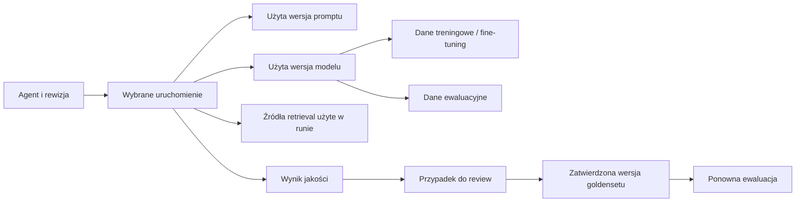

# AIWatcher — audyt UX i równorzędne ścieżki pracy

Data: 14.09.2026. Status: propozycja produktowa do dalszego projektowania; bez zmian w kodzie aplikacji.

## 1. Wniosek

AIWatcher ma wiele potrzebnych mechanizmów, ale użytkownik musi sam połączyć je w proces. Produkt nie ma jednego centralnego obiektu ani obowiązkowego początku pracy. Firma może pracować przede wszystkim nad danymi, anotacją i treningiem; inna nad gotowymi modelami, ewaluacją lub agentami. Najważniejsza zmiana to równorzędny dostęp do tych obszarów i zachowanie kontekstu między powiązanymi obiektami oraz ich wersjami.

Zasada nadrzędna po doprecyzowaniu użytkownika: agent jest jednym z obiektów produktu. Dataset, projekt anotacji, model, trening, ewaluacja i workflow muszą być użyteczne samodzielnie, bez tworzenia agenta. Kolejność działań wynika z zadania; może zaczynać się od znalezienia modelu, pozyskania danych albo oceny istniejącego wyniku.

Priorytetem jest architektura informacji i ciągłość pracy. Obecna spokojna estetyka konsoli, semantyczne kolory, tabele, grafy i wspólne komponenty nadają się do rozwijania.

Uzupełnienie: Weights & Biases jest dodatkowym punktem odniesienia dla projektu. Sekcja 15 doprecyzowuje nawigację globalną/projektową, wspólne filtrowanie tabel i wykresów, porównania oraz wersjonowanie na podstawie obejrzanego Home i oficjalnej dokumentacji W&B Models i Weave.

Główne grupy użytkowników desktopowych to zespoły przygotowujące dane, anotatorzy i reviewerzy, osoby wybierające i trenujące modele, twórcy agentów oraz osoby odpowiedzialne za jakość. Anotacja i review powinny być możliwe bez znajomości SDK. Telefon służy przede wszystkim do sprawdzenia statusu i triage; autorstwo złożonych grafów jest zadaniem desktopowym. Dotychczasowy test interakcji obejmował głównie obserwowalność i ewaluacje; ścieżka dane → anotacja → trening wymaga osobnej weryfikacji interfejsu i kontraktów przed implementacją.

## 2. Zakres i wiarygodność ustaleń

- Przeczytano skill `ui-ux-pro-max`, nawigację, shell, style oraz wybrane ekrany i kontrakty URL: Explore, Metrics, run detail, modele, ewaluacje, review, workflow i data curation.
- Obejrzano historyczne zrzuty Explore, Evaluation, Models i pipeline Titanic. Ich menu różni się od bieżącego kodu; nie stanowią dowodu obecnego układu nawigacji.
- Uruchomiono bieżący frontend Vite oraz istniejący lokalny plik binarny backendu, z pamięciowymi magazynami zdarzeń, workflow i promptów. Nie przebudowywano backendu; zgodność tego pliku z każdym aktualnym endpointem nie została potwierdzona.
- Wprowadzono demonstracyjny run i dwa raporty istniejącymi skryptami do tej tymczasowej instancji. Prześledzono Explore → agent → run → Metrics i ekran Evaluation → Measure.
- Obejrzano aktualny UI przy szerokości desktopowej i Evaluation przy 375 px. To audyt heurystyczny z częściowym sprawdzeniem interakcji, nie pełny audyt WCAG ani badanie z użytkownikami.
- Nie uruchamiano treningu, płatnego modelu, pełnego pipeline dokumentów ani nowej ewaluacji. Dla tych procesów oddzielono istniejące elementy kodu od rekomendowanego doświadczenia.

## 3. Co warto zachować

1. **Stan w URL.** Wybór agenta, runu, spanu, wyszukiwanie i okno czasu są linkowalne. To dobra podstawa powrotu do analizy i współpracy.
2. **Explore jako narzędzie diagnostyczne.** Rozwijane drzewo i szczegóły obok pozwalają zagłębiać się bez gubienia hierarchii.
3. **Wersjonowanie i pochodzenie.** Istnieją wersje promptów i modeli, `DatasetReference` rozwiązuje odnośniki do zachowanych rejestrów, a wyniki ewaluacji mają mechanizmy porównywalności.
4. **Pętla poprawy jakości.** Case review zawiera propozycję, review i publikację zatwierdzonych przypadków jako nowej wersji datasetu. Nie trzeba projektować jej od zera.
5. **Wykonania zarządzane.** Workflows ma launcher oraz kontrolę wykonania; Data Curation ma edycję grafu, preview, uruchamianie, publikację i harmonogram.
6. **Wspólny język wizualny.** Lucide, semantyczne tokeny, jasny/ciemny motyw, widoczny focus i reduced motion są już obecne.

## 4. Najważniejsze problemy

P0 oznacza warunek realizacji danej ścieżki; P1 istotną przeszkodę; P2 późniejsze usprawnienie. Nie jest to klasyfikacja awarii produkcyjnych ani globalna kolejność wdrażania: P0 w ścieżce agentowej nie ma automatycznie pierwszeństwa przed pracą nad danymi lub treningiem.

| Priorytet | Ustalenie i dowód | Skutek | Proponowana zmiana |
|---|---|---|---|
| P0 | Agent jest pivotem Explore; brak dedykowanej trasy agenta w rejestrze tras. Kliknięcie agenta rozwija runy, a prawy panel nadal prosi o wybór runu. | Znalezienie agenta nie daje odpowiedzi: co to za agent, z czym pracuje i czy działa dobrze. | Lista Agents i karta agenta z historią, konfiguracją, jakością oraz powiązaniami. |
| P0 | W UI potwierdzono przejście `explore?by=agent&key=research-agent&run=ux-audit-run&window=3600` → `metrics?window=3600`. Shell przenosi tylko `window`; Metrics już obsługuje `agent_id` i `model`. | Użytkownik otrzymuje metryki szerszego zbioru niż przed chwilą analizował. | Kontekstowe „Metryki tego agenta” z jawnym mapowaniem parametrów; oddzielne wejście do metryk globalnych. |
| P0 | `TimeRange` daje wyłącznie 15m, 1h, 6h, 24h, 7d i all; wspólny schemat opisuje względne `window`. | Brak wygodnego przejścia do poprzedniej godziny/doby, wskazania incydentu i porównania dwóch okresów. | Zakres bezwzględny, strzałki poprzedni/następny okres, porównanie i zamrożenie czasu. |
| P0 | `Feature / Training / Inference` rozdziela dane, prompt/ewaluację i obserwację. | Jedno zadanie wymaga znajomości wewnętrznego podziału produktu. „Feature” nie mówi wprost, gdzie szukać danych. | Stała nawigacja po obiektach i zadaniach; szczegóły dostępne również z karty agenta. |
| P0 | Explore renderuje payload jako podgląd/JSON; jego `MessageRow` nie korzysta z `PromptRefLink`. Inny komponent `EventFeed` taki link ma. | Ścieżka do promptu zależy od ekranu. Model w payloadzie nie daje jednolitego przejścia do konkretnej wersji rejestru. | Wspólny podgląd referencji: agent, prompt, model, dataset, evaluation, execution; wersje i źródło informacji zawsze jawne. |
| P1 | W aktualnym Evaluation karta ma zielone `succeeded` obok pass rate 33,3%. | Sukces wykonania może zostać odczytany jako akceptowalna jakość. | Osobne pola: „Pomiar zakończony” oraz „Wymagania spełnione / niespełnione / nieokreślone”. |
| P1 | Measure pokazuje naraz Scorecard, Measure like, Cohort, Experiment, Evaluation ID, Repetition, Answers i parametry wykonania. Wariant pochodzi z opublikowanego wyniku. | Długi próg wejścia; pierwsza ewaluacja nie ma jasnej ścieżki z karty agenta. | Kreator celu, danych, kryteriów i wykonania; osobna ścieżka pierwszego pomiaru, bez konieczności wcześniejszego raportu. |
| P1 | `WorkflowLauncher` pozwala wybrać zarejestrowany workflow i wpisać Parameters (JSON). Kod prosi o rejestrację z Runtime. Data Curation ma osobny edytor. | „Uruchom workflow” nie oznacza „zbuduj workflow przetwarzania dokumentów”. | Rozdzielić definicje/edycję od wykonań; szablony i formularze parametrów; wspólne wejście do istniejących edytorów. |
| P1 | Case review i publikacja istnieją, ale są ukryte pod ewaluacjami; brak jednej prezentacji procesu live → kolejka → zatwierdzony zestaw → ponowny pomiar. | Użytkownik musi wiedzieć, do którego modułu przejść z problematycznego wpisu. | Akcja „Dodaj do review” przy runie, odpowiedzi i case; kolejka z kontekstem agenta i powodem wyboru. |
| P1 | Przy 375 px nagłówek nakłada elementy, rząd akcji Evaluation wychodzi poza ekran, a na stronie występuje przewijanie poziome. | Część podstawowej nawigacji i akcji jest trudno dostępna. | Jedno menu mobilne, zwijany panel filtrów, podział akcji, szczegóły na osobnym ekranie. |
| P1 | Wersję modelu wybiera `<tr onClick>` bez własnego przycisku/linku wyboru; część filtrów Explore ma tylko placeholder. | Niepełna obsługa klawiaturą i niejasne nazwy pól dla technologii asystujących. | Link w komórce wersji, jawne etykiety, stan wybrania/rozwinięcia i test klawiatury. |
| P2 | Wiele drobnych etykiet 10–12 px, techniczne objaśnienia w głównym UI, mieszane PL/EN w Local views. Blurb Experiments mówi „not built yet”, mimo istniejącego ekranu. | Słabsza czytelność i niepewność, co naprawdę działa. | Spójny język, krótszy tekst operacyjny, szczegóły techniczne na żądanie, aktualizacja opisów. |

## 5. Docelowe menu

Proponuję stały sidebar z rozwijanymi grupami. Modele, anotacja i trening mają własne nazwane wejścia; nie są ukryte w ogólnych „Zasobach”. Grupy organizują menu, ale nie są obowiązkowymi etapami. Wszystkie obszary pozostają dostępne niezależnie od miejsca rozpoczęcia pracy.

| Grupa / pozycja | Widoki i przeznaczenie |
|---|---|
| **Przegląd** | Ostatnia praca, problemy, aktywne zadania i przypięte obiekty różnych typów. Opcjonalny ekran startowy. |
| **Dane / Datasety i źródła** | Wyszukiwanie i import danych, wersje, podgląd rekordów, schemat, jakość, splity, goldensety, eksporty. |
| **Dane / Przygotowanie danych** | Czyszczenie, transformacje, deduplikacja, pipeline, preview i publikacja wersji. |
| **Dane / Anotacja i review** | Projekty, schematy etykiet, kolejki, przypisania, anotacja, rozbieżności i zatwierdzanie. |
| **Modele i jakość / Modele** | Odkrywanie modeli zewnętrznych, porównanie kandydatów oraz rejestr własnych modeli i wersji. |
| **Modele i jakość / Trening** | Nowy trening/fine-tuning, uruchomienia, konfiguracje, krzywe, checkpointy i wyniki. |
| **Modele i jakość / Ewaluacje i eksperymenty** | Definicje pomiarów, wyniki, porównania modeli/agentów/workflow, kryteria i regresje. |
| **Aplikacje / Agenci** | Konfiguracje, wersje, historia i jakość agentów. |
| **Aplikacje / Prompty** | Katalog, wersje, porównania i użycia, również poza agentami. |
| **Aplikacje / Obserwowalność** | Uruchomienia, Live, Explore/Trace, metryki i Query. |
| **Workflow** | Wspólne definicje, szablony, wykonania i harmonogramy dla danych, anotacji, treningu, oceny i aplikacji. |

To proponowane obszary produktu, nie deklaracja, że wszystkie wymienione funkcje już istnieją. Użytkownik może przypiąć widoki i ustawić stronę startową, np. kolejkę anotacji albo treningi. Personalizacja zmienia dostępność skrótów, nie znaczenie nazw ani uprawnienia; nie zamyka firmy w jednym trybie pracy.

Runtime, integracje, uprawnienia i ustawienia instancji umieścić w dolnej sekcji „System”. Runtime jest również wybierany lokalnie tam, gdzie uruchamia się zadanie; konfiguracja systemowa nie powinna być wymagana do zwykłego podglądu raportu.

Górny pasek: kontekst projektu/środowiska tam, gdzie model danych go rzeczywiście wspiera; globalne wyszukiwanie obiektów; akcje użytkownika. Nie tworzyć pozornych filtrów projektu, jeśli backend nie potrafi ograniczyć danych.

⌘K obecnie przeszukuje katalog komend. Docelowo wyniki powinny rozdzielać **obiekty** (dataset, projekt anotacji, model, trening, ewaluacja, agent, prompt, workflow, run) i **akcje** (np. importuj dane, rozpocznij anotację, trening lub ewaluację). Obiekt znajduje się po nazwie i typie, bez znajomości widoku, w którym go zapisano.

Ta rekomendacja realizuje zasadę rozpoznawania dostępnych opcji zamiast wymagania pamiętania, gdzie je ukryto: [NN/g — Recognition and Recall](https://www.nngroup.com/articles/recognition-and-recall/?lm=computer-skill-levels&pt=article).

### Równorzędne ścieżki i strony obiektów

| Zamiar firmy / zespołu | Przykładowy przebieg |
|---|---|
| Przygotować dane do wykorzystania lub przekazania | Źródło → import → profil jakości → czyszczenie → wersja datasetu → eksport/udostępnienie. Trening jest opcjonalny. |
| Przygotować zbiór z anotacjami | Dataset → schemat etykiet → anotacja → review → zatwierdzona wersja → splity/eksport. |
| Znaleźć i dostosować model | Odkrywanie modeli → porównanie kandydatów → zgodność zadania i danych → przygotowanie/anotacja danych → trening → checkpoint → ewaluacja. |
| Wytrenować własny model | Dataset z przypiętą wersją → model/architektura → konfiguracja treningu → wykonanie → checkpointy → ewaluacja → rejestr modelu. |
| Wybrać gotowy model bez treningu | Model → test na własnym zbiorze → porównanie jakości, czasu i kosztu → wybór wersji. |
| Utrzymywać aplikację z agentami | Agent/workflow → uruchomienia → problem → prompt/model/dane → review → ewaluacja → zmiana konfiguracji. |

Każdy typ obiektu ma własną stronę z dopasowanymi zakładkami:

- **Dataset:** dane, schemat, jakość, anotacje, wersje, splity, pochodzenie i użycia. Akcje: przygotuj, anotuj, trenuj, oceniaj, eksportuj.
- **Projekt anotacji:** zadania, narzędzie anotacji, schemat etykiet, postęp, rozbieżności, review i publikacja. Model wspomagający anotację jest opcjonalny i jawnie odróżniony od ludzkiego zatwierdzenia.
- **Model:** zadanie i modalność, pochodzenie, dostępne informacje o licencji i wymaganiach, wersje, dane treningowe, wyniki ewaluacji, treningi i użycia. Katalog rozdziela odkrywanie modeli od lokalnie dostępnych wersji.
- **Trening:** przypięte wejścia, konfiguracja, runtime, postęp i logi, metryki, checkpointy oraz wynikowe modele. Z checkpointu można przejść do ewaluacji bez tworzenia agenta.
- **Ewaluacja:** oceniany obiekt i wersja, dataset/split, kryteria, wykonania, raporty i porównania.
- **Workflow i agent:** własne konfiguracje, historia, wykonania i relacje; nie stanowią rodzica datasetów ani modeli.

Wspólny wzorzec to obiekt → wersja → wejścia/wyjścia → powiązane działania. Nie wymuszać identycznych zakładek dla anotatora i operatora treningu. Linki są dwukierunkowe: dataset pokazuje modele/treningi, które go użyły, a model wskazuje dane, z których powstał. Zmiana obszaru zachowuje referencję źródłową, np. „Trening na dataset@v3”, z możliwością świadomej zmiany wejścia.

Filtry mają zakres właściwy zadaniu: w anotacji status review i schemat etykiet; w katalogu modeli zadanie, modalność i wymagania; w treningu dataset, konfiguracja i runtime; w obserwowalności agent i czas. Nie przenosić mechanicznie wszystkich filtrów między ekranami ani nie wymagać filtra agenta w zadaniach danych.

## 6. Karta agenta — miejsce pracy w ścieżce agentowej

Proponowana trasa: `/agents/:agentId`. To nowa koncepcja, nie istniejący endpoint.

```text
Agenci / document-extractor                         production
Stan: aktywny   Ostatnio widziany: …   Wersja agenta: …

Prompt: extraction@v12   Model: parser@v8   Workflow: invoices@v5
[Podgląd promptu] [Pochodzenie modelu] [Uruchom ewaluację]

Przegląd | Historia | Konfiguracja | Jakość | Dane i powiązania

Zakres: 14 września, 08:00–09:00 Europe/Warsaw
[← Poprzedni] [Następny →] [Porównaj z poprzednim] [Live]
Filtry: Wersja agenta · Status · Wynik jakości · Model · Więcej

Historia: lista uruchomień       Szczegóły wybranego uruchomienia
z datą i zmianami konfiguracji   odpowiedź / trace / metryki / oceny
```

**Przegląd** odpowiada: co agent robi, gdzie działa, co się zmieniło i co wymaga uwagi. Pokazuje błędy, latencję, jakość, koszt i pokrycie ewaluacją, jeśli dane są dostępne. Brak pomiaru to „Nie oceniono”, nie 0%.

**Historia** pokazuje uruchomienia i znaczniki zmian konfiguracji na jednej osi czasu. Domyślnie prezentuje użyteczne wpisy/odpowiedzi; surowe `llm.chunk` i pozostałe zdarzenia pozostają w zakładce diagnostycznej. Treść może nie być rejestrowana — wtedy UI to wyjaśnia i nadal udostępnia metadane oraz trace.

**Konfiguracja** pokazuje prompt, model, parametry generowania, tools, retrieval, runtime i rewizję kodu, o ile są znane. Prompt otwiera się w bocznym podglądzie z wersją i diffem do poprzedniej. Pełny ekran zasobu pozostaje dostępny.

**Jakość** zbiera ostatni porównywalny wynik, trend, kryteria, liczbę przypadków, regresje i link do szczegółów. Werdykt zawsze podaje cel i wersję pomiaru.

**Dane i powiązania** łączą datasety treningowe, ewaluacyjne, źródła retrieval oraz przypadki review. Domyślny widok to podpisana lista relacji; graf lineage jest drugim widokiem do głębszej analizy.

### Trzy różne znaczenia „obecnego”

Nie wolno utożsamiać ostatnio zarejestrowanej wersji z produkcją. UI rozdziela:

- **Przypisane do środowiska** — zadeklarowane wdrożenie lub etykieta, z czasem przypisania.
- **Ostatnio zaobserwowane** — konfiguracja faktycznie użyta w ostatnich runach, z czasem obserwacji.
- **Użyte w tym uruchomieniu** — dokładny snapshot wersji; nie zmienia się podczas przeglądania historii.

Przy routingu wielomodelowym agent pokazuje kilka modeli i warunki/udziały, jeśli są znane. Przy dynamicznym prompcie pokazuje szablon i wersję; rozwiniętą treść tylko wtedy, gdy została zarejestrowana. Brak referencji oznacza „Nie zarejestrowano”, z instrukcją instrumentacji.

## 7. Czas, filtry i powrót do pracy

1. Presety: ostatnie 15 min, 1 h, 24 h, 7 dni; dodatkowo kalendarz od/do, strefa czasowa i przesunięcie o długość bieżącego okresu.
2. Porównanie: poprzedni okres tej samej długości lub jawnie wybrany zakres B. Wynik pokazuje liczebność i pokrycie obu okresów, żeby mniejsza próbka nie wyglądała jak poprawa.
3. Zakres „Live” i zakres historyczny są odrębnymi stanami. Otwarcie szczegółów zatrzymuje automatyczne podążanie; nowe wpisy zwiększają licznik „12 nowych”. Nie przesuwają czytanego wiersza.
4. Widoczne chipy aktywnych filtrów z usunięciem pojedynczego filtra i „Wyczyść filtry”. Zakres globalny i kontekst agenta opisane osobno.
5. Nawigacja wewnątrz agenta zachowuje jego identyfikator, środowisko oraz czas. Przejście przez globalne menu może otwierać cały katalog, lecz zakres musi być jasno nazwany.
6. Link incydentu zapisuje stałe `from/to`; „obserwuj ostatnią godzinę” zapisuje zakres względny. Powrót przywraca filtry, zaznaczenie i pozycję listy.
7. Utrata danych przez retencję, brak danych dla filtrów i błąd pobrania wymagają różnych komunikatów. Zapisany widok nie przechowuje historii; obecne ostrzeżenie Local views warto zachować w skróconej formie.

Obsługa bezwzględnego zakresu wymaga sprawdzenia i prawdopodobnie rozszerzenia API oraz przechowywania historii; nie jest tylko zmianą kontrolki React. Nie obiecywać okresów, których read model nie zachowuje.

## 8. Agent → prompt → model → dane



Każda relacja powinna mieć nazwę roli, nie tylko identyfikator datasetu. „Wytrenowano na”, „oceniono na” i „pobrano kontekst z” odpowiadają na inne pytania.

Rejestr modeli już pokazuje dataset i ma `DatasetReference`; wykorzystać ten mechanizm. Rozszerzenia wymagają m.in. modele zewnętrzne, wiele zbiorów oraz relacje do konkretnych ocen. Nazwa modelu w zdarzeniu nie wystarcza do pewnego przypisania do zarejestrowanej wersji. Dla modeli API bez ujawnionych danych treningowych podawać „Dane treningowe niedostępne od dostawcy”, a znane lokalne dane retrieval/ewaluacji pokazywać osobno.

## 9. Ewaluacja agenta i modelu

**Agent:** wynik zadania od wejścia do wyjścia, użycie narzędzi, poprawność retrieval, format odpowiedzi, koszt i opóźnienie. **Model:** konkretny model/wersja na wskazanym zadaniu i wejściu. Dobra ocena samego modelu nie dowodzi poprawności całego workflow.

Kreator uruchamiany z kontekstu:

1. **Co oceniasz?** Agent, model albo workflow; wersja i środowisko wypełnione z miejsca wejścia. Baseline opcjonalny i jawny.
2. **Na jakich danych?** Przypięta wersja datasetu/goldensetu, split, liczba przypadków. Widoczna informacja, czy to pełny zbiór, pierwsze N przypadków czy próbka.
3. **Co oznacza dobry wynik?** Kryteria z istniejących scorecards, progi i kierunek poprawy. Użytkownik może zobaczyć przykład oceny konkretnego przypadku.
4. **Jak wykonać?** Nagrane odpowiedzi albo generowanie na workerze; runtime, dostępność zadania, wersja wykonawcza, limit czasu i koszty, gdy można je oszacować.
5. **Sprawdź i uruchom.** Krótkie podsumowanie celu, danych, scorera/judge, baseline i wymaganych uprawnień. Zapis konfiguracji oraz start pozostają semantycznie odrębne, nawet jeśli interfejs prowadzi przez nie jednym procesem.

„Evaluation runtime” trzeba doprecyzować w produkcie: **runtime wykonujący agenta**, **worker wykonujący pomiar** i **scorer/judge oceniający odpowiedź** są różnymi rolami. Wybór istniejącego runtime powinien być prosty. Dodanie nowego prowadzi przez typ wykonawcy, połączenie/konfigurację, test dostępności i rejestrację możliwości; następnie wraca do rozpoczętego kreatora bez utraty danych.

Wynik: u góry decyzja i jej przyczyna; następnie metryki i delta do porównywalnego baseline; potem regresje i przypadki. „Nieporównywalne” wyjaśnia konkretną różnicę: dane, split, kryteria albo konfiguracja oceny. Asynchroniczna ocena ma status oczekiwania niezależny od statusu zakończonego runu.

## 10. Goldenset i real-time curation

Istniejące review i wersjonowanie datasetów stanowią podstawę. Goldenset proponuję jako **zatwierdzoną, wersjonowaną rolę datasetu** z dodatkowymi zasadami jakości; nie trzeba od razu budować kolejnego niezależnego magazynu.

Docelowa pętla:

```text
Live / run / raport
→ Dodaj do review z kontekstem i powodem
→ Kolejka kandydatów
→ Popraw oczekiwaną odpowiedź / etykietę
→ Review i rozstrzygnięcie
→ Publikacja nowej wersji goldensetu
→ Ewaluacja wybranej wersji agenta i baseline
→ Regresje / poprawa / decyzja o wdrożeniu
```

Kandydaci mogą trafiać do kolejki z reguł: nieudane zadanie, negatywny feedback, rozbieżność ocen, zmiana rozkładu albo kontrolowana próbka. UI pokazuje regułę, źródło, wersję agenta, priorytet i właściciela; deduplikuje powtórzenia oraz umożliwia operacje zbiorcze.

Przy review: wejście, odpowiedź agenta, oczekiwany wynik, uzasadnienie, źródła i porównanie wariantów. Przy dokumentach również oryginalna strona/fragment oraz wskazanie pola.

Automatyczny dopływ zmienia kolejkę kandydatów. Opublikowany goldenset pozostaje niezmienny; nowe zatwierdzenia tworzą kolejną wersję. Pokazać pokrycie kategorii i splitów, konflikt anotacji oraz źródło przypadku. Zbiory użyte do uczenia/iteracji i końcowej niezależnej oceny muszą być rozróżnione, aby wyniki nie sugerowały niezależności, której już nie ma.

„Real time” wymaga również widoku opóźnienia przetwarzania, ostatniego odebranego wpisu i błędów reguł. Sam napis Live lub odświeżanie tabeli nie daje pełnego procesu curation.

## 11. Workflow dokumentów

Wejście: **Workflow → Nowy → Przetwarzanie dokumentów**. Użytkownik najpierw wskazuje cel i przykładowe dane. Następnie dostaje edytowalny szablon:

```text
Dokumenty → Parse/OCR → Podział/normalizacja → Ekstrakcja agentem
          → Walidacja pól → Ewaluacja → Warunek jakości → Publikacja
                                                   ↘ Review człowieka
```

Każdy krok ma nazwę operacji, stan i podgląd wejścia/wyjścia. Szczegóły runtime, silnika i kodu są w inspektorze. Obecne biblioteki i edytory Data Curation warto wykorzystać, zamiast utrzymywać dwa podobne canvasy bez wspólnego języka.

Trzy tryby: **Edytuj**, **Przetestuj próbkę**, **Uruchom i obserwuj**. Parametry formularza wynikają ze schematu kroku; JSON jest opcją zaawansowaną. Różnica między preview, pełnym wykonaniem i publikacją wyniku musi być widoczna przed akcją.

Dodanie kroku „Ewaluacja” wybiera cel, scorecard, mapowanie pól, źródło oczekiwanego wyniku, scorer i worker. Użytkownik wskazuje, czy jest to:

- **Bramka przed publikacją:** zatrzymuje/zwraca do review wynik poniżej progu; pokazuje wpływ na czas i koszt.
- **Ocena w tle:** publikuje ocenę po wykonaniu, bez blokowania ścieżki użytkownika.

Nie każdy dokument produkcyjny ma odpowiedź wzorcową. Walidacja schematu, ocena regułami/judge i ewaluacja na goldensecie muszą mieć odrębne etykiety. Próbka z goldensetu służy testowi offline; ocena online opisuje tylko kryteria, które rzeczywiście można sprawdzić.

Definicja workflow ma własną rewizję. Run przypina definicję, konfigurację kroków, prompt i model. Edycja grafu tworzy nową rewizję; nie przepisuje historii wykonania. Panel pokazuje retry, timeout, błędy pojedynczych dokumentów, oczekiwanie na człowieka i pochodzenie wyniku.

## 12. Wygląd i interakcje

- Zachować obecny kierunek konsoli danych: neutralne powierzchnie, niebieski akcent akcji, kolory statusów zawsze z tekstem. Nie wprowadzać dekoracyjnych kart kosztem historii i filtrów.
- Uporządkować pionową hierarchię: tytuł i kontekst → najważniejszy stan → filtry → treść → szczegóły. Na Evaluation formularz zapisywania widoku i informacje o retencji nie powinny konkurować z wynikiem.
- Ujednolicić 14–16 px dla głównego UI i 12–13 px dla pomocniczych metadanych. Monospace dla ID, kodu i wartości wymagających porównania znak po znaku. To rekomendacja czytelności, nie stwierdzenie o naruszeniu WCAG na podstawie samego rozmiaru fontu.
- Podsumowanie/kontekst zostaje nad listą, a inspektor otwiera się z boku; na małym ekranie jest pełnym widokiem z przewidywalnym „Wróć”. Ruch ma sygnalizować otwarcie, przybycie danych lub zmianę stanu, bez przesuwania czytanego wiersza.
- Jeden język interfejsu; słownik nazw wyjaśnia „run”, „runtime”, „scorecard” i „goldenset”. Zamiast opisów transportu i projektora — krótka odpowiedź, co użytkownik może tutaj zrobić.
- Focus, etykiety pól, stan wybrania i klawiatura są częścią komponentu. Dla webu WCAG 2.2 AA mówi o minimum 24×24 CSS px lub dopuszczonych wyjątkach/odstępach; 44×44 to użyteczny większy cel dla dotyku, nie uniwersalny wymóg AA. [W3C — Target Size](https://www.w3.org/WAI/WCAG22/Understanding/target-size-minimum)
- Kontrast tekstu i wykresów wymaga pomiaru obu motywów. Ten audyt nie deklaruje zgodności całego produktu ani nie wyprowadza niezgodności wyłącznie z ciemnego wyglądu. [W3C — WCAG 2.2](https://www.w3.org/TR/WCAG22/)

Zastosowanie skilla: trafne lokalne dopasowanie `style: data-dense-dashboard` i reguły nawigacji/focus. Automatyczny `--design-system` zawierał nietrafny marketingowy „Enterprise Gateway”; ten fragment odrzucono i nie zapisano jako design system. Wyszukiwanie React `URL state filters` zwróciło ogólne hooks, więc nie stanowi podstawy kontraktu nawigacji; ten wynika z kodu TanStack Router i opisanych scenariuszy produktu.

## 13. Kolejność prac i kryteria odbioru

### Etap A — równorzędna nawigacja i zachowanie kontekstu

Nawigacja po danych, anotacjach, modelach, treningach, ewaluacjach i aplikacjach; wspólne referencje do wersji, czytelne filtry, poprawki mobilne i klawiatura. Strony obiektów rozwijać według potrzeb wybranych scenariuszy, bez obowiązkowego wdrożenia karty agenta jako pierwszej funkcji. Dla ścieżki agentowej ustalić źródło tożsamości i rewizji; dla danych/treningu zweryfikować przypinanie datasetu, schematu anotacji, modelu i checkpointu. Backend czasu/retencji ocenić osobno.

Kryteria:

- Dane, anotacja, modele i trening mają bezpośrednie wejścia i działają bez zarejestrowanego agenta.
- Dataset → anotacja/trening/ewaluacja przenosi właściwą wersję danych; model → ewaluacja przenosi wersję modelu.
- Wyszukiwanie i powrót do zadania obsługują obiekty każdego z tych obszarów.
- Wyszukanie agenta prowadzi do jego podsumowania, także gdy nie ma runów w bieżącym okresie.
- Agent → Metrics zachowuje identyfikator; wejście globalne jasno mówi, że obejmuje wszystkich agentów.
- Użyty prompt/model można otworzyć bez ręcznego przepisywania ID, jeśli istnieje jednoznaczna referencja; brak mapowania jest wyjaśniony.
- Run historyczny pokazuje historyczną konfigurację, a nie bieżące aliasy.
- Wstecz i odświeżenie przywracają kontekst. Na 375 px podstawowe menu i filtry nie wymagają przewijania całej strony w poziomie.

### Etap B — kompletne ścieżki danych, modeli i jakości

Przygotowanie danych → anotacja/review → wersja → wybór modelu → trening → ewaluacja oraz niezależna ścieżka model → ewaluacja bez treningu. Równolegle jako zakres produktowy: ewaluacje z kontekstu agenta, pierwsza ewaluacja, rozdzielenie sukcesu wykonania i jakości, publikacja goldensetu i ponowne porównanie. Wybór kolejności wdrażania wymaga priorytetów docelowych firm; obecny audyt nie zakłada przewagi ścieżki agentowej.

Kryteria:

- Pierwszy pomiar da się skonfigurować bez wcześniejszego opublikowanego raportu i ręcznego manifestu.
- Użytkownik może zakończyć pracę na zatwierdzonym/wyeksportowanym datasecie, bez treningu ani agenta.
- Trening zachowuje wersję danych i konfiguracji; checkpoint otwiera ewaluację i rejestrację modelu bez przechodzenia przez agentów.
- Odkryty model można ocenić na własnych danych; brak zgodności schematu lub możliwości wykonania wskazuje konkretny krok do uzupełnienia.
- Porównanie wskazuje wersje danych i kryteriów; odrzuca nieporównywalne wyniki z czytelną przyczyną.
- Przypadek dodany z runu zachowuje źródło i snapshot konfiguracji.
- Dopływ kandydatów nie zmienia opublikowanego goldensetu; można odtworzyć dane poprzedniego raportu w granicach retencji.
- Brak workera, scorera lub uprawnień jest widoczny przed uruchomieniem, ze wskazaną drogą rozwiązania.

### Etap C — autorstwo workflow i ciągłe doskonalenie

Szablon dokumentów, formularze kroków, dodawanie ewaluacji, zarządzanie runtime, harmonogramy i reguły live curation. Następnie alerty regresji, analiza zmian jakości, budżety, porównanie wdrożeń i zespołowa obsługa review.

Kryteria:

- Z przykładowego dokumentu można zbudować, przetestować i zapisać workflow bez edycji JSON.
- Kliknięcie kroku pokazuje wejście, wyjście i ocenę; błąd wskazuje dokument i miejsce naprawy.
- Ocena w tle i bramka jakości mają rozróżnialny wpływ na wynik wykonania.
- Ponowne uruchomienie starej rewizji nie korzysta po cichu z najnowszego promptu/modelu.

Test użyteczności po prototypie obejmuje oddzielnie zespoły danych/anotacji, treningu/modeli i aplikacji. Zadania: „przygotuj i wyeksportuj dataset”, „zaanotuj i zatwierdź próbkę”, „znajdź model pasujący do danych”, „uruchom trening na konkretnej wersji”, „oceń checkpoint”, „znajdź obecny prompt”, „porównaj poprzednią godzinę”, „wskaż dane użyte do modelu”, „wyjaśnij regresję”, „dodaj przypadek do goldensetu”, „dodaj ocenę do workflow dokumentów”. Mierzyć ukończenie bez podpowiedzi, czas, cofnięcia i błędne wnioski o jakości osobno dla każdej grupy. To plan weryfikacji, nie wyniki przeprowadzonego badania.

## 14. Mapa do obecnego kodu

Ścieżki względem katalogu repozytorium:

| Obszar | Źródło |
|---|---|
| Menu i zachowanie filtrów | `apps/panel/src/app/navigation.ts`, `apps/panel/src/app/shell.tsx` |
| Komendy globalne | `apps/panel/src/app/commands.ts`, `apps/panel/src/app/command-panel.tsx` |
| Agent jako pivot i payload | `apps/panel/src/features/observability/screens/explore/page.tsx`, `search.ts` |
| Metryki z filtrem agenta/modelu | `apps/panel/src/features/observability/screens/metrics/page.tsx`, `search.ts` |
| Czas | `apps/panel/src/shared/components/time-range.tsx` |
| Linki do zasobów | `apps/panel/src/shared/components/lineage-reference.tsx`, `prompt-bits.tsx`, `features/observability/components/event-feed.tsx` |
| Rejestr modeli | `apps/panel/src/features/training/screens/models/page.tsx` |
| Ewaluacje i pierwsze uruchomienie | `apps/panel/src/features/evaluation/screens/overview/page.tsx`, `measure.tsx`, `search.ts` |
| Przypadki i publikacja | `apps/panel/src/features/evaluation/screens/overview/reviews.tsx` |
| Wykonania workflow | `apps/panel/src/features/workflows/components/managed-workflow.tsx`, `screens/overview/page.tsx` |
| Edytor curation | `apps/panel/src/features/data-curation/screens/pipeline/page.tsx` |
| Tokeny i motywy | `apps/panel/src/styles.css` |

Do rozstrzygnięcia przed implementacją nowych kontraktów: trwała tożsamość agenta i jego rewizji; źródło prawdy o wdrożeniu; zakres archiwizacji historii; relacje do modeli zewnętrznych; obsługiwane runtime i sposób rejestracji; zakres multi-project oraz środowisk. Te braki nie blokują poprawy obecnych linków, etykiet, hierarchii informacji i dostępności.

## 15. Inspiracja Weights & Biases — konkretne zastosowanie

Dodano na prośbę użytkownika 14.09.2026. Bezpośrednio obejrzano [W&B Home](https://wandb.ai/home) w przeglądarce: stały sidebar, wyszukiwanie projektów, zasoby globalne, tabelę ostatniej aktywności i jej zakres. Pozostałe wzorce zweryfikowano w oficjalnej dokumentacji. Nie wykonywano zmian na koncie W&B ani nie testowano tam uruchamiania ewaluacji. Nazwy projektów i dane konta nie są potrzebne do tej analizy i nie są tutaj kopiowane.

### A. Hierarchia nawigacji: globalnie → projekt → wybrany obiekt → wersja/wykonanie

Home W&B pomaga wrócić do projektu lub ostatniej aktywności. Wewnątrz projektu dokumentacja opisuje osobne widoki Workspace, Runs, Reports i Artifacts; filtrowanie runów wpływa na widoczne wykresy. [W&B — Projects](https://docs.wandb.ai/models/track/project-page)

**Doprecyzowanie sekcji 5:** grupy obszarów tworzą menu pracy wewnątrz projektu. Projekt jest zakresem organizacyjnym, nie narzuconym centrum procesu. Poziom globalny służy wyborowi projektu, powrotowi do ostatnich obiektów, przeglądowi problemów i wejściu do zasobów współdzielonych. W instalacji jednoprojektowej można pominąć ekran wyboru; nie dodawać pustej warstwy nawigacji.

Docelowy układ AIWatchera:

```text
Globalnie: projekty · ostatnia aktywność · zasoby wspólne · system
  Projekt: dane · anotacja · modele · trening · ewaluacje · aplikacje · workflow
    Wybrany obiekt: dataset / projekt anotacji / model / trening / agent / …
      Wersja / wykonanie / case: szczegóły z powrotem do kontekstu zadania
```

Projekt w breadcrumbs i filtrach musi oznaczać rzeczywisty zakres danych i uprawnień. Rejestr współdzielony może otworzyć się z datasetu, treningu, agenta lub innego obiektu, ale powinien pokazać, że użytkownik ogląda zasób szerszy niż projekt. Powrót odtwarza źródłowe zadanie, jego zaznaczenie i właściwe filtry.

### B. Jedna tabela robocza, ten sam zakres na wykresach

W&B daje filtrowanie, sortowanie, grupowanie oraz konfigurację kolumn i powiązanie selekcji runów z wizualizacjami. [W&B — Workspace i Runs](https://docs.wandb.ai/models/track/project-page)

**Adaptacja:** widoki treningów, ewaluacji i historii agenta mają tabelę wykonań oraz dopasowane wykresy. Filtr datasetu, modelu, konfiguracji lub statusu zmienia oba widoki. Każdy wykres pokazuje liczbę uwzględnionych wykonań; dodatkowe lokalne ograniczenie wykresu musi być widoczne. Zaznaczenie dwóch wersji otwiera porównanie, bez ponownego wyszukiwania ich w innym module.

Domyślne kolumny dopasować do obszaru: dla treningu dataset, model, konfiguracja, postęp i metryki; dla anotacji postęp, status review i rozbieżności; dla agenta czas, status wykonania, jakość, wersja, model, latencja i koszt. Dalsze kolumny przez „Kolumny”. Osobne kontrolki „Grupuj” i „Filtry”, z czytelnymi aktywnymi wartościami. Zachować zapisane widoki; późniejszy wariant zespołowy wymaga trwałego zapisu i uprawnień, a nie samego localStorage.

### C. Trace jako punkt wejścia do poprawy

Weave łączy śledzenie wejść/wyjść i wywołań z wersjami, feedbackiem i ocenami produkcji. [W&B — What is Weave?](https://docs.wandb.ai/weave/concepts/what-is-weave)

**Adaptacja:** szczegóły runu mają zakładki „Wejście i wynik”, „Trace”, „Konfiguracja”, „Oceny”, „Feedback”. Przy odpowiedzi znajdują się „Dodaj do review”, „Porównaj wariant” i „Przetestuj zmianę”. Wszystkie zachowują identyfikator runu, spanu oraz faktycznie użyte wersje. W nagłówku pierwszeństwo mają wynik zadania i jakość; surowe zdarzenia są dostępne głębiej.

### D. Porównywanie przypadków obok siebie

Evaluation Playground pozwala dobrać dataset, modele i scorery oraz obejrzeć wyniki per przykład: wejście, oczekiwaną odpowiedź, odpowiedzi modeli i oceny. [W&B — Evaluation Playground](https://docs.wandb.ai/weave/guides/tools/evaluation_playground)

**Adaptacja:** ekran porównania zaczyna się od podsumowania wariantów A/B, następnie pokazuje tabelę przypadków z odpowiedziami obok siebie. Filtry: regresje, poprawy, rozbieżności, brak oceny. Kliknięcie przypadku otwiera oba trace’y i różnicę konfiguracji. Przy dokumentach porównanie obejmuje pola oraz wspólny podgląd strony źródłowej.

W karcie agenta można otworzyć prosty Playground: wariant bazowy i kandydat, zmiana promptu/modelu, kilka wybranych przykładów, następnie pełna ewaluacja. Wynik takiej próby należy oznaczyć jako eksperymentalny; nie jest automatycznie dowodem jakości produkcyjnej ani zmianą wdrożenia.

### E. Ewaluacja jako definicja wielokrotnego użytku

W Weave obiekt Evaluation opisuje dane i scorery, a uruchomienie mierzy wskazany model lub funkcję aplikacji. [W&B — Evaluations overview](https://docs.wandb.ai/weave/guides/core-types/evaluations)

**Adaptacja:** nazwana konfiguracja pomiaru, np. „Ekstrakcja faktur — regresja”, wskazuje przypięte dane, kryteria i ustawienia. Użytkownik wybiera model, checkpoint, agenta lub workflow odpowiedniego typu i uruchamia tę konfigurację. W UI rozdzielić definicję oceny, jej wykonanie i raport. Wersja scorera/judge jest tak samo istotna jak wersja modelu; zmiana oceniającego musi być widoczna w porównaniu.

### F. Wersjonowane artefakty i czytelne pochodzenie

W&B Artifacts służy wersjonowaniu zasobów i śledzeniu ich pochodzenia. [W&B — Artifacts](https://docs.wandb.ai/models/artifacts)

**Adaptacja:** jednolity komponent odnośnika do wersji promptu, modelu, datasetu, goldensetu, scorera i workflow. Szczegóły modelu pokazują „Powstał z” oraz „Używany przez”; analogiczne relacje są dostępne po drugiej stronie. Aliasy typu production są etykietami obok niezmiennej wersji. Przeniesienie aliasu nie zmienia referencji w starym runie.

Graf lineage uzupełnia podpisane relacje, ale ich nie zastępuje. Użytkownik najpierw otrzymuje odpowiedź „model wytrenowany na dataset@wersja”, a dopiero potem może rozwinąć pełny graf.

### G. Wspólne kryteria offline i online

Weave opisuje wykorzystanie scorerów zarówno do ewaluacji, jak i monitorowania produkcji oraz zbieranie feedbacku do tworzenia lepszych przypadków testowych. [W&B — What is Weave?](https://docs.wandb.ai/weave/concepts/what-is-weave)

**Adaptacja:** konfiguracja kryteriów może zostać użyta przy pomiarze goldensetu i w regule live curation, jeśli dostępne dane pozwalają obliczyć daną ocenę. UI pokazuje pokrycie, sampling, opóźnienie i błędy oceniania. Case wybrany z produkcji trafia do kolejki review. Zamrożona wersja goldensetu zmienia się dopiero przy publikacji kolejnej wersji.

### H. Kierunek wizualny i priorytety po tej inspiracji

Z obejrzanego Home warto zaczerpnąć stały sidebar z czytelnymi grupami, wyszukiwanie blisko listy, przewagę tabel nad kafelkami oraz spokojne statusy. W AIWatcherze zachować istniejące motywy i semantyczne tokeny; zwiększyć czytelność treści i siłę hierarchii. Zasoby techniczne mają nazwę przyjazną użytkownikowi, wersję i krótki opis, a pełny identyfikator można skopiować.

Kolejność implementacji z sekcji 13 pozostaje aktualna. W etapie A dodać synchronizację tabeli i wykresów oraz kontekst projektu tam, gdzie backend go wspiera. W etapie B uwzględnić porównanie per case i zapisane konfiguracje pomiaru. Playground oraz widoki zespołowe można dodać po działającym przepływie referencji i wersji. Edytor dokumentowego workflow pozostaje własnym wymaganiem AIWatchera; nie został zweryfikowany jako wzorzec W&B w tym przeglądzie.

Kryteria dodatkowe: ten sam filtr ogranicza tabelę i jej wykresy; otwarcie modelu z historycznego runu wybiera dokładną wersję; porównanie przypadku daje dostęp do obu odpowiedzi i konfiguracji; praca w Playground nie zmienia konfiguracji produkcyjnej; powrót z zasobu współdzielonego przywraca obiekt źródłowy i kontekst zadania. Firma skupiona wyłącznie na danych, anotacji i treningu nie musi przechodzić przez agentów na żadnym etapie.


## 15. Realizacja i konto użytkownika — aktualizacja 14.09.2026

[Plan migracji UX](ux-migration-plan-2026-09-14.md) jest rejestrem etapów i kryteriów odbioru. Podstawą pozostają równorzędne obszary pracy: firma może zaczynać od przygotowania danych i kończyć na ewaluacji modelu, bez agenta.

Górny pasek zawiera globalne wyszukiwanie nawigacyjne, wygląd i konto. Profil prezentuje faktyczną sesję oraz grupy SSO jako dane tylko do odczytu. Docelowo dojdą organizacja i projekt; samo dodanie selektora nie realizuje izolacji danych. Authentik odpowiada za tożsamość, a AIWatcher za członkostwa, zespoły, zaproszenia i ograniczone czasowo uprawnienia projektowe. Obecna implementacja profilu nie deklaruje tych przyszłych uprawnień jako działających.

Zestawienie z oceną audytu potwierdziło błędy publikacji próbki, mianownika skuteczności, paginacji Runs, zmiennego celu komend workflow i przywracania zaakceptowanej rewizji zamiast zapisanego szkicu. Nie potwierdzono uogólnień o braku wszystkich potwierdzeń zapisu i filtra review; skorygowano je w dokumencie oceny.
