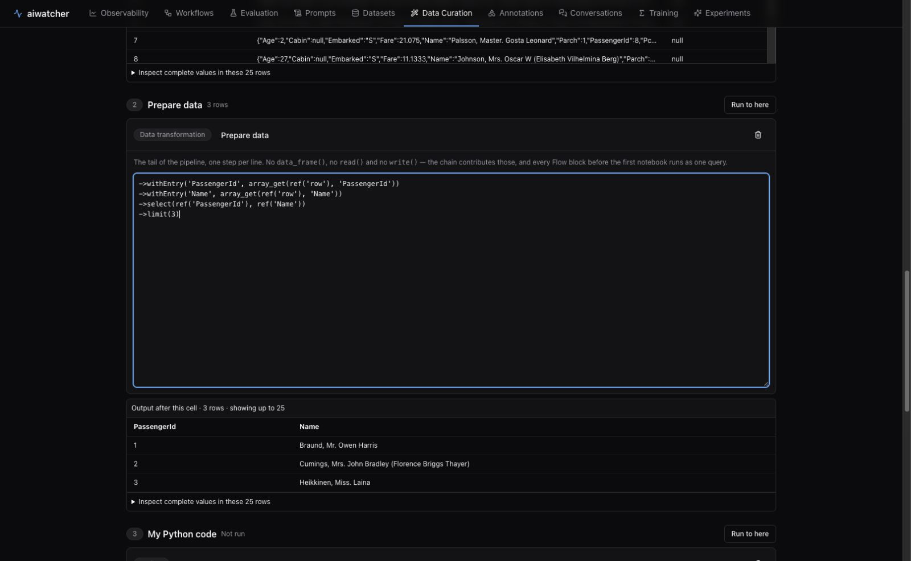
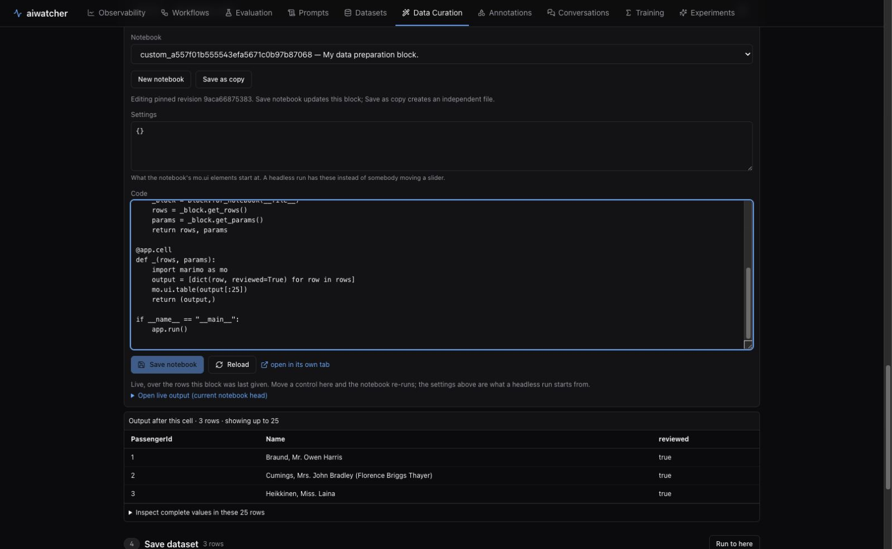
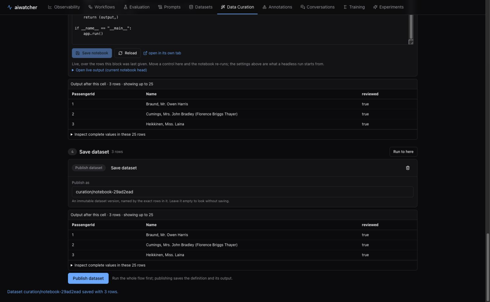
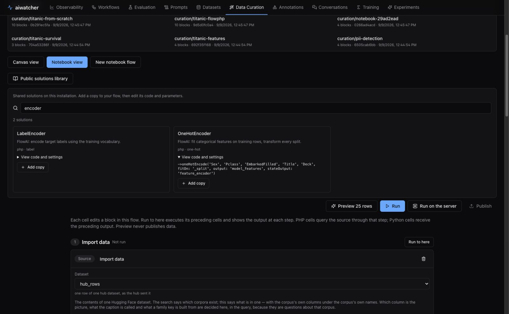
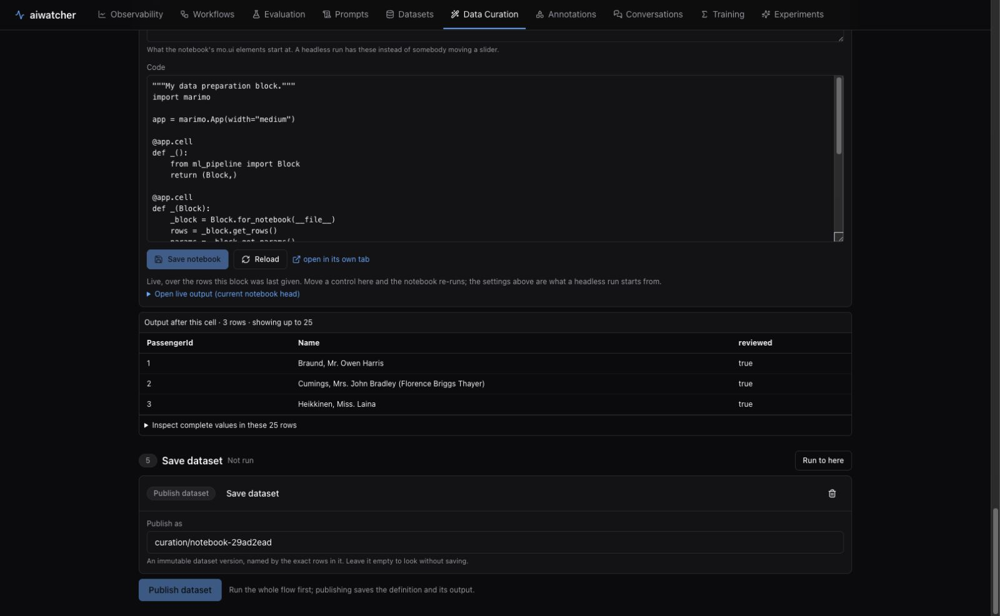
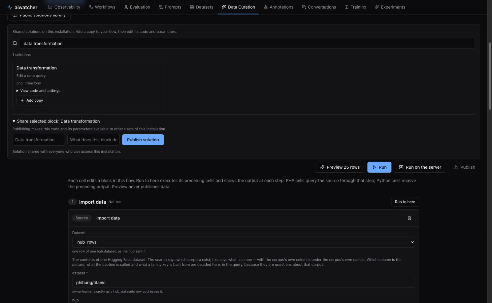

# Własny notebook: od importu danych do zapisu

W **Data Curation → Pipeline** przełącz **Notebook view**, aby zobaczyć istniejący
flow jako kolejne komórki. **New notebook flow** tworzy nowy flow z importem,
przygotowaniem PHP, niezależnym plikiem Python i zapisem datasetu.
Canvas i notebook edytują tę samą definicję; zapis oraz import/export `.flow.json`
działają w obu widokach. Widok notebooka jest dostępny dla połączonego łańcucha.

Poniższe zrzuty pokazują rzeczywisty test: import 12 pasażerów Titanica,
ograniczenie wyniku do 3 rekordów w PHP, własną transformację Python i publikację.

## 1. Import i przygotowanie danych

W pierwszej komórce wybierz źródło i jego parametry. W przykładzie jest to
`hub_rows`, dataset `phihung/titanic`, split `train`, limit `12`.
Komórka pokazuje również generowany kod `read(...)`.

W **Prepare data** edytuj kod PHP:

```php
->withEntry('PassengerId', array_get(ref('row'), 'PassengerId'))
->withEntry('Name', array_get(ref('row'), 'Name'))
->select(ref('PassengerId'), ref('Name'))
->limit(3)
```

**Run to here** uruchamia komórki od źródła do wybranego miejsca. Wynik poniżej
każdej komórki pochodzi z tego konkretnego kroku: import ma 12 rekordów, PHP ma
3, a Python jeszcze nie został wykonany. Można dodać dalsze bloki z palety.
Nowy blok PHP trafia przed pierwszy Python, a nowy Python przed zapis.



## 2. Własny kod Python

Nowa komórka Python zawiera działający szablon, który otrzymuje `rows` i `params`
od poprzedniego bloku. Zmień transformację, pozostawiając wynik w `output`:

```python
output = [dict(row, reviewed=True) for row in rows]
```

**Save notebook** zapisuje kod i aktualizuje przypiętą rewizję tej komórki.
**Save as copy** zapisuje aktualny kod pod nową, niezależną nazwą i przełącza
komórkę na kopię. **New notebook** tworzy pusty szablon; przycisk **Python code**
w palecie dodaje nowy blok z własnym plikiem.

Niezapisany kod trzeba zapisać lub odrzucić przez **Discard code edits**, zanim
uruchomi się flow, zmieni widok lub wykona eksport. Przy otwieraniu zapisanego
flow edytor pokazuje dokładnie przypiętą rewizję. Sam zapis flow jej nie zamienia
na nowszy kod wspólnego pliku. Opcjonalny **Open live output** pokazuje bieżący
plik notebooka, który może być nowszy od przypiętej rewizji; tabela komórki
zawsze dotyczy zakończonego wykonania.



## 3. Uruchomienie i zapis

**Preview 25 rows** sprawdza cały notebook na małej próbce. **Run** przetwarza
pełny zakres wybranego źródła. Komórki pokazują liczbę zwróconych rekordów,
maksymalnie 25 wierszy podglądu oraz wydrukowane raporty. Rozwinięcie
**Inspect complete values** pokazuje pełne wartości z tych 25 wierszy.

W komórce **Save dataset** ustaw nazwę docelową. Po wykonaniu całego flow kliknij
**Publish dataset**. Ta akcja zapisuje definicję flow oraz wersję datasetu;
podgląd i samo **Run** nie publikują danych. Test ze zrzutu zakończył się
publikacją 3 rekordów z `PassengerId`, `Name` i `reviewed`.

**Save** zachowuje definicję do dalszej pracy, a **Export flow with code**
przenosi bloki, parametry, układ i źródła PHP/Python do pliku `.flow.json`.
Po odświeżeniu strony lub zmianie kodu wykonaj komórki ponownie: wyniki podglądu
nie są częścią zapisanej definicji. Zmiana kodu, parametrów, połączeń lub zakresu
czasu usuwa poprzednie wyniki i blokuje ich publikację.



Podgląd komórek PHP wykonuje kolejne zapytania od źródła do danego kroku, aby
zachować semantykę agregacji i dopasowania FlowAI. Przy dużym flow oznacza to
więcej odczytów źródła niż zwykłe wykonanie z canvasu. Odczyty nie są wspólnym
snapshotem zmiennego źródła. Python wykonuje się kolejno nad wynikiem ostatniego
bloku PHP. Błąd zatrzymuje dalsze komórki i pozostawia wyniki wcześniejszych.

[Wróć do pełnego przykładu Titanica](WALKTHROUGH.md).

## Biblioteka rozwiązań

Otwórz **Public solutions library**. Wpisz np. `encoder`: serwer wyszukuje
rozwiązania po tytule, opisie, tagach i rodzaju bloku. **View code and settings**
pokazuje kod PHP lub parametry; **Python source** pobiera przypiętą wersję kodu Python.
Katalog pochodzi z API i seeda, nie z listy w kodzie panelu.



Wybierz **Add copy**. Klocek trafia do flow i można go edytować w **Notebook view**.
Notebook Python dostaje własny plik. W teście poniżej kopia `Python code`
przetworzyła trzy wiersze otrzymane z poprzedniej komórki. **Run to here**
pokazuje wynik po dodanym kroku.



W **Canvas view** można wybrać klocek, otworzyć bibliotekę i rozwinąć
**Share selected block**. Po wpisaniu opisu **Publish solution** udostępnia
rozwiązanie innym użytkownikom tej instalacji. Zapis wymaga roli edytora;
zwykłe **Add copy** nie publikuje żadnych zmian.


