# Titanic step by step: FlowPHP + FlowAI

This variant prepares data in PHP. FlowAI provides data splitting, missing-value
imputation, and encoders. Python handles visualization and Random Forest training.
Ready-to-import file: [titanic-php.flow.json](titanic-php.flow.json).
Setup and execution from scratch: [README](README.md#recommended-flowphp--flowai).
You can also open all blocks as cells: [notebook view and custom code](NOTEBOOK.md).

Below are actual panel screenshots from September 9, 2026. Each step shows the
configuration of a specific block. The table on the left shows the **final output
of the entire flow**, not the intermediate output of the selected block. PHP blocks
run together as a single query; their counters refer to that shared execution.
The source and import screenshots were taken before execution; the remaining
screenshots were taken after processing 891 records.

## 0. Import the example

Open **Data Curation → Pipeline → Import flow** and select
`examples/titanic/titanic-php.flow.json`. A draft named `curation/titanic-flowphp`
appears with 10 blocks, 9 connections, PHP transformation code, and two Python sources.
Import verifies source checksums. It does not run the code.
Alternatively, select **curation/titanic-flowphp** from **Saved pipelines**.

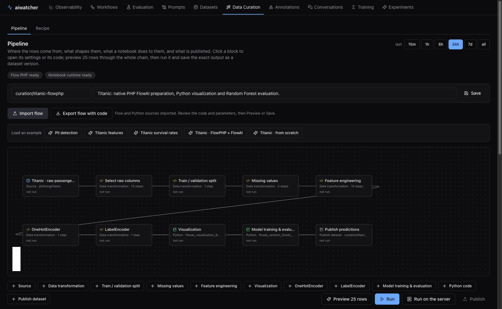

## 1. Source — raw passenger data

Click **Titanic · raw passengers**. Set the dataset to `hub_rows`, source to
`phihung/titanic`, split to `train`, and limit to `891`. The service fetches
successive pages of up to 100 records. The output passenger fields are nested in `row`.

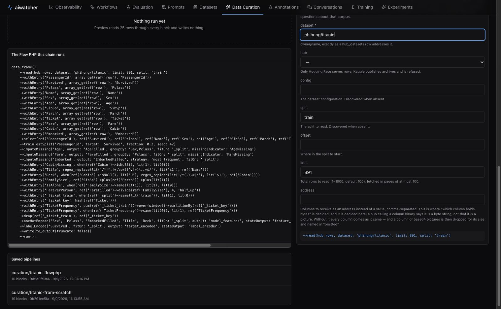

## 2. Select raw columns — an explicit set of columns

This block moves the original 12 fields from `row` to the top level.
`PassengerId` identifies the record, and `Survived` is the target. `Age`, `Fare`,
`Cabin`, and `Embarked` remain raw, with their missing values still visible.
You can edit the code in the inspector on the right.

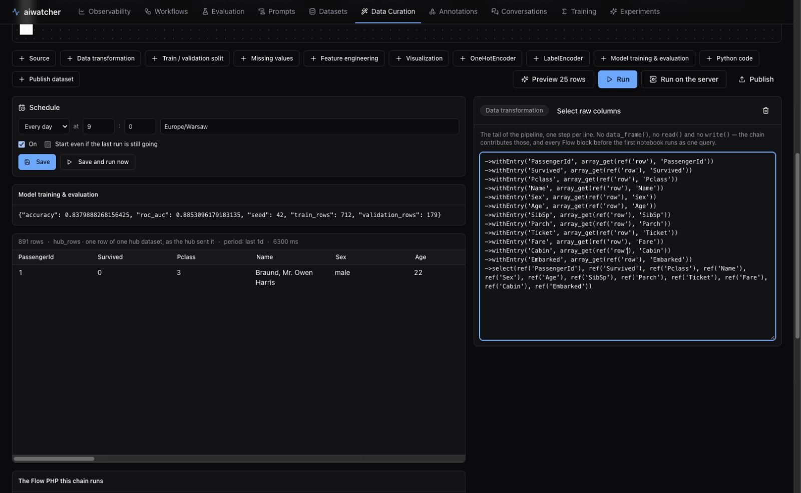

## 3. Train / validation split — split before fitting

`trainTestSplit('PassengerId', target: 'Survived', fraction: 0.2, seed: 42)`
adds `_split`. For the full dataset, it produces 712 `train` and 179 `validation` records.
The split is stratified by target class and remains deterministic when the input
order changes. It requires unique identifiers and at least two records per class.

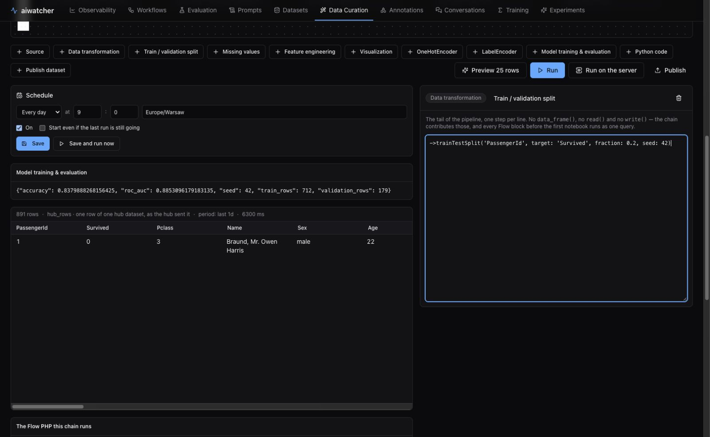

## 4. Missing values — imputation

`imputeMissing` learns medians only from rows selected by `fitOn: '_split'`, with
`fitValue: 'train'` by default. It fills age by `Sex,Pclass`, fare by `Pclass`,
and embarkation port with the most frequent training value. An unknown group falls
back to the statistic for the entire training set. This creates `AgeFilled`,
`FareFilled`, `EmbarkedFilled`, and missing-value flags. The original columns remain
available for inspection.

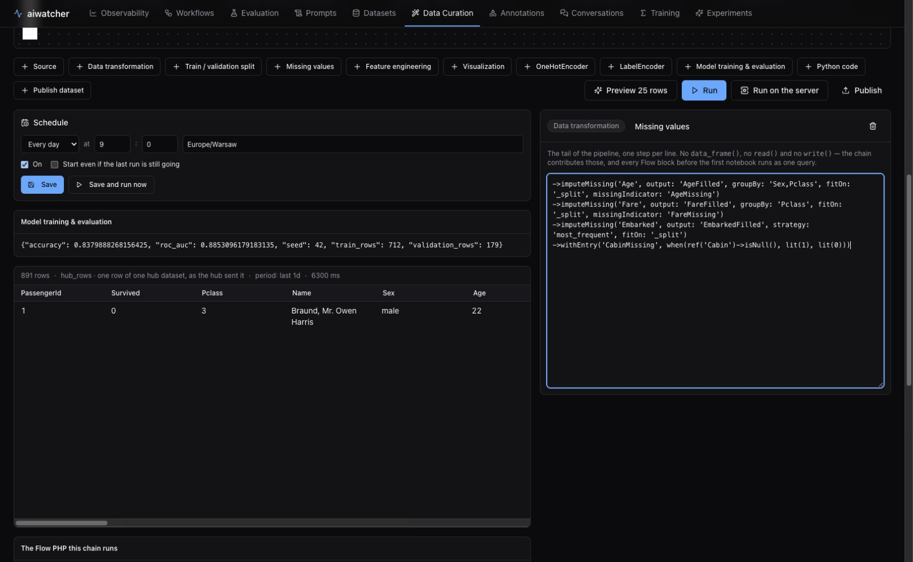

## 5. Feature engineering — building features in FlowPHP

We create `Title`, `Deck`, `FamilySize`, `IsAlone`, `FarePerPerson`, and
`TicketFrequency`. Ticket frequency counts only training passengers;
an unknown ticket gets a value of 1. A ticket hash serves as an internal partition
key because some ticket numbers contain `/`. The original `Ticket` is preserved.
These are standard FlowPHP transformations that you can extend in your own flow.

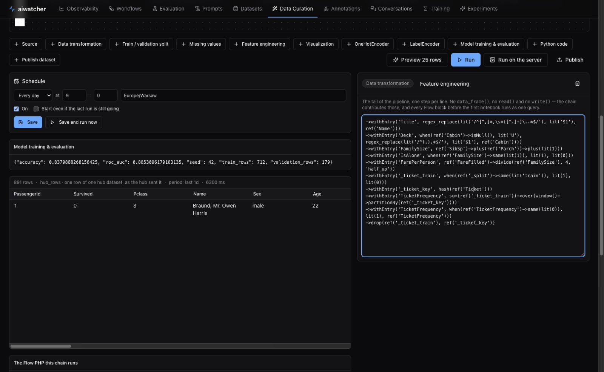

## 6. OneHotEncoder — categorical features in PHP

`oneHotEncode` fits a vocabulary for `Sex`, `Pclass`, `EmbarkedFilled`, `Title`,
and `Deck` on the training subset. It writes numeric indicators to `model_features`.
An unknown validation category produces zeros (`handleUnknown: 'ignore'`).
`stateOutput: 'feature_encoder'` preserves the vocabulary alongside the rows.
You can later pass it as `state: '<JSON>'` to transform data without fitting again.

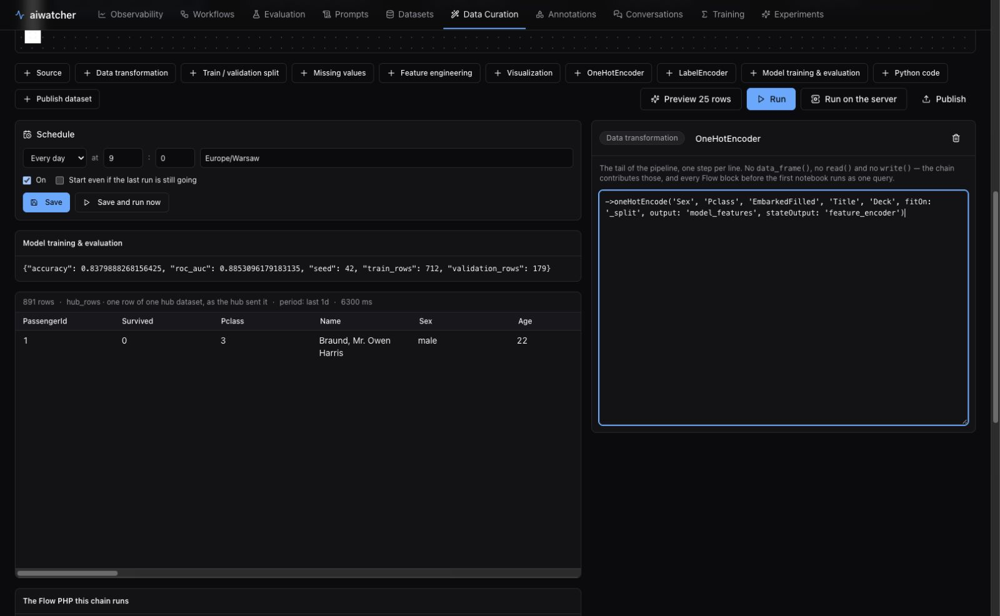

## 7. LabelEncoder — target encoding in PHP

`labelEncode('Survived', fitOn: '_split')` creates `target_encoded`.
In this dataset, classes 0 and 1 remain 0 and 1, respectively. An unknown class
raises an error. The state in `label_encoder` lets you restore the mapping;
you can also use the PHP class independently through `fit`, `transform`, and
`inverseTransform`. The target is excluded from the model features.

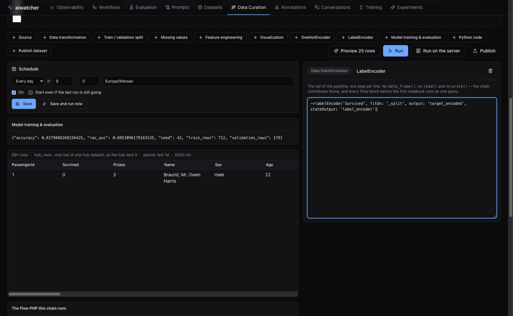

## 8. Visualization — training data charts

The first Python block shows raw missing-value counts and survival rates by sex.
The charts use only training data. The block passes all 891 rows onward without
filtering them. Click **Visualization** and scroll the inspector to the Live preview.
The chart source is editable and included in the export.

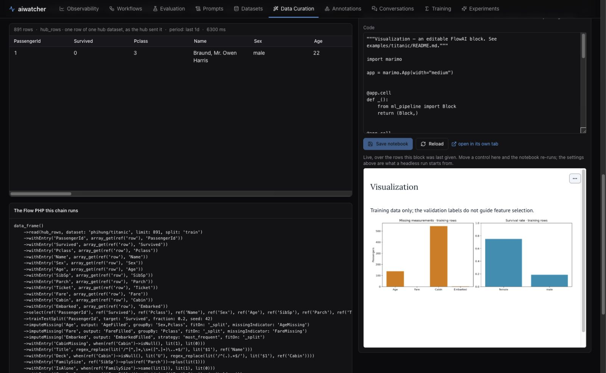

## 9. Model training & evaluation — model and validation results

Random Forest uses explicitly selected numeric features together with `model_features`.
It trains on `train`, evaluates only on `validation`, and adds predictions to every
row as `prediction` and `survival_probability`. With the full dataset and the
recorded dependencies: **accuracy 0.837989, ROC AUC 0.885310**.

This is the result of a single holdout split. Families and shared tickets may appear
on both sides of the split; this does not measure generalization to new families
and is not a score on the competition's test.csv. **Preview 25 rows** is used to
check the connections.

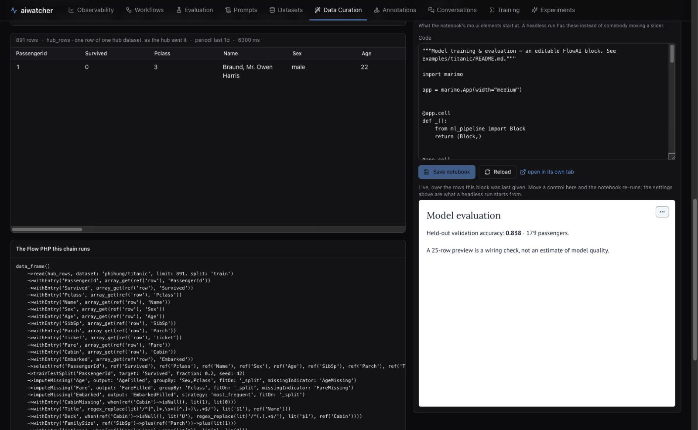

## 10. Publish predictions — target dataset

The **Publish predictions** block sets the name to `curation/titanic-flowphp`.
**Run** previews the result. The separate **Publish** action saves a dataset version.
The screenshot shows a configuration ready for publication, not a publication confirmation.
**Save** saves the flow definition and pins notebook revisions. The Schedule form
is a separate feature: saving the pipeline alone does not enable scheduling.

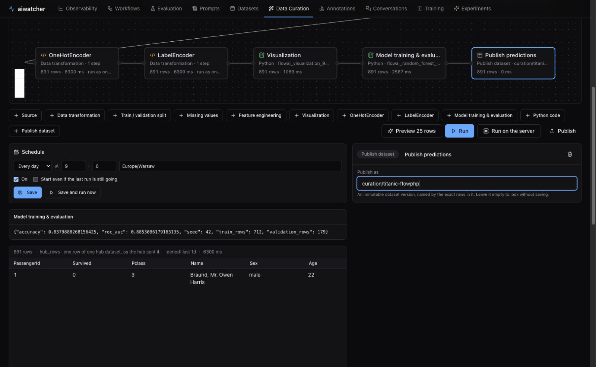

## 11. Export and continue working

Click **Export flow with code**. The bundle contains PHP code in `transform` blocks,
the sources of two notebooks, parameters, connections, and positions. Open it again
using **Import flow** on an instance with the FlowAI libraries installed.
Saved encoder state is part of the output data; the flow bundle carries the recipe
and code, not a trained model or a snapshot of the passengers.

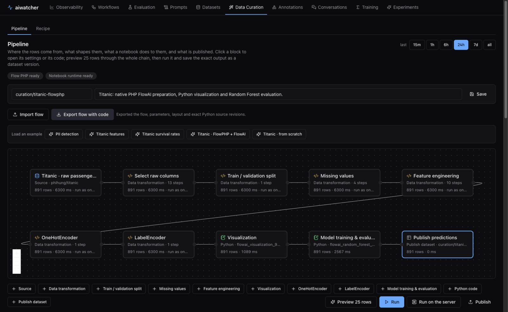

The code for this version is also in [pipeline-php.json](pipeline-php.json),
and the complete query is in [preparation.flow](preparation.flow).
Run the offline variant with `run.py --php --csv /path/to/train.csv`.
The local runner saves the chart, metrics, predictions, and both encoder states.
